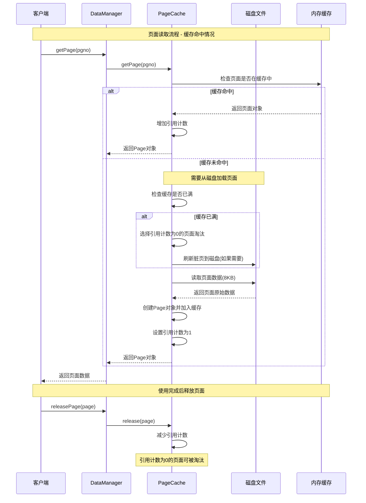
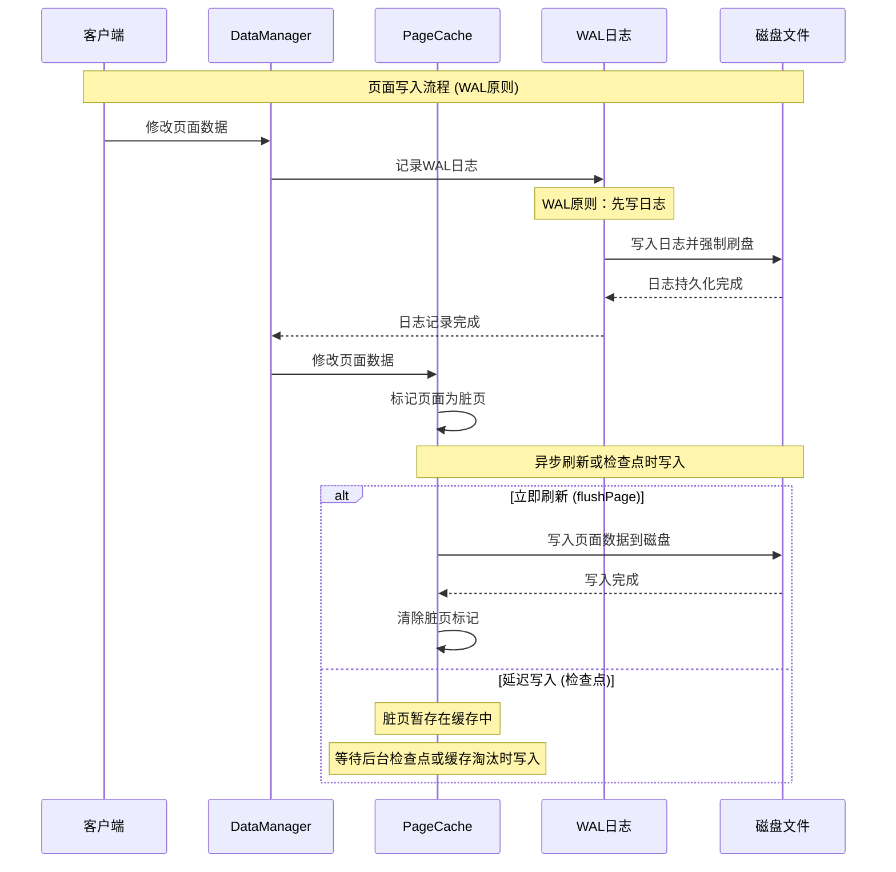
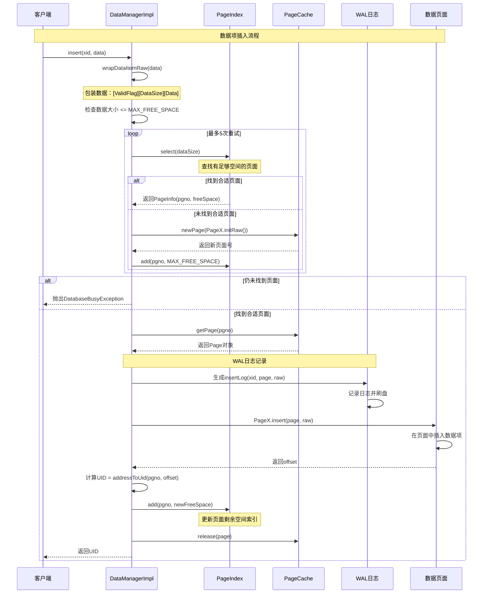
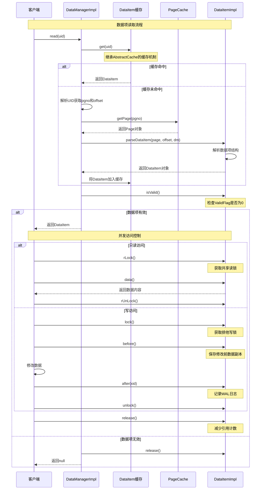
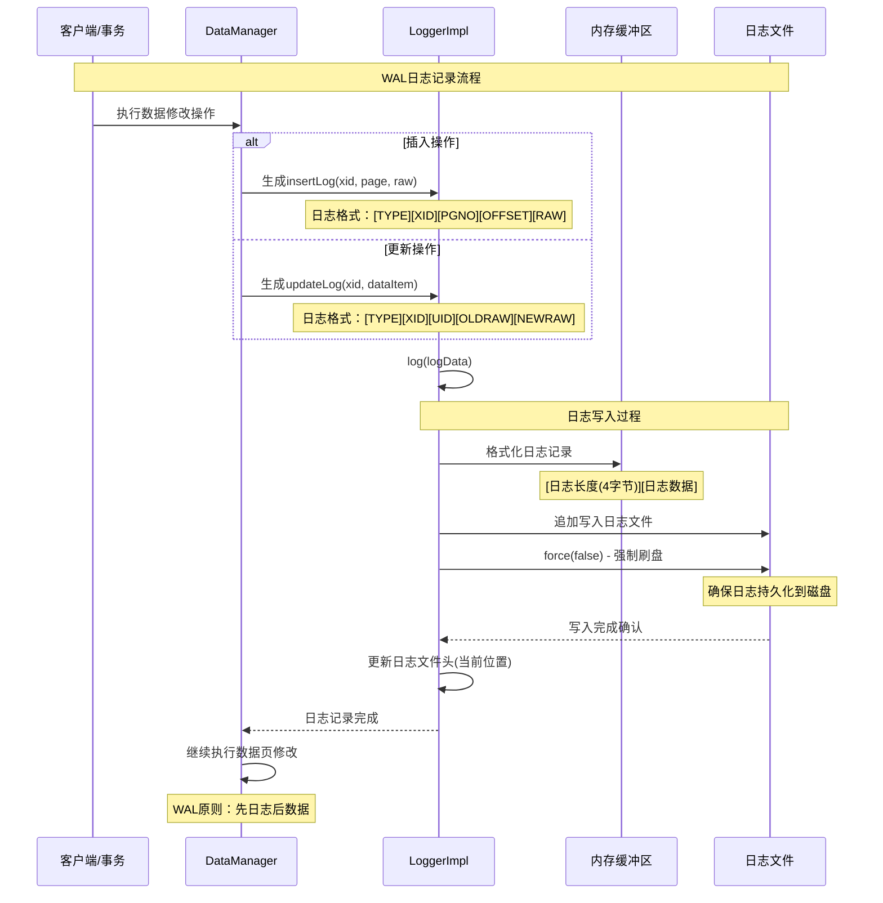
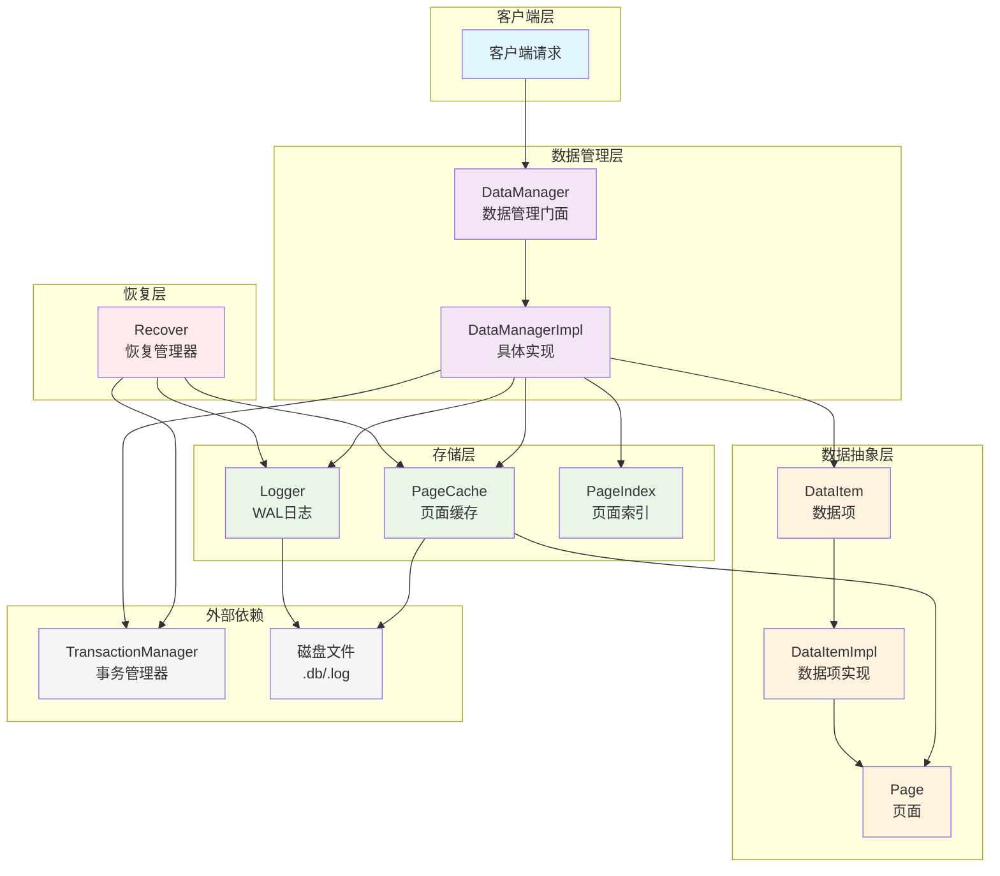
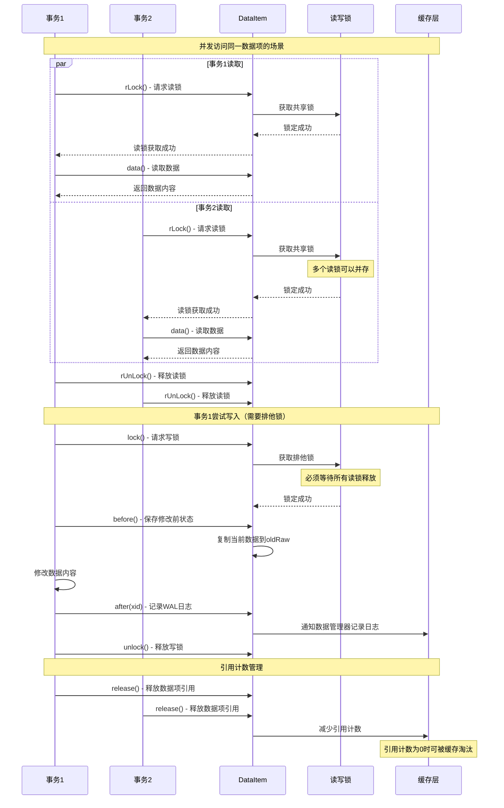
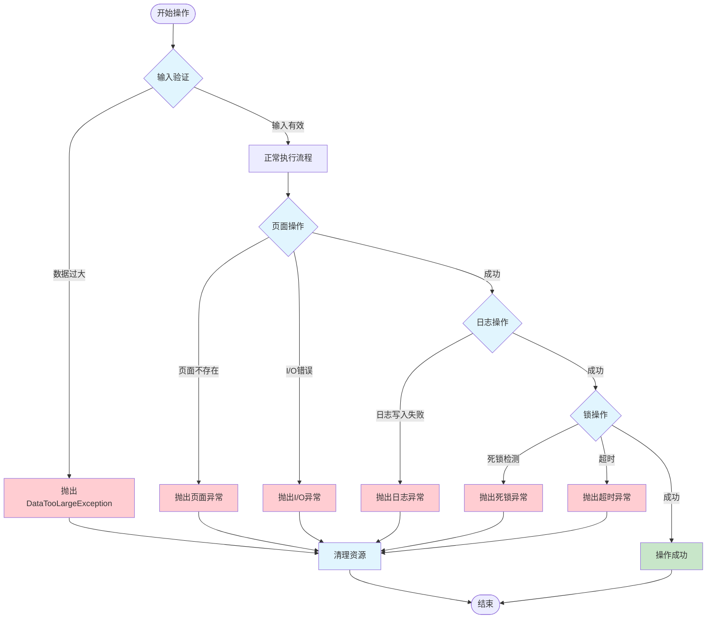

# MYDB 数据管理模块时序图

## 模块概述

数据管理模块 (dm) 是 MYDB 的核心存储引擎，负责数据的持久化存储、缓存管理、事务支持和故障恢复。该模块类似于 MySQL InnoDB 存储引擎，但采用了简化的设计以便于理解核心原理。

### 核心组件

- **[`DataManager`](../src/main/java/top/guoziyang/mydb/backend/dm/DataManager.java)**: 数据管理器门面，协调所有底层存储组件
- **[`PageCache`](../src/main/java/top/guoziyang/mydb/backend/dm/pageCache/PageCache.java)**: 页面缓存管理，实现8KB页面的内存缓存
- **[`Logger`](../src/main/java/top/guoziyang/mydb/backend/dm/logger/Logger.java)**: WAL日志管理，确保数据持久性
- **[`DataItem`](../src/main/java/top/guoziyang/mydb/backend/dm/dataItem/DataItem.java)**: 数据项抽象，代表单条记录
- **[`Recover`](../src/main/java/top/guoziyang/mydb/backend/dm/Recover.java)**: 崩溃恢复管理器，实现ARIES简化版算法

### 架构层次

```
DataManager (数据管理门面)
├── PageCache (页面缓存管理)
├── Logger (WAL日志管理)  
├── PageIndex (页面空间索引)
└── TransactionManager (事务管理协调)
```

---

## 核心时序图

### 1. 页面缓存 (PageCache) 读写流程

#### 1.1 页面读取流程



#### 1.2 页面写入流程



### 2. 数据项 (DataItem) 创建和访问流程

#### 2.1 数据项插入流程



#### 2.2 数据项读取和并发控制流程



### 3. 日志 (Logger) 记录和恢复流程

#### 3.1 WAL日志记录流程



#### 3.2 日志读取流程

```mermaid
sequenceDiagram
    participant Recovery as 恢复进程
    participant Logger as LoggerImpl
    participant Buffer as 内存缓冲区
    participant Disk as 日志文件

    Note over Recovery,Disk: 日志读取流程 (用于恢复)
    Recovery->>Logger: 开始日志扫描
    Logger->>Logger: rewind() - 重置到文件开头
    
    loop 直到文件结束
        Logger->>Disk: 读取日志记录长度(4字节)
        
        alt 读取成功
            Disk-->>Logger: 返回长度值
            
            alt 长度有效 (> 0)
                Logger->>Disk: 根据长度读取日志数据
                Disk-->>Logger: 返回日志数据
                
                Logger->>Buffer: 解析日志内容
                Logger-->>Recovery: next() - 返回日志记录
                
                Recovery->>Recovery: 处理日志记录
                Note over Recovery: 根据日志类型执行恢复操作
            else 长度无效
                Logger-->>Recovery: 返回null (文件结束)
                break
            end
        else 读取失败
            Logger-->>Recovery: 返回null (文件结束)
            break
        end
    end
```

### 4. 数据恢复 (Recover) 执行流程

#### 4.1 完整恢复流程 (ARIES简化版)

```mermaid
sequenceDiagram
    participant DM as DataManager
    participant Recover as 恢复管理器
    participant TM as TransactionManager
    participant Logger as WAL日志
    participant PC as PageCache

    Note over DM,PC: 数据库启动时的恢复流程
    DM->>DM: loadCheckPageOne()
    Note over DM: 检查PageOne的ValidCheck标记
    
    alt ValidCheck失败 (异常关闭)
        DM->>Recover: recover(tm, logger, pageCache)
        
        Note over Recover,PC: 阶段1：分析阶段 (Analysis)
        Recover->>Logger: rewind() - 重置日志位置
        Recover->>Recover: 初始化事务状态映射
        
        loop 扫描所有日志记录
            Recover->>Logger: next()
            Logger-->>Recover: 返回日志记录
            
            alt 插入日志
                Recover->>Recover: 解析InsertLogInfo
                Recover->>Recover: 标记事务为活跃状态
            else 更新日志  
                Recover->>Recover: 解析UpdateLogInfo
                Recover->>Recover: 标记事务为活跃状态
            end
        end
        
        Note over Recover,PC: 阶段2：重做阶段 (Redo)
        Recover->>Logger: rewind() - 重新开始扫描
        
        loop 重放所有日志记录
            Recover->>Logger: next()
            Logger-->>Recover: 返回日志记录
            
            alt 插入日志
                Recover->>Recover: 解析InsertLogInfo
                Recover->>TM: isCommitted(xid)
                
                alt 事务已提交
                    Recover->>PC: getPage(pgno)
                    PC-->>Recover: 返回页面
                    Recover->>Recover: doInsertLog(page, raw, REDO)
                    Note over Recover: 重新执行插入操作
                    Recover->>PC: release(page)
                end
            else 更新日志
                Recover->>Recover: 解析UpdateLogInfo  
                Recover->>TM: isCommitted(xid)
                
                alt 事务已提交
                    Recover->>PC: getPage(pgno)
                    PC-->>Recover: 返回页面
                    Recover->>Recover: doUpdateLog(page, newRaw, REDO)
                    Note over Recover: 重新执行更新操作
                    Recover->>PC: release(page)
                end
            end
        end
        
        Note over Recover,PC: 阶段3：撤销阶段 (Undo)
        Recover->>Logger: rewind() - 再次重新开始
        
        loop 撤销未提交事务的操作
            Recover->>Logger: next()
            Logger-->>Recover: 返回日志记录
            
            alt 插入日志
                Recover->>Recover: 解析InsertLogInfo
                Recover->>TM: isCommitted(xid)
                
                alt 事务未提交
                    Recover->>PC: getPage(pgno)
                    PC-->>Recover: 返回页面
                    Recover->>Recover: doInsertLog(page, raw, UNDO)
                    Note over Recover: 撤销插入：标记数据项为无效
                    Recover->>PC: release(page)
                end
            else 更新日志
                Recover->>Recover: 解析UpdateLogInfo
                Recover->>TM: isCommitted(xid)
                
                alt 事务未提交
                    Recover->>PC: getPage(pgno)
                    PC-->>Recover: 返回页面
                    Recover->>Recover: doUpdateLog(page, oldRaw, UNDO)
                    Note over Recover: 撤销更新：恢复旧数据
                    Recover->>PC: release(page)
                end
            end
        end
        
        Recover-->>DM: 恢复完成
    else ValidCheck成功 (正常关闭)
        Note over DM: 跳过恢复，直接启动
    end
    
    DM->>DM: fillPageIndex()
    Note over DM: 重建页面空间索引
    
    DM->>DM: setVcOpen(pageOne)
    Note over DM: 设置数据库为运行状态
```



---

## 组件交互图

### 整体架构交互关系



### 并发控制和线程安全机制



---

## 错误处理和异常情况

### 异常处理流程



---

## 性能优化要点

### 1. 缓存策略优化
- **引用计数LRU**：基于引用计数的页面替换算法
- **脏页延迟写入**：减少磁盘I/O，提高写入性能
- **批量刷新**：检查点机制批量写入脏页

### 2. 并发控制优化
- **读写锁分离**：支持多读单写，提高并发度
- **细粒度锁定**：数据项级别的锁定，减少锁冲突
- **无锁读取**：对于只读查询，减少锁开销

### 3. 日志优化
- **顺序写入**：WAL日志采用顺序写入，提高I/O效率
- **批量提交**：减少fsync调用次数
- **日志压缩**：定期清理不再需要的历史日志

### 4. 恢复优化
- **并行恢复**：可以并行处理不同页面的恢复操作
- **增量恢复**：只恢复必要的数据，跳过已知一致的部分
- **检查点机制**：减少恢复时需要处理的日志量

---

## 学习要点总结

1. **WAL原则**：理解Write-Ahead Logging的重要性和实现机制
2. **缓存管理**：掌握页面缓存的LRU替换和引用计数机制
3. **并发控制**：理解读写锁和事务的before/after机制
4. **故障恢复**：掌握ARIES算法的核心思想：分析、重做、撤销
5. **存储结构**：理解页面、数据项的存储格式和寻址方式

数据管理模块是整个MYDB系统的基础，为上层的版本管理、事务管理等模块提供了可靠的数据存储服务。通过这些时序图，可以清晰地理解各个组件之间的协作关系和数据流向。