# MYDB 事务管理模块时序图

## 模块概述

事务管理模块 (tm) 是 MYDB 的并发控制核心，负责事务的生命周期管理、状态维护和 ACID 特性的基础保障。该模块类似于 MySQL InnoDB 的事务子系统，但采用了简化的设计专注于事务状态的持久化管理。

### 核心组件

- **[`TransactionManager`](../src/main/java/top/guoziyang/mydb/backend/tm/TransactionManager.java)**: 事务管理器接口，定义事务生命周期操作
- **[`TransactionManagerImpl`](../src/main/java/top/guoziyang/mydb/backend/tm/TransactionManagerImpl.java)**: 事务管理器具体实现，维护事务状态和XID分配
- **[`Transaction`](../src/main/java/top/guoziyang/mydb/backend/vm/Transaction.java)**: 事务对象抽象，包含快照和隔离级别信息

### 与 MySQL InnoDB 的对比

| 特性 | MySQL InnoDB | MYDB TransactionManager |
|------|-------------|-------------------------|
| **事务ID管理** | 全局递增的事务ID | XID计数器，持久化到.xid文件 |
| **事务状态** | 复杂状态机(活跃、准备、提交等) | 简化三状态(ACTIVE、COMMITTED、ABORTED) |
| **持久化** | 重做日志+回滚段 | 直接状态文件持久化 |
| **并发控制** | 锁+MVCC | 简化MVCC快照机制 |
| **崩溃恢复** | ARIES算法 | 状态文件直接恢复 |

### ACID 特性在 MYDB 中的实现

- **原子性 (Atomicity)**: 通过事务状态管理，配合版本管理模块实现
- **一致性 (Consistency)**: 通过事务隔离级别和约束检查保证
- **隔离性 (Isolation)**: 实现读已提交和可重复读两种隔离级别
- **持久性 (Durability)**: 事务状态立即强制刷新到磁盘，配合WAL日志

### 架构层次

```
TransactionManager (事务管理门面)
├── XID 文件管理 (事务状态持久化)
├── XID 计数器 (事务ID分配)
├── 状态检查器 (事务状态查询)
└── 并发控制锁 (线程安全保障)
```

---

## 核心时序图

### 1. 事务开始 (begin) 流程

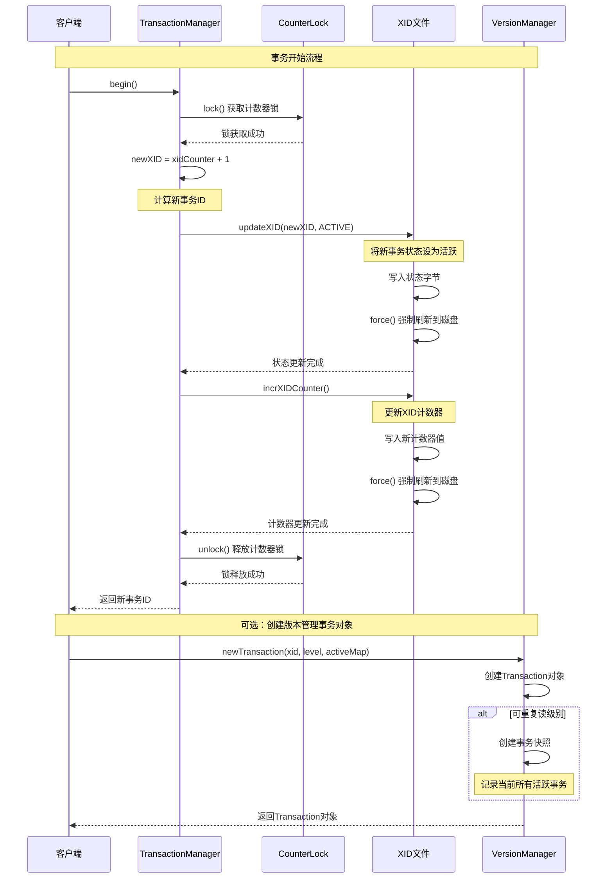
```mermaid
sequenceDiagram
    participant Client as 客户端
    participant TM as TransactionManager
    participant Lock as CounterLock
    participant File as XID文件
    participant VM as VersionManager

    Note over Client,VM: 事务开始流程
    Client->>TM: begin()
    
    TM->>Lock: lock() 获取计数器锁
    Lock-->>TM: 锁获取成功
    
    TM->>TM: newXID = xidCounter + 1
    Note over TM: 计算新事务ID
    
    TM->>File: updateXID(newXID, ACTIVE)
    Note over File: 将新事务状态设为活跃
    File->>File: 写入状态字节
    File->>File: force() 强制刷新到磁盘
    File-->>TM: 状态更新完成
    
    TM->>File: incrXIDCounter()
    Note over File: 更新XID计数器
    File->>File: 写入新计数器值
    File->>File: force() 强制刷新到磁盘
    File-->>TM: 计数器更新完成
    
    TM->>Lock: unlock() 释放计数器锁
    Lock-->>TM: 锁释放成功
    
    TM-->>Client: 返回新事务ID
    
    Note over Client,VM: 可选：创建版本管理事务对象
    Client->>VM: newTransaction(xid, level, activeMap)
    VM->>VM: 创建Transaction对象
    alt 可重复读级别
        VM->>VM: 创建事务快照
        Note over VM: 记录当前所有活跃事务
    end
    VM-->>Client: 返回Transaction对象
```

### 2. 事务提交 (commit) 流程

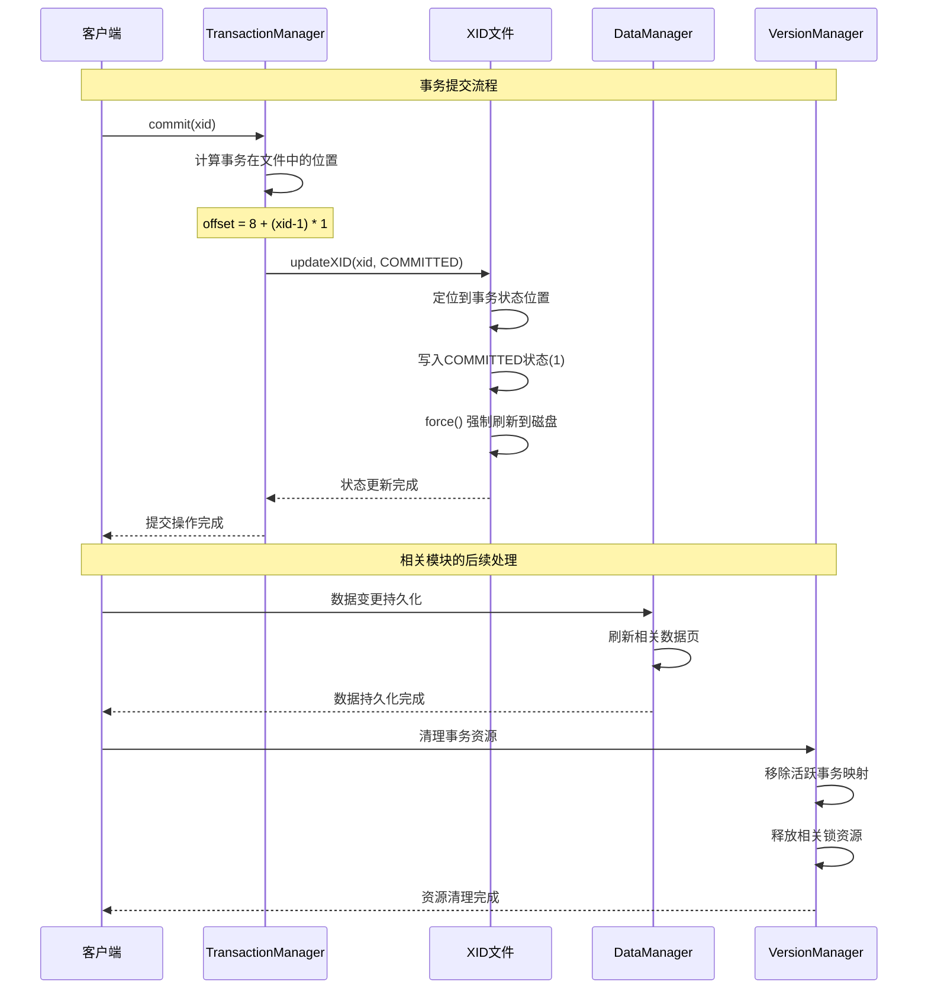
```mermaid
sequenceDiagram
    participant Client as 客户端
    participant TM as TransactionManager
    participant File as XID文件
    participant DM as DataManager
    participant VM as VersionManager

    Note over Client,VM: 事务提交流程
    Client->>TM: commit(xid)
    
    TM->>TM: 计算事务在文件中的位置
    Note over TM: offset = 8 + (xid-1) * 1
    
    TM->>File: updateXID(xid, COMMITTED)
    File->>File: 定位到事务状态位置
    File->>File: 写入COMMITTED状态(1)
    File->>File: force() 强制刷新到磁盘
    File-->>TM: 状态更新完成
    
    TM-->>Client: 提交操作完成
    
    Note over Client,VM: 相关模块的后续处理
    Client->>DM: 数据变更持久化
    DM->>DM: 刷新相关数据页
    DM-->>Client: 数据持久化完成
    
    Client->>VM: 清理事务资源
    VM->>VM: 移除活跃事务映射
    VM->>VM: 释放相关锁资源
    VM-->>Client: 资源清理完成
```

### 3. 事务回滚 (abort) 流程

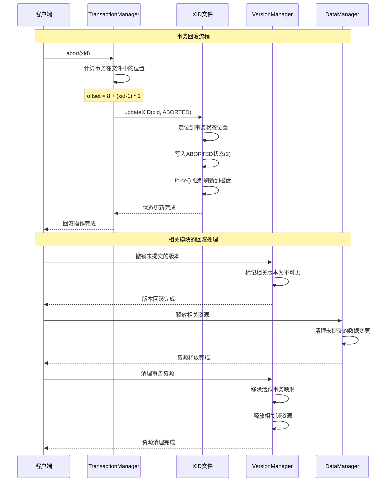
```mermaid
sequenceDiagram
    participant Client as 客户端
    participant TM as TransactionManager
    participant File as XID文件
    participant VM as VersionManager
    participant DM as DataManager

    Note over Client,DM: 事务回滚流程
    Client->>TM: abort(xid)
    
    TM->>TM: 计算事务在文件中的位置
    Note over TM: offset = 8 + (xid-1) * 1
    
    TM->>File: updateXID(xid, ABORTED)
    File->>File: 定位到事务状态位置
    File->>File: 写入ABORTED状态(2)
    File->>File: force() 强制刷新到磁盘
    File-->>TM: 状态更新完成
    
    TM-->>Client: 回滚操作完成
    
    Note over Client,DM: 相关模块的回滚处理
    Client->>VM: 撤销未提交的版本
    VM->>VM: 标记相关版本为不可见
    VM-->>Client: 版本回滚完成
    
    Client->>DM: 释放相关资源
    DM->>DM: 清理未提交的数据变更
    DM-->>Client: 资源释放完成
    
    Client->>VM: 清理事务资源
    VM->>VM: 移除活跃事务映射
    VM->>VM: 释放相关锁资源
    VM-->>Client: 资源清理完成
```

### 4. 事务状态检查流程

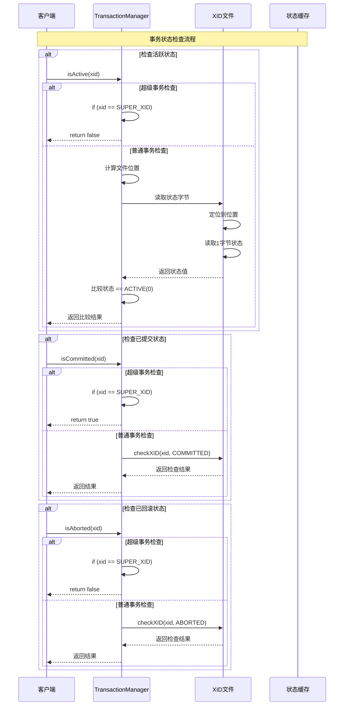
```mermaid
sequenceDiagram
    participant Client as 客户端
    participant TM as TransactionManager
    participant File as XID文件
    participant Cache as 状态缓存

    Note over Client,Cache: 事务状态检查流程
    
    alt 检查活跃状态
        Client->>TM: isActive(xid)
        
        alt 超级事务检查
            TM->>TM: if (xid == SUPER_XID)
            TM-->>Client: return false
        else 普通事务检查
            TM->>TM: 计算文件位置
            TM->>File: 读取状态字节
            File->>File: 定位到位置
            File->>File: 读取1字节状态
            File-->>TM: 返回状态值
            TM->>TM: 比较状态 == ACTIVE(0)
            TM-->>Client: 返回比较结果
        end
    end
    
    alt 检查已提交状态
        Client->>TM: isCommitted(xid)
        
        alt 超级事务检查
            TM->>TM: if (xid == SUPER_XID)
            TM-->>Client: return true
        else 普通事务检查
            TM->>File: checkXID(xid, COMMITTED)
            File-->>TM: 返回检查结果
            TM-->>Client: 返回结果
        end
    end
    
    alt 检查已回滚状态
        Client->>TM: isAborted(xid)
        
        alt 超级事务检查
            TM->>TM: if (xid == SUPER_XID)
            TM-->>Client: return false
        else 普通事务检查
            TM->>File: checkXID(xid, ABORTED)
            File-->>TM: 返回检查结果
            TM-->>Client: 返回结果
        end
    end
```

### 5. 并发事务隔离级别实现

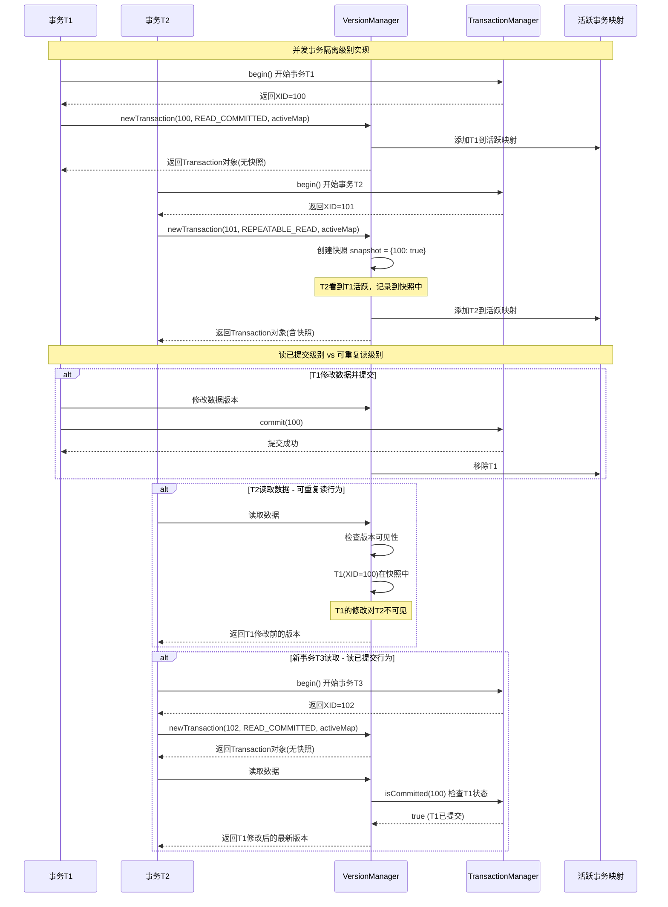
```mermaid
sequenceDiagram
    participant T1 as 事务T1
    participant T2 as 事务T2
    participant VM as VersionManager
    participant TM as TransactionManager
    participant ActiveMap as 活跃事务映射

    Note over T1,ActiveMap: 并发事务隔离级别实现
    
    T1->>TM: begin() 开始事务T1
    TM-->>T1: 返回XID=100
    
    T1->>VM: newTransaction(100, READ_COMMITTED, activeMap)
    VM->>ActiveMap: 添加T1到活跃映射
    VM-->>T1: 返回Transaction对象(无快照)
    
    T2->>TM: begin() 开始事务T2
    TM-->>T2: 返回XID=101
    
    T2->>VM: newTransaction(101, REPEATABLE_READ, activeMap)
    VM->>VM: 创建快照 snapshot = {100: true}
    Note over VM: T2看到T1活跃，记录到快照中
    VM->>ActiveMap: 添加T2到活跃映射
    VM-->>T2: 返回Transaction对象(含快照)
    
    Note over T1,ActiveMap: 读已提交级别 vs 可重复读级别
    
    alt T1修改数据并提交
        T1->>VM: 修改数据版本
        T1->>TM: commit(100)
        TM-->>T1: 提交成功
        VM->>ActiveMap: 移除T1
    end
    
    alt T2读取数据 - 可重复读行为
        T2->>VM: 读取数据
        VM->>VM: 检查版本可见性
        VM->>VM: T1(XID=100)在快照中
        Note over VM: T1的修改对T2不可见
        VM-->>T2: 返回T1修改前的版本
    end
    
    alt 新事务T3读取 - 读已提交行为
        T2->>TM: begin() 开始事务T3
        TM-->>T2: 返回XID=102
        T2->>VM: newTransaction(102, READ_COMMITTED, activeMap)
        VM-->>T2: 返回Transaction对象(无快照)
        
        T2->>VM: 读取数据
        VM->>TM: isCommitted(100) 检查T1状态
        TM-->>VM: true (T1已提交)
        VM-->>T2: 返回T1修改后的最新版本
    end
```

---

## XID 文件管理

### 1. XID 文件创建和初始化

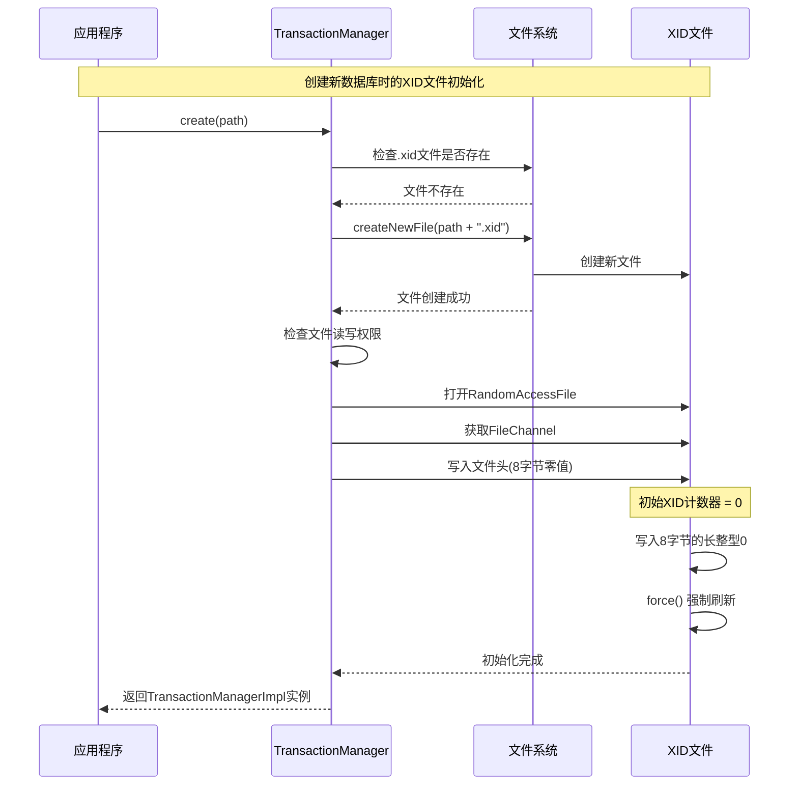
```mermaid
sequenceDiagram
    participant App as 应用程序
    participant TM as TransactionManager
    participant FileSystem as 文件系统
    participant XIDFile as XID文件

    Note over App,XIDFile: 创建新数据库时的XID文件初始化
    App->>TM: create(path)
    
    TM->>FileSystem: 检查.xid文件是否存在
    FileSystem-->>TM: 文件不存在
    
    TM->>FileSystem: createNewFile(path + ".xid")
    FileSystem->>XIDFile: 创建新文件
    FileSystem-->>TM: 文件创建成功
    
    TM->>TM: 检查文件读写权限
    
    TM->>XIDFile: 打开RandomAccessFile
    TM->>XIDFile: 获取FileChannel
    
    TM->>XIDFile: 写入文件头(8字节零值)
    Note over XIDFile: 初始XID计数器 = 0
    XIDFile->>XIDFile: 写入8字节的长整型0
    XIDFile->>XIDFile: force() 强制刷新
    XIDFile-->>TM: 初始化完成
    
    TM-->>App: 返回TransactionManagerImpl实例
```

### 2. XID 文件打开和完整性检查

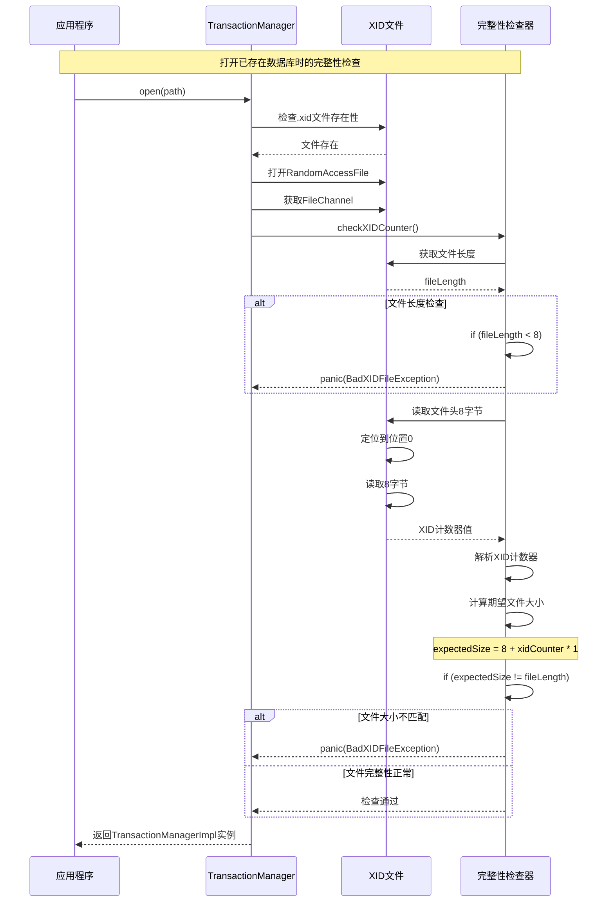
```mermaid
sequenceDiagram
    participant App as 应用程序
    participant TM as TransactionManager
    participant XIDFile as XID文件
    participant Validator as 完整性检查器

    Note over App,Validator: 打开已存在数据库时的完整性检查
    App->>TM: open(path)
    
    TM->>XIDFile: 检查.xid文件存在性
    XIDFile-->>TM: 文件存在
    
    TM->>XIDFile: 打开RandomAccessFile
    TM->>XIDFile: 获取FileChannel
    
    TM->>Validator: checkXIDCounter()
    
    Validator->>XIDFile: 获取文件长度
    XIDFile-->>Validator: fileLength
    
    alt 文件长度检查
        Validator->>Validator: if (fileLength < 8)
        Validator-->>TM: panic(BadXIDFileException)
    end
    
    Validator->>XIDFile: 读取文件头8字节
    XIDFile->>XIDFile: 定位到位置0
    XIDFile->>XIDFile: 读取8字节
    XIDFile-->>Validator: XID计数器值
    
    Validator->>Validator: 解析XID计数器
    Validator->>Validator: 计算期望文件大小
    Note over Validator: expectedSize = 8 + xidCounter * 1
    
    Validator->>Validator: if (expectedSize != fileLength)
    alt 文件大小不匹配
        Validator-->>TM: panic(BadXIDFileException)
    else 文件完整性正常
        Validator-->>TM: 检查通过
    end
    
    TM-->>App: 返回TransactionManagerImpl实例
```

### 3. 事务状态持久化存储

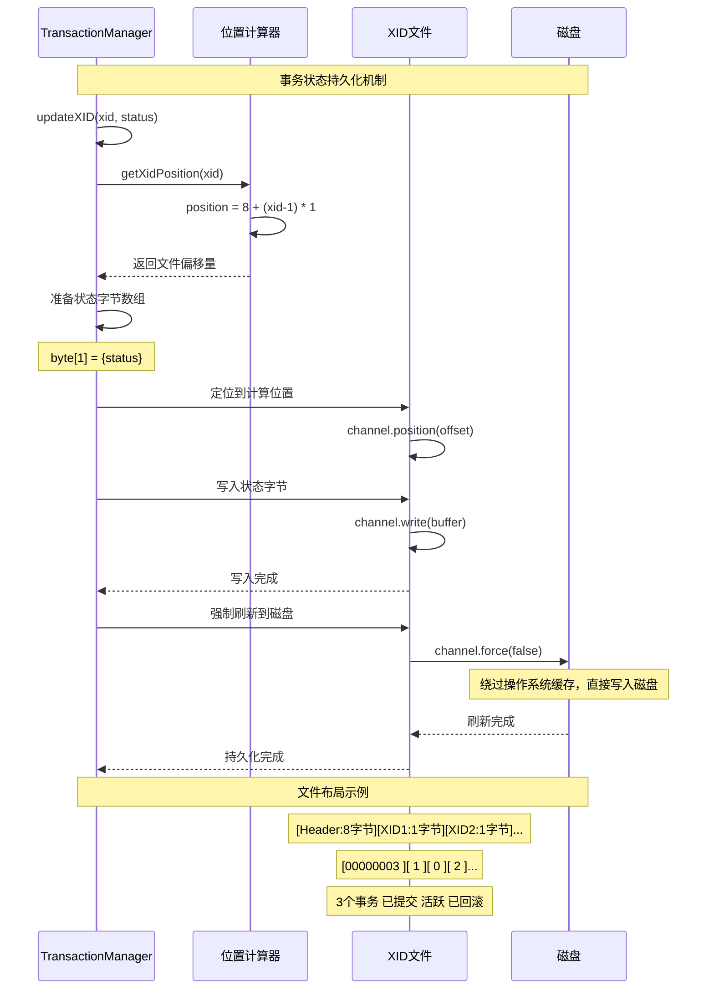
```mermaid
sequenceDiagram
    participant TM as TransactionManager
    participant Calculator as 位置计算器
    participant XIDFile as XID文件
    participant Disk as 磁盘

    Note over TM,Disk: 事务状态持久化机制
    TM->>TM: updateXID(xid, status)
    
    TM->>Calculator: getXidPosition(xid)
    Calculator->>Calculator: position = 8 + (xid-1) * 1
    Calculator-->>TM: 返回文件偏移量
    
    TM->>TM: 准备状态字节数组
    Note over TM: byte[1] = {status}
    
    TM->>XIDFile: 定位到计算位置
    XIDFile->>XIDFile: channel.position(offset)
    
    TM->>XIDFile: 写入状态字节
    XIDFile->>XIDFile: channel.write(buffer)
    XIDFile-->>TM: 写入完成
    
    TM->>XIDFile: 强制刷新到磁盘
    XIDFile->>Disk: channel.force(false)
    Note over Disk: 绕过操作系统缓存，直接写入磁盘
    Disk-->>XIDFile: 刷新完成
    XIDFile-->>TM: 持久化完成
    
    Note over TM,Disk: 文件布局示例
    Note over XIDFile: [Header:8字节][XID1:1字节][XID2:1字节]...
    Note over XIDFile: [00000003   ][  1     ][  0     ][  2  ]...
    Note over XIDFile: 3个事务      已提交    活跃      已回滚
```

### 4. 崩溃恢复时的事务状态恢复

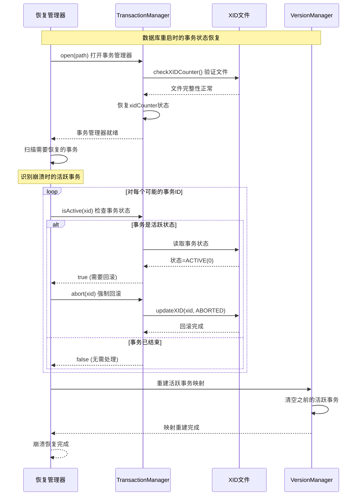
```mermaid
sequenceDiagram
    participant Recovery as 恢复管理器
    participant TM as TransactionManager
    participant XIDFile as XID文件
    participant VM as VersionManager

    Note over Recovery,VM: 数据库重启时的事务状态恢复
    Recovery->>TM: open(path) 打开事务管理器
    
    TM->>XIDFile: checkXIDCounter() 验证文件
    XIDFile-->>TM: 文件完整性正常
    
    TM->>TM: 恢复xidCounter状态
    TM-->>Recovery: 事务管理器就绪
    
    Recovery->>Recovery: 扫描需要恢复的事务
    Note over Recovery: 识别崩溃时的活跃事务
    
    loop 对每个可能的事务ID
        Recovery->>TM: isActive(xid) 检查事务状态
        
        alt 事务是活跃状态
            TM->>XIDFile: 读取事务状态
            XIDFile-->>TM: 状态=ACTIVE(0)
            TM-->>Recovery: true (需要回滚)
            
            Recovery->>TM: abort(xid) 强制回滚
            TM->>XIDFile: updateXID(xid, ABORTED)
            XIDFile-->>TM: 回滚完成
        else 事务已结束
            TM-->>Recovery: false (无需处理)
        end
    end
    
    Recovery->>VM: 重建活跃事务映射
    VM->>VM: 清空之前的活跃事务
    VM-->>Recovery: 映射重建完成
    
    Recovery-->>Recovery: 崩溃恢复完成
```

---

## 组件交互图

### 1. TransactionManager 与其他模块的协作

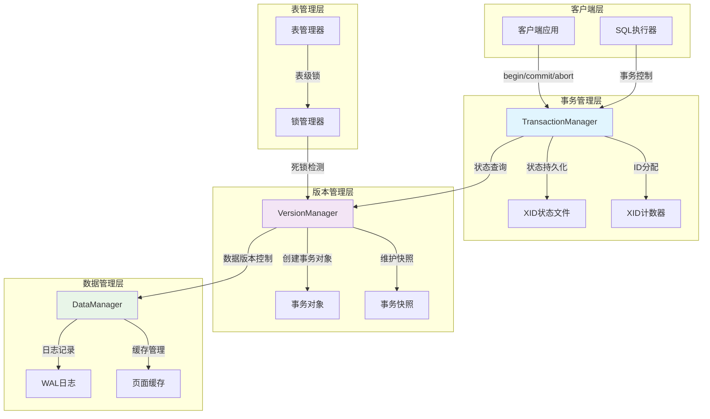
```mermaid
graph TB
    subgraph "客户端层"
        Client[客户端应用]
        Executor[SQL执行器]
    end
    
    subgraph "事务管理层"
        TM[TransactionManager]
        XIDFile[XID状态文件]
        Counter[XID计数器]
    end
    
    subgraph "版本管理层"
        VM[VersionManager]
        Transaction[事务对象]
        Snapshot[事务快照]
    end
    
    subgraph "数据管理层"
        DM[DataManager]
        Logger[WAL日志]
        PageCache[页面缓存]
    end
    
    subgraph "表管理层"
        TableManager[表管理器]
        LockManager[锁管理器]
    end
    
    Client -->|begin/commit/abort| TM
    Executor -->|事务控制| TM
    
    TM -->|状态持久化| XIDFile
    TM -->|ID分配| Counter
    TM -->|状态查询| VM
    
    VM -->|创建事务对象| Transaction
    VM -->|维护快照| Snapshot
    VM -->|数据版本控制| DM
    
    DM -->|日志记录| Logger
    DM -->|缓存管理| PageCache
    
    TableManager -->|表级锁| LockManager
    LockManager -->|死锁检测| VM
    
    style TM fill:#e1f5fe
    style VM fill:#f3e5f5
    style DM fill:#e8f5e8
```

### 2. 事务日志与数据管理模块的配合

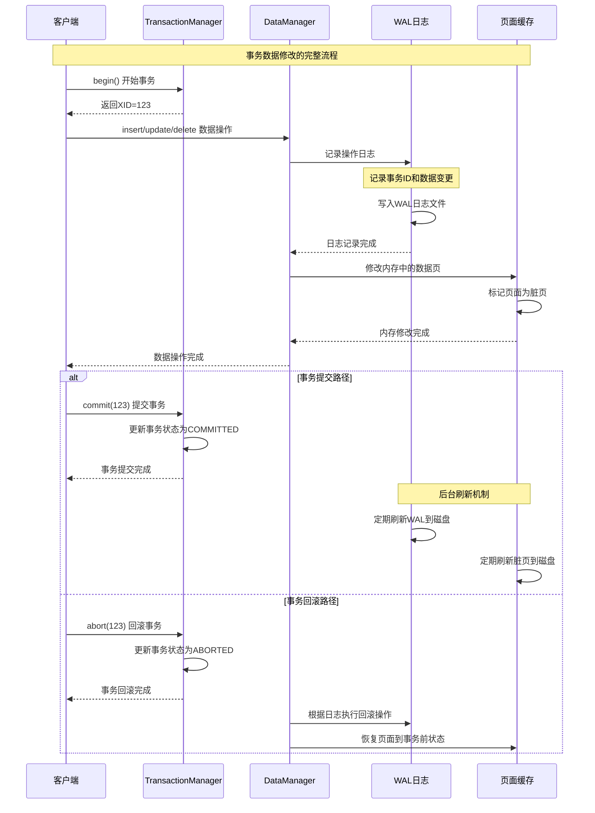
```mermaid
sequenceDiagram
    participant Client as 客户端
    participant TM as TransactionManager
    participant DM as DataManager
    participant Logger as WAL日志
    participant PageCache as 页面缓存

    Note over Client,PageCache: 事务数据修改的完整流程
    
    Client->>TM: begin() 开始事务
    TM-->>Client: 返回XID=123
    
    Client->>DM: insert/update/delete 数据操作
    
    DM->>Logger: 记录操作日志
    Note over Logger: 记录事务ID和数据变更
    Logger->>Logger: 写入WAL日志文件
    Logger-->>DM: 日志记录完成
    
    DM->>PageCache: 修改内存中的数据页
    PageCache->>PageCache: 标记页面为脏页
    PageCache-->>DM: 内存修改完成
    
    DM-->>Client: 数据操作完成
    
    alt 事务提交路径
        Client->>TM: commit(123) 提交事务
        TM->>TM: 更新事务状态为COMMITTED
        TM-->>Client: 事务提交完成
        
        Note over Logger,PageCache: 后台刷新机制
        Logger->>Logger: 定期刷新WAL到磁盘
        PageCache->>PageCache: 定期刷新脏页到磁盘
    else 事务回滚路径
        Client->>TM: abort(123) 回滚事务
        TM->>TM: 更新事务状态为ABORTED
        TM-->>Client: 事务回滚完成
        
        DM->>Logger: 根据日志执行回滚操作
        DM->>PageCache: 恢复页面到事务前状态
    end
```

### 3. 锁管理与版本管理的集成

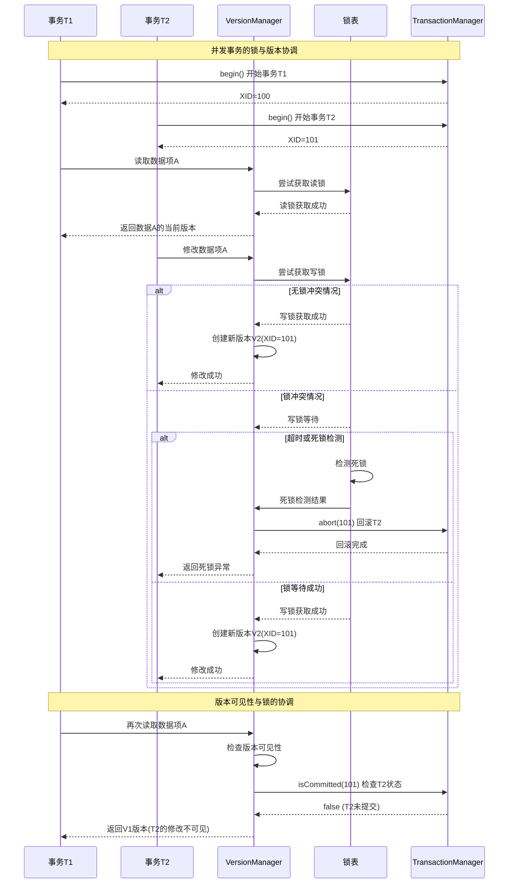
```mermaid
sequenceDiagram
    participant T1 as 事务T1
    participant T2 as 事务T2
    participant VM as VersionManager
    participant LockTable as 锁表
    participant TM as TransactionManager

    Note over T1,TM: 并发事务的锁与版本协调
    
    T1->>TM: begin() 开始事务T1
    TM-->>T1: XID=100
    
    T2->>TM: begin() 开始事务T2  
    TM-->>T2: XID=101
    
    T1->>VM: 读取数据项A
    VM->>LockTable: 尝试获取读锁
    LockTable-->>VM: 读锁获取成功
    VM-->>T1: 返回数据A的当前版本
    
    T2->>VM: 修改数据项A
    VM->>LockTable: 尝试获取写锁
    
    alt 无锁冲突情况
        LockTable-->>VM: 写锁获取成功
        VM->>VM: 创建新版本V2(XID=101)
        VM-->>T2: 修改成功
    else 锁冲突情况
        LockTable-->>VM: 写锁等待
        
        alt 超时或死锁检测
            LockTable->>LockTable: 检测死锁
            LockTable->>VM: 死锁检测结果
            VM->>TM: abort(101) 回滚T2
            TM-->>VM: 回滚完成
            VM-->>T2: 返回死锁异常
        else 锁等待成功
            LockTable-->>VM: 写锁获取成功
            VM->>VM: 创建新版本V2(XID=101)
            VM-->>T2: 修改成功
        end
    end
    
    Note over T1,TM: 版本可见性与锁的协调
    T1->>VM: 再次读取数据项A
    VM->>VM: 检查版本可见性
    VM->>TM: isCommitted(101) 检查T2状态
    TM-->>VM: false (T2未提交)
    VM-->>T1: 返回V1版本(T2的修改不可见)
```

---

## 错误处理和异常回滚流程

### 1. 死锁检测和处理

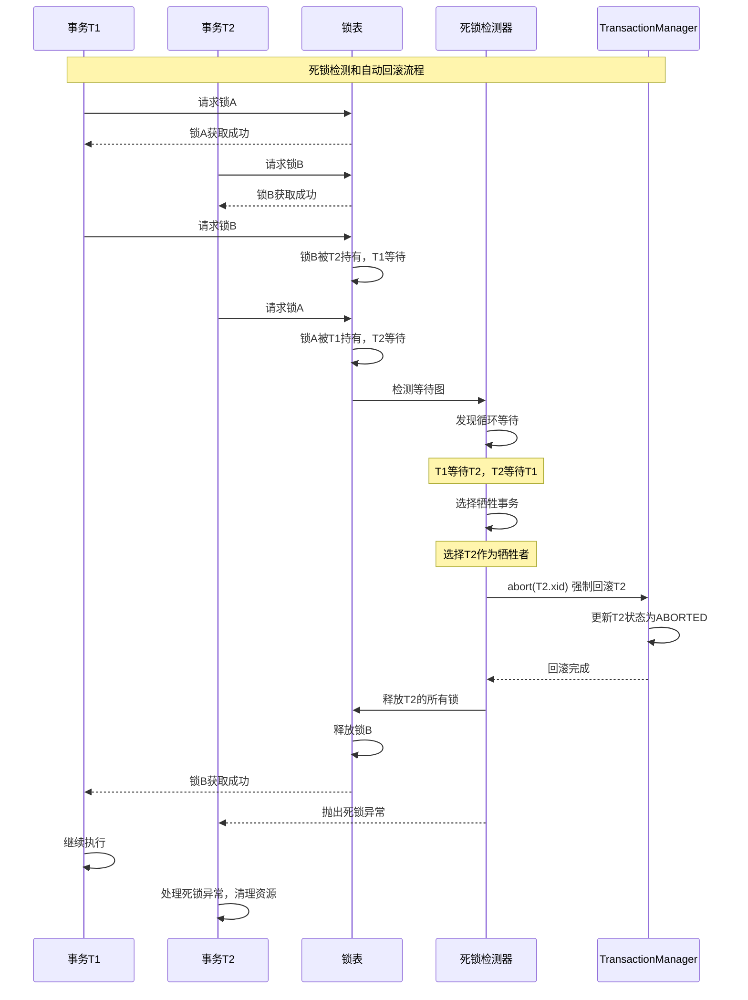
```mermaid
sequenceDiagram
    participant T1 as 事务T1
    participant T2 as 事务T2
    participant LockTable as 锁表
    participant DeadlockDetector as 死锁检测器
    participant TM as TransactionManager

    Note over T1,TM: 死锁检测和自动回滚流程
    
    T1->>LockTable: 请求锁A
    LockTable-->>T1: 锁A获取成功
    
    T2->>LockTable: 请求锁B
    LockTable-->>T2: 锁B获取成功
    
    T1->>LockTable: 请求锁B
    LockTable->>LockTable: 锁B被T2持有，T1等待
    
    T2->>LockTable: 请求锁A
    LockTable->>LockTable: 锁A被T1持有，T2等待
    
    LockTable->>DeadlockDetector: 检测等待图
    DeadlockDetector->>DeadlockDetector: 发现循环等待
    Note over DeadlockDetector: T1等待T2，T2等待T1
    
    DeadlockDetector->>DeadlockDetector: 选择牺牲事务
    Note over DeadlockDetector: 选择T2作为牺牲者
    
    DeadlockDetector->>TM: abort(T2.xid) 强制回滚T2
    TM->>TM: 更新T2状态为ABORTED
    TM-->>DeadlockDetector: 回滚完成
    
    DeadlockDetector->>LockTable: 释放T2的所有锁
    LockTable->>LockTable: 释放锁B
    LockTable-->>T1: 锁B获取成功
    
    DeadlockDetector-->>T2: 抛出死锁异常
    T1->>T1: 继续执行
    T2->>T2: 处理死锁异常，清理资源
```

### 2. 事务异常和自动回滚

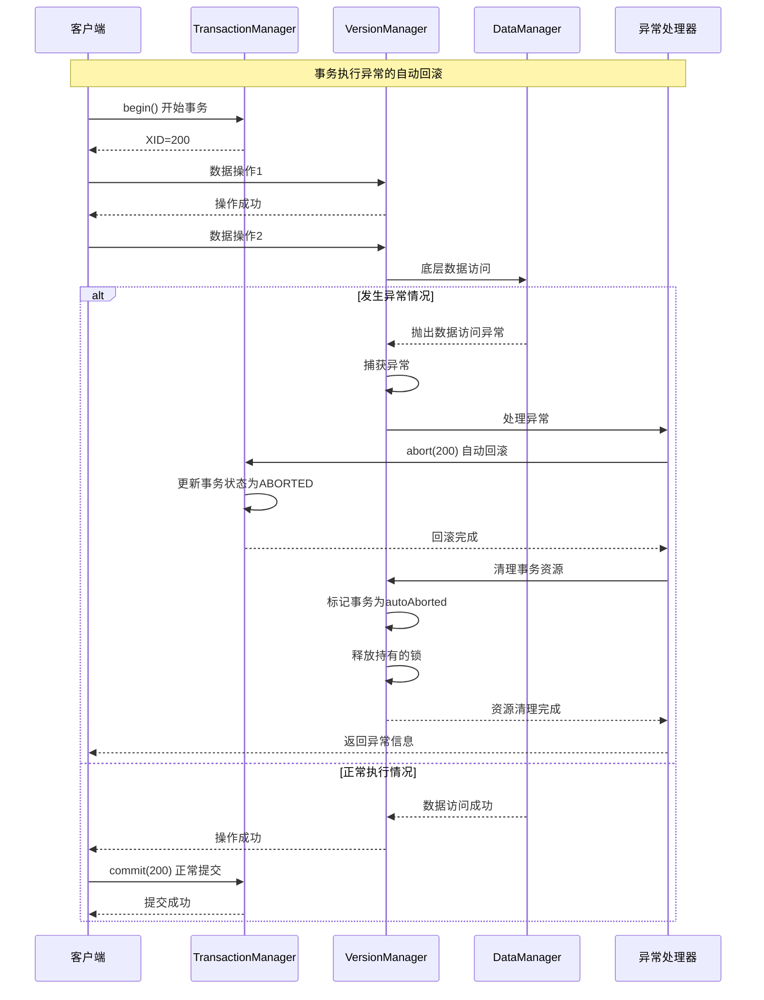
```mermaid
sequenceDiagram
    participant Client as 客户端
    participant TM as TransactionManager
    participant VM as VersionManager
    participant DM as DataManager
    participant ErrorHandler as 异常处理器

    Note over Client,ErrorHandler: 事务执行异常的自动回滚
    
    Client->>TM: begin() 开始事务
    TM-->>Client: XID=200
    
    Client->>VM: 数据操作1
    VM-->>Client: 操作成功
    
    Client->>VM: 数据操作2
    VM->>DM: 底层数据访问
    
    alt 发生异常情况
        DM-->>VM: 抛出数据访问异常
        VM->>VM: 捕获异常
        VM->>ErrorHandler: 处理异常
        
        ErrorHandler->>TM: abort(200) 自动回滚
        TM->>TM: 更新事务状态为ABORTED
        TM-->>ErrorHandler: 回滚完成
        
        ErrorHandler->>VM: 清理事务资源
        VM->>VM: 标记事务为autoAborted
        VM->>VM: 释放持有的锁
        VM-->>ErrorHandler: 资源清理完成
        
        ErrorHandler-->>Client: 返回异常信息
    else 正常执行情况
        DM-->>VM: 数据访问成功
        VM-->>Client: 操作成功
        
        Client->>TM: commit(200) 正常提交
        TM-->>Client: 提交成功
    end
```

### 3. 系统崩溃时的事务恢复

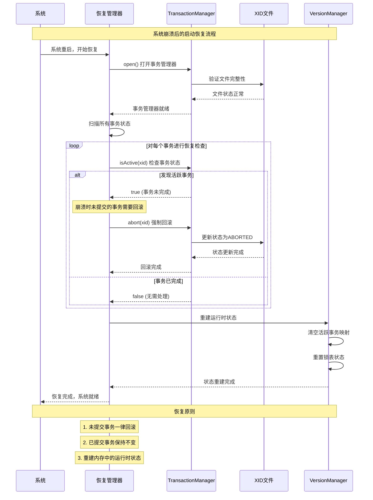
```mermaid
sequenceDiagram
    participant System as 系统
    participant Recovery as 恢复管理器
    participant TM as TransactionManager
    participant XIDFile as XID文件
    participant VM as VersionManager

    Note over System,VM: 系统崩溃后的启动恢复流程
    
    System->>Recovery: 系统重启，开始恢复
    
    Recovery->>TM: open() 打开事务管理器
    TM->>XIDFile: 验证文件完整性
    XIDFile-->>TM: 文件状态正常
    TM-->>Recovery: 事务管理器就绪
    
    Recovery->>Recovery: 扫描所有事务状态
    
    loop 对每个事务进行恢复检查
        Recovery->>TM: isActive(xid) 检查事务状态
        
        alt 发现活跃事务
            TM-->>Recovery: true (事务未完成)
            Note over Recovery: 崩溃时未提交的事务需要回滚
            
            Recovery->>TM: abort(xid) 强制回滚
            TM->>XIDFile: 更新状态为ABORTED
            XIDFile-->>TM: 状态更新完成
            TM-->>Recovery: 回滚完成
            
        else 事务已完成
            TM-->>Recovery: false (无需处理)
        end
    end
    
    Recovery->>VM: 重建运行时状态
    VM->>VM: 清空活跃事务映射
    VM->>VM: 重置锁表状态
    VM-->>Recovery: 状态重建完成
    
    Recovery-->>System: 恢复完成，系统就绪
    
    Note over System,VM: 恢复原则
    Note over Recovery: 1. 未提交事务一律回滚
    Note over Recovery: 2. 已提交事务保持不变
    Note over Recovery: 3. 重建内存中的运行时状态
```

---

## 总结

MYDB 的事务管理模块通过简化的设计实现了数据库事务的核心功能：

### 关键特性
1. **简单高效的状态管理**: 使用单字节存储事务状态，O(1) 时间复杂度访问
2. **强一致性保证**: 每次状态变更立即强制刷新到磁盘
3. **并发安全**: 通过锁机制保护 XID 分配的原子性
4. **快速恢复**: 基于状态文件的直接恢复，无需复杂的日志回放

### 设计优势
- **存储效率**: 最小化存储开销，每个事务仅占用 1 字节
- **访问性能**: 通过计算偏移量实现快速状态查询
- **持久性保证**: 强制刷新机制确保事务状态不丢失
- **崩溃恢复**: 简单可靠的状态恢复机制

### 与其他模块的协作
- **版本管理模块**: 提供事务对象和快照机制，实现 MVCC
- **数据管理模块**: 配合 WAL 日志，确保数据持久性
- **锁管理模块**: 支持死锁检测和自动回滚机制

这种简化的事务管理设计在保证 ACID 特性的同时，降低了实现复杂度，非常适合学习和理解数据库事务的核心原理。