# MYDB 版本管理模块时序图

## 模块概述

### 版本管理模块的职责和核心组件

版本管理模块 (VM - Version Manager) 是 MYDB 多版本并发控制 (MVCC) 的核心实现，负责管理数据的版本信息、事务的可见性判断和死锁检测。

**核心组件：**

1. **[`VersionManagerImpl`](../src/main/java/top/guoziyang/mydb/backend/vm/VersionManagerImpl.java)** - 版本管理器主实现
   - 继承 [`AbstractCache`](../src/main/java/top/guoziyang/mydb/backend/common/AbstractCache.java) 提供 Entry 缓存管理
   - 协调事务管理器和数据管理器
   - 维护活跃事务表和全局锁

2. **[`Entry`](../src/main/java/top/guoziyang/mydb/backend/vm/Entry.java)** - 版本记录抽象
   - 包含 XMIN (创建事务ID) 和 XMAX (删除事务ID)
   - 存储实际数据内容
   - 支持逻辑删除机制

3. **[`Visibility`](../src/main/java/top/guoziyang/mydb/backend/vm/Visibility.java)** - 可见性判断核心
   - 实现不同隔离级别的可见性算法
   - 支持 READ_COMMITTED 和 REPEATABLE_READ
   - 处理版本跳过逻辑

4. **[`LockTable`](../src/main/java/top/guoziyang/mydb/backend/vm/LockTable.java)** - 死锁检测和锁管理
   - 维护依赖等待图
   - DFS 算法检测死锁
   - 管理资源锁和等待队列

5. **[`Transaction`](../src/main/java/top/guoziyang/mydb/backend/vm/Transaction.java)** - 事务对象抽象
   - 管理事务快照
   - 记录隔离级别和错误状态
   - 支持自动回滚机制

### MVCC (多版本并发控制) 的基本原理

**MVCC 核心思想：**
- 读写操作不相互阻塞
- 为每个数据维护多个版本
- 通过时间戳和快照判断版本可见性
- 支持事务的隔离性和一致性

**版本记录结构：**
```
┌─────────────┬─────────────┬─────────────────┐
│    XMIN     │    XMAX     │      DATA       │
│   (8字节)    │   (8字节)    │     (变长)       │
│  创建事务ID   │  删除事务ID   │    实际数据      │
└─────────────┴─────────────┴─────────────────┘
```

**版本可见性规则：**
- XMIN：版本的创建事务必须已提交
- XMAX：版本的删除事务必须未提交或不存在
- 快照：根据事务快照判断其他事务的可见性

### 与 MySQL InnoDB MVCC 的对比分析

| 特性 | MySQL InnoDB | MYDB VM |
|------|-------------|---------|
| **版本存储** | Undo Log + Read View | Entry + Snapshot |
| **版本标识** | DB_TRX_ID + DB_ROLL_PTR | XMIN + XMAX |
| **快照机制** | Read View (min_trx_id, max_trx_id, creator_trx_id, ids) | Transaction Snapshot Map |
| **可见性判断** | 复杂的 Read View 算法 | 简化的 [`Visibility.isVisible()`](../src/main/java/top/guoziyang/mydb/backend/vm/Visibility.java:63) |
| **垃圾回收** | Purge 线程清理 undo log | 缓存 LRU 自动回收 |
| **锁管理** | 行锁 + 间隙锁 + Next-Key 锁 | 简化的资源锁 + 死锁检测 |

### 读已提交 vs 可重复读隔离级别的实现

**READ_COMMITTED (level=0)：**
- 不创建事务快照
- 每次读取看到最新的已提交数据
- 允许不可重复读现象
- 实现：[`Visibility.readCommitted()`](../src/main/java/top/guoziyang/mydb/backend/vm/Visibility.java:88)

**REPEATABLE_READ (level=1)：**
- 事务开始时创建快照
- 整个事务期间保持一致的读取视图
- 避免不可重复读现象
- 实现：[`Visibility.repeatableRead()`](../src/main/java/top/guoziyang/mydb/backend/vm/Visibility.java:129)

## 核心时序图

### Entry 版本记录的创建流程

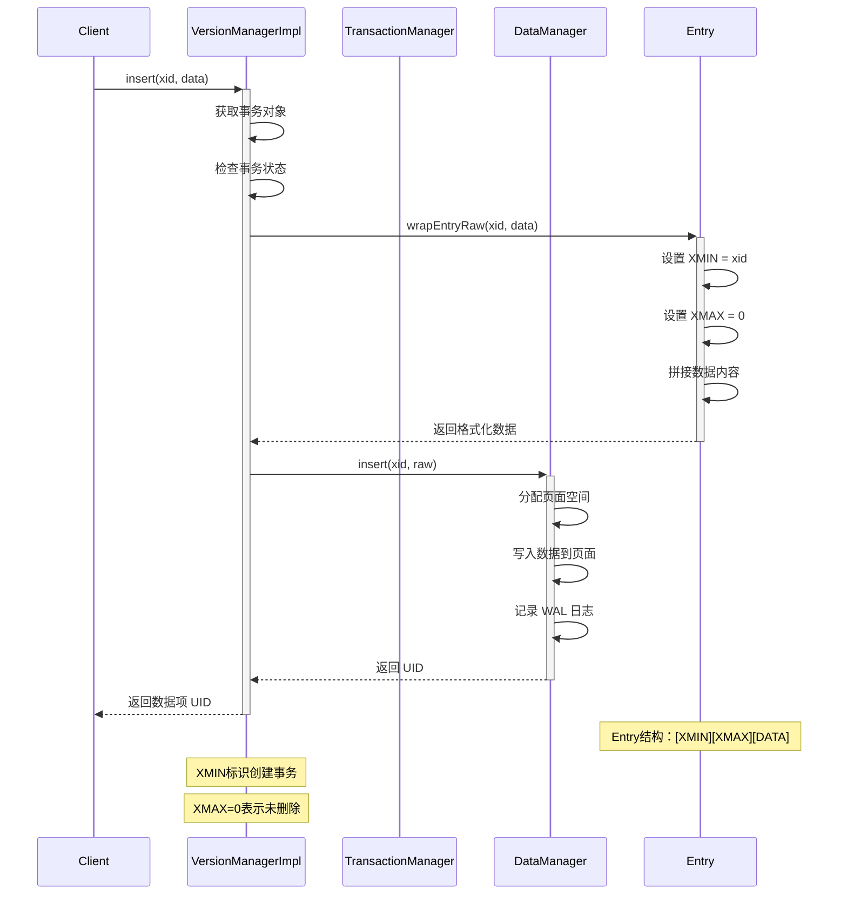

### 事务的 read 操作流程（可见性判断）

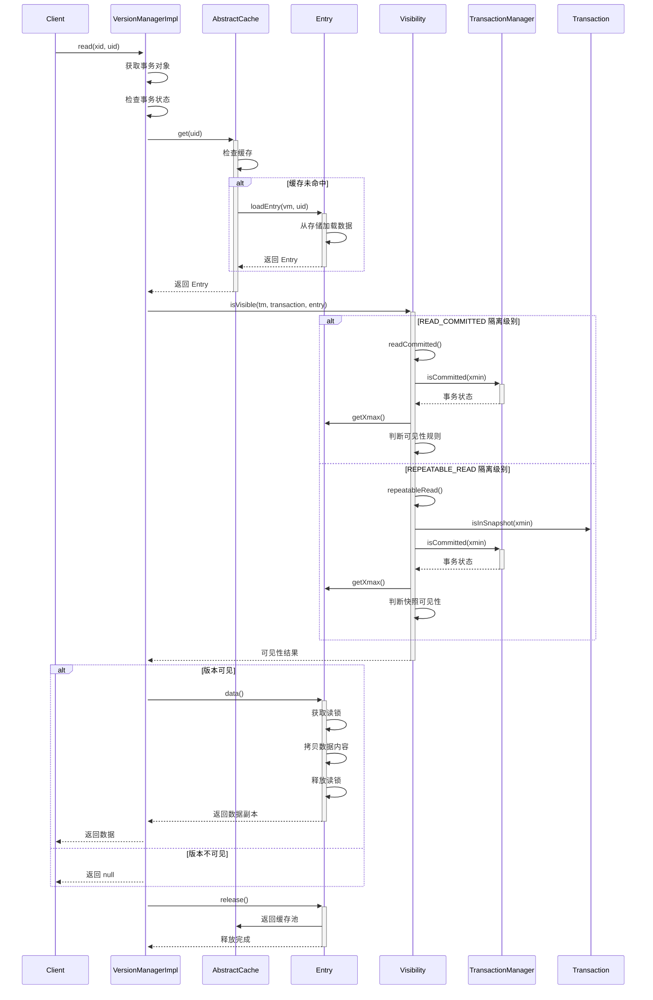

### 事务的 insert 操作流程

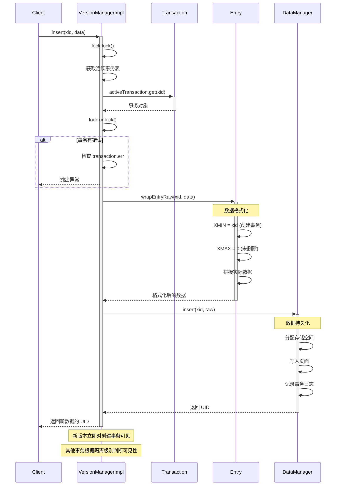

### 事务的 delete 操作流程

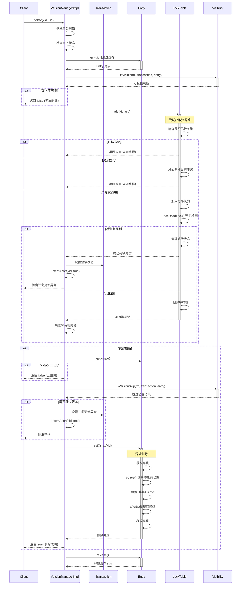

### 版本链的维护和遍历

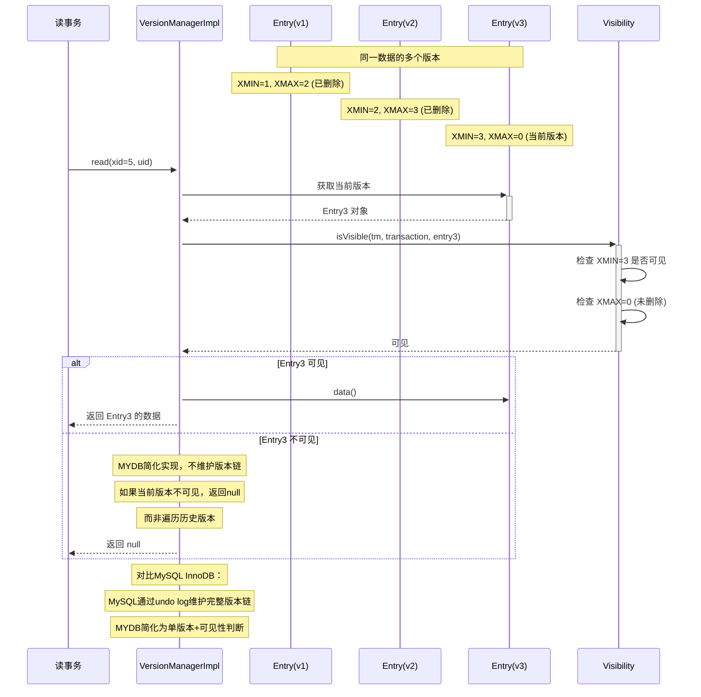

### 可见性检查的详细算法

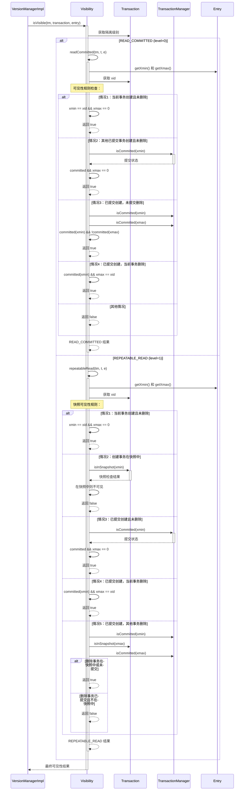

## LockTable 死锁检测

### 锁请求和等待队列管理

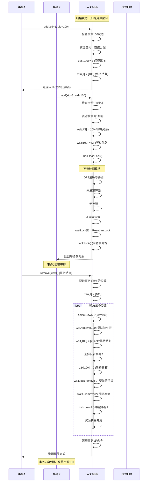

### 死锁检测的 DFS 算法流程

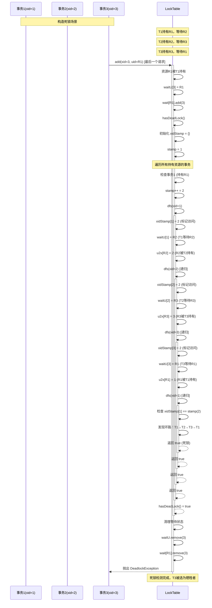

### 死锁解决和事务回滚

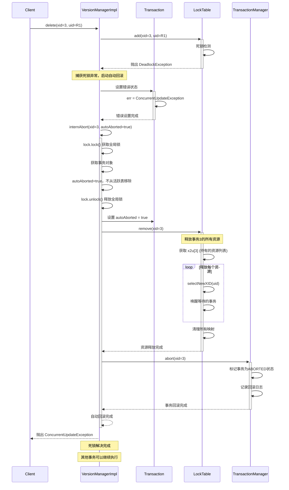

### 资源释放和等待者唤醒

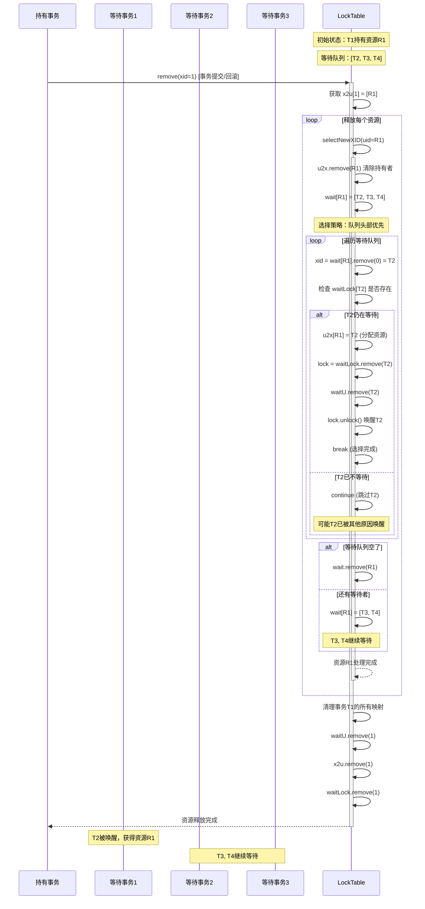

## Transaction 快照管理

### 事务快照的创建和管理

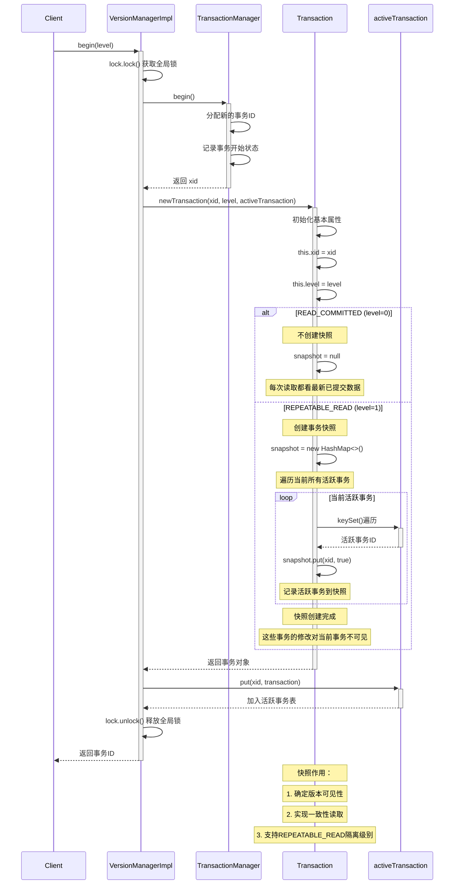

### Read Committed 的快照更新机制

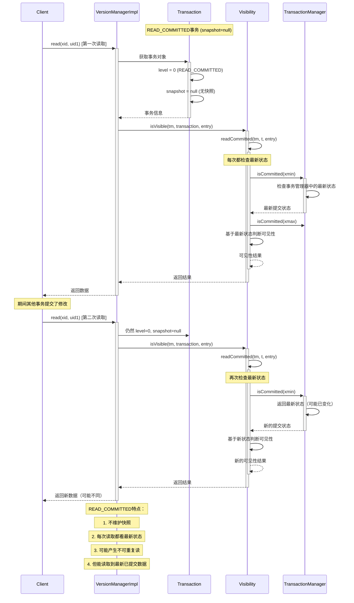

### Repeatable Read 的快照保持机制

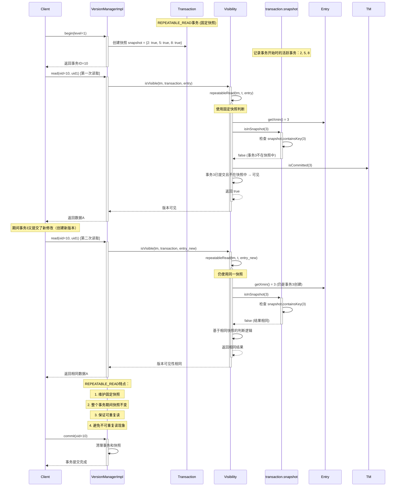

### 活跃事务列表的维护

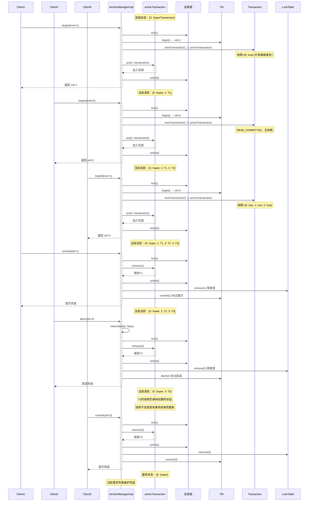

## 组件交互图

### VersionManager 与 TransactionManager 的协作

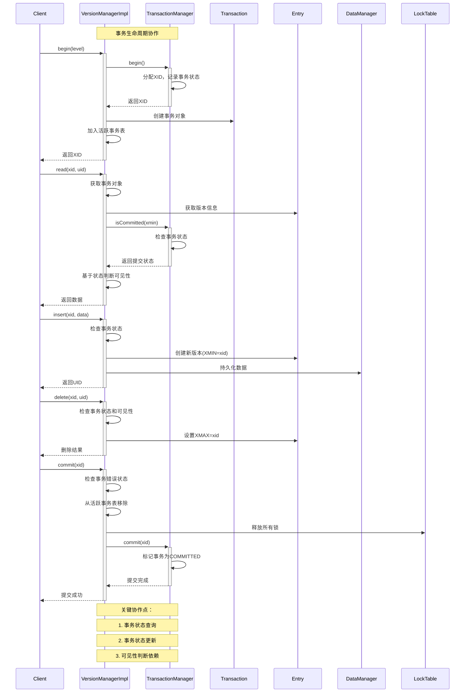

### LockTable 与并发控制的集成

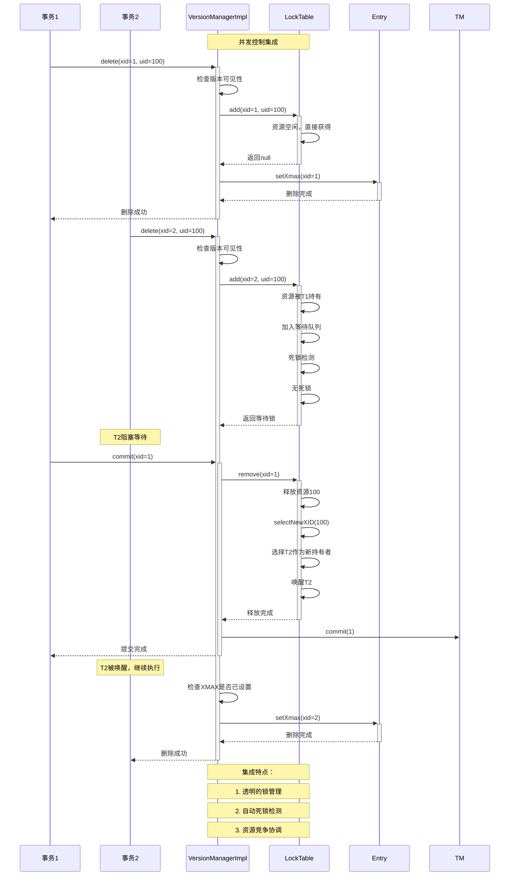

### Entry 版本链与可见性判断的关系

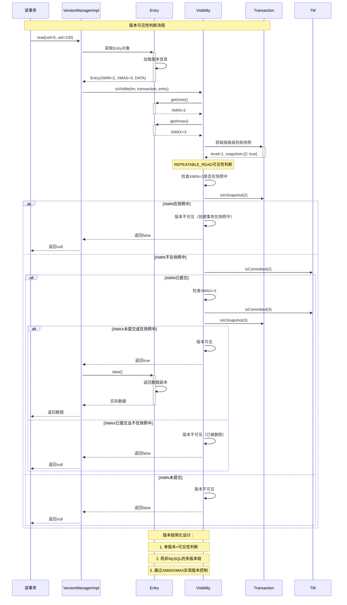

### 各隔离级别下的不同行为模式

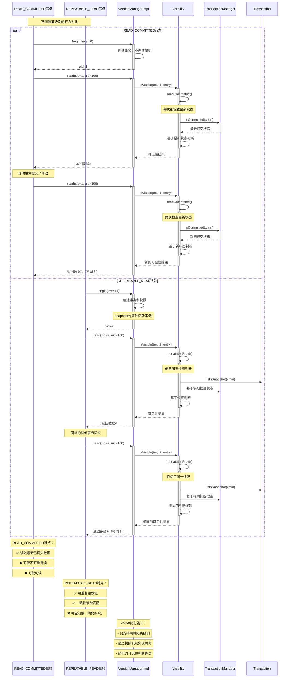

## 总结

MYDB 版本管理模块通过以下核心机制实现了简化但完整的 MVCC：

### 核心设计原则
1. **简化的版本控制**：使用 XMIN/XMAX 而非复杂的版本链
2. **快照隔离**：通过事务快照实现隔离级别
3. **可见性算法**：根据事务状态和快照判断版本可见性
4. **死锁检测**：DFS 算法检测和解决死锁
5. **缓存管理**：LRU 缓存提升性能

### 与 MySQL InnoDB 的差异
1. **版本存储**：Entry 直接存储 vs Undo Log 间接存储
2. **快照机制**：简化的 Map 结构 vs 复杂的 Read View
3. **锁粒度**：资源级锁 vs 行级锁和间隙锁
4. **垃圾回收**：缓存自动回收 vs 专门的 Purge 线程

### 性能和功能权衡
- ✅ 实现简单，易于理解和维护
- ✅ 支持基本的 MVCC 功能
- ✅ 有效的死锁检测和处理
- ❌ 功能相对简化，不支持复杂查询优化
- ❌ 锁粒度较粗，并发性能有限

这种设计在教学和小型应用中具有很好的实用价值，展示了 MVCC 的核心思想和实现方法。