# 表管理模块 (TBM) 时序图

## 模块概述

### 表管理模块的职责和核心组件

表管理模块 (Table Manager) 是 MYDB 的上层数据操作接口，负责连接底层存储与 SQL 语句处理。它提供了完整的表级别操作，包括表的创建、数据的增删改查以及事务管理。

**核心组件：**
- **TableManager/TableManagerImpl**：表管理器接口和实现，提供所有表操作的入口
- **Table**：表的核心实现，管理表结构和数据操作
- **Field**：字段定义和类型系统，支持索引和类型转换
- **Booter**：启动文件管理器，维护表链表的起始点
- **BeginRes/FieldCalRes**：操作结果封装类

### 表结构定义和字段管理机制

**表结构持久化格式：**
```
[TableName][NextTable][Field1Uid][Field2Uid]...[FieldNUid]
```

**字段持久化格式：**
```
[FieldName][TypeName][IndexUid]
```

**支持的数据类型：**
- `int32`：32位整数
- `int64`：64位长整数
- `string`：字符串类型

### 与关系型数据库表管理的对比

| 功能 | MySQL | MYDB |
|------|-------|------|
| 表元信息存储 | .frm文件 + information_schema | 版本管理系统中的数据块 |
| 表链表管理 | 系统表 | Booter文件 + 表链表结构 |
| 字段类型系统 | 丰富的数据类型 | 简化的三种基本类型 |
| 索引管理 | 多种索引类型 | B+树索引 |

### TableManager 作为上层接口的设计原理

TableManager 采用了**门面模式（Facade Pattern）**的设计，将复杂的底层操作封装为简单的上层接口：

1. **统一入口**：所有表操作都通过 TableManager 进行
2. **事务集成**：与 VersionManager 深度集成，支持 MVCC
3. **缓存管理**：维护表缓存和事务表缓存，提高性能
4. **异常处理**：统一的错误处理和异常传播

---

## 表结构管理时序图

### 1. 数据库的创建和初始化流程

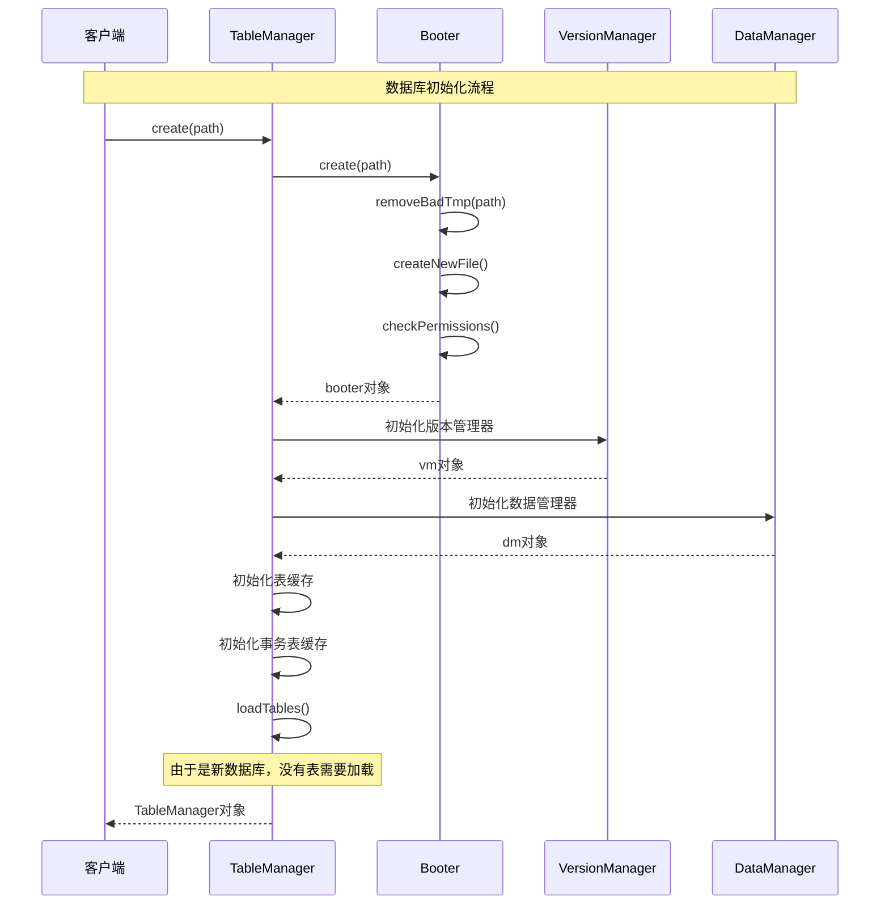
```mermaid
sequenceDiagram
    participant Client as 客户端
    participant TM as TableManager
    participant Booter as Booter
    participant VM as VersionManager
    participant DM as DataManager

    Note over Client,DM: 数据库初始化流程

    Client->>TM: create(path)
    TM->>Booter: create(path)
    Booter->>Booter: removeBadTmp(path)
    Booter->>Booter: createNewFile()
    Booter->>Booter: checkPermissions()
    Booter-->>TM: booter对象

    TM->>VM: 初始化版本管理器
    VM-->>TM: vm对象
    
    TM->>DM: 初始化数据管理器
    DM-->>TM: dm对象

    TM->>TM: 初始化表缓存
    TM->>TM: 初始化事务表缓存
    TM->>TM: loadTables()
    
    Note over TM: 由于是新数据库，没有表需要加载
    
    TM-->>Client: TableManager对象
```

### 2. 表的创建流程（CREATE TABLE）

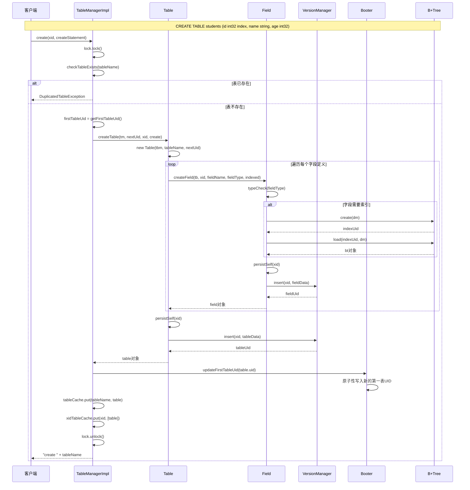
```mermaid
sequenceDiagram
    participant Client as 客户端
    participant TM as TableManagerImpl
    participant Table as Table
    participant Field as Field
    participant VM as VersionManager
    participant Booter as Booter
    participant BTree as B+Tree

    Note over Client,BTree: CREATE TABLE students (id int32 index, name string, age int32)

    Client->>TM: create(xid, createStatement)
    TM->>TM: lock.lock()
    TM->>TM: checkTableExists(tableName)
    
    alt 表已存在
        TM-->>Client: DuplicatedTableException
    else 表不存在
        TM->>TM: firstTableUid = getFirstTableUid()
        TM->>Table: createTable(tm, nextUid, xid, create)
        
        Table->>Table: new Table(tbm, tableName, nextUid)
        
        loop 遍历每个字段定义
            Table->>Field: createField(tb, xid, fieldName, fieldType, indexed)
            Field->>Field: typeCheck(fieldType)
            
            alt 字段需要索引
                Field->>BTree: create(dm)
                BTree-->>Field: indexUid
                Field->>BTree: load(indexUid, dm)
                BTree-->>Field: bt对象
            end
            
            Field->>Field: persistSelf(xid)
            Field->>VM: insert(xid, fieldData)
            VM-->>Field: fieldUid
            Field-->>Table: field对象
        end
        
        Table->>Table: persistSelf(xid)
        Table->>VM: insert(xid, tableData)
        VM-->>Table: tableUid
        Table-->>TM: table对象
        
        TM->>Booter: updateFirstTableUid(table.uid)
        Booter->>Booter: 原子性写入新的第一表UID
        
        TM->>TM: tableCache.put(tableName, table)
        TM->>TM: xidTableCache.put(xid, [table])
        TM->>TM: lock.unlock()
        
        TM-->>Client: "create " + tableName
    end
```

### 3. 字段定义和类型系统

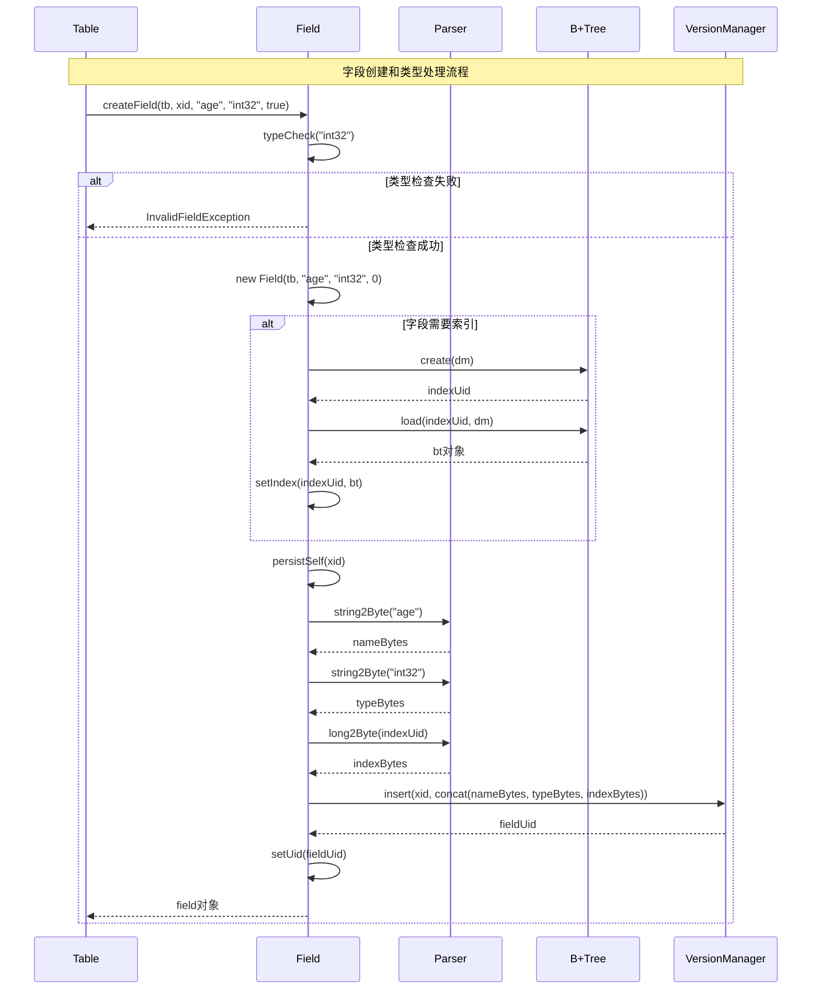
```mermaid
sequenceDiagram
    participant Table as Table
    participant Field as Field
    participant Parser as Parser
    participant BTree as B+Tree
    participant VM as VersionManager

    Note over Table,VM: 字段创建和类型处理流程

    Table->>Field: createField(tb, xid, "age", "int32", true)
    Field->>Field: typeCheck("int32")
    
    alt 类型检查失败
        Field-->>Table: InvalidFieldException
    else 类型检查成功
        Field->>Field: new Field(tb, "age", "int32", 0)
        
        alt 字段需要索引
            Field->>BTree: create(dm)
            BTree-->>Field: indexUid
            Field->>BTree: load(indexUid, dm)
            BTree-->>Field: bt对象
            Field->>Field: setIndex(indexUid, bt)
        end
        
        Field->>Field: persistSelf(xid)
        Field->>Parser: string2Byte("age")
        Parser-->>Field: nameBytes
        Field->>Parser: string2Byte("int32")
        Parser-->>Field: typeBytes
        Field->>Parser: long2Byte(indexUid)
        Parser-->>Field: indexBytes
        
        Field->>VM: insert(xid, concat(nameBytes, typeBytes, indexBytes))
        VM-->>Field: fieldUid
        Field->>Field: setUid(fieldUid)
        Field-->>Table: field对象
    end
```

### 4. 表结构的持久化存储

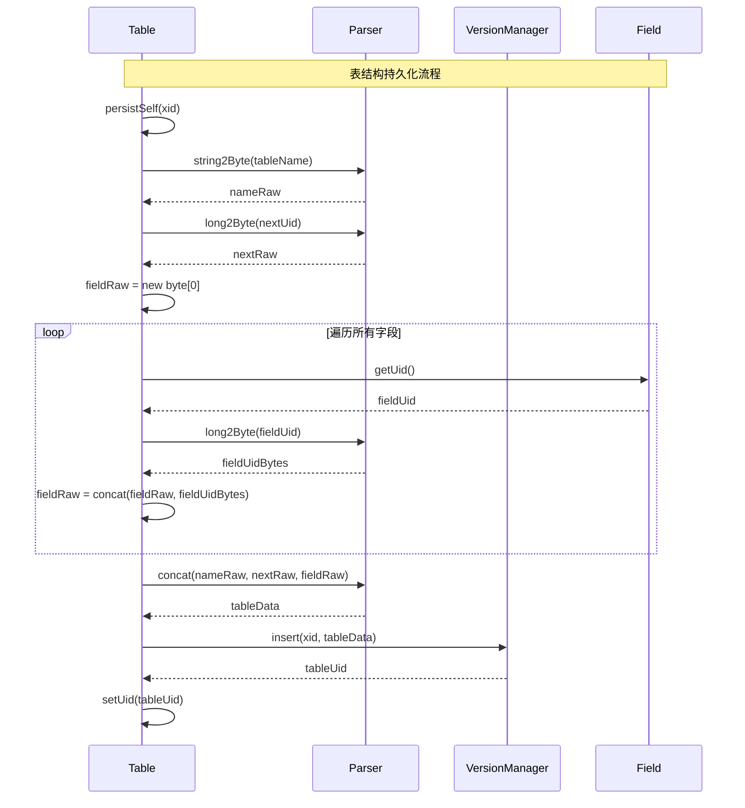
```mermaid
sequenceDiagram
    participant Table as Table
    participant Parser as Parser
    participant VM as VersionManager
    participant Field as Field

    Note over Table,Field: 表结构持久化流程

    Table->>Table: persistSelf(xid)
    Table->>Parser: string2Byte(tableName)
    Parser-->>Table: nameRaw
    
    Table->>Parser: long2Byte(nextUid)
    Parser-->>Table: nextRaw
    
    Table->>Table: fieldRaw = new byte[0]
    
    loop 遍历所有字段
        Table->>Field: getUid()
        Field-->>Table: fieldUid
        Table->>Parser: long2Byte(fieldUid)
        Parser-->>Table: fieldUidBytes
        Table->>Table: fieldRaw = concat(fieldRaw, fieldUidBytes)
    end
    
    Table->>Parser: concat(nameRaw, nextRaw, fieldRaw)
    Parser-->>Table: tableData
    
    Table->>VM: insert(xid, tableData)
    VM-->>Table: tableUid
    Table->>Table: setUid(tableUid)
```

### 5. Booter 启动文件的管理

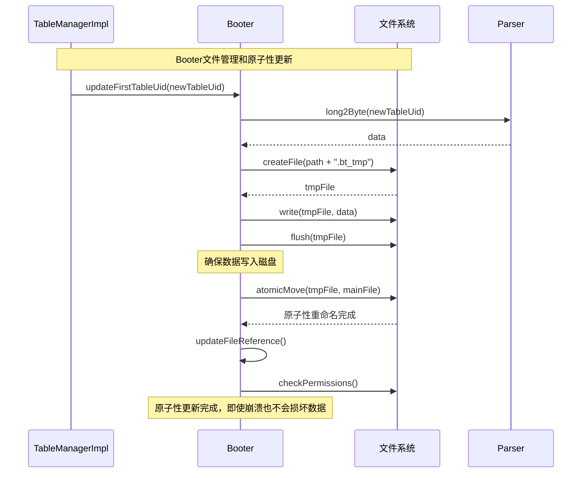
```mermaid
sequenceDiagram
    participant TM as TableManagerImpl
    participant Booter as Booter
    participant FileSystem as 文件系统

    Note over TM,FileSystem: Booter文件管理和原子性更新

    TM->>Booter: updateFirstTableUid(newTableUid)
    Booter->>Parser: long2Byte(newTableUid)
    Parser-->>Booter: data
    
    Booter->>FileSystem: createFile(path + ".bt_tmp")
    FileSystem-->>Booter: tmpFile
    
    Booter->>FileSystem: write(tmpFile, data)
    Booter->>FileSystem: flush(tmpFile)
    
    Note over Booter: 确保数据写入磁盘
    
    Booter->>FileSystem: atomicMove(tmpFile, mainFile)
    FileSystem-->>Booter: 原子性重命名完成
    
    Booter->>Booter: updateFileReference()
    Booter->>FileSystem: checkPermissions()
    
    Note over Booter: 原子性更新完成，即使崩溃也不会损坏数据
```

---

## 数据操作时序图

### 1. 数据插入流程（INSERT）

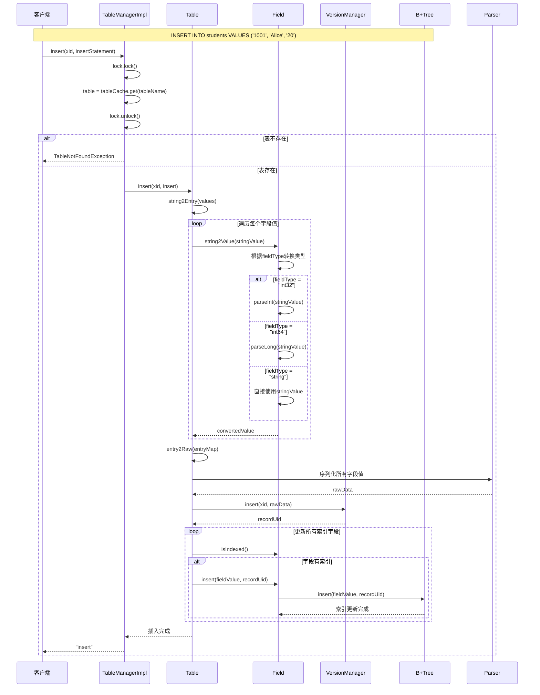
```mermaid
sequenceDiagram
    participant Client as 客户端
    participant TM as TableManagerImpl
    participant Table as Table
    participant Field as Field
    participant VM as VersionManager
    participant BTree as B+Tree

    Note over Client,BTree: INSERT INTO students VALUES ('1001', 'Alice', '20')

    Client->>TM: insert(xid, insertStatement)
    TM->>TM: lock.lock()
    TM->>TM: table = tableCache.get(tableName)
    TM->>TM: lock.unlock()
    
    alt 表不存在
        TM-->>Client: TableNotFoundException
    else 表存在
        TM->>Table: insert(xid, insert)
        Table->>Table: string2Entry(values)
        
        loop 遍历每个字段值
            Table->>Field: string2Value(stringValue)
            Field->>Field: 根据fieldType转换类型
            alt fieldType = "int32"
                Field->>Field: parseInt(stringValue)
            else fieldType = "int64"
                Field->>Field: parseLong(stringValue)
            else fieldType = "string"
                Field->>Field: 直接使用stringValue
            end
            Field-->>Table: convertedValue
        end
        
        Table->>Table: entry2Raw(entryMap)
        Table->>Parser: 序列化所有字段值
        Parser-->>Table: rawData
        
        Table->>VM: insert(xid, rawData)
        VM-->>Table: recordUid
        
        loop 更新所有索引字段
            Table->>Field: isIndexed()
            alt 字段有索引
                Table->>Field: insert(fieldValue, recordUid)
                Field->>BTree: insert(fieldValue, recordUid)
                BTree-->>Field: 索引更新完成
            end
        end
        
        Table-->>TM: 插入完成
        TM-->>Client: "insert"
    end
```

### 2. 数据查询流程（SELECT）

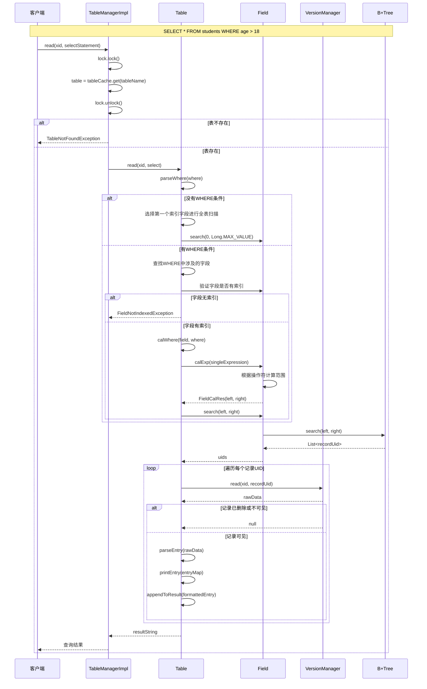
```mermaid
sequenceDiagram
    participant Client as 客户端
    participant TM as TableManagerImpl
    participant Table as Table
    participant Field as Field
    participant VM as VersionManager
    participant BTree as B+Tree

    Note over Client,BTree: SELECT * FROM students WHERE age > 18

    Client->>TM: read(xid, selectStatement)
    TM->>TM: lock.lock()
    TM->>TM: table = tableCache.get(tableName)
    TM->>TM: lock.unlock()
    
    alt 表不存在
        TM-->>Client: TableNotFoundException
    else 表存在
        TM->>Table: read(xid, select)
        Table->>Table: parseWhere(where)
        
        alt 没有WHERE条件
            Table->>Table: 选择第一个索引字段进行全表扫描
            Table->>Field: search(0, Long.MAX_VALUE)
        else 有WHERE条件
            Table->>Table: 查找WHERE中涉及的字段
            Table->>Field: 验证字段是否有索引
            
            alt 字段无索引
                Table-->>TM: FieldNotIndexedException
            else 字段有索引
                Table->>Table: calWhere(field, where)
                Table->>Field: calExp(singleExpression)
                Field->>Field: 根据操作符计算范围
                Field-->>Table: FieldCalRes(left, right)
                Table->>Field: search(left, right)
            end
        end
        
        Field->>BTree: search(left, right)
        BTree-->>Field: List<recordUid>
        Field-->>Table: uids
        
        loop 遍历每个记录UID
            Table->>VM: read(xid, recordUid)
            VM-->>Table: rawData
            
            alt 记录已删除或不可见
                VM-->>Table: null
            else 记录可见
                Table->>Table: parseEntry(rawData)
                Table->>Table: printEntry(entryMap)
                Table->>Table: appendToResult(formattedEntry)
            end
        end
        
        Table-->>TM: resultString
        TM-->>Client: 查询结果
    end
```

### 3. 数据更新流程（UPDATE）

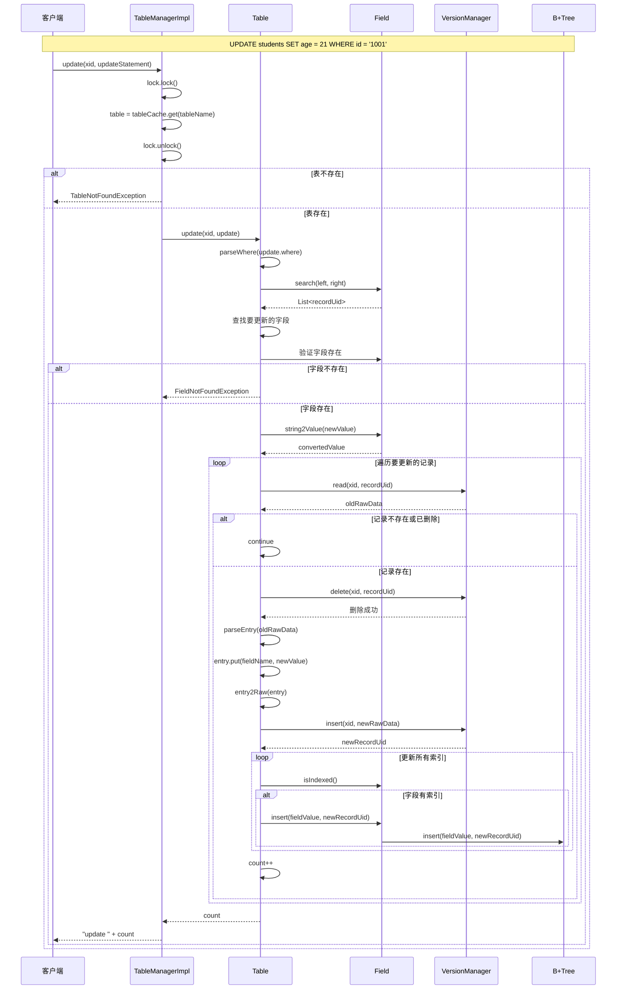
```mermaid
sequenceDiagram
    participant Client as 客户端
    participant TM as TableManagerImpl
    participant Table as Table
    participant Field as Field
    participant VM as VersionManager
    participant BTree as B+Tree

    Note over Client,BTree: UPDATE students SET age = 21 WHERE id = '1001'

    Client->>TM: update(xid, updateStatement)
    TM->>TM: lock.lock()
    TM->>TM: table = tableCache.get(tableName)
    TM->>TM: lock.unlock()
    
    alt 表不存在
        TM-->>Client: TableNotFoundException
    else 表存在
        TM->>Table: update(xid, update)
        Table->>Table: parseWhere(update.where)
        Table->>Field: search(left, right)
        Field-->>Table: List<recordUid>
        
        Table->>Table: 查找要更新的字段
        Table->>Field: 验证字段存在
        
        alt 字段不存在
            Table-->>TM: FieldNotFoundException
        else 字段存在
            Table->>Field: string2Value(newValue)
            Field-->>Table: convertedValue
            
            loop 遍历要更新的记录
                Table->>VM: read(xid, recordUid)
                VM-->>Table: oldRawData
                
                alt 记录不存在或已删除
                    Table->>Table: continue
                else 记录存在
                    Table->>VM: delete(xid, recordUid)
                    VM-->>Table: 删除成功
                    
                    Table->>Table: parseEntry(oldRawData)
                    Table->>Table: entry.put(fieldName, newValue)
                    Table->>Table: entry2Raw(entry)
                    
                    Table->>VM: insert(xid, newRawData)
                    VM-->>Table: newRecordUid
                    
                    loop 更新所有索引
                        Table->>Field: isIndexed()
                        alt 字段有索引
                            Table->>Field: insert(fieldValue, newRecordUid)
                            Field->>BTree: insert(fieldValue, newRecordUid)
                        end
                    end
                    
                    Table->>Table: count++
                end
            end
            
            Table-->>TM: count
            TM-->>Client: "update " + count
        end
    end
```

### 4. 数据删除流程（DELETE）

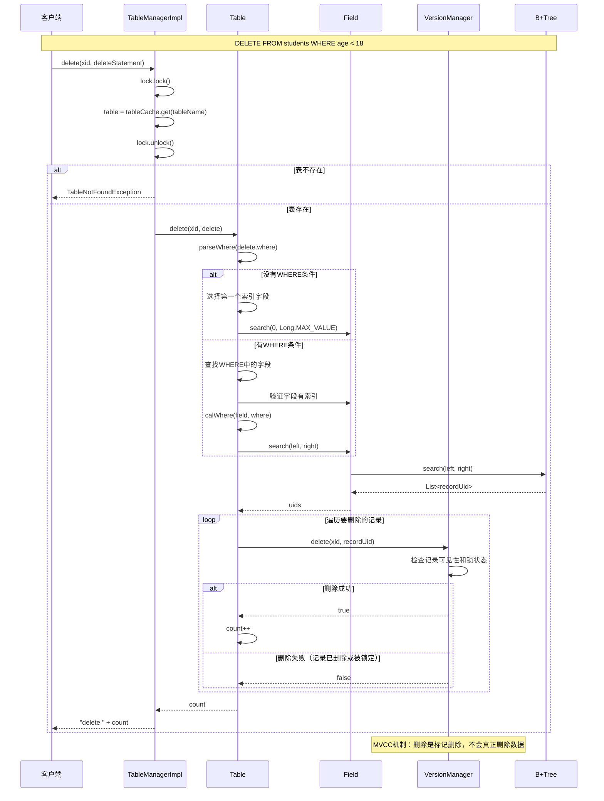
```mermaid
sequenceDiagram
    participant Client as 客户端
    participant TM as TableManagerImpl
    participant Table as Table
    participant Field as Field
    participant VM as VersionManager
    participant BTree as B+Tree

    Note over Client,BTree: DELETE FROM students WHERE age < 18

    Client->>TM: delete(xid, deleteStatement)
    TM->>TM: lock.lock()
    TM->>TM: table = tableCache.get(tableName)
    TM->>TM: lock.unlock()
    
    alt 表不存在
        TM-->>Client: TableNotFoundException
    else 表存在
        TM->>Table: delete(xid, delete)
        Table->>Table: parseWhere(delete.where)
        
        alt 没有WHERE条件
            Table->>Table: 选择第一个索引字段
            Table->>Field: search(0, Long.MAX_VALUE)
        else 有WHERE条件
            Table->>Table: 查找WHERE中的字段
            Table->>Field: 验证字段有索引
            Table->>Table: calWhere(field, where)
            Table->>Field: search(left, right)
        end
        
        Field->>BTree: search(left, right)
        BTree-->>Field: List<recordUid>
        Field-->>Table: uids
        
        loop 遍历要删除的记录
            Table->>VM: delete(xid, recordUid)
            VM->>VM: 检查记录可见性和锁状态
            
            alt 删除成功
                VM-->>Table: true
                Table->>Table: count++
            else 删除失败（记录已删除或被锁定）
                VM-->>Table: false
            end
        end
        
        Table-->>TM: count
        TM-->>Client: "delete " + count
    end

    Note over VM: MVCC机制：删除是标记删除，不会真正删除数据
```

### 5. 条件查询和字段计算

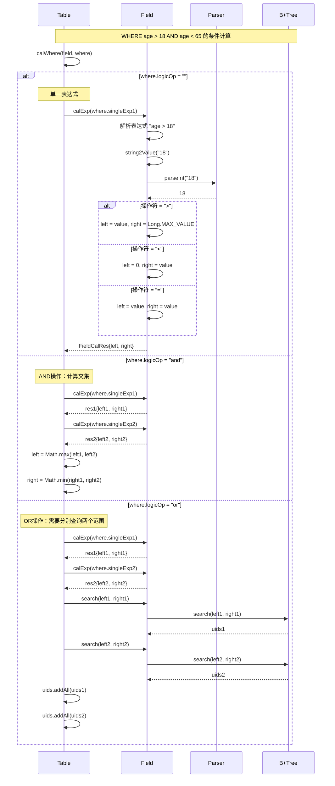
```mermaid
sequenceDiagram
    participant Table as Table
    participant Field as Field
    participant Parser as Parser
    participant BTree as B+Tree

    Note over Table,BTree: WHERE age > 18 AND age < 65 的条件计算

    Table->>Table: calWhere(field, where)
    
    alt where.logicOp = ""
        Note over Table: 单一表达式
        Table->>Field: calExp(where.singleExp1)
        Field->>Field: 解析表达式 "age > 18"
        Field->>Field: string2Value("18")
        Field->>Parser: parseInt("18")
        Parser-->>Field: 18
        
        alt 操作符 = ">"
            Field->>Field: left = value, right = Long.MAX_VALUE
        else 操作符 = "<"
            Field->>Field: left = 0, right = value
        else 操作符 = "="
            Field->>Field: left = value, right = value
        end
        
        Field-->>Table: FieldCalRes{left, right}
        
    else where.logicOp = "and"
        Note over Table: AND操作：计算交集
        Table->>Field: calExp(where.singleExp1)
        Field-->>Table: res1{left1, right1}
        Table->>Field: calExp(where.singleExp2)
        Field-->>Table: res2{left2, right2}
        
        Table->>Table: left = Math.max(left1, left2)
        Table->>Table: right = Math.min(right1, right2)
        
    else where.logicOp = "or"
        Note over Table: OR操作：需要分别查询两个范围
        Table->>Field: calExp(where.singleExp1)
        Field-->>Table: res1{left1, right1}
        Table->>Field: calExp(where.singleExp2)
        Field-->>Table: res2{left2, right2}
        
        Table->>Field: search(left1, right1)
        Field->>BTree: search(left1, right1)
        BTree-->>Field: uids1
        
        Table->>Field: search(left2, right2)
        Field->>BTree: search(left2, right2)
        BTree-->>Field: uids2
        
        Table->>Table: uids.addAll(uids1)
        Table->>Table: uids.addAll(uids2)
    end
```

---

## 字段系统时序图

### 1. Field 字段的定义和解析

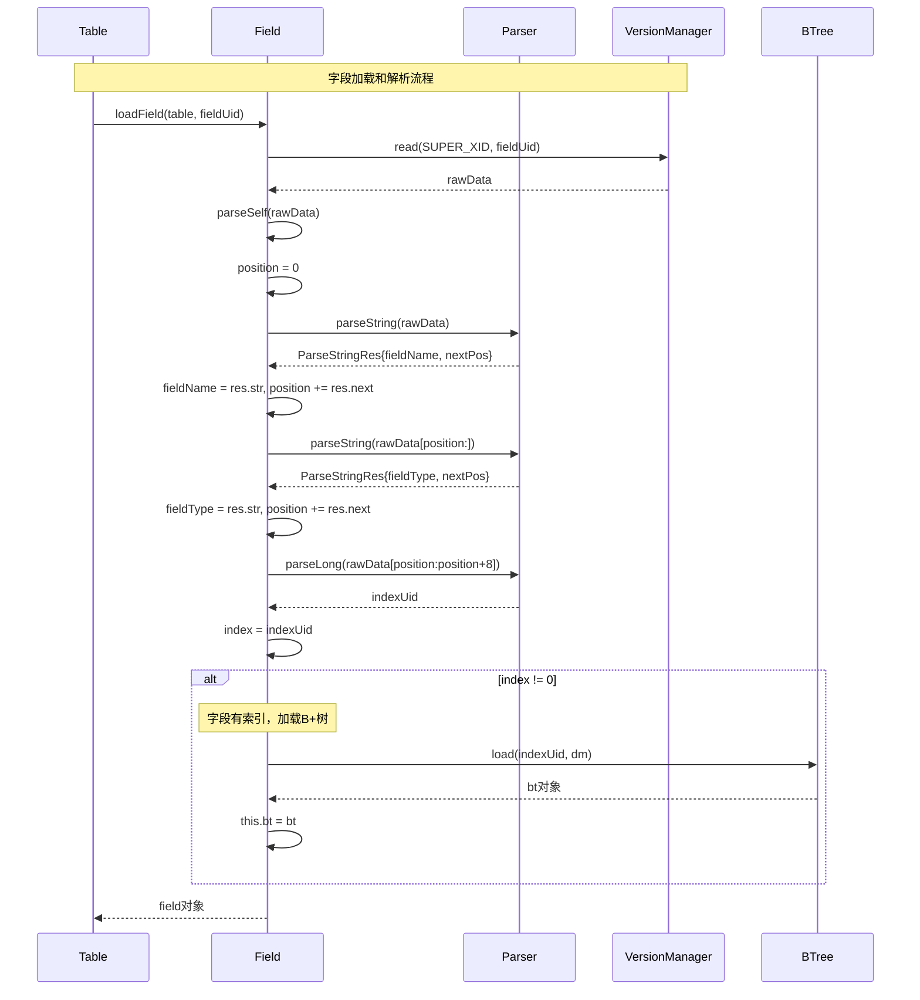
```mermaid
sequenceDiagram
    participant Table as Table
    participant Field as Field
    participant Parser as Parser
    participant VM as VersionManager

    Note over Table,VM: 字段加载和解析流程

    Table->>Field: loadField(table, fieldUid)
    Field->>VM: read(SUPER_XID, fieldUid)
    VM-->>Field: rawData
    
    Field->>Field: parseSelf(rawData)
    Field->>Field: position = 0
    
    Field->>Parser: parseString(rawData)
    Parser-->>Field: ParseStringRes{fieldName, nextPos}
    Field->>Field: fieldName = res.str, position += res.next
    
    Field->>Parser: parseString(rawData[position:])
    Parser-->>Field: ParseStringRes{fieldType, nextPos}
    Field->>Field: fieldType = res.str, position += res.next
    
    Field->>Parser: parseLong(rawData[position:position+8])
    Parser-->>Field: indexUid
    Field->>Field: index = indexUid
    
    alt index != 0
        Note over Field: 字段有索引，加载B+树
        Field->>BTree: load(indexUid, dm)
        BTree-->>Field: bt对象
        Field->>Field: this.bt = bt
    end
    
    Field-->>Table: field对象
```

### 2. 不同数据类型的处理

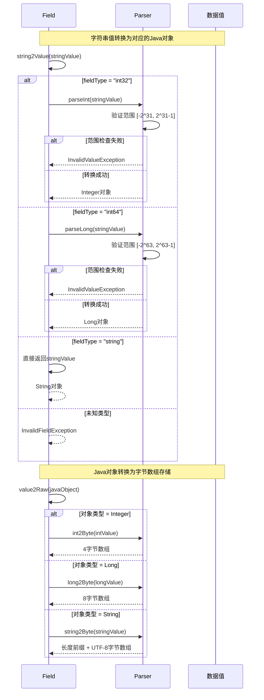
```mermaid
sequenceDiagram
    participant Field as Field
    participant Parser as Parser
    participant Value as 数据值

    Note over Field,Value: 字符串值转换为对应的Java对象

    Field->>Field: string2Value(stringValue)
    
    alt fieldType = "int32"
        Field->>Parser: parseInt(stringValue)
        Parser->>Parser: 验证范围 [-2^31, 2^31-1]
        alt 范围检查失败
            Parser-->>Field: InvalidValueException
        else 转换成功
            Parser-->>Field: Integer对象
        end
        
    else fieldType = "int64"
        Field->>Parser: parseLong(stringValue)
        Parser->>Parser: 验证范围 [-2^63, 2^63-1]
        alt 范围检查失败
            Parser-->>Field: InvalidValueException
        else 转换成功
            Parser-->>Field: Long对象
        end
        
    else fieldType = "string"
        Field->>Field: 直接返回stringValue
        Field-->>Field: String对象
        
    else 未知类型
        Field-->>Field: InvalidFieldException
    end

    Note over Field,Value: Java对象转换为字节数组存储

    Field->>Field: value2Raw(javaObject)
    
    alt 对象类型 = Integer
        Field->>Parser: int2Byte(intValue)
        Parser-->>Field: 4字节数组
        
    else 对象类型 = Long
        Field->>Parser: long2Byte(longValue)
        Parser-->>Field: 8字节数组
        
    else 对象类型 = String
        Field->>Parser: string2Byte(stringValue)
        Parser-->>Field: 长度前缀 + UTF-8字节数组
    end
```

### 3. 字段值的编码和解码

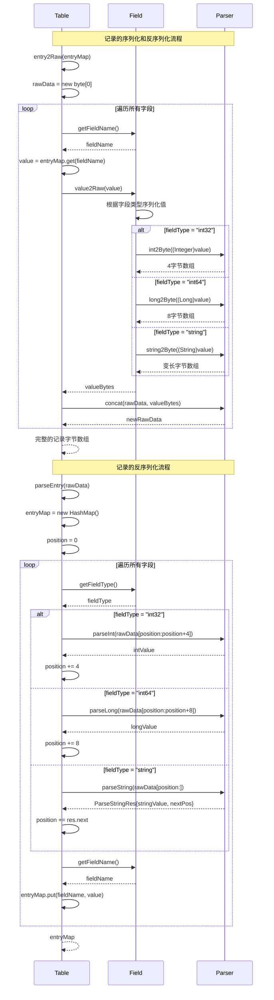
```mermaid
sequenceDiagram
    participant Table as Table
    participant Field as Field
    participant Parser as Parser

    Note over Table,Parser: 记录的序列化和反序列化流程

    Table->>Table: entry2Raw(entryMap)
    Table->>Table: rawData = new byte[0]
    
    loop 遍历所有字段
        Table->>Field: getFieldName()
        Field-->>Table: fieldName
        Table->>Table: value = entryMap.get(fieldName)
        
        Table->>Field: value2Raw(value)
        Field->>Field: 根据字段类型序列化值
        
        alt fieldType = "int32"
            Field->>Parser: int2Byte((Integer)value)
            Parser-->>Field: 4字节数组
        else fieldType = "int64"
            Field->>Parser: long2Byte((Long)value)
            Parser-->>Field: 8字节数组
        else fieldType = "string"
            Field->>Parser: string2Byte((String)value)
            Parser-->>Field: 变长字节数组
        end
        
        Field-->>Table: valueBytes
        Table->>Parser: concat(rawData, valueBytes)
        Parser-->>Table: newRawData
    end
    
    Table-->>Table: 完整的记录字节数组

    Note over Table,Parser: 记录的反序列化流程
    
    Table->>Table: parseEntry(rawData)
    Table->>Table: entryMap = new HashMap()
    Table->>Table: position = 0
    
    loop 遍历所有字段
        Table->>Field: getFieldType()
        Field-->>Table: fieldType
        
        alt fieldType = "int32"
            Table->>Parser: parseInt(rawData[position:position+4])
            Parser-->>Table: intValue
            Table->>Table: position += 4
        else fieldType = "int64"
            Table->>Parser: parseLong(rawData[position:position+8])
            Parser-->>Table: longValue
            Table->>Table: position += 8
        else fieldType = "string"
            Table->>Parser: parseString(rawData[position:])
            Parser-->>Table: ParseStringRes{stringValue, nextPos}
            Table->>Table: position += res.next
        end
        
        Table->>Field: getFieldName()
        Field-->>Table: fieldName
        Table->>Table: entryMap.put(fieldName, value)
    end
    
    Table-->>Table: entryMap
```

### 4. FieldCalRes 计算结果的处理

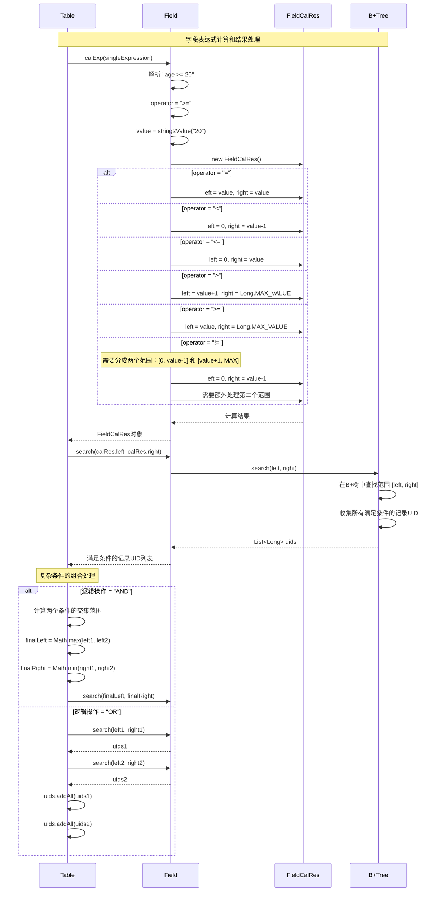
```mermaid
sequenceDiagram
    participant Table as Table
    participant Field as Field
    participant FieldCalRes as FieldCalRes
    participant BTree as B+Tree

    Note over Table,BTree: 字段表达式计算和结果处理

    Table->>Field: calExp(singleExpression)
    Field->>Field: 解析 "age >= 20"
    Field->>Field: operator = ">="
    Field->>Field: value = string2Value("20")
    
    Field->>FieldCalRes: new FieldCalRes()
    
    alt operator = "="
        Field->>FieldCalRes: left = value, right = value
    else operator = "<"
        Field->>FieldCalRes: left = 0, right = value-1
    else operator = "<="
        Field->>FieldCalRes: left = 0, right = value
    else operator = ">"
        Field->>FieldCalRes: left = value+1, right = Long.MAX_VALUE
    else operator = ">="
        Field->>FieldCalRes: left = value, right = Long.MAX_VALUE
    else operator = "!="
        Note over Field: 需要分成两个范围：[0, value-1] 和 [value+1, MAX]
        Field->>FieldCalRes: left = 0, right = value-1
        Field->>FieldCalRes: 需要额外处理第二个范围
    end
    
    FieldCalRes-->>Field: 计算结果
    Field-->>Table: FieldCalRes对象
    
    Table->>Field: search(calRes.left, calRes.right)
    Field->>BTree: search(left, right)
    BTree->>BTree: 在B+树中查找范围 [left, right]
    BTree->>BTree: 收集所有满足条件的记录UID
    BTree-->>Field: List<Long> uids
    Field-->>Table: 满足条件的记录UID列表

    Note over Table: 复杂条件的组合处理
    
    alt 逻辑操作 = "AND"
        Table->>Table: 计算两个条件的交集范围
        Table->>Table: finalLeft = Math.max(left1, left2)
        Table->>Table: finalRight = Math.min(right1, right2)
        Table->>Field: search(finalLeft, finalRight)
        
    else 逻辑操作 = "OR"
        Table->>Field: search(left1, right1)
        Field-->>Table: uids1
        Table->>Field: search(left2, right2)
        Field-->>Table: uids2
        Table->>Table: uids.addAll(uids1)
        Table->>Table: uids.addAll(uids2)
    end
```

---

## 事务集成时序图

### 1. TableManager 与 VersionManager 的协作

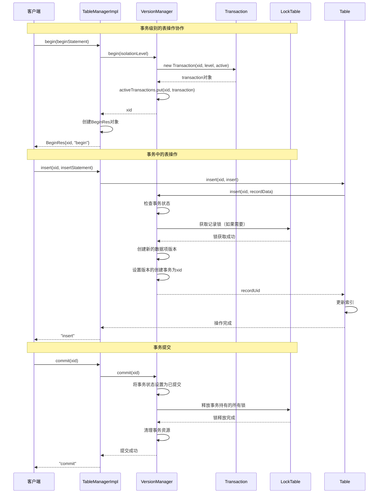
```mermaid
sequenceDiagram
    participant Client as 客户端
    participant TM as TableManagerImpl
    participant VM as VersionManager
    participant Transaction as Transaction
    participant LockTable as LockTable

    Note over Client,LockTable: 事务级别的表操作协作

    Client->>TM: begin(beginStatement)
    TM->>VM: begin(isolationLevel)
    VM->>Transaction: new Transaction(xid, level, active)
    Transaction-->>VM: transaction对象
    VM->>VM: activeTransactions.put(xid, transaction)
    VM-->>TM: xid
    
    TM->>TM: 创建BeginRes对象
    TM-->>Client: BeginRes{xid, "begin"}

    Note over Client,LockTable: 事务中的表操作

    Client->>TM: insert(xid, insertStatement)
    TM->>Table: insert(xid, insert)
    Table->>VM: insert(xid, recordData)
    
    VM->>VM: 检查事务状态
    VM->>LockTable: 获取记录锁（如果需要）
    LockTable-->>VM: 锁获取成功
    
    VM->>VM: 创建新的数据项版本
    VM->>VM: 设置版本的创建事务为xid
    VM-->>Table: recordUid
    
    Table->>Table: 更新索引
    Table-->>TM: 操作完成
    TM-->>Client: "insert"

    Note over Client,LockTable: 事务提交

    Client->>TM: commit(xid)
    TM->>VM: commit(xid)
    VM->>VM: 将事务状态设置为已提交
    VM->>LockTable: 释放事务持有的所有锁
    LockTable-->>VM: 锁释放完成
    VM->>VM: 清理事务资源
    VM-->>TM: 提交成功
    TM-->>Client: "commit"
```

### 2. 事务中的表操作处理

```mermaid
sequenceDiagram
    participant TM as TableManagerImpl
    participant Table as Table
    participant VM as VersionManager
    participant Visibility as Visibility
    participant Transaction as Transaction

    Note over TM,Transaction: 事务隔离级别对表操作的影响

    TM->>Table: read(xid, selectStatement)
    Table->>VM: read(xid, recordUid)
    
    VM->>VM: 获取记录的所有版本
    VM->>Transaction: getTransaction(xid)
    Transaction-->>VM: transaction对象
    
    loop 遍历记录的所有版本
        VM->>Visibility: isVersionVisible(version, transaction)
        Visibility->>Visibility: 检查版本的创建事务
        Visibility->>Visibility: 检查版本的删除事务
        Visibility->>Visibility: 根据隔离级别判断可见性
        
        alt READ_COMMITTED级别
            Visibility->>Visibility: 只能看到已提交的版本
        else REPEATABLE_READ级别
            Visibility->>Visibility: 只能看到事务开始前已提交的版本
        end
        
        Visibility-->>VM: 版本可见性结果
        
        alt 版本可见
            VM-->>Table: 返回版本数据
            break
        else 版本不可见
            VM->>VM: 继续检查下一个版本
        end
    end
    
    alt 没有可见版本
        VM-->>Table: null
    end

    Note over TM,Transaction: 写操作的事务处理

    TM->>Table: update(xid, updateStatement)
    Table->>VM: delete(xid, oldRecordUid)
    VM->>VM: 检查记录是否被其他事务锁定
    
    alt 记录被锁定
        VM->>VM: 等待锁释放或检测死锁
        VM-->>Table: 操作结果（成功/死锁异常）
    else 记录未被锁定
        VM->>VM: 标记记录为已删除（设置删除事务为xid）
        VM-->>Table: 删除成功
        
        Table->>VM: insert(xid, newRecordData)
        VM->>VM: 创建新版本，设置创建事务为xid
        VM-->>Table: newRecordUid
    end
```

### 3. BeginRes 事务结果的管理

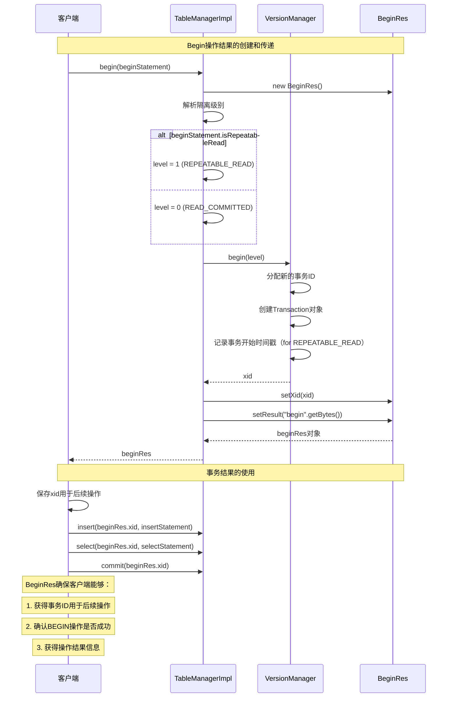
```mermaid
sequenceDiagram
    participant Client as 客户端
    participant TM as TableManagerImpl
    participant VM as VersionManager
    participant BeginRes as BeginRes

    Note over Client,BeginRes: Begin操作结果的创建和传递

    Client->>TM: begin(beginStatement)
    TM->>BeginRes: new BeginRes()
    
    TM->>TM: 解析隔离级别
    alt beginStatement.isRepeatableRead
        TM->>TM: level = 1 (REPEATABLE_READ)
    else
        TM->>TM: level = 0 (READ_COMMITTED)
    end
    
    TM->>VM: begin(level)
    VM->>VM: 分配新的事务ID
    VM->>VM: 创建Transaction对象
    VM->>VM: 记录事务开始时间戳（for REPEATABLE_READ）
    VM-->>TM: xid
    
    TM->>BeginRes: setXid(xid)
    TM->>BeginRes: setResult("begin".getBytes())
    BeginRes-->>TM: beginRes对象
    
    TM-->>Client: beginRes

    Note over Client,BeginRes: 事务结果的使用

    Client->>Client: 保存xid用于后续操作
    Client->>TM: insert(beginRes.xid, insertStatement)
    Client->>TM: select(beginRes.xid, selectStatement)
    Client->>TM: commit(beginRes.xid)
    
    Note over Client: BeginRes确保客户端能够：
    Note over Client: 1. 获得事务ID用于后续操作
    Note over Client: 2. 确认BEGIN操作是否成功
    Note over Client: 3. 获得操作结果信息
```

---

## 组件交互图

### 1. Table、Field、TableManager 的协作关系

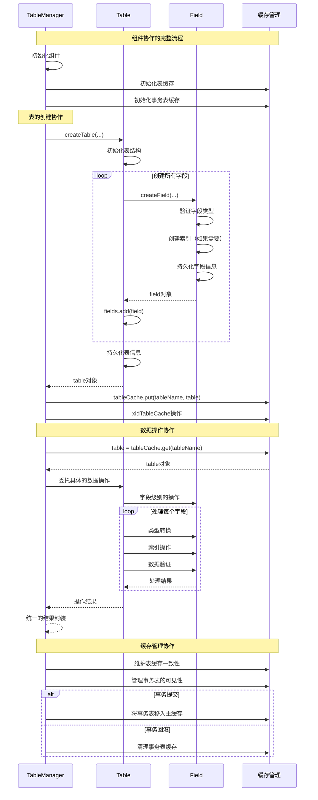
```mermaid
sequenceDiagram
    participant TM as TableManager
    participant Table as Table
    participant Field as Field
    participant Cache as 缓存管理

    Note over TM,Cache: 组件协作的完整流程

    TM->>TM: 初始化组件
    TM->>Cache: 初始化表缓存
    TM->>Cache: 初始化事务表缓存
    
    Note over TM: 表的创建协作
    
    TM->>Table: createTable(...)
    Table->>Table: 初始化表结构
    
    loop 创建所有字段
        Table->>Field: createField(...)
        Field->>Field: 验证字段类型
        Field->>Field: 创建索引（如果需要）
        Field->>Field: 持久化字段信息
        Field-->>Table: field对象
        Table->>Table: fields.add(field)
    end
    
    Table->>Table: 持久化表信息
    Table-->>TM: table对象
    
    TM->>Cache: tableCache.put(tableName, table)
    TM->>Cache: xidTableCache操作

    Note over TM,Cache: 数据操作协作

    TM->>Cache: table = tableCache.get(tableName)
    Cache-->>TM: table对象
    
    TM->>Table: 委托具体的数据操作
    Table->>Field: 字段级别的操作
    
    loop 处理每个字段
        Table->>Field: 类型转换
        Table->>Field: 索引操作
        Table->>Field: 数据验证
        Field-->>Table: 处理结果
    end
    
    Table-->>TM: 操作结果
    TM-->>TM: 统一的结果封装

    Note over TM,Cache: 缓存管理协作

    TM->>Cache: 维护表缓存一致性
    TM->>Cache: 管理事务表的可见性
    
    alt 事务提交
        TM->>Cache: 将事务表移入主缓存
    else 事务回滚
        TM->>Cache: 清理事务表缓存
    end
```

### 2. 与下层 VM、DM 模块的接口调用

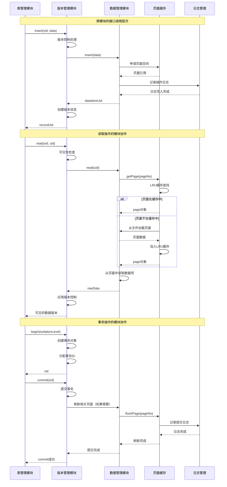
```mermaid
sequenceDiagram
    participant TBM as 表管理模块
    participant VM as 版本管理模块  
    participant DM as 数据管理模块
    participant PageCache as 页面缓存
    participant Logger as 日志管理

    Note over TBM,Logger: 跨模块的接口调用层次

    TBM->>VM: insert(xid, data)
    VM->>VM: 版本控制处理
    VM->>DM: insert(data)
    DM->>PageCache: 申请页面空间
    PageCache-->>DM: 页面引用
    DM->>Logger: 记录操作日志
    Logger-->>DM: 日志写入完成
    DM-->>VM: dataItemUid
    VM->>VM: 创建版本信息
    VM-->>TBM: recordUid

    Note over TBM,Logger: 读取操作的模块协作

    TBM->>VM: read(xid, uid)
    VM->>VM: 可见性检查
    VM->>DM: read(uid)
    DM->>PageCache: getPage(pageNo)
    PageCache->>PageCache: LRU缓存查找
    
    alt 页面在缓存中
        PageCache-->>DM: page对象
    else 页面不在缓存中
        PageCache->>DM: 从文件加载页面
        DM-->>PageCache: 页面数据
        PageCache->>PageCache: 加入LRU缓存
        PageCache-->>DM: page对象
    end
    
    DM->>DM: 从页面中读取数据项
    DM-->>VM: rawData
    VM->>VM: 应用版本控制
    VM-->>TBM: 可见的数据版本

    Note over TBM,Logger: 事务操作的模块协作

    TBM->>VM: begin(isolationLevel)
    VM->>VM: 创建事务对象
    VM->>VM: 分配事务ID
    VM-->>TBM: xid

    TBM->>VM: commit(xid)
    VM->>VM: 提交事务
    VM->>DM: 刷新相关页面（如果需要）
    DM->>PageCache: flushPage(pageNo)
    PageCache->>Logger: 记录提交日志
    Logger-->>PageCache: 日志完成
    PageCache-->>DM: 刷新完成
    DM-->>VM: 提交完成
    VM-->>TBM: commit成功
```

### 3. Booter 文件与表元数据的管理

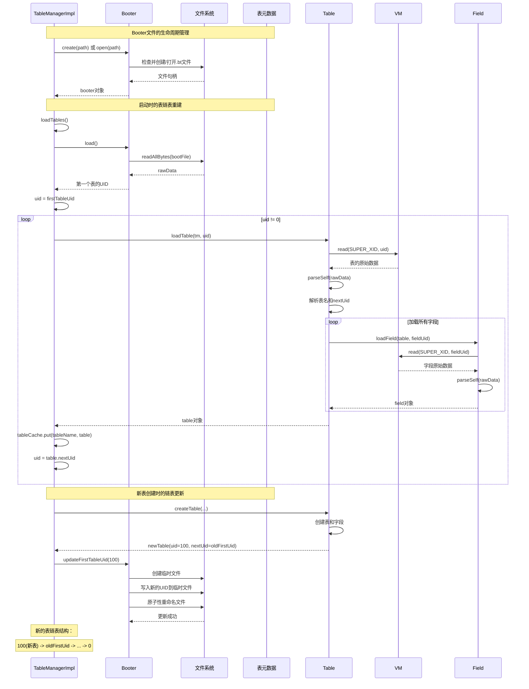
```mermaid
sequenceDiagram
    participant TM as TableManagerImpl
    participant Booter as Booter
    participant FileSystem as 文件系统
    participant MetaData as 表元数据

    Note over TM,MetaData: Booter文件的生命周期管理

    TM->>Booter: create(path) 或 open(path)
    Booter->>FileSystem: 检查并创建/打开.bt文件
    FileSystem-->>Booter: 文件句柄
    Booter-->>TM: booter对象

    Note over TM,MetaData: 启动时的表链表重建

    TM->>TM: loadTables()
    TM->>Booter: load()
    Booter->>FileSystem: readAllBytes(bootFile)
    FileSystem-->>Booter: rawData
    Booter-->>TM: 第一个表的UID

    TM->>TM: uid = firstTableUid
    
    loop uid != 0
        TM->>Table: loadTable(tm, uid)
        Table->>VM: read(SUPER_XID, uid)
        VM-->>Table: 表的原始数据
        Table->>Table: parseSelf(rawData)
        Table->>Table: 解析表名和nextUid
        
        loop 加载所有字段
            Table->>Field: loadField(table, fieldUid)
            Field->>VM: read(SUPER_XID, fieldUid)
            VM-->>Field: 字段原始数据
            Field->>Field: parseSelf(rawData)
            Field-->>Table: field对象
        end
        
        Table-->>TM: table对象
        TM->>TM: tableCache.put(tableName, table)
        TM->>TM: uid = table.nextUid
    end

    Note over TM,MetaData: 新表创建时的链表更新

    TM->>Table: createTable(...)
    Table->>Table: 创建表和字段
    Table-->>TM: newTable(uid=100, nextUid=oldFirstUid)
    
    TM->>Booter: updateFirstTableUid(100)
    Booter->>FileSystem: 创建临时文件
    Booter->>FileSystem: 写入新的UID到临时文件
    Booter->>FileSystem: 原子性重命名文件
    FileSystem-->>Booter: 更新成功
    
    Note over TM: 新的表链表结构：
    Note over TM: 100(新表) -> oldFirstUid -> ... -> 0
```

### 4. 错误处理和异常传播机制

```mermaid
sequenceDiagram
    participant Client as 客户端
    participant TM as TableManagerImpl
    participant Table as Table
    participant VM as VersionManager
    participant Error as 异常处理

    Note over Client,Error: 异常的产生和传播路径

    Client->>TM: create(xid, "CREATE TABLE users ...")
    TM->>TM: lock.lock()
    TM->>TM: checkTableExists("users")
    
    alt 表已存在
        TM->>Error: throw DuplicatedTableException
        Error-->>TM: 异常对象
        TM->>TM: lock.unlock()
        TM-->>Client: DuplicatedTableException
    else 表不存在，继续创建
        TM->>Table: createTable(...)
        
        Table->>Field: createField(..., "invalidType", ...)
        Field->>Field: typeCheck("invalidType")
        Field->>Error: throw InvalidFieldException
        Error-->>Field: 异常对象
        Field-->>Table: InvalidFieldException
        Table-->>TM: InvalidFieldException
        TM->>TM: lock.unlock()
        TM-->>Client: InvalidFieldException
    end

    Note over Client,Error: 底层异常的向上传播

    Client->>TM: insert(xid, insertStatement)
    TM->>Table: insert(xid, insert)
    Table->>VM: insert(xid, rawData)
    
    VM->>VM: 检查事务状态
    alt 事务已回滚
        VM->>Error: throw TransactionAbortedException
        Error-->>VM: 异常对象
        VM-->>Table: TransactionAbortedException
        Table-->>TM: TransactionAbortedException
        TM-->>Client: TransactionAbortedException
    else 检测到死锁
        VM->>Error: throw DeadlockException
        Error-->>VM: 异常对象
        VM-->>Table: DeadlockException
        Table-->>TM: DeadlockException
        TM-->>Client: DeadlockException
    end

    Note over Client,Error: 资源清理和错误恢复

    alt 异常发生时的清理
        TM->>TM: 确保释放持有的锁
        TM->>TM: 清理事务相关的临时数据
        TM->>VM: 如果需要，回滚部分操作
    end

    Note over Client,Error: 常见异常类型：
    Note over Client,Error: - DuplicatedTableException: 表已存在
    Note over Client,Error: - TableNotFoundException: 表不存在  
    Note over Client,Error: - FieldNotFoundException: 字段不存在
    Note over Client,Error: - FieldNotIndexedException: 字段无索引
    Note over Client,Error: - InvalidValuesException: 值数量不匹配
    Note over Client,Error: - InvalidFieldException: 字段类型无效
    Note over Client,Error: - TransactionAbortedException: 事务已回滚
    Note over Client,Error: - DeadlockException: 死锁检测
```

---

## 总结

表管理模块 (TBM) 是 MYDB 的核心上层接口，它成功地将复杂的底层存储操作抽象为简单易用的表级别操作。通过本文档的时序图分析，我们可以看到：

### 核心设计特点

1. **分层架构**：TableManager 作为门面，Table 和 Field 作为核心实现，清晰的职责分离
2. **事务集成**：与 VersionManager 深度集成，提供完整的 MVCC 支持
3. **缓存优化**：多级缓存设计提高查询性能
4. **原子性保证**：通过 Booter 的原子性更新机制保证元数据一致性

### 关键实现机制

1. **表链表管理**：通过 nextUid 构建表的链表结构，实现表的有序管理
2. **字段系统**：简化但完整的字段类型系统，支持索引和类型转换
3. **查询优化**：基于索引的范围查询，支持复杂的 WHERE 条件
4. **异常处理**：完整的异常传播机制，确保系统稳定性

表管理模块的设计体现了简化复杂性的原则，在保持核心功能的同时，大大降低了实现复杂度，为上层 SQL 处理提供了稳定可靠的基础。