# MYDB 索引管理模块时序图

## 模块概述

索引管理模块（Index Manager, IM）是 MYDB 数据库系统的核心组件之一，负责实现高效的数据索引功能。该模块基于 B+ 树数据结构，为数据检索提供了对数时间复杂度的查询性能。

### 核心组件

1. **[`BPlusTree`](src/main/java/top/guoziyang/mydb/backend/im/BPlusTree.java:42)** - B+ 树主控制器
2. **[`Node`](src/main/java/top/guoziyang/mydb/backend/im/Node.java:42)** - B+ 树节点抽象

### B+ 树索引的基本原理

MYDB 的 B+ 树实现具有以下特点：
- **平衡多路搜索树**：所有叶子节点在同一层，保证了查询性能的一致性
- **数据存储在叶子节点**：内部节点只存储索引键，叶子节点存储实际数据的 UID
- **兄弟节点链表**：叶子节点通过指针连接，支持高效的范围查询
- **动态平衡**：通过节点分裂和合并维护树的平衡性

### 与关系型数据库索引系统的对比

| 特性 | MYDB B+ 树 | MySQL InnoDB |
|------|-----------|--------------|
| 节点大小 | 固定大小（约1KB） | 16KB 页面 |
| 键类型支持 | Long 类型 | 多种数据类型 |
| 索引类型 | 非聚簇索引 | 聚簇/非聚簇索引 |
| 并发控制 | 读写锁 | MVCC + 锁 |
| 分裂策略 | 简单二分 | 优化的页分裂 |

### 索引在 MYDB 查询优化中的作用

1. **点查询优化**：将 O(n) 的顺序扫描降为 O(log n) 的树搜索
2. **范围查询支持**：利用叶子节点链表实现高效的范围扫描
3. **排序操作优化**：索引本身的有序性减少了排序开销
4. **连接操作加速**：为嵌套循环连接提供快速查找能力

---

## B+ 树结构管理时序图

### 1. B+ 树创建和初始化流程

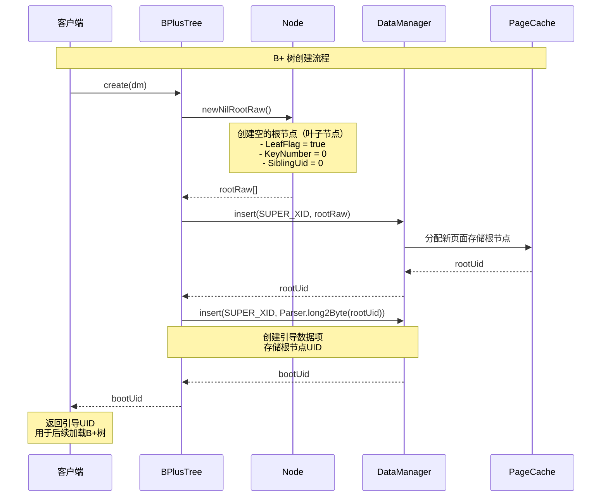

### 2. B+ 树加载和初始化

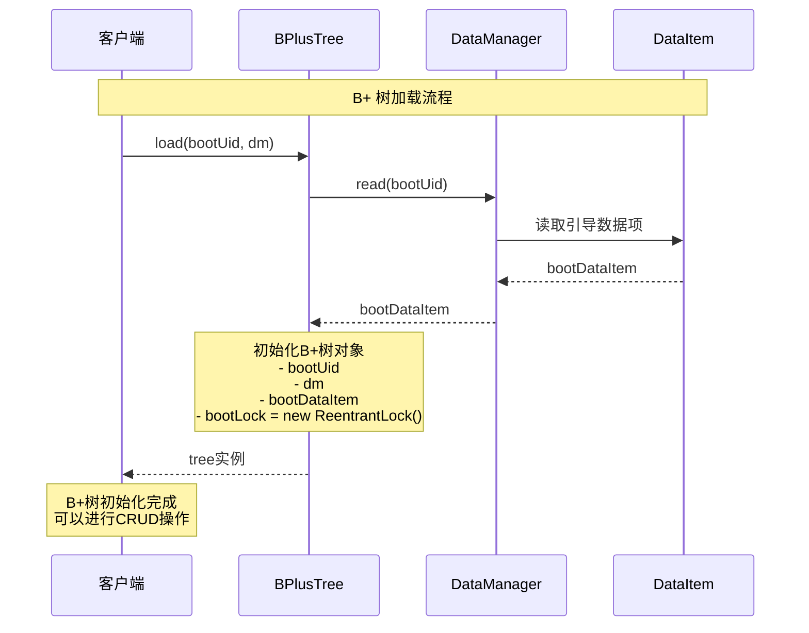

### 3. 根节点管理和更新

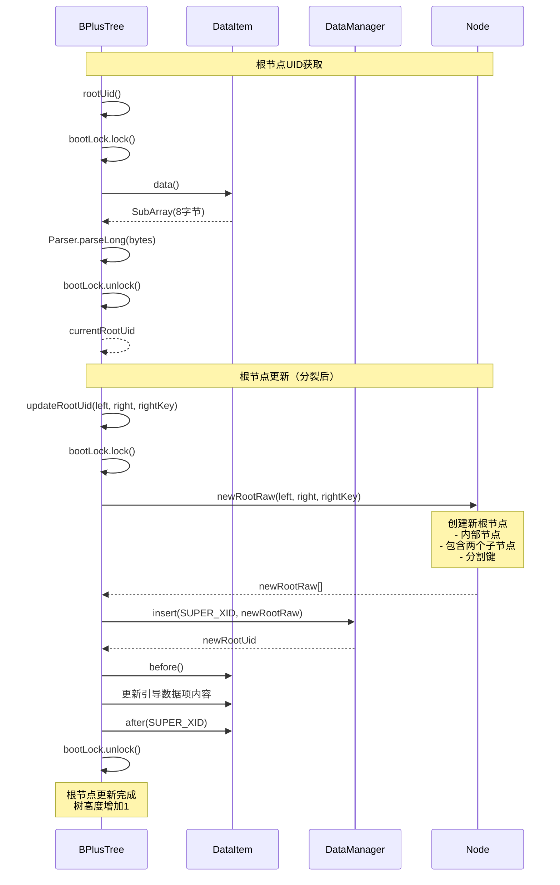

### 4. 树高度的动态调整

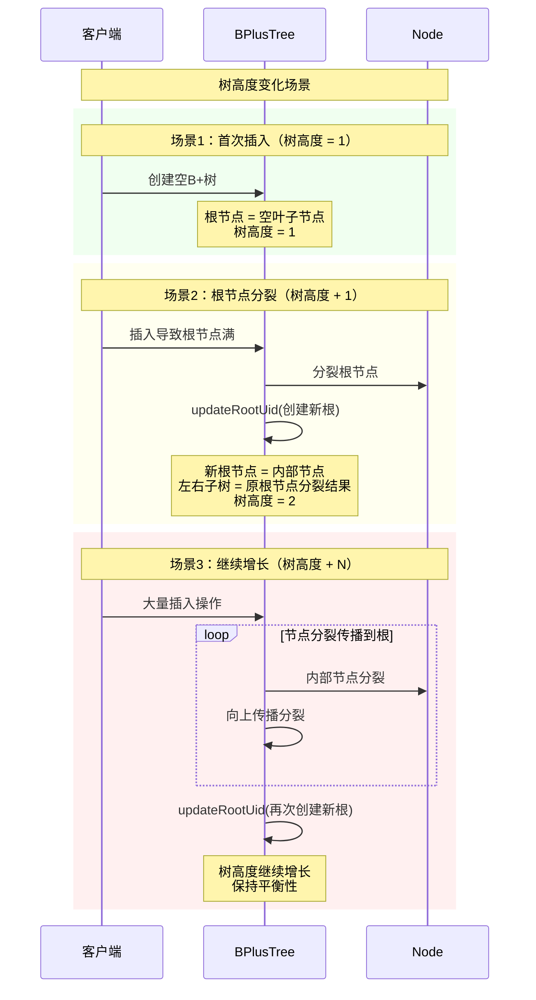

---

## 索引操作时序图

### 1. 索引插入操作（INSERT）流程

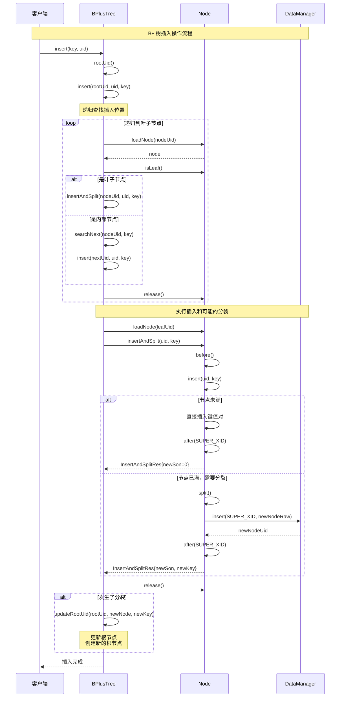

### 2. 索引查找操作（SEARCH）流程

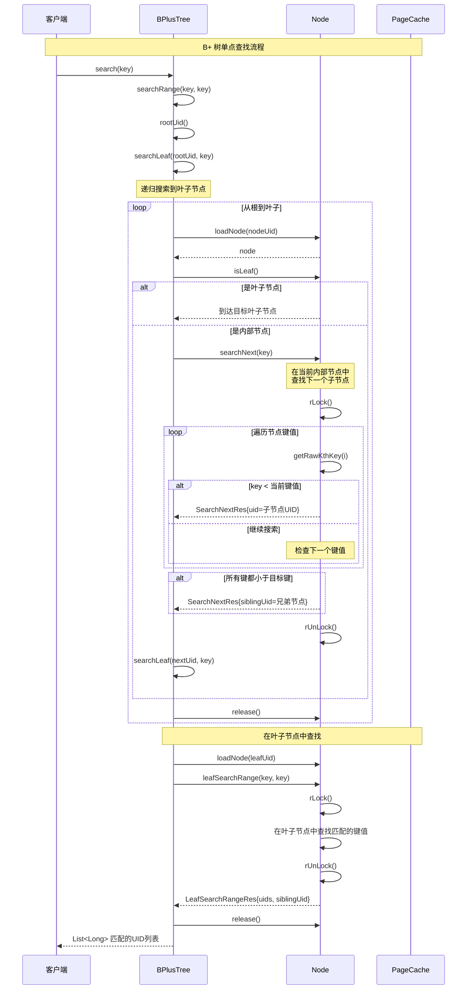

### 3. 范围查询操作（RANGE SEARCH）流程

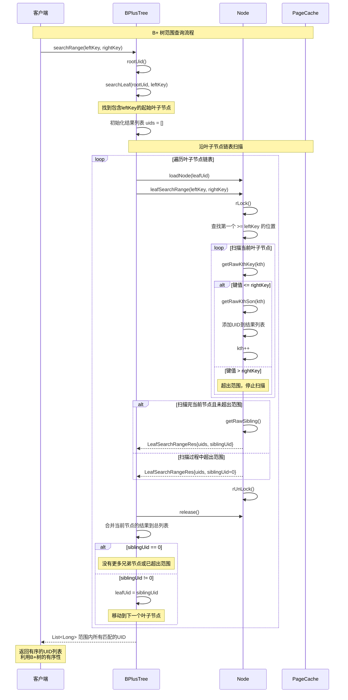

---

## 节点管理时序图

### 1. 内部节点（InternalNode）的操作

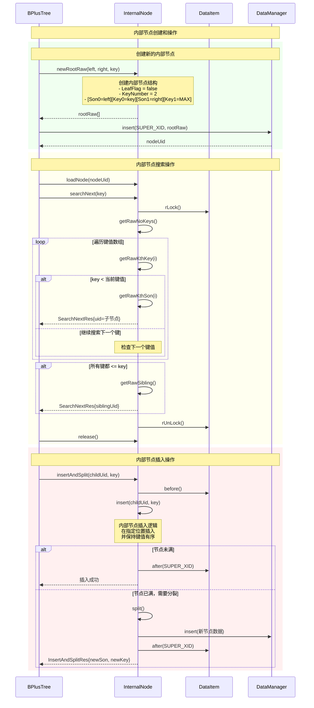

### 2. 叶子节点（LeafNode）的操作

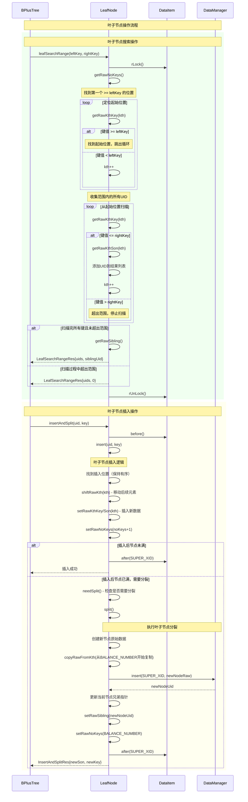

### 3. 节点分裂（Split）机制

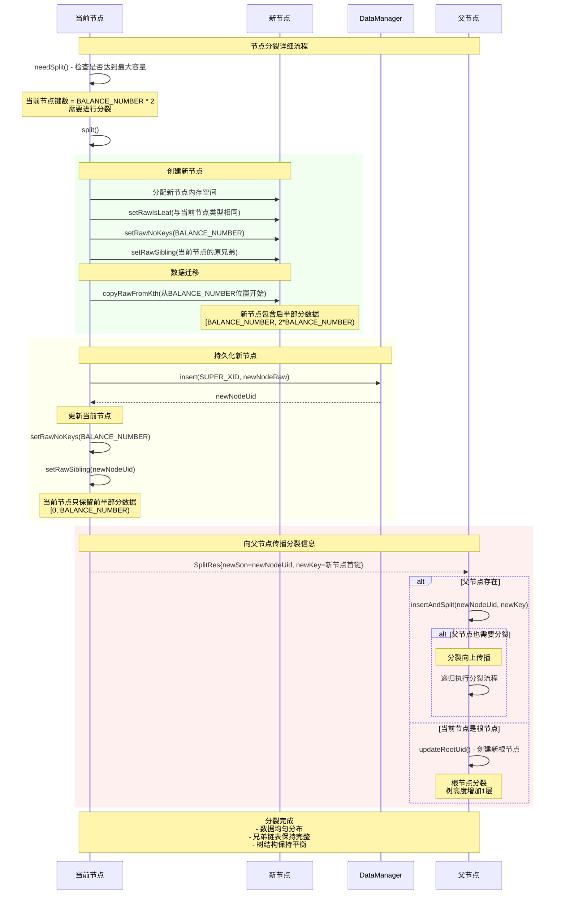

---

## 并发控制时序图

### 1. 多事务并发访问索引

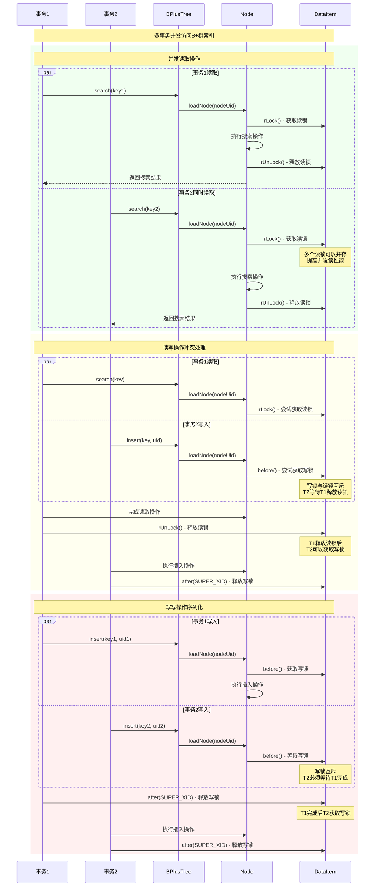

### 2. 索引锁的获取和释放

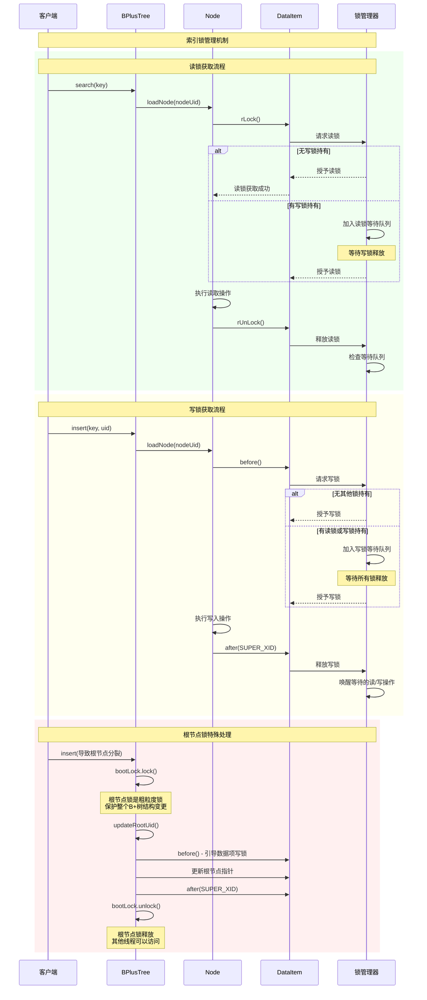

### 3. 死锁避免和处理机制

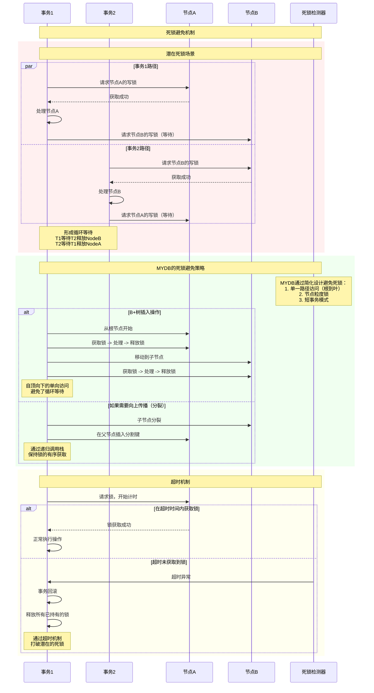

### 4. 索引的 MVCC 集成

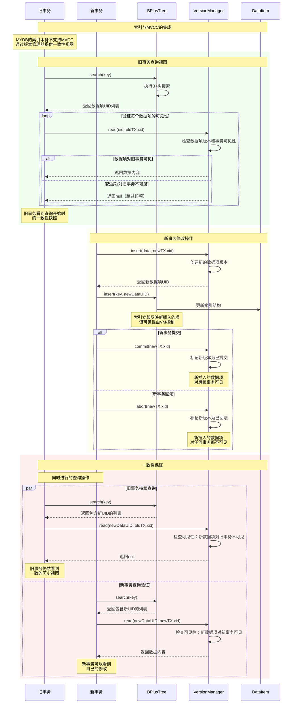

---

## 组件交互图

### 1. BPlusTree 与 Node 的协作关系

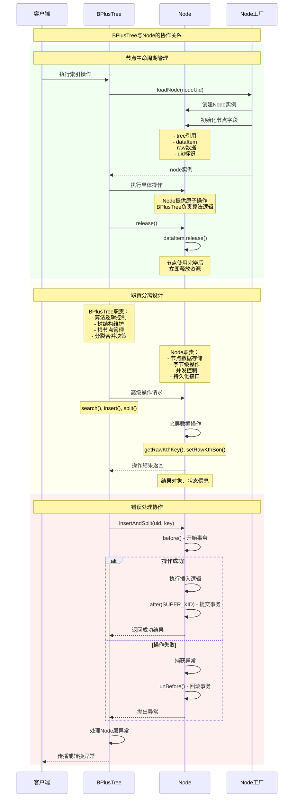

### 2. 与 DataManager 的数据持久化交互

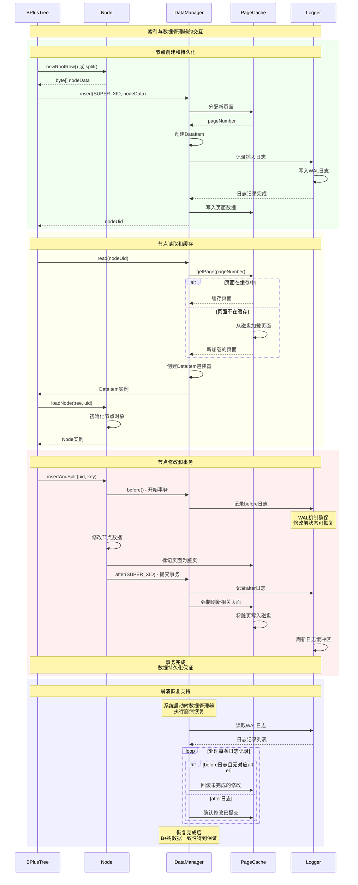

### 3. 与 TableManager 的集成调用

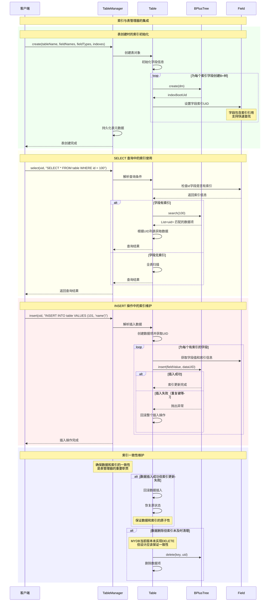

### 4. 错误处理和异常恢复机制

```mermaid
sequenceDiagram
    participant Client as 客户端
    participant BPlusTree as BPlusTree
    participant Node as Node
    participant DM as DataManager
    participant Error as 错误处理器

    Note over Client, Error: 索引操作的错误处理机制
    
    rect rgb(255, 240, 240)
        Note over Client, Error: 插入操作异常处理
        Client->>BPlusTree: insert(key, uid)
        
        BPlusTree->>Node: insertAndSplit(uid, key)
        Node->>Node: before() - 开始事务
        
        alt 节点数据损坏
            Node->>Node: 检测到数据不一致
            Node->>Error: 抛出DataCorruptedException
            Node->>Node: unBefore() - 回滚事务
            Error-->>BPlusTree: 传播异常
            BPlusTree-->>Client: 操作失败，数据损坏
        else 磁盘空间不足
            Node->>DM: insert(SUPER_XID, newNodeData)
            DM->>Error: 抛出InsufficientSpaceException
            Error-->>Node: 磁盘空间不足
            Node->>Node: unBefore() - 回滚事务
            Error-->>BPlusTree: 传播异常
            BPlusTree-->>Client: 操作失败，空间不足
        else 并发冲突
            Node->>Node: 等待锁超时
            Node->>Error: 抛出LockTimeoutException
            Node->>Node: unBefore() - 回滚事务
            Error-->>BPlusTree: 传播异常
            BPlusTree-->>Client: 操作失败，并发冲突
        end
    end
    
    rect rgb(240, 255, 240)
        Note over Client, Error: 搜索操作异常处理
        Client->>BPlusTree: search(key)
        
        BPlusTree->>Node: loadNode(nodeUid)
        
        alt 节点不存在
            Node->>DM: read(invalidUid)
            DM->>Error: 抛出NodeNotFoundException
            Error-->>BPlusTree: 节点不存在
            BPlusTree->>BPlusTree: 尝试重建索引或报告错误
            BPlusTree-->>Client: 搜索失败，索引损坏
        else 数据格式错误
            Node->>Node: 解析节点数据
            Node->>Error: 数据格式不匹配
            Error-->>BPlusTree: 节点格式错误
            BPlusTree-->>Client: 搜索失败，数据损坏
        else 正常情况
            Node->>Node: 执行搜索逻辑
            Node-->>BPlusTree: 返回搜索结果
            BPlusTree-->>Client: 搜索成功
        end
    end
    
    rect rgb(255, 255, 240)
        Note over Client, Error: 系统崩溃恢复
        Note over Error: 系统重启后的索引恢复
        
        BPlusTree->>DM: 系统启动时检查数据一致性
        DM->>DM: 执行WAL日志恢复
        
        alt 发现未完成的B+树操作
            DM->>Node: 回滚未提交的节点修改
            Node->>Node: 恢复到before状态
            DM->>BPlusTree: 通知索引可能不一致
            BPlusTree->>BPlusTree: 执行索引完整性检查
        end
        
        alt 检测到索引损坏
            BPlusTree->>Error: 报告索引损坏
            Error->>Error: 记录错误日志
            Error->>BPlusTree: 建议重建索引
            BPlusTree->>BPlusTree: 标记索引为不可用
        else 索引完整性检查通过
            BPlusTree->>BPlusTree: 索引恢复完成
            BPlusTree-->>Client: 系统准备就绪
        end
    end
    
    rect rgb(240, 240, 255)
        Note over Client, Error: 性能监控和降级
        Note over Error: 监控索引性能并处理异常情况
        
        alt 索引操作响应时间过长
            BPlusTree->>Error: 报告性能问题
            Error->>Error: 记录性能日志
            Error->>BPlusTree: 建议优化或重建
        end
        
        alt 频繁的分裂操作
            BPlusTree->>Error: 报告频繁分裂
            Error->>Error: 分析数据插入模式
            Error->>BPlusTree: 建议调整平衡因子
        end
        
        alt 内存使用过高
            BPlusTree->>Error: 报告内存压力
            Error->>Error: 触发节点缓存清理
            Error->>DM: 强制刷新脏页
        end
    end
```

---

## 总结

MYDB 的索引管理模块通过 B+ 树数据结构实现了高效的数据索引功能。本文档详细展示了以下关键时序图：

### 核心功能时序图
1. **B+ 树结构管理**：创建、加载、根节点管理和动态调整
2. **索引操作**：插入、查找、范围查询的完整流程
3. **节点管理**：内部节点和叶子节点的操作，以及分裂机制
4. **并发控制**：多事务访问、锁机制、死锁避免和 MVCC 集成

### 组件交互时序图
1. **BPlusTree 与 Node 协作**：职责分离和生命周期管理
2. **与 DataManager 交互**：数据持久化、缓存管理和崩溃恢复
3. **与 TableManager 集成**：表创建、查询优化和索引维护
4. **错误处理机制**：异常处理、系统恢复和性能监控

### 设计亮点
- **简洁高效**：相比 MySQL InnoDB，MYDB 的 B+ 树实现更加简洁，专注核心功能
- **并发友好**：通过读写锁机制支持多事务并发访问
- **崩溃安全**：与数据管理器的 WAL 机制集成，保证数据一致性
- **模块化设计**：清晰的职责分离，便于维护和扩展

这些时序图为理解 MYDB 索引管理模块的工作原理和优化方向提供了重要参考。