# MYDB 查询处理模块时序图

## 1. 模块概述

### 1.1 查询处理模块的职责和核心组件

查询处理模块（Parser）是 MYDB 的 SQL 解析和执行引擎，负责将用户输入的 SQL 语句转换为底层可执行的操作。该模块采用经典的编译器设计模式，分为词法分析和语法分析两个阶段。

**核心组件：**
- **[`Parser`](../src/main/java/top/guoziyang/mydb/backend/parser/Parser.java)**: 主解析器，负责语法分析和语句对象构建
- **[`Tokenizer`](../src/main/java/top/guoziyang/mydb/backend/parser/Tokenizer.java)**: 词法分析器，负责将 SQL 语句分解为词法单元
- **Statement 对象**: 各种 SQL 语句的结构化表示

### 1.2 SQL 解析和词法分析的基本原理

**词法分析（Lexical Analysis）：**
- 将输入的字符流识别为有意义的词法单元（Token）
- 识别关键字、标识符、操作符、字面量等基本元素
- 过滤空白字符，处理引号字符串

**语法分析（Syntax Analysis）：**
- 采用递归下降解析器设计
- 根据 SQL 语法规则构建抽象语法树
- 验证语句的语法正确性

### 1.3 与关系型数据库查询引擎的对比

| 特性 | MySQL 查询引擎 | MYDB 查询处理模块 |
|------|----------------|-------------------|
| 语法支持 | 完整 SQL 标准 | 基本 SQL 操作 |
| 解析策略 | 复杂语法分析器 | 递归下降解析 |
| 优化器 | 基于成本的优化 | 简单执行策略 |
| 子查询 | 完整支持 | 不支持 |
| JOIN | 多种 JOIN 类型 | 不支持 |

### 1.4 Parser 和 Tokenizer 的设计理念

**设计原则：**
- **分离关注点**: 词法分析与语法分析分离
- **简化优先**: 只支持核心 SQL 功能，便于理解
- **递归下降**: 每个语法规则对应一个解析方法
- **向前看机制**: 支持 LL(1) 语法分析

## 2. 词法分析时序图

### 2.1 Tokenizer 的初始化和设置

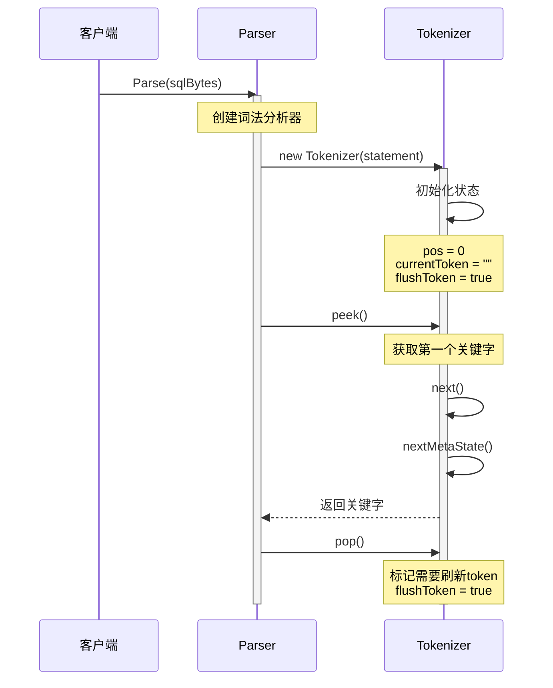

### 2.2 词法单元的识别和分类

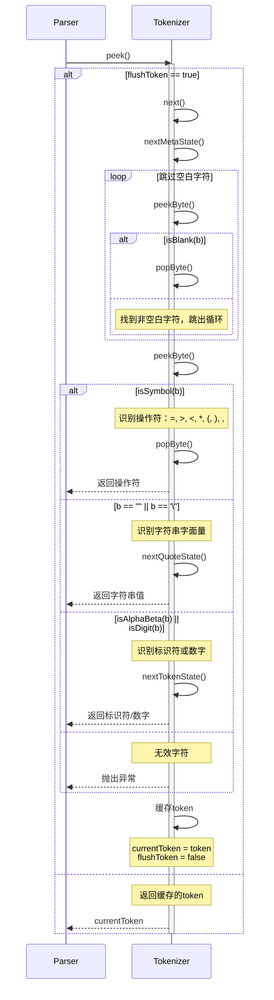

### 2.3 关键字、标识符、字面量的处理

```mermaid
sequenceDiagram
    participant Tokenizer as Tokenizer
    
    Note over Tokenizer: 处理不同类型的词法单元
    
    rect rgb(240, 248, 255)
        Note over Tokenizer: 处理标识符和数字 (nextTokenState)
        Tokenizer->>Tokenizer: StringBuilder sb = new StringBuilder()
        
        loop 读取字符
            Tokenizer->>Tokenizer: peekByte()
            alt isAlphaBeta(b) || isDigit(b) || b == '_'
                Tokenizer->>Tokenizer: sb.append(b)
                Tokenizer->>Tokenizer: popByte()
            else
                Note over Tokenizer: 遇到分隔符，结束token
                break
            end
        end
        
        Tokenizer->>Tokenizer: return sb.toString()
    end
    
    rect rgb(248, 255, 240)
        Note over Tokenizer: 处理字符串字面量 (nextQuoteState)
        Tokenizer->>Tokenizer: quote = peekByte()
        Tokenizer->>Tokenizer: popByte()
        Tokenizer->>Tokenizer: StringBuilder sb = new StringBuilder()
        
        loop 读取字符串内容
            Tokenizer->>Tokenizer: peekByte()
            alt b == null
                Tokenizer->>Tokenizer: 抛出异常（字符串未结束）
            else b == quote
                Tokenizer->>Tokenizer: popByte()
                Note over Tokenizer: 字符串结束
                break
            else
                Tokenizer->>Tokenizer: sb.append(b)
                Tokenizer->>Tokenizer: popByte()
            end
        end
        
        Tokenizer->>Tokenizer: return sb.toString()
    end
```

### 2.4 错误检测和恢复机制

```mermaid
sequenceDiagram
    participant Parser as Parser
    participant Tokenizer as Tokenizer
    
    Parser->>Tokenizer: peek()
    activate Tokenizer
    
    alt err != null
        Note over Tokenizer: 之前已有错误
        Tokenizer-->>Parser: 抛出缓存的异常
    else
        try
            Tokenizer->>Tokenizer: next()
            Note over Tokenizer: 正常处理
        catch Exception e
            Tokenizer->>Tokenizer: err = e
            Note over Tokenizer: 缓存错误
            Tokenizer-->>Parser: 抛出异常
        end
    end
    
    deactivate Tokenizer
    
    Note over Parser: 解析完成后检查剩余token
    Parser->>Tokenizer: peek()
    
    alt next != ""
        Parser->>Tokenizer: errStat()
        activate Tokenizer
        
        Note over Tokenizer: 生成错误信息
        Tokenizer->>Tokenizer: 创建错误字节数组
        Tokenizer->>Tokenizer: 在错误位置插入"<<"标记
        Tokenizer-->>Parser: 返回错误位置信息
        
        deactivate Tokenizer
        Parser->>Parser: 抛出"Invalid statement"异常
    else
        Note over Parser: 语句完整，解析成功
    end
```

## 3. 语法分析时序图

### 3.1 Parser 的递归下降解析

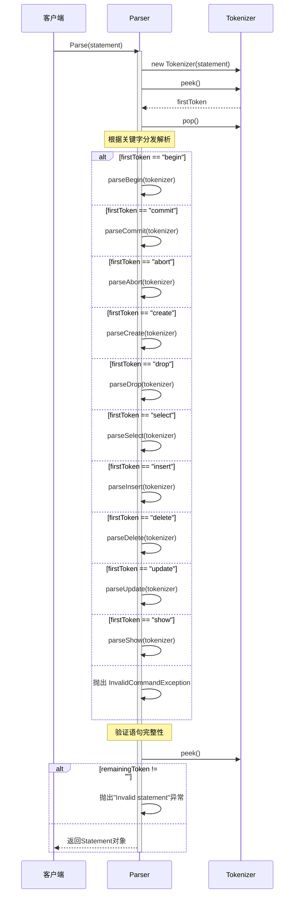

### 3.2 各种 SQL 语句的解析流程

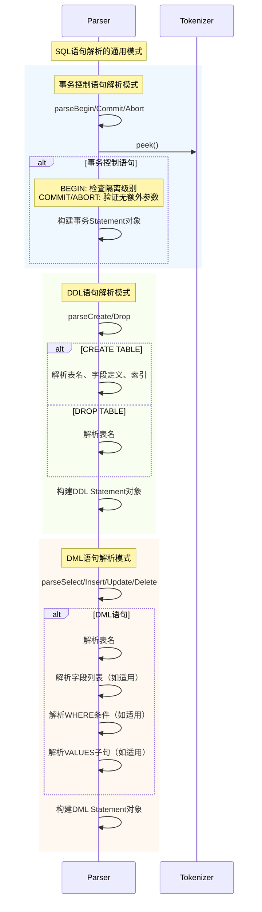

### 3.3 语法树的构建过程

```mermaid
sequenceDiagram
    participant Parser as Parser
    participant Tokenizer as Tokenizer
    participant Statement as Statement对象
    
    Note over Parser: 以SELECT语句为例展示语法树构建
    
    Parser->>Parser: parseSelect(tokenizer)
    activate Parser
    
    Parser->>Statement: new Select()
    activate Statement
    
    Note over Parser: 1. 解析字段列表
    Parser->>Tokenizer: peek()
    
    alt "*"
        Parser->>Statement: fields = ["*"]
        Parser->>Tokenizer: pop()
    else 具体字段列表
        loop 解析字段
            Parser->>Tokenizer: peek()
            Parser->>Parser: isName(field)
            Parser->>Statement: fields.add(field)
            Parser->>Tokenizer: pop()
            
            Parser->>Tokenizer: peek()
            alt ","
                Parser->>Tokenizer: pop()
            else
                Note over Parser: 字段列表结束
                break
            end
        end
    end
    
    Note over Parser: 2. 解析FROM子句
    Parser->>Tokenizer: peek()
    Parser->>Parser: 验证"from"关键字
    Parser->>Tokenizer: pop()
    
    Parser->>Tokenizer: peek()
    Parser->>Parser: isName(tableName)
    Parser->>Statement: tableName = tableName
    Parser->>Tokenizer: pop()
    
    Note over Parser: 3. 解析WHERE子句（可选）
    Parser->>Tokenizer: peek()
    
    alt 有WHERE子句
        Parser->>Parser: parseWhere(tokenizer)
        Parser->>Statement: where = whereObj
    else 无WHERE子句
        Parser->>Statement: where = null
    end
    
    Parser-->>Parser: 返回Select对象
    deactivate Statement
    deactivate Parser
```

### 3.4 语法错误的处理和报告

```mermaid
sequenceDiagram
    participant Parser as Parser
    participant Tokenizer as Tokenizer
    participant ErrorHandler as 错误处理
    
    Note over Parser: 语法错误检测和处理流程
    
    Parser->>Parser: parseXXX(tokenizer)
    
    try
        Parser->>Tokenizer: peek()
        Parser->>Parser: 验证期望的token
        
        alt token不符合语法规则
            Parser->>ErrorHandler: throw InvalidCommandException
            activate ErrorHandler
            Note over ErrorHandler: 语法错误
        else token为null但期望有内容
            Parser->>ErrorHandler: throw InvalidCommandException
            Note over ErrorHandler: 语句不完整
        else 字段名不符合规范
            Parser->>Parser: isName(token)
            alt !isName(token)
                Parser->>ErrorHandler: throw InvalidCommandException
                Note over ErrorHandler: 无效的标识符
            end
        end
        
    catch Exception e
        Note over Parser: 捕获解析异常
        Parser->>Parser: statErr = e
        
        Note over Parser: 检查语句完整性
        Parser->>Tokenizer: peek()
        alt 还有未处理的token
            Parser->>Tokenizer: errStat()
            Parser->>ErrorHandler: throw "Invalid statement"异常
            Note over ErrorHandler: 包含错误位置信息
        end
        
        Parser->>ErrorHandler: throw statErr
        deactivate ErrorHandler
    end
```

## 4. SQL 语句解析时序图

### 4.1 CREATE 语句的解析流程

```mermaid
sequenceDiagram
    participant Parser as Parser
    participant Tokenizer as Tokenizer
    participant Create as Create对象
    
    Parser->>Parser: parseCreate(tokenizer)
    activate Parser
    
    Note over Parser: 1. 验证TABLE关键字
    Parser->>Tokenizer: peek()
    Parser->>Parser: 验证token == "table"
    Parser->>Tokenizer: pop()
    
    Parser->>Create: new Create()
    activate Create
    
    Note over Parser: 2. 解析表名
    Parser->>Tokenizer: peek()
    Parser->>Parser: isName(tableName)
    Parser->>Create: tableName = name
    
    Note over Parser: 3. 解析字段定义列表
    Parser->>Parser: 初始化字段列表
    
    loop 解析字段定义
        Parser->>Tokenizer: pop()
        Parser->>Tokenizer: peek()
        
        alt field == "("
            Note over Parser: 开始索引定义
            break
        end
        
        Parser->>Parser: isName(field)
        Parser->>Tokenizer: pop()
        
        Parser->>Tokenizer: peek()
        Parser->>Parser: isType(fieldType)
        Note over Parser: 验证类型: int32, int64, string
        
        Parser->>Create: 添加字段名和类型
        Parser->>Tokenizer: pop()
        
        Parser->>Tokenizer: peek()
        alt ","
            Note over Parser: 继续下一个字段
        else "("
            Note over Parser: 字段定义完成
            break
        else ""
            Parser->>Parser: throw TableNoIndexException
        end
    end
    
    Note over Parser: 4. 解析索引定义
    Parser->>Tokenizer: pop()
    Parser->>Tokenizer: peek()
    Parser->>Parser: 验证token == "index"
    
    loop 解析索引字段
        Parser->>Tokenizer: pop()
        Parser->>Tokenizer: peek()
        
        alt field == ")"
            Note over Parser: 索引定义结束
            break
        end
        
        Parser->>Parser: isName(field)
        Parser->>Create: 添加索引字段
    end
    
    Parser->>Tokenizer: pop()
    Parser->>Tokenizer: peek()
    Parser->>Parser: 验证语句结束
    
    Parser-->>Parser: 返回Create对象
    deactivate Create
    deactivate Parser
```

### 4.2 INSERT 语句的解析流程

```mermaid
sequenceDiagram
    participant Parser as Parser
    participant Tokenizer as Tokenizer
    participant Insert as Insert对象
    
    Parser->>Parser: parseInsert(tokenizer)
    activate Parser
    
    Parser->>Insert: new Insert()
    activate Insert
    
    Note over Parser: 1. 验证INTO关键字
    Parser->>Tokenizer: peek()
    Parser->>Parser: 验证token == "into"
    Parser->>Tokenizer: pop()
    
    Note over Parser: 2. 解析表名
    Parser->>Tokenizer: peek()
    Parser->>Parser: isName(tableName)
    Parser->>Insert: tableName = tableName
    Parser->>Tokenizer: pop()
    
    Note over Parser: 3. 验证VALUES关键字
    Parser->>Tokenizer: peek()
    Parser->>Parser: 验证token == "values"
    
    Note over Parser: 4. 解析值列表
    Parser->>Parser: 初始化values列表
    
    loop 解析值
        Parser->>Tokenizer: pop()
        Parser->>Tokenizer: peek()
        
        alt value == ""
            Note over Parser: 值列表结束
            break
        else
            Parser->>Insert: values.add(value)
        end
    end
    
    Parser->>Insert: 转换为数组格式
    
    Parser-->>Parser: 返回Insert对象
    deactivate Insert
    deactivate Parser
```

### 4.3 SELECT 语句的解析流程

```mermaid
sequenceDiagram
    participant Parser as Parser
    participant Tokenizer as Tokenizer
    participant Select as Select对象
    
    Parser->>Parser: parseSelect(tokenizer)
    activate Parser
    
    Parser->>Select: new Select()
    activate Select
    
    Note over Parser: 1. 解析字段列表
    Parser->>Tokenizer: peek()
    
    alt asterisk == "*"
        Parser->>Select: fields = ["*"]
        Parser->>Tokenizer: pop()
    else 具体字段列表
        loop 解析字段
            Parser->>Tokenizer: peek()
            Parser->>Parser: isName(field)
            Parser->>Select: fields.add(field)
            Parser->>Tokenizer: pop()
            
            Parser->>Tokenizer: peek()
            alt ","
                Parser->>Tokenizer: pop()
            else
                break
            end
        end
    end
    
    Note over Parser: 2. 验证FROM关键字
    Parser->>Tokenizer: peek()
    Parser->>Parser: 验证token == "from"
    Parser->>Tokenizer: pop()
    
    Note over Parser: 3. 解析表名
    Parser->>Tokenizer: peek()
    Parser->>Parser: isName(tableName)
    Parser->>Select: tableName = tableName
    Parser->>Tokenizer: pop()
    
    Note over Parser: 4. 解析WHERE子句（可选）
    Parser->>Tokenizer: peek()
    
    alt tmp == ""
        Parser->>Select: where = null
    else
        Parser->>Parser: parseWhere(tokenizer)
        Parser->>Select: where = whereObj
    end
    
    Parser-->>Parser: 返回Select对象
    deactivate Select
    deactivate Parser
```

### 4.4 UPDATE 语句的解析流程

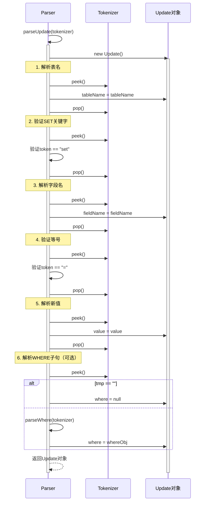

### 4.5 DELETE 语句的解析流程

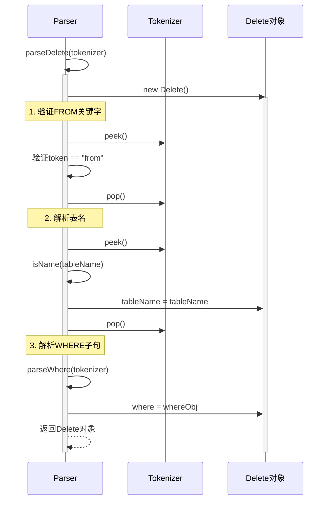

### 4.6 事务控制语句的解析

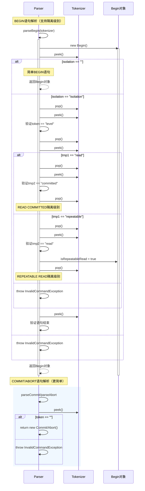

## 5. WHERE 条件处理时序图

### 5.1 WHERE 子句的解析

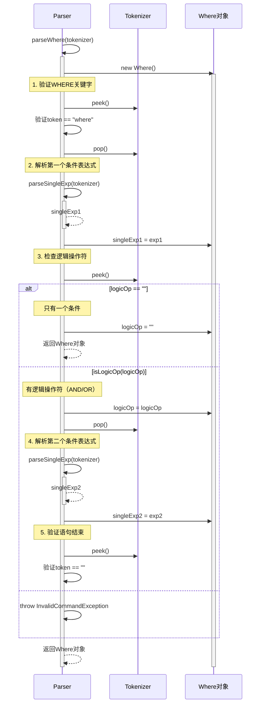

### 5.2 单一表达式的处理

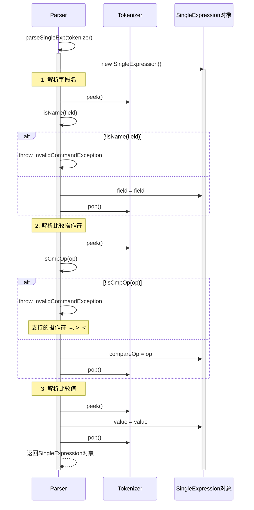

### 5.3 比较操作符的识别

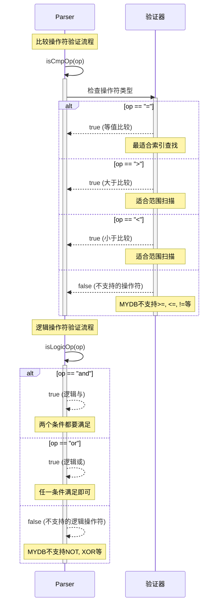

### 5.4 复杂条件的递归解析

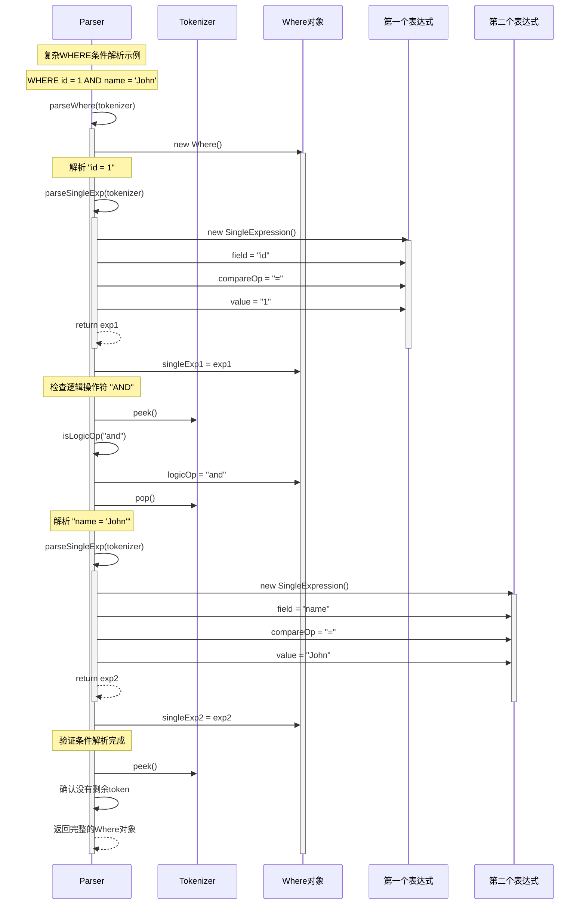

## 6. 组件交互图

### 6.1 Parser 与 Tokenizer 的协作关系

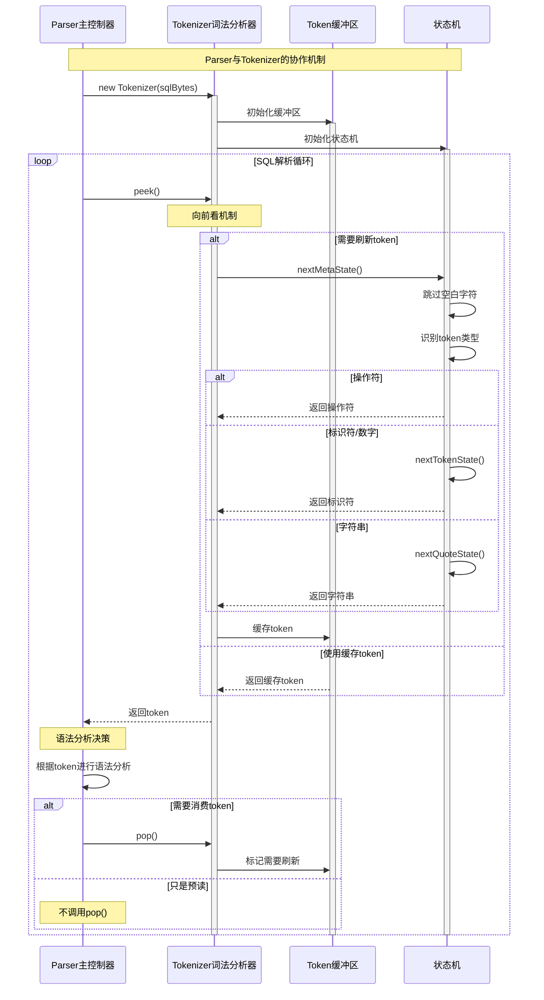

### 6.2 Statement 对象的创建和管理

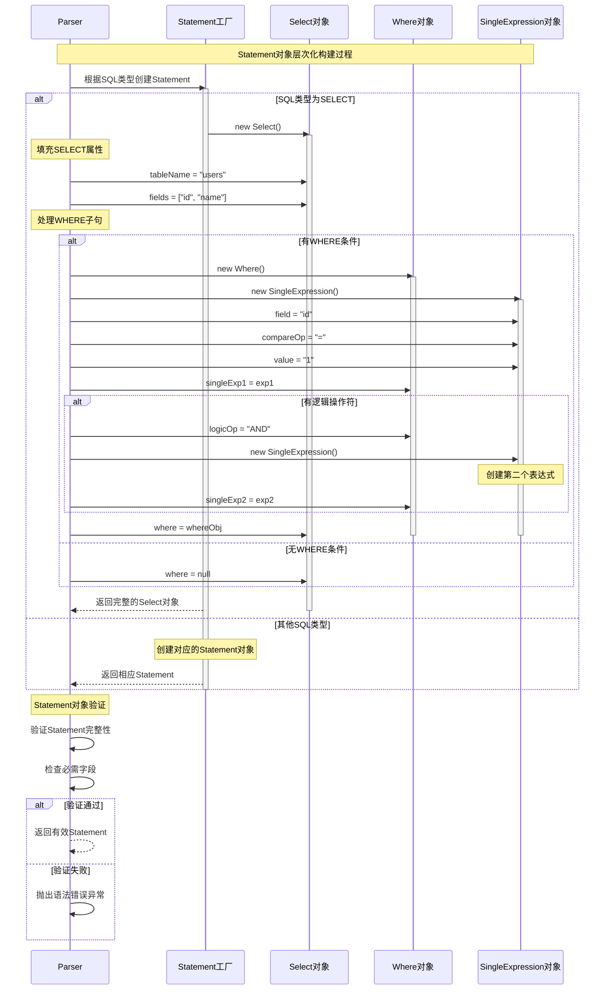

### 6.3 与 Executor 模块的接口设计

```mermaid
sequenceDiagram
    participant Client as 客户端
    participant Parser as Parser模块
    participant Executor as Executor模块
    participant Statement as Statement对象
    participant TableManager as 表管理器
    
    Note over Client,TableManager: Parser与Executor的协作接口
    
    Client->>Parser: Parse(sqlBytes)
    activate Parser
    
    Parser->>Parser: 词法和语法分析
    Parser->>Statement: 构建Statement对象
    activate Statement
    
    Parser-->>Client: 返回Statement对象
    deactivate Parser
    
    Note over Client: 将Statement传递给执行器
    Client->>Executor: execute(statement, tableManager)
    activate Executor
    
    Note over Executor: 根据Statement类型分发执行
    Executor->>Statement: 获取语句类型和参数
    Statement-->>Executor: 返回语句信息
    
    alt SELECT语句
        Executor->>TableManager: 执行查询操作
        activate TableManager
        Note over TableManager: 使用WHERE条件筛选数据
        TableManager-->>Executor: 返回查询结果
        deactivate TableManager
    else INSERT语句
        Executor->>TableManager: 执行插入操作
        activate TableManager
        TableManager-->>Executor: 返回插入结果
        deactivate TableManager
    else UPDATE语句
        Executor->>TableManager: 执行更新操作
        activate TableManager
        TableManager-->>Executor: 返回更新结果
        deactivate TableManager
    else DELETE语句
        Executor->>TableManager: 执行删除操作
        activate TableManager
        TableManager-->>Executor: 返回删除结果
        deactivate TableManager
    else DDL语句
        Executor->>TableManager: 执行表结构操作
        activate TableManager
        TableManager-->>Executor: 返回操作结果
        deactivate TableManager
    end
    
    Executor-->>Client: 返回执行结果
    deactivate Statement
    deactivate Executor
    
    Note over Client,TableManager: 接口设计特点
    Note over Parser: 1. Parser只负责语法分析，不涉及语义<br/>2. Statement对象作为中间表示<br/>3. Executor处理具体的执行逻辑<br/>4. 清晰的职责分离
```

### 6.4 错误处理和异常传播机制

```mermaid
sequenceDiagram
    participant Client as 客户端
    participant Parser as Parser
    participant Tokenizer as Tokenizer
    participant ErrorHandler as 错误处理器
    participant Exception as 异常对象
    
    Note over Client,Exception: 错误处理和异常传播流程
    
    Client->>Parser: Parse(invalidSQL)
    activate Parser
    
    try
        Parser->>Tokenizer: new Tokenizer(statement)
        activate Tokenizer
        
        Note over Parser: 词法分析阶段错误
        Parser->>Tokenizer: peek()
        
        alt 词法错误
            Tokenizer->>Exception: new InvalidCommandException
            activate Exception
            Tokenizer->>Tokenizer: err = exception
            Tokenizer-->>Parser: throw exception
            Note over Exception: 无效字符或格式错误
        end
        
        Note over Parser: 语法分析阶段错误
        Parser->>Parser: parseXXX(tokenizer)
        
        alt 语法错误
            Parser->>Exception: new InvalidCommandException
            Note over Exception: 关键字缺失或顺序错误
            Parser-->>Parser: statErr = exception
        else 语句不完整错误
            Parser->>Tokenizer: peek()
            
            alt 还有剩余token
                Parser->>Tokenizer: errStat()
                Tokenizer->>ErrorHandler: 生成错误位置信息
                activate ErrorHandler
                ErrorHandler->>Exception: new RuntimeException("Invalid statement")
                ErrorHandler-->>Parser: 包含位置的错误信息
                deactivate ErrorHandler
                Parser-->>Parser: statErr = exception
            end
        end
        
    catch Exception e
        Note over Parser: 统一错误处理
        Parser->>ErrorHandler: 处理异常
        activate ErrorHandler
        
        ErrorHandler->>ErrorHandler: 记录错误日志
        ErrorHandler->>ErrorHandler: 格式化错误信息
        
        alt 提供错误位置
            ErrorHandler->>Tokenizer: errStat()
            Tokenizer-->>ErrorHandler: 错误位置标记
            ErrorHandler->>Exception: 增强错误信息
        end
        
        ErrorHandler-->>Parser: 返回处理后的异常
        deactivate ErrorHandler
        
        Parser-->>Client: throw 最终异常
        deactivate Exception
    end
    
    deactivate Tokenizer
    deactivate Parser
    
    Note over Client,Exception: 错误类型和处理策略
    
    rect rgb(255, 240, 240)
        Note over ErrorHandler: 词法错误<br/>- 无效字符<br/>- 字符串未闭合<br/>- 不支持的符号
    end
    
    rect rgb(240, 255, 240)
        Note over ErrorHandler: 语法错误<br/>- 关键字错误<br/>- 语句结构不完整<br/>- 类型不匹配
    end
    
    rect rgb(240, 240, 255)
        Note over ErrorHandler: 语义错误<br/>- 表不存在<br/>- 字段不存在<br/>- 约束违反
    end
```

## 7. 总结

### 7.1 查询处理模块的特点

MYDB 的查询处理模块实现了一个简化但完整的 SQL 解析器，具有以下特点：

1. **分层设计**: 词法分析与语法分析分离，职责清晰
2. **递归下降**: 采用递归下降解析器，易于理解和扩展  
3. **向前看机制**: 支持 LL(1) 语法分析，提供 peek/pop 接口
4. **错误处理**: 完善的错误检测和位置标记机制
5. **语句对象**: 结构化的中间表示，便于后续处理

### 7.2 与标准 SQL 解析器的差异

| 方面 | 标准SQL解析器 | MYDB解析器 |
|------|---------------|------------|
| 语法复杂度 | 支持完整SQL标准 | 基本SQL操作 |
| 解析策略 | LR/LALR解析器 | 递归下降 |
| 错误恢复 | 复杂的错误恢复 | 简单的错误报告 |
| 优化 | 查询计划优化 | 直接执行 |
| 扩展性 | 高度可配置 | 固定语法规则 |

### 7.3 编译原理在数据库中的应用

查询处理模块展示了编译原理在数据库系统中的典型应用：

1. **词法分析**: 将 SQL 文本转换为 Token 流
2. **语法分析**: 构建抽象语法树（AST）
3. **语义分析**: 验证表和字段的存在性（在执行阶段）
4. **代码生成**: 转换为可执行的操作序列（在执行阶段）

这种设计使得 MYDB 能够以结构化的方式处理 SQL 语句，为学习数据库内核原理提供了良好的示例。