# MYDB 服务与通信模块时序图

## 1. 模块概述

### 1.1 核心职责与组件

服务与通信模块是 MYDB 系统中的网络层和应用层接口，负责客户端与服务器之间的通信协调。该模块包含以下核心组件：

**服务器端组件：**
- [`Server`](src/main/java/top/guoziyang/mydb/backend/server/Server.java:40) - 服务器主类，负责监听和管理客户端连接
- [`HandleSocket`](src/main/java/top/guoziyang/mydb/backend/server/Server.java:157) - 连接处理器，处理单个客户端的所有请求
- [`Executor`](src/main/java/top/guoziyang/mydb/backend/server/Executor.java:45) - SQL执行器，负责解析和执行SQL语句

**传输层组件：**
- [`Package`](src/main/java/top/guoziyang/mydb/transport/Package.java:34) - 数据包封装类，统一处理数据和异常
- [`Encoder`](src/main/java/top/guoziyang/mydb/transport/Encoder.java:40) - 数据编码器，负责序列化和反序列化
- [`Transporter`](src/main/java/top/guoziyang/mydb/transport/Transporter.java:49) - 网络传输器，处理底层TCP通信
- [`Packager`](src/main/java/top/guoziyang/mydb/transport/Packager.java:38) - 数据包装器，组合传输和编码功能

**客户端组件：**
- [`Client`](src/main/java/top/guoziyang/mydb/client/Client.java:33) - 客户端核心类，提供SQL执行接口
- [`RoundTripper`](src/main/java/top/guoziyang/mydb/client/RoundTripper.java:39) - 往返通信处理器，实现请求-响应模式
- [`Shell`](src/main/java/top/guoziyang/mydb/client/Shell.java:34) - 交互式命令行界面

### 1.2 架构设计原理

**客户端/服务器架构：**
- 采用传统的C/S架构，服务器端集中处理SQL逻辑
- 客户端作为薄客户端，主要负责用户交互和网络通信
- 支持多客户端并发连接，使用线程池处理并发请求

**网络通信协议：**
- 使用基于TCP的简化文本协议
- 数据包采用十六进制编码，每条消息占用一行
- 支持数据和异常的统一传输格式
- 协议极其简化，专注于基本功能实现

### 1.3 与传统数据库服务器对比

**相比MySQL等传统数据库：**

| 特性 | MySQL | MYDB |
|------|-------|------|
| 连接管理 | 复杂的连接池、认证、SSL | 简单的Socket连接 |
| 协议复杂度 | 二进制协议，包头、序列号 | 文本协议，十六进制编码 |
| 并发处理 | 复杂的线程模型和连接复用 | 简单的线程池处理 |
| 事务管理 | 多种隔离级别、锁机制 | 简化的事务状态管理 |
| SQL执行 | 查询优化、缓存、预编译 | 直接解析执行 |

## 2. 服务器端时序图

### 2.1 Server启动和初始化流程

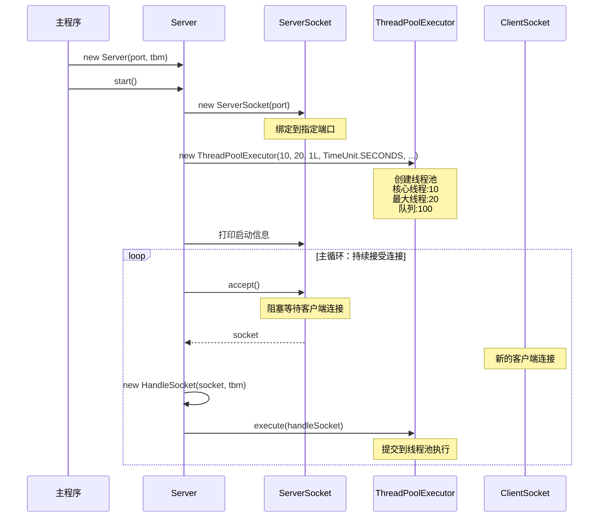
```mermaid
sequenceDiagram
    participant Main as 主程序
    participant Server as Server
    participant SS as ServerSocket
    participant TPE as ThreadPoolExecutor
    participant Socket as ClientSocket

    Main->>Server: new Server(port, tbm)
    Main->>Server: start()
    
    Server->>SS: new ServerSocket(port)
    Note over SS: 绑定到指定端口
    
    Server->>TPE: new ThreadPoolExecutor(10, 20, 1L, TimeUnit.SECONDS, ...)
    Note over TPE: 创建线程池<br/>核心线程:10<br/>最大线程:20<br/>队列:100
    
    Server->>SS: 打印启动信息
    
    loop 主循环：持续接受连接
        Server->>SS: accept()
        Note over SS: 阻塞等待客户端连接
        
        SS-->>Server: socket
        Note over Socket: 新的客户端连接
        
        Server->>Server: new HandleSocket(socket, tbm)
        Server->>TPE: execute(handleSocket)
        Note over TPE: 提交到线程池执行
    end
```

### 2.2 客户端连接处理流程

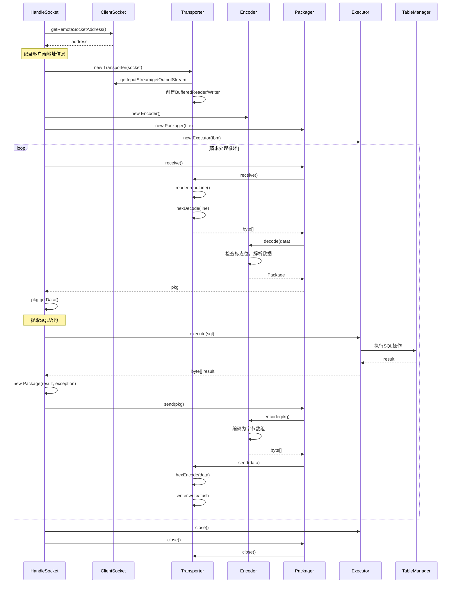
```mermaid
sequenceDiagram
    participant HS as HandleSocket
    participant Socket as ClientSocket
    participant T as Transporter
    participant E as Encoder
    participant P as Packager
    participant Exe as Executor
    participant TBM as TableManager

    HS->>Socket: getRemoteSocketAddress()
    Socket-->>HS: address
    Note over HS: 记录客户端地址信息
    
    HS->>T: new Transporter(socket)
    T->>Socket: getInputStream/getOutputStream
    T->>T: 创建BufferedReader/Writer
    
    HS->>E: new Encoder()
    HS->>P: new Packager(t, e)
    
    HS->>Exe: new Executor(tbm)
    
    loop 请求处理循环
        HS->>P: receive()
        P->>T: receive()
        T->>T: reader.readLine()
        T->>T: hexDecode(line)
        T-->>P: byte[]
        P->>E: decode(data)
        E->>E: 检查标志位，解析数据
        E-->>P: Package
        P-->>HS: pkg
        
        HS->>HS: pkg.getData()
        Note over HS: 提取SQL语句
        
        HS->>Exe: execute(sql)
        Exe->>TBM: 执行SQL操作
        TBM-->>Exe: result
        Exe-->>HS: byte[] result
        
        HS->>HS: new Package(result, exception)
        HS->>P: send(pkg)
        P->>E: encode(pkg)
        E->>E: 编码为字节数组
        E-->>P: byte[]
        P->>T: send(data)
        T->>T: hexEncode(data)
        T->>T: writer.write/flush
    end
    
    HS->>Exe: close()
    HS->>P: close()
    P->>T: close()
```

### 2.3 多客户端并发处理机制

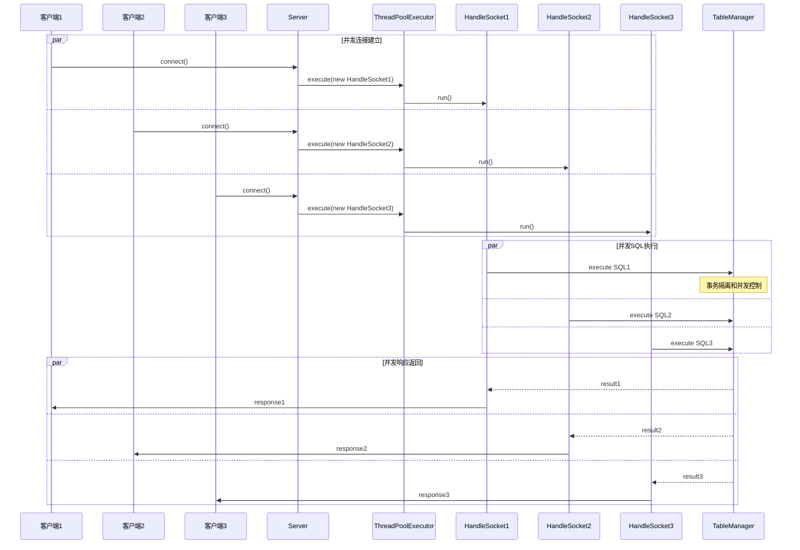
```mermaid
sequenceDiagram
    participant C1 as 客户端1
    participant C2 as 客户端2
    participant C3 as 客户端3
    participant Server as Server
    participant TPE as ThreadPoolExecutor
    participant HS1 as HandleSocket1
    participant HS2 as HandleSocket2
    participant HS3 as HandleSocket3
    participant TBM as TableManager

    par 并发连接建立
        C1->>Server: connect()
        Server->>TPE: execute(new HandleSocket1)
        TPE->>HS1: run()
    and
        C2->>Server: connect()
        Server->>TPE: execute(new HandleSocket2)
        TPE->>HS2: run()
    and
        C3->>Server: connect()
        Server->>TPE: execute(new HandleSocket3)
        TPE->>HS3: run()
    end
    
    par 并发SQL执行
        HS1->>TBM: execute SQL1
        Note over TBM: 事务隔离和并发控制
    and
        HS2->>TBM: execute SQL2
    and
        HS3->>TBM: execute SQL3
    end
    
    par 并发响应返回
        TBM-->>HS1: result1
        HS1->>C1: response1
    and
        TBM-->>HS2: result2
        HS2->>C2: response2
    and
        TBM-->>HS3: result3
        HS3->>C3: response3
    end
```

## 3. 客户端时序图

### 3.1 Client连接建立流程

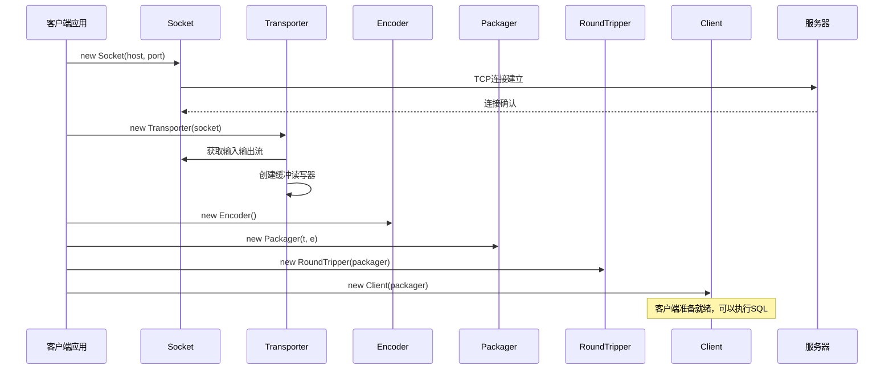
```mermaid
sequenceDiagram
    participant App as 客户端应用
    participant Socket as Socket
    participant T as Transporter
    participant E as Encoder
    participant P as Packager
    participant RT as RoundTripper
    participant Client as Client
    participant Server as 服务器

    App->>Socket: new Socket(host, port)
    Socket->>Server: TCP连接建立
    Server-->>Socket: 连接确认
    
    App->>T: new Transporter(socket)
    T->>Socket: 获取输入输出流
    T->>T: 创建缓冲读写器
    
    App->>E: new Encoder()
    App->>P: new Packager(t, e)
    App->>RT: new RoundTripper(packager)
    App->>Client: new Client(packager)
    
    Note over Client: 客户端准备就绪，可以执行SQL
```

### 3.2 SQL语句发送和接收流程

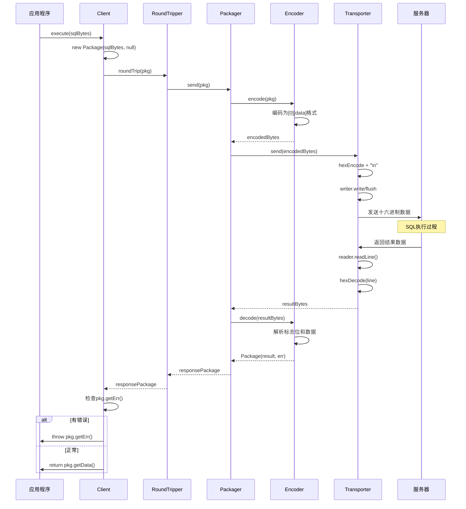
```mermaid
sequenceDiagram
    participant App as 应用程序
    participant Client as Client
    participant RT as RoundTripper
    participant P as Packager
    participant E as Encoder
    participant T as Transporter
    participant Server as 服务器

    App->>Client: execute(sqlBytes)
    Client->>Client: new Package(sqlBytes, null)
    
    Client->>RT: roundTrip(pkg)
    RT->>P: send(pkg)
    P->>E: encode(pkg)
    E->>E: 编码为[0][data]格式
    E-->>P: encodedBytes
    P->>T: send(encodedBytes)
    T->>T: hexEncode + "\n"
    T->>T: writer.write/flush
    T->>Server: 发送十六进制数据
    
    Note over Server: SQL执行过程
    
    Server->>T: 返回结果数据
    T->>T: reader.readLine()
    T->>T: hexDecode(line)
    T-->>P: resultBytes
    P->>E: decode(resultBytes)
    E->>E: 解析标志位和数据
    E-->>P: Package(result, err)
    P-->>RT: responsePackage
    RT-->>Client: responsePackage
    
    Client->>Client: 检查pkg.getErr()
    alt 有错误
        Client->>App: throw pkg.getErr()
    else 正常
        Client->>App: return pkg.getData()
    end
```

### 3.3 RoundTripper请求-响应处理

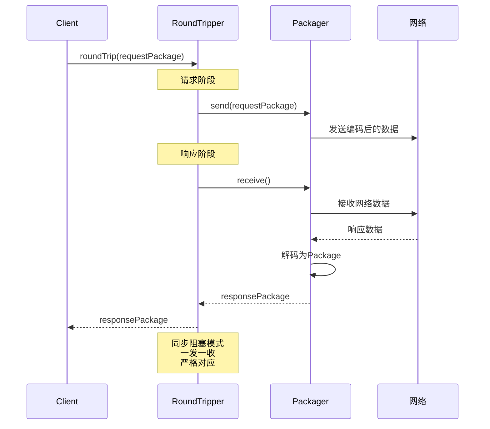
```mermaid
sequenceDiagram
    participant Client as Client
    participant RT as RoundTripper
    participant P as Packager
    participant Network as 网络

    Client->>RT: roundTrip(requestPackage)
    
    Note over RT: 请求阶段
    RT->>P: send(requestPackage)
    P->>Network: 发送编码后的数据
    
    Note over RT: 响应阶段
    RT->>P: receive()
    P->>Network: 接收网络数据
    Network-->>P: 响应数据
    P->>P: 解码为Package
    P-->>RT: responsePackage
    
    RT-->>Client: responsePackage
    
    Note over RT: 同步阻塞模式<br/>一发一收<br/>严格对应
```

### 3.4 Shell交互式命令行界面

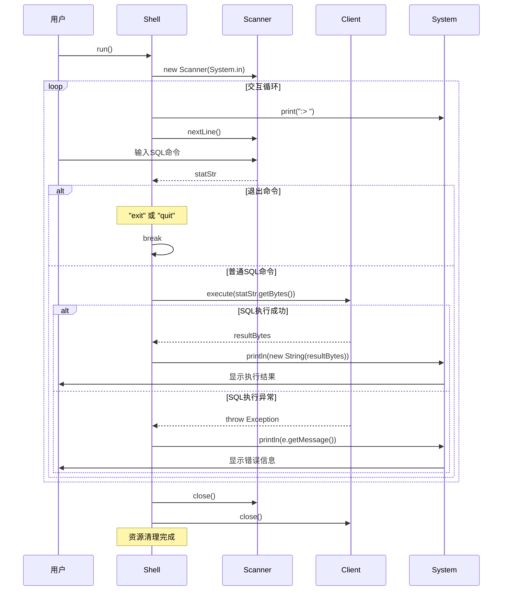
```mermaid
sequenceDiagram
    participant User as 用户
    participant Shell as Shell
    participant Scanner as Scanner
    participant Client as Client
    participant System as System

    User->>Shell: run()
    Shell->>Scanner: new Scanner(System.in)
    
    loop 交互循环
        Shell->>System: print(":> ")
        Shell->>Scanner: nextLine()
        User->>Scanner: 输入SQL命令
        Scanner-->>Shell: statStr
        
        alt 退出命令
            Note over Shell: "exit" 或 "quit"
            Shell->>Shell: break
        else 普通SQL命令
            Shell->>Client: execute(statStr.getBytes())
            
            alt SQL执行成功
                Client-->>Shell: resultBytes
                Shell->>System: println(new String(resultBytes))
                System->>User: 显示执行结果
            else SQL执行异常
                Client-->>Shell: throw Exception
                Shell->>System: println(e.getMessage())
                System->>User: 显示错误信息
            end
        end
    end
    
    Shell->>Scanner: close()
    Shell->>Client: close()
    Note over Shell: 资源清理完成
```

## 4. 通信协议时序图

### 4.1 Package数据包封装和解封

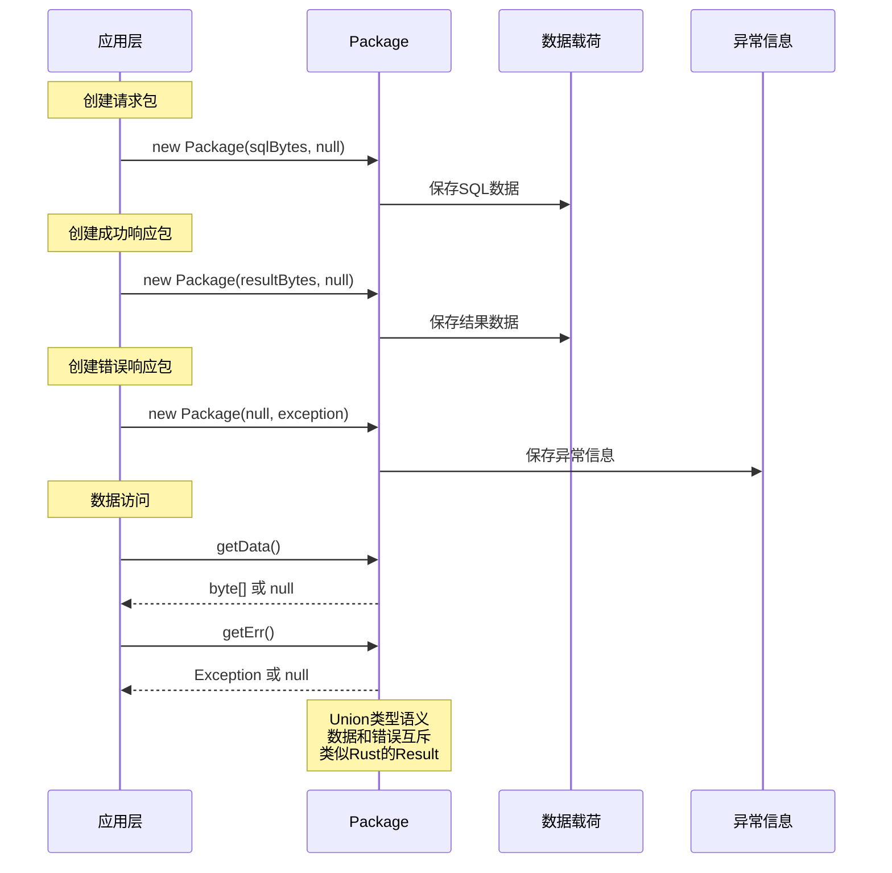
```mermaid
sequenceDiagram
    participant App as 应用层
    participant Pkg as Package
    participant Data as 数据载荷
    participant Err as 异常信息

    Note over App: 创建请求包
    App->>Pkg: new Package(sqlBytes, null)
    Pkg->>Data: 保存SQL数据
    
    Note over App: 创建成功响应包
    App->>Pkg: new Package(resultBytes, null)
    Pkg->>Data: 保存结果数据
    
    Note over App: 创建错误响应包
    App->>Pkg: new Package(null, exception)
    Pkg->>Err: 保存异常信息
    
    Note over App: 数据访问
    App->>Pkg: getData()
    Pkg-->>App: byte[] 或 null
    
    App->>Pkg: getErr()
    Pkg-->>App: Exception 或 null
    
    Note over Pkg: Union类型语义<br/>数据和错误互斥<br/>类似Rust的Result
```

### 4.2 Encoder编码和解码流程

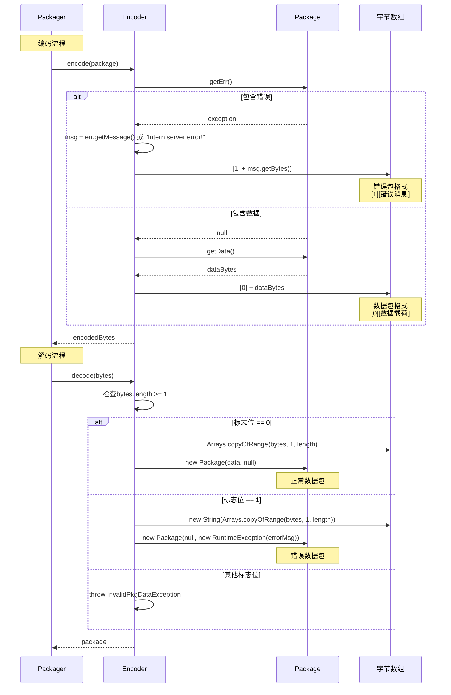
```mermaid
sequenceDiagram
    participant P as Packager
    participant E as Encoder
    participant Pkg as Package
    participant Bytes as 字节数组

    Note over P: 编码流程
    P->>E: encode(package)
    E->>Pkg: getErr()
    
    alt 包含错误
        Pkg-->>E: exception
        E->>E: msg = err.getMessage() 或 "Intern server error!"
        E->>Bytes: [1] + msg.getBytes()
        Note over Bytes: 错误包格式<br/>[1][错误消息]
    else 包含数据
        Pkg-->>E: null
        E->>Pkg: getData()
        Pkg-->>E: dataBytes
        E->>Bytes: [0] + dataBytes
        Note over Bytes: 数据包格式<br/>[0][数据载荷]
    end
    
    E-->>P: encodedBytes
    
    Note over P: 解码流程
    P->>E: decode(bytes)
    E->>E: 检查bytes.length >= 1
    
    alt 标志位 == 0
        E->>Bytes: Arrays.copyOfRange(bytes, 1, length)
        E->>Pkg: new Package(data, null)
        Note over Pkg: 正常数据包
    else 标志位 == 1
        E->>Bytes: new String(Arrays.copyOfRange(bytes, 1, length))
        E->>Pkg: new Package(null, new RuntimeException(errorMsg))
        Note over Pkg: 错误数据包
    else 其他标志位
        E->>E: throw InvalidPkgDataException
    end
    
    E-->>P: package
```

### 4.3 Transporter传输层处理

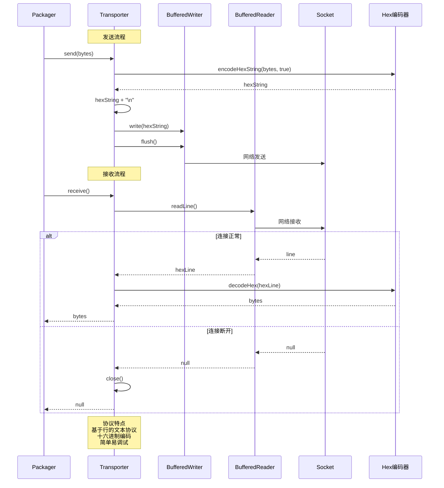
```mermaid
sequenceDiagram
    participant P as Packager
    participant T as Transporter
    participant Writer as BufferedWriter
    participant Reader as BufferedReader
    participant Socket as Socket
    participant Hex as Hex编码器

    Note over T: 发送流程
    P->>T: send(bytes)
    T->>Hex: encodeHexString(bytes, true)
    Hex-->>T: hexString
    T->>T: hexString + "\n"
    T->>Writer: write(hexString)
    T->>Writer: flush()
    Writer->>Socket: 网络发送
    
    Note over T: 接收流程
    P->>T: receive()
    T->>Reader: readLine()
    Reader->>Socket: 网络接收
    
    alt 连接正常
        Socket-->>Reader: line
        Reader-->>T: hexLine
        T->>Hex: decodeHex(hexLine)
        Hex-->>T: bytes
        T-->>P: bytes
    else 连接断开
        Socket-->>Reader: null
        Reader-->>T: null
        T->>T: close()
        T-->>P: null
    end
    
    Note over T: 协议特点<br/>基于行的文本协议<br/>十六进制编码<br/>简单易调试
```

### 4.4 Packager包管理机制

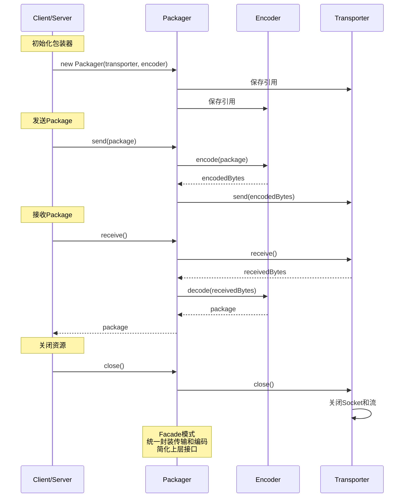
```mermaid
sequenceDiagram
    participant Client as Client/Server
    participant Packager as Packager
    participant Encoder as Encoder
    participant Transporter as Transporter

    Note over Client: 初始化包装器
    Client->>Packager: new Packager(transporter, encoder)
    Packager->>Transporter: 保存引用
    Packager->>Encoder: 保存引用
    
    Note over Client: 发送Package
    Client->>Packager: send(package)
    Packager->>Encoder: encode(package)
    Encoder-->>Packager: encodedBytes
    Packager->>Transporter: send(encodedBytes)
    
    Note over Client: 接收Package
    Client->>Packager: receive()
    Packager->>Transporter: receive()
    Transporter-->>Packager: receivedBytes
    Packager->>Encoder: decode(receivedBytes)
    Encoder-->>Packager: package
    Packager-->>Client: package
    
    Note over Client: 关闭资源
    Client->>Packager: close()
    Packager->>Transporter: close()
    Transporter->>Transporter: 关闭Socket和流
    
    Note over Packager: Facade模式<br/>统一封装传输和编码<br/>简化上层接口
```

## 5. SQL执行引擎时序图

### 5.1 Executor语句分发机制

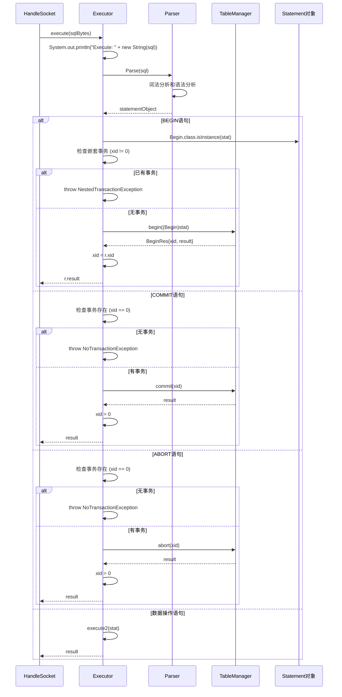
```mermaid
sequenceDiagram
    participant HS as HandleSocket
    participant Exe as Executor
    participant Parser as Parser
    participant TBM as TableManager
    participant Stat as Statement对象

    HS->>Exe: execute(sqlBytes)
    Exe->>Exe: System.out.println("Execute: " + new String(sql))
    
    Exe->>Parser: Parse(sql)
    Parser->>Parser: 词法分析和语法分析
    Parser-->>Exe: statementObject
    
    alt BEGIN语句
        Exe->>Stat: Begin.class.isInstance(stat)
        Exe->>Exe: 检查嵌套事务 (xid != 0)
        alt 已有事务
            Exe->>Exe: throw NestedTransactionException
        else 无事务
            Exe->>TBM: begin((Begin)stat)
            TBM-->>Exe: BeginRes{xid, result}
            Exe->>Exe: xid = r.xid
            Exe-->>HS: r.result
        end
    else COMMIT语句
        Exe->>Exe: 检查事务存在 (xid == 0)
        alt 无事务
            Exe->>Exe: throw NoTransactionException
        else 有事务
            Exe->>TBM: commit(xid)
            TBM-->>Exe: result
            Exe->>Exe: xid = 0
            Exe-->>HS: result
        end
    else ABORT语句
        Exe->>Exe: 检查事务存在 (xid == 0)
        alt 无事务
            Exe->>Exe: throw NoTransactionException
        else 有事务
            Exe->>TBM: abort(xid)
            TBM-->>Exe: result
            Exe->>Exe: xid = 0
            Exe-->>HS: result
        end
    else 数据操作语句
        Exe->>Exe: execute2(stat)
        Exe-->>HS: result
    end
```

### 5.2 不同SQL语句的执行路径

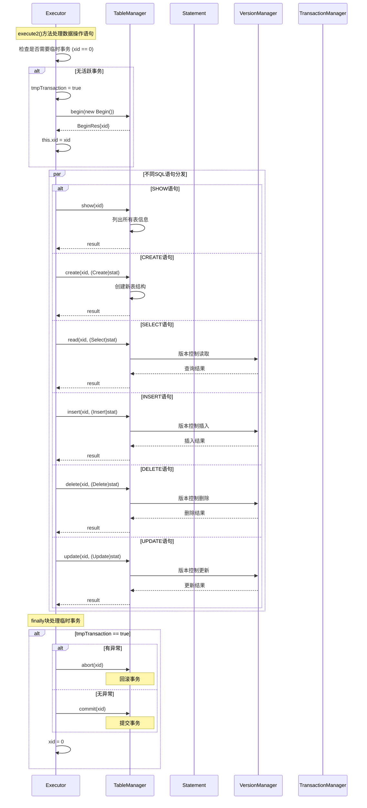
```mermaid
sequenceDiagram
    participant Exe as Executor
    participant TBM as TableManager
    participant Stat as Statement
    participant VM as VersionManager
    participant TM as TransactionManager

    Note over Exe: execute2()方法处理数据操作语句
    
    Exe->>Exe: 检查是否需要临时事务 (xid == 0)
    alt 无活跃事务
        Exe->>Exe: tmpTransaction = true
        Exe->>TBM: begin(new Begin())
        TBM-->>Exe: BeginRes{xid}
        Exe->>Exe: this.xid = xid
    end
    
    par 不同SQL语句分发
        alt SHOW语句
            Exe->>TBM: show(xid)
            TBM->>TBM: 列出所有表信息
            TBM-->>Exe: result
        else CREATE语句
            Exe->>TBM: create(xid, (Create)stat)
            TBM->>TBM: 创建新表结构
            TBM-->>Exe: result
        else SELECT语句
            Exe->>TBM: read(xid, (Select)stat)
            TBM->>VM: 版本控制读取
            VM-->>TBM: 查询结果
            TBM-->>Exe: result
        else INSERT语句
            Exe->>TBM: insert(xid, (Insert)stat)
            TBM->>VM: 版本控制插入
            VM-->>TBM: 插入结果
            TBM-->>Exe: result
        else DELETE语句
            Exe->>TBM: delete(xid, (Delete)stat)
            TBM->>VM: 版本控制删除
            VM-->>TBM: 删除结果
            TBM-->>Exe: result
        else UPDATE语句
            Exe->>TBM: update(xid, (Update)stat)
            TBM->>VM: 版本控制更新
            VM-->>TBM: 更新结果
            TBM-->>Exe: result
        end
    end
    
    Note over Exe: finally块处理临时事务
    alt tmpTransaction == true
        alt 有异常
            Exe->>TBM: abort(xid)
            Note over TBM: 回滚事务
        else 无异常
            Exe->>TBM: commit(xid)
            Note over TBM: 提交事务
        end
        Exe->>Exe: xid = 0
    end
```

### 5.3 事务管理与执行器集成

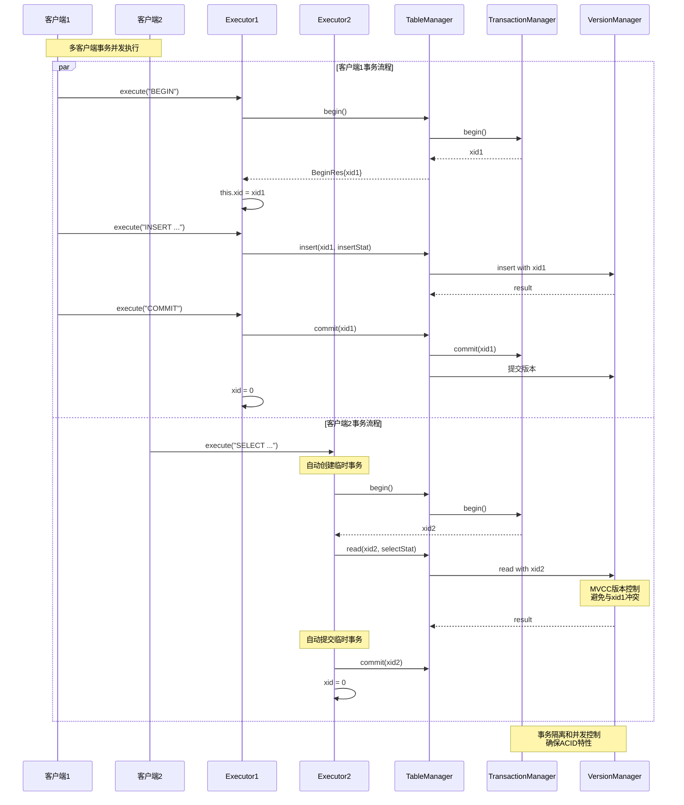
```mermaid
sequenceDiagram
    participant Client1 as 客户端1
    participant Client2 as 客户端2
    participant Exe1 as Executor1
    participant Exe2 as Executor2
    participant TBM as TableManager
    participant TM as TransactionManager
    participant VM as VersionManager

    Note over Client1,Client2: 多客户端事务并发执行
    
    par 客户端1事务流程
        Client1->>Exe1: execute("BEGIN")
        Exe1->>TBM: begin()
        TBM->>TM: begin()
        TM-->>TBM: xid1
        TBM-->>Exe1: BeginRes{xid1}
        Exe1->>Exe1: this.xid = xid1
        
        Client1->>Exe1: execute("INSERT ...")
        Exe1->>TBM: insert(xid1, insertStat)
        TBM->>VM: insert with xid1
        VM-->>TBM: result
        
        Client1->>Exe1: execute("COMMIT")
        Exe1->>TBM: commit(xid1)
        TBM->>TM: commit(xid1)
        TBM->>VM: 提交版本
        Exe1->>Exe1: xid = 0
    and 客户端2事务流程
        Client2->>Exe2: execute("SELECT ...")
        Note over Exe2: 自动创建临时事务
        Exe2->>TBM: begin()
        TBM->>TM: begin()
        TM-->>Exe2: xid2
        
        Exe2->>TBM: read(xid2, selectStat)
        TBM->>VM: read with xid2
        Note over VM: MVCC版本控制<br/>避免与xid1冲突
        VM-->>TBM: result
        
        Note over Exe2: 自动提交临时事务
        Exe2->>TBM: commit(xid2)
        Exe2->>Exe2: xid = 0
    end
    
    Note over TM,VM: 事务隔离和并发控制<br/>确保ACID特性
```

### 5.4 执行结果处理和返回

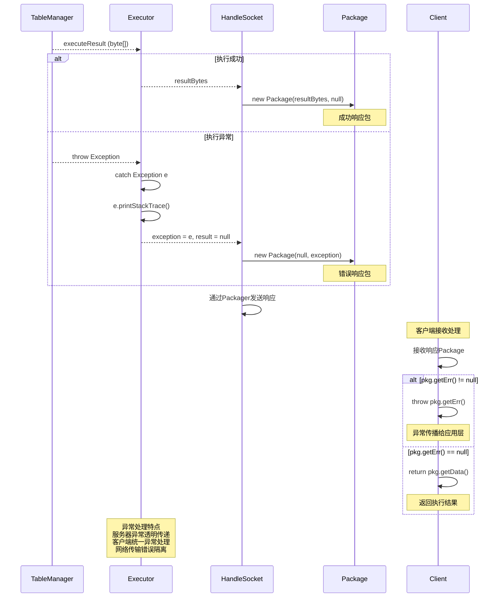
```mermaid
sequenceDiagram
    participant TBM as TableManager
    participant Exe as Executor
    participant HS as HandleSocket
    participant Pkg as Package
    participant Client as Client

    TBM-->>Exe: executeResult (byte[])
    
    alt 执行成功
        Exe-->>HS: resultBytes
        HS->>Pkg: new Package(resultBytes, null)
        Note over Pkg: 成功响应包
    else 执行异常
        TBM-->>Exe: throw Exception
        Exe->>Exe: catch Exception e
        Exe->>Exe: e.printStackTrace()
        Exe-->>HS: exception = e, result = null
        HS->>Pkg: new Package(null, exception)
        Note over Pkg: 错误响应包
    end
    
    HS->>HS: 通过Packager发送响应
    
    Note over Client: 客户端接收处理
    Client->>Client: 接收响应Package
    
    alt pkg.getErr() != null
        Client->>Client: throw pkg.getErr()
        Note over Client: 异常传播给应用层
    else pkg.getErr() == null
        Client->>Client: return pkg.getData()
        Note over Client: 返回执行结果
    end
    
    Note over Exe: 异常处理特点<br/>服务器异常透明传递<br/>客户端统一异常处理<br/>网络传输错误隔离
```

## 6. 组件交互图

### 6.1 Server、Client、Executor协作关系

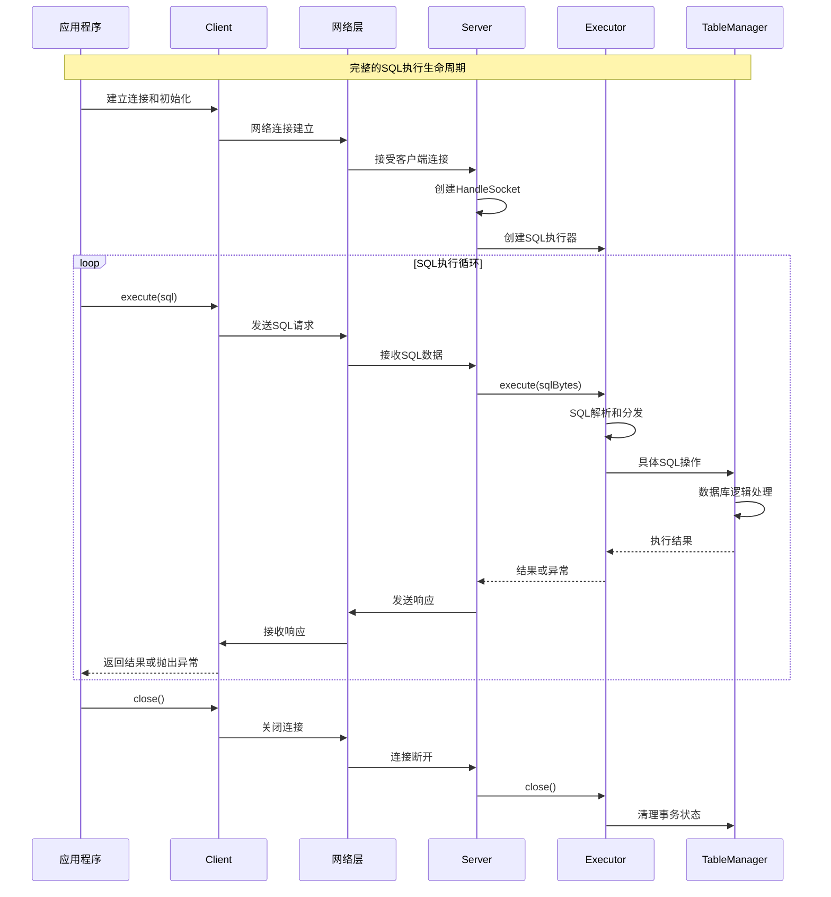
```mermaid
sequenceDiagram
    participant App as 应用程序
    participant Client as Client
    participant Network as 网络层
    participant Server as Server
    participant Executor as Executor
    participant TBM as TableManager

    Note over App,TBM: 完整的SQL执行生命周期
    
    App->>Client: 建立连接和初始化
    Client->>Network: 网络连接建立
    Network->>Server: 接受客户端连接
    Server->>Server: 创建HandleSocket
    Server->>Executor: 创建SQL执行器
    
    loop SQL执行循环
        App->>Client: execute(sql)
        Client->>Network: 发送SQL请求
        Network->>Server: 接收SQL数据
        Server->>Executor: execute(sqlBytes)
        
        Executor->>Executor: SQL解析和分发
        Executor->>TBM: 具体SQL操作
        TBM->>TBM: 数据库逻辑处理
        TBM-->>Executor: 执行结果
        
        Executor-->>Server: 结果或异常
        Server->>Network: 发送响应
        Network->>Client: 接收响应
        Client-->>App: 返回结果或抛出异常
    end
    
    App->>Client: close()
    Client->>Network: 关闭连接
    Network->>Server: 连接断开
    Server->>Executor: close()
    Executor->>TBM: 清理事务状态
```

### 6.2 Transport层与应用层接口

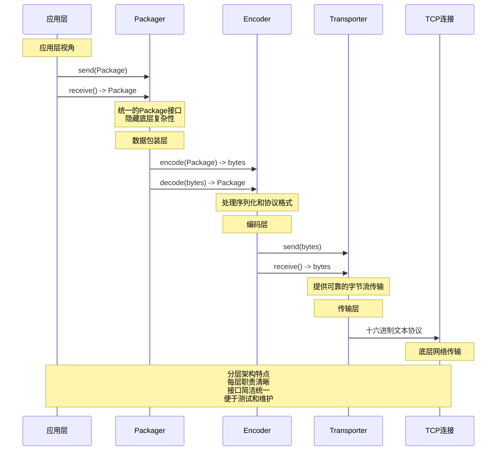
```mermaid
sequenceDiagram
    participant App as 应用层
    participant Packager as Packager
    participant Encoder as Encoder
    participant Transporter as Transporter
    participant TCP as TCP连接

    Note over App: 应用层视角
    App->>Packager: send(Package)
    App->>Packager: receive() -> Package
    Note over Packager: 统一的Package接口<br/>隐藏底层复杂性
    
    Note over Packager: 数据包装层
    Packager->>Encoder: encode(Package) -> bytes
    Packager->>Encoder: decode(bytes) -> Package
    Note over Encoder: 处理序列化和协议格式
    
    Note over Encoder: 编码层
    Encoder->>Transporter: send(bytes)
    Encoder->>Transporter: receive() -> bytes
    Note over Transporter: 提供可靠的字节流传输
    
    Note over Transporter: 传输层
    Transporter->>TCP: 十六进制文本协议
    Note over TCP: 底层网络传输
    
    Note over App,TCP: 分层架构特点<br/>每层职责清晰<br/>接口简洁统一<br/>便于测试和维护
```

### 6.3 错误处理和连接管理

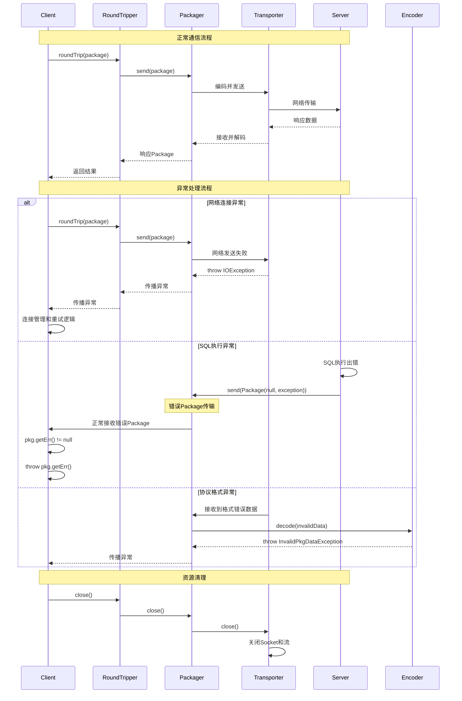
```mermaid
sequenceDiagram
    participant Client as Client
    participant RoundTripper as RoundTripper
    participant Packager as Packager
    participant Transporter as Transporter
    participant Server as Server

    Note over Client,Server: 正常通信流程
    Client->>RoundTripper: roundTrip(package)
    RoundTripper->>Packager: send(package)
    Packager->>Transporter: 编码并发送
    Transporter->>Server: 网络传输
    Server-->>Transporter: 响应数据
    Transporter-->>Packager: 接收并解码
    Packager-->>RoundTripper: 响应Package
    RoundTripper-->>Client: 返回结果
    
    Note over Client,Server: 异常处理流程
    
    alt 网络连接异常
        Client->>RoundTripper: roundTrip(package)
        RoundTripper->>Packager: send(package)
        Packager->>Transporter: 网络发送失败
        Transporter-->>Packager: throw IOException
        Packager-->>RoundTripper: 传播异常
        RoundTripper-->>Client: 传播异常
        Client->>Client: 连接管理和重试逻辑
    else SQL执行异常
        Server->>Server: SQL执行出错
        Server->>Packager: send(Package(null, exception))
        Note over Packager: 错误Package传输
        Packager->>Client: 正常接收错误Package
        Client->>Client: pkg.getErr() != null
        Client->>Client: throw pkg.getErr()
    else 协议格式异常
        Transporter->>Packager: 接收到格式错误数据
        Packager->>Encoder: decode(invalidData)
        Encoder-->>Packager: throw InvalidPkgDataException
        Packager-->>Client: 传播异常
    end
    
    Note over Client,Server: 资源清理
    Client->>RoundTripper: close()
    RoundTripper->>Packager: close()
    Packager->>Transporter: close()
    Transporter->>Transporter: 关闭Socket和流
```

### 6.4 并发控制和资源管理

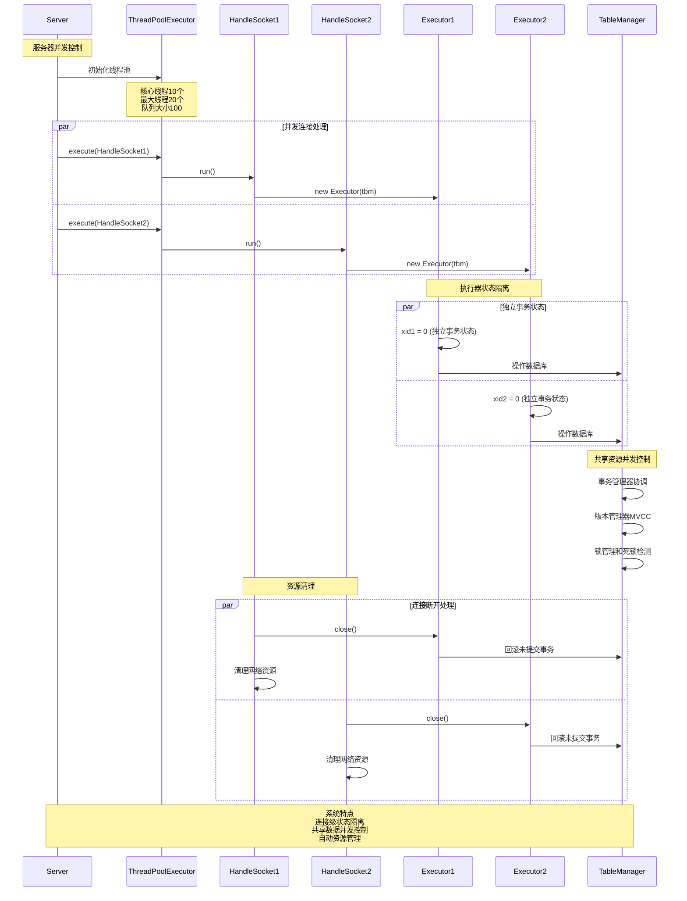
```mermaid
sequenceDiagram
    participant Server as Server
    participant TPE as ThreadPoolExecutor
    participant HS1 as HandleSocket1
    participant HS2 as HandleSocket2
    participant Exe1 as Executor1
    participant Exe2 as Executor2
    participant TBM as TableManager

    Note over Server: 服务器并发控制
    Server->>TPE: 初始化线程池
    Note over TPE: 核心线程10个<br/>最大线程20个<br/>队列大小100
    
    par 并发连接处理
        Server->>TPE: execute(HandleSocket1)
        TPE->>HS1: run()
        HS1->>Exe1: new Executor(tbm)
    and
        Server->>TPE: execute(HandleSocket2)
        TPE->>HS2: run()
        HS2->>Exe2: new Executor(tbm)
    end
    
    Note over Exe1,Exe2: 执行器状态隔离
    par 独立事务状态
        Exe1->>Exe1: xid1 = 0 (独立事务状态)
        Exe1->>TBM: 操作数据库
    and
        Exe2->>Exe2: xid2 = 0 (独立事务状态)
        Exe2->>TBM: 操作数据库
    end
    
    Note over TBM: 共享资源并发控制
    TBM->>TBM: 事务管理器协调
    TBM->>TBM: 版本管理器MVCC
    TBM->>TBM: 锁管理和死锁检测
    
    Note over HS1,HS2: 资源清理
    par 连接断开处理
        HS1->>Exe1: close()
        Exe1->>TBM: 回滚未提交事务
        HS1->>HS1: 清理网络资源
    and
        HS2->>Exe2: close()
        Exe2->>TBM: 回滚未提交事务
        HS2->>HS2: 清理网络资源
    end
    
    Note over Server,TBM: 系统特点<br/>连接级状态隔离<br/>共享数据并发控制<br/>自动资源管理
```

## 7. 总结

### 7.1 模块架构特点

服务与通信模块采用了经典的客户端/服务器架构，具有以下特点：

1. **分层设计明确**：应用层、包装层、编码层、传输层职责清晰
2. **协议简化**：采用基于十六进制的文本协议，易于调试和理解
3. **并发处理**：使用线程池处理多客户端连接，支持并发SQL执行
4. **异常透明**：服务器异常能够完整传递给客户端
5. **资源管理**：自动处理连接生命周期和资源清理

### 7.2 与其他模块的集成

服务与通信模块作为系统的网络层和应用层接口，与其他模块深度集成：

- **与表管理模块**：通过 [`TableManager`](src/main/java/top/guoziyang/mydb/backend/tbm/TableManager.java:1) 接口执行SQL操作
- **与查询处理模块**：通过 [`Parser`](src/main/java/top/guoziyang/mydb/backend/parser/Parser.java:1) 解析SQL语句
- **与事务管理模块**：在 [`Executor`](src/main/java/top/guoziyang/mydb/backend/server/Executor.java:45) 中管理事务状态
- **与版本管理模块**：通过事务ID协调MVCC操作

### 7.3 设计优势

1. **简化实现**：相比MySQL等复杂数据库，MYDB大幅简化了协议和连接管理
2. **易于扩展**：模块化设计便于后续添加新功能
3. **调试友好**：文本协议便于网络抓包和问题定位
4. **资源高效**：使用线程池和连接复用提高并发性能

### 7.4 改进空间

1. **协议优化**：可以考虑二进制协议提高传输效率
2. **连接池**：添加客户端连接池支持
3. **异步支持**：支持异步请求处理提高吞吐量
4. **安全机制**：添加认证和权限控制
5. **监控指标**：添加连接数、请求延迟等监控指标

通过本文档的详细时序图，我们可以清楚地理解MYDB服务与通信模块的工作原理，为系统的使用、维护和扩展提供了重要参考。