# MYDB 通用工具和错误处理模块时序图

## 模块概述

通用工具和错误处理模块是 MYDB 系统的基础设施层，为整个数据库系统提供核心的工具类和错误处理机制。这些组件虽然不直接处理业务逻辑，但却是系统稳定运行的重要保障。

### 核心组件职责

1. **抽象缓存框架 ([`AbstractCache`](../src/main/java/top/guoziyang/mydb/backend/common/AbstractCache.java))**
   - 提供基于引用计数的缓存管理
   - 支持多线程安全的资源获取和释放
   - 实现模板方法模式的缓存框架

2. **工具类库**
   - [`Parser`](../src/main/java/top/guoziyang/mydb/backend/utils/Parser.java): 数据类型转换工具
   - [`Types`](../src/main/java/top/guoziyang/mydb/backend/utils/Types.java): 地址编码工具
   - [`RandomUtil`](../src/main/java/top/guoziyang/mydb/backend/utils/RandomUtil.java): 安全随机数生成
   - [`SubArray`](../src/main/java/top/guoziyang/mydb/backend/common/SubArray.java): 数组分片工具

3. **错误处理机制**
   - [`Error`](../src/main/java/top/guoziyang/mydb/common/Error.java): 统一的错误定义体系
   - [`Panic`](../src/main/java/top/guoziyang/mydb/backend/utils/Panic.java): 致命错误处理

4. **系统启动器**
   - [`Launcher`](../src/main/java/top/guoziyang/mydb/backend/Launcher.java): 程序启动和初始化

### 基础设施重要性

在数据库系统中，基础设施组件的重要性往往被低估，但它们实际上：
- 为所有业务模块提供统一的服务
- 保证系统的稳定性和可靠性
- 提高开发效率和代码复用性
- 实现横切关注点的统一管理

### 与其他模块的支撑关系

- **数据管理模块**: 使用 AbstractCache 实现页面缓存和数据项缓存
- **事务管理模块**: 使用 Parser 进行数据序列化和反序列化
- **版本管理模块**: 使用 Types 进行地址编码和解码
- **表管理模块**: 使用各种工具类进行数据处理
- **索引管理模块**: 使用缓存框架管理 B+ 树节点
- **查询处理模块**: 使用 Parser 解析各种数据类型
- **服务通信模块**: 使用 Error 体系进行错误处理

## 1. 缓存框架时序图

### 1.1 AbstractCache 抽象缓存获取流程

```mermaid
sequenceDiagram
    participant Client as 客户端
    participant Cache as AbstractCache
    participant SubClass as 具体实现类
    participant Lock as ReentrantLock
    participant Getting as getting状态表
    participant CacheMap as cache缓存表
    participant RefMap as references引用表

    Note over Client,RefMap: 缓存资源获取的完整流程

    Client->>Cache: get(key)
    activate Cache
    
    loop 获取资源循环
        Cache->>Lock: lock()
        activate Lock
        
        Cache->>Getting: containsKey(key)
        alt 有其他线程正在获取
            Getting-->>Cache: true
            Cache->>Lock: unlock()
            deactivate Lock
            Cache->>Cache: Thread.sleep(1)
            Note over Cache: 等待其他线程完成加载
        else 检查缓存是否命中
            Getting-->>Cache: false
            Cache->>CacheMap: containsKey(key)
            alt 缓存命中
                CacheMap-->>Cache: 返回缓存对象
                Cache->>RefMap: 增加引用计数
                RefMap-->>Cache: 更新引用数
                Cache->>Lock: unlock()
                deactivate Lock
                Cache-->>Client: 返回缓存对象
                break
            else 缓存未命中
                Cache->>Cache: 检查容量限制
                alt 缓存已满
                    Cache->>Lock: unlock()
                    deactivate Lock
                    Cache-->>Client: 抛出 CacheFullException
                    break
                else 可以加载新资源
                    Cache->>Cache: count++
                    Cache->>Getting: put(key, true)
                    Cache->>Lock: unlock()
                    deactivate Lock
                    break
                end
            end
        end
    end
    
    Note over Cache,SubClass: 在锁外执行资源加载
    Cache->>SubClass: getForCache(key)
    activate SubClass
    SubClass-->>Cache: 返回新资源对象
    deactivate SubClass
    
    Cache->>Lock: lock()
    activate Lock
    Cache->>Getting: remove(key)
    Cache->>CacheMap: put(key, obj)
    Cache->>RefMap: put(key, 1)
    Cache->>Lock: unlock()
    deactivate Lock
    
    Cache-->>Client: 返回新加载的对象
    deactivate Cache
```

### 1.2 缓存资源释放流程

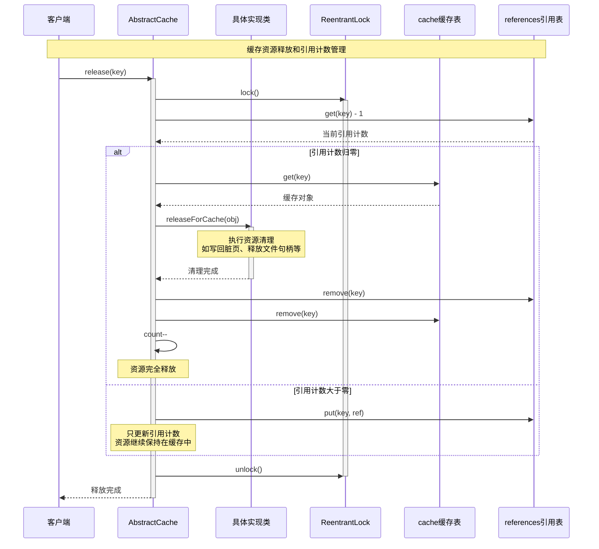
```mermaid
sequenceDiagram
    participant Client as 客户端
    participant Cache as AbstractCache
    participant SubClass as 具体实现类
    participant Lock as ReentrantLock
    participant CacheMap as cache缓存表
    participant RefMap as references引用表

    Note over Client,RefMap: 缓存资源释放和引用计数管理

    Client->>Cache: release(key)
    activate Cache
    
    Cache->>Lock: lock()
    activate Lock
    
    Cache->>RefMap: get(key) - 1
    RefMap-->>Cache: 当前引用计数
    
    alt 引用计数归零
        Cache->>CacheMap: get(key)
        CacheMap-->>Cache: 缓存对象
        
        Cache->>SubClass: releaseForCache(obj)
        activate SubClass
        Note over SubClass: 执行资源清理<br/>如写回脏页、释放文件句柄等
        SubClass-->>Cache: 清理完成
        deactivate SubClass
        
        Cache->>RefMap: remove(key)
        Cache->>CacheMap: remove(key)
        Cache->>Cache: count--
        
        Note over Cache: 资源完全释放
    else 引用计数大于零
        Cache->>RefMap: put(key, ref)
        Note over Cache: 只更新引用计数<br/>资源继续保持在缓存中
    end
    
    Cache->>Lock: unlock()
    deactivate Lock
    
    Cache-->>Client: 释放完成
    deactivate Cache
```

### 1.3 缓存关闭和批量释放流程

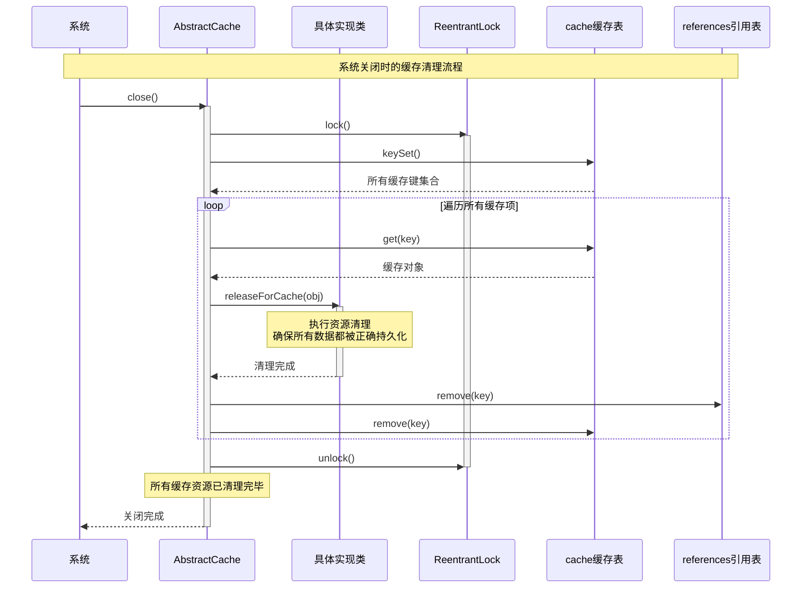
```mermaid
sequenceDiagram
    participant System as 系统
    participant Cache as AbstractCache
    participant SubClass as 具体实现类
    participant Lock as ReentrantLock
    participant CacheMap as cache缓存表
    participant RefMap as references引用表

    Note over System,RefMap: 系统关闭时的缓存清理流程

    System->>Cache: close()
    activate Cache
    
    Cache->>Lock: lock()
    activate Lock
    
    Cache->>CacheMap: keySet()
    CacheMap-->>Cache: 所有缓存键集合
    
    loop 遍历所有缓存项
        Cache->>CacheMap: get(key)
        CacheMap-->>Cache: 缓存对象
        
        Cache->>SubClass: releaseForCache(obj)
        activate SubClass
        Note over SubClass: 执行资源清理<br/>确保所有数据都被正确持久化
        SubClass-->>Cache: 清理完成
        deactivate SubClass
        
        Cache->>RefMap: remove(key)
        Cache->>CacheMap: remove(key)
    end
    
    Cache->>Lock: unlock()
    deactivate Lock
    
    Note over Cache: 所有缓存资源已清理完毕
    Cache-->>System: 关闭完成
    deactivate Cache
```

## 2. 工具类时序图

### 2.1 Parser 数据类型转换流程

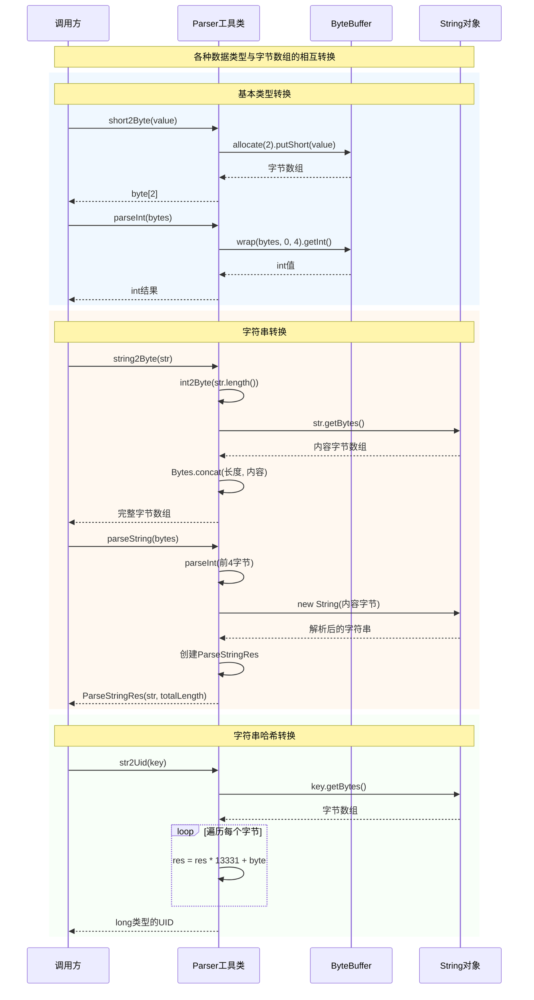
```mermaid
sequenceDiagram
    participant Client as 调用方
    participant Parser as Parser工具类
    participant ByteBuffer as ByteBuffer
    participant String as String对象

    Note over Client,String: 各种数据类型与字节数组的相互转换

    rect rgb(240, 248, 255)
        Note over Client,String: 基本类型转换
        Client->>Parser: short2Byte(value)
        Parser->>ByteBuffer: allocate(2).putShort(value)
        ByteBuffer-->>Parser: 字节数组
        Parser-->>Client: byte[2]
        
        Client->>Parser: parseInt(bytes)
        Parser->>ByteBuffer: wrap(bytes, 0, 4).getInt()
        ByteBuffer-->>Parser: int值
        Parser-->>Client: int结果
    end
    
    rect rgb(255, 248, 240)
        Note over Client,String: 字符串转换
        Client->>Parser: string2Byte(str)
        Parser->>Parser: int2Byte(str.length())
        Parser->>String: str.getBytes()
        String-->>Parser: 内容字节数组
        Parser->>Parser: Bytes.concat(长度, 内容)
        Parser-->>Client: 完整字节数组
        
        Client->>Parser: parseString(bytes)
        Parser->>Parser: parseInt(前4字节)
        Parser->>String: new String(内容字节)
        String-->>Parser: 解析后的字符串
        Parser->>Parser: 创建ParseStringRes
        Parser-->>Client: ParseStringRes(str, totalLength)
    end
    
    rect rgb(248, 255, 248)
        Note over Client,String: 字符串哈希转换
        Client->>Parser: str2Uid(key)
        Parser->>String: key.getBytes()
        String-->>Parser: 字节数组
        loop 遍历每个字节
            Parser->>Parser: res = res * 13331 + byte
        end
        Parser-->>Client: long类型的UID
    end
```

### 2.2 Types 地址编码解码流程

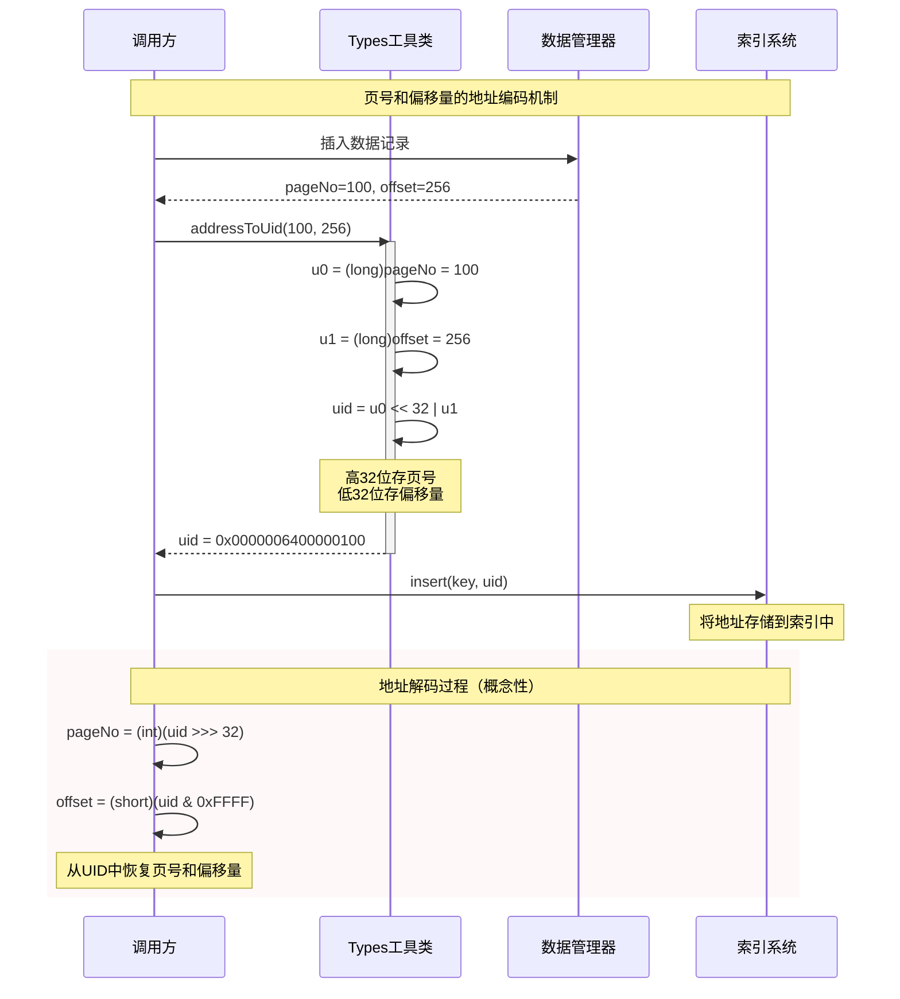
```mermaid
sequenceDiagram
    participant Client as 调用方
    participant Types as Types工具类
    participant DataManager as 数据管理器
    participant Index as 索引系统

    Note over Client,Index: 页号和偏移量的地址编码机制

    Client->>DataManager: 插入数据记录
    DataManager-->>Client: pageNo=100, offset=256
    
    Client->>Types: addressToUid(100, 256)
    activate Types
    Types->>Types: u0 = (long)pageNo = 100
    Types->>Types: u1 = (long)offset = 256  
    Types->>Types: uid = u0 << 32 | u1
    Note over Types: 高32位存页号<br/>低32位存偏移量
    Types-->>Client: uid = 0x0000006400000100
    deactivate Types
    
    Client->>Index: insert(key, uid)
    Note over Index: 将地址存储到索引中
    
    rect rgb(255, 248, 248)
        Note over Client,Index: 地址解码过程（概念性）
        Client->>Client: pageNo = (int)(uid >>> 32)
        Client->>Client: offset = (short)(uid & 0xFFFF)
        Note over Client: 从UID中恢复页号和偏移量
    end
```

### 2.3 RandomUtil 随机数生成流程

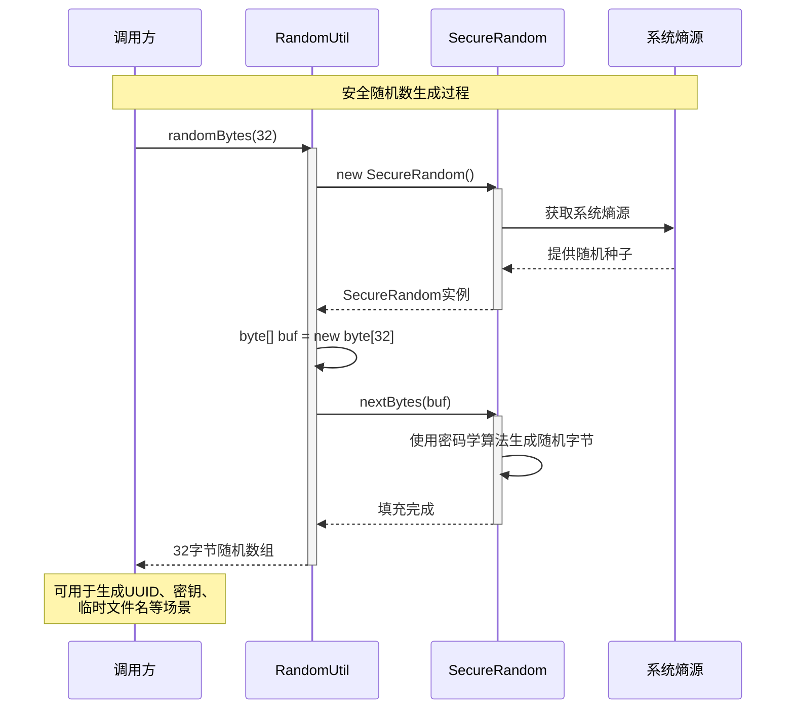
```mermaid
sequenceDiagram
    participant Client as 调用方
    participant RandomUtil as RandomUtil
    participant SecureRandom as SecureRandom
    participant System as 系统熵源

    Note over Client,System: 安全随机数生成过程

    Client->>RandomUtil: randomBytes(32)
    activate RandomUtil
    
    RandomUtil->>SecureRandom: new SecureRandom()
    activate SecureRandom
    SecureRandom->>System: 获取系统熵源
    System-->>SecureRandom: 提供随机种子
    SecureRandom-->>RandomUtil: SecureRandom实例
    deactivate SecureRandom
    
    RandomUtil->>RandomUtil: byte[] buf = new byte[32]
    RandomUtil->>SecureRandom: nextBytes(buf)
    activate SecureRandom
    SecureRandom->>SecureRandom: 使用密码学算法生成随机字节
    SecureRandom-->>RandomUtil: 填充完成
    deactivate SecureRandom
    
    RandomUtil-->>Client: 32字节随机数组
    deactivate RandomUtil
    
    Note over Client: 可用于生成UUID、密钥、<br/>临时文件名等场景
```

### 2.4 SubArray 数组分片操作流程

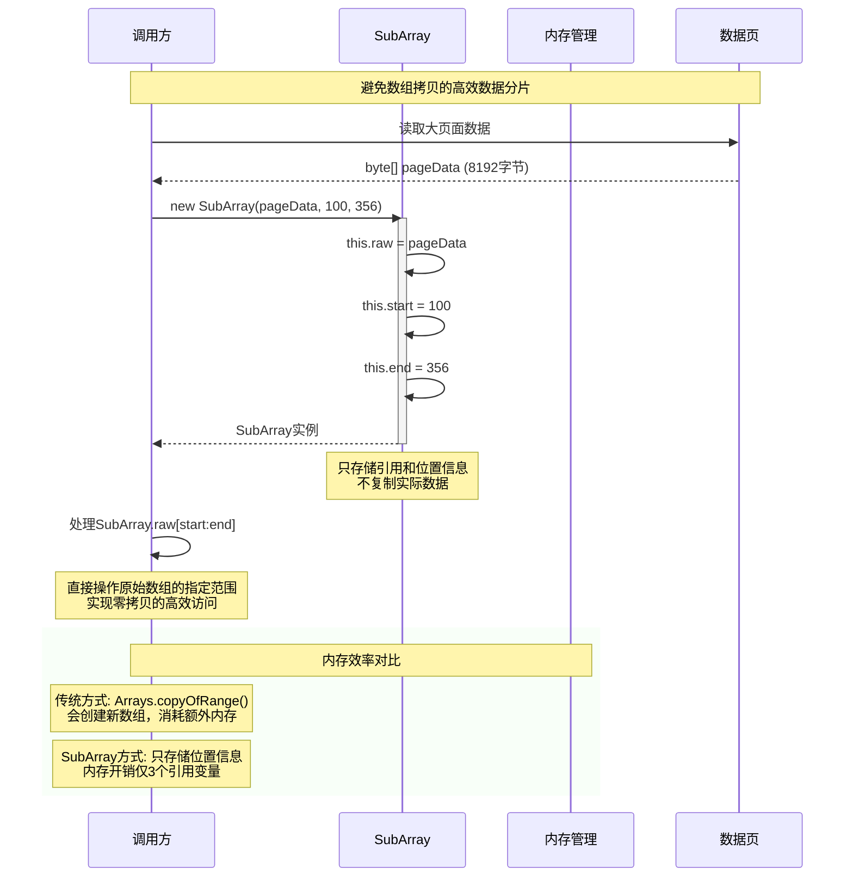
```mermaid
sequenceDiagram
    participant Client as 调用方
    participant SubArray as SubArray
    participant Memory as 内存管理
    participant DataPage as 数据页

    Note over Client,DataPage: 避免数组拷贝的高效数据分片

    Client->>DataPage: 读取大页面数据
    DataPage-->>Client: byte[] pageData (8192字节)
    
    Client->>SubArray: new SubArray(pageData, 100, 356)
    activate SubArray
    SubArray->>SubArray: this.raw = pageData
    SubArray->>SubArray: this.start = 100
    SubArray->>SubArray: this.end = 356
    SubArray-->>Client: SubArray实例
    deactivate SubArray
    
    Note over SubArray: 只存储引用和位置信息<br/>不复制实际数据
    
    Client->>Client: 处理SubArray.raw[start:end]
    Note over Client: 直接操作原始数组的指定范围<br/>实现零拷贝的高效访问
    
    rect rgb(248, 255, 248)
        Note over Client,Memory: 内存效率对比
        Note over Client: 传统方式: Arrays.copyOfRange()<br/>会创建新数组，消耗额外内存
        Note over Client: SubArray方式: 只存储位置信息<br/>内存开销仅3个引用变量
    end
```

## 3. 错误处理时序图

### 3.1 Error 错误分类和处理流程

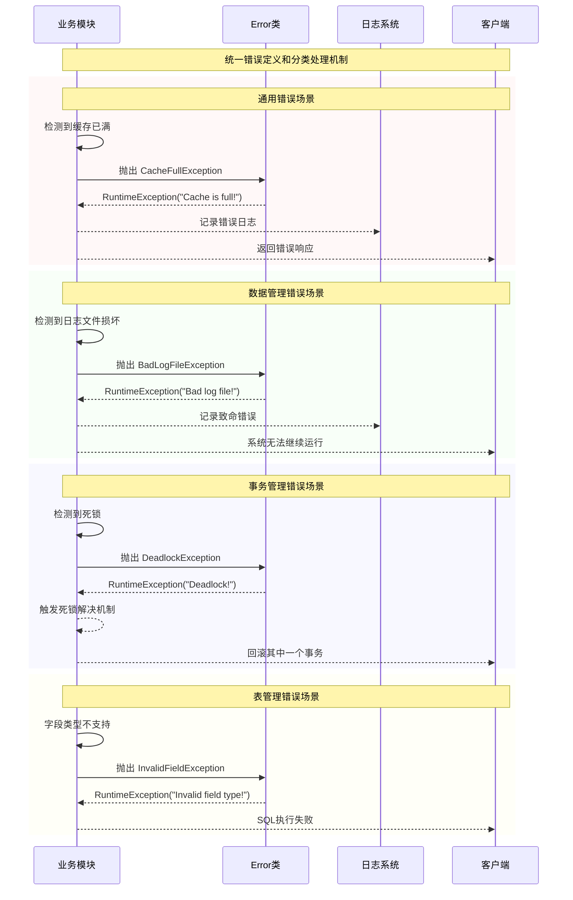
```mermaid
sequenceDiagram
    participant Module as 业务模块
    participant Error as Error类
    participant Logger as 日志系统
    participant Client as 客户端

    Note over Module,Client: 统一错误定义和分类处理机制

    rect rgb(255, 248, 248)
        Note over Module,Client: 通用错误场景
        Module->>Module: 检测到缓存已满
        Module->>Error: 抛出 CacheFullException
        Error-->>Module: RuntimeException("Cache is full!")
        Module-->>Logger: 记录错误日志
        Module-->>Client: 返回错误响应
    end
    
    rect rgb(248, 255, 248)
        Note over Module,Client: 数据管理错误场景
        Module->>Module: 检测到日志文件损坏
        Module->>Error: 抛出 BadLogFileException
        Error-->>Module: RuntimeException("Bad log file!")
        Module-->>Logger: 记录致命错误
        Module-->>Client: 系统无法继续运行
    end
    
    rect rgb(248, 248, 255)
        Note over Module,Client: 事务管理错误场景
        Module->>Module: 检测到死锁
        Module->>Error: 抛出 DeadlockException
        Error-->>Module: RuntimeException("Deadlock!")
        Module-->>Module: 触发死锁解决机制
        Module-->>Client: 回滚其中一个事务
    end
    
    rect rgb(255, 255, 248)
        Note over Module,Client: 表管理错误场景
        Module->>Module: 字段类型不支持
        Module->>Error: 抛出 InvalidFieldException
        Error-->>Module: RuntimeException("Invalid field type!")
        Module-->>Client: SQL执行失败
    end
```

### 3.2 Panic 致命错误处理流程

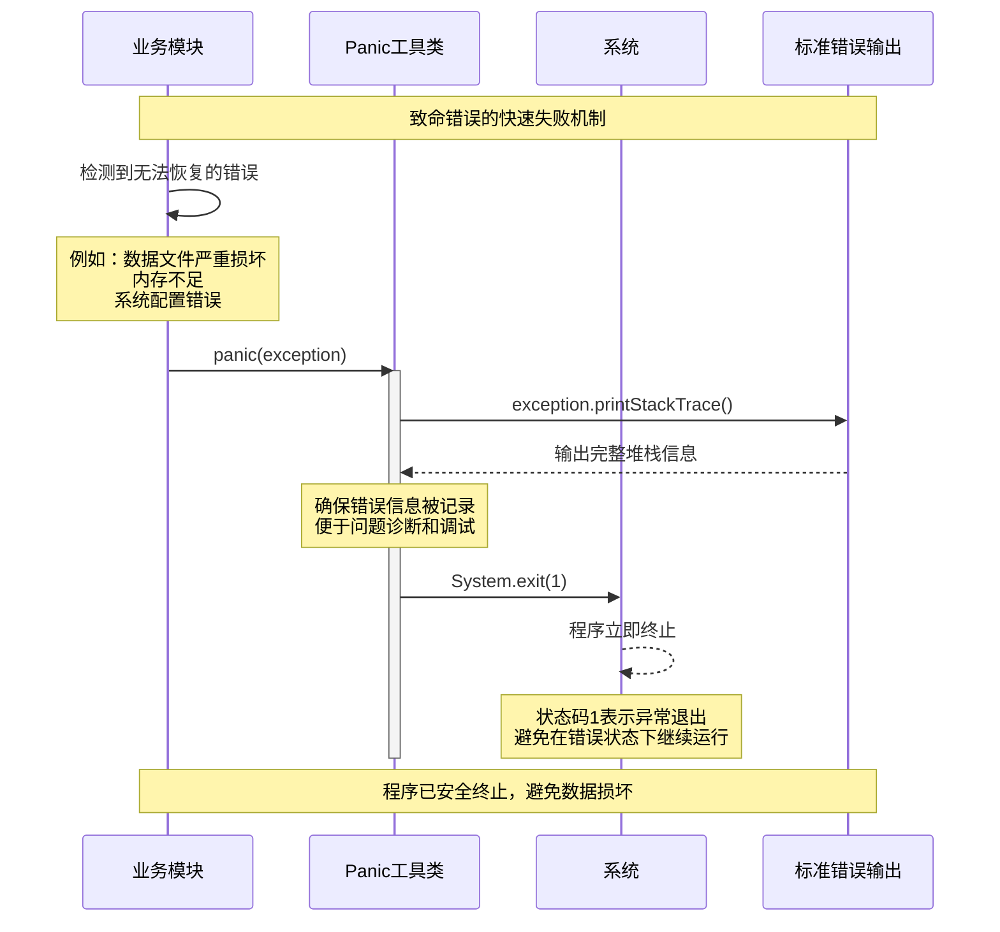
```mermaid
sequenceDiagram
    participant Module as 业务模块
    participant Panic as Panic工具类
    participant System as 系统
    participant stderr as 标准错误输出

    Note over Module,stderr: 致命错误的快速失败机制

    Module->>Module: 检测到无法恢复的错误
    Note over Module: 例如：数据文件严重损坏<br/>内存不足<br/>系统配置错误

    Module->>Panic: panic(exception)
    activate Panic
    
    Panic->>stderr: exception.printStackTrace()
    stderr-->>Panic: 输出完整堆栈信息
    
    Note over Panic: 确保错误信息被记录<br/>便于问题诊断和调试
    
    Panic->>System: System.exit(1)
    System-->>System: 程序立即终止
    
    Note over System: 状态码1表示异常退出<br/>避免在错误状态下继续运行
    
    deactivate Panic
    
    Note over Module,stderr: 程序已安全终止，避免数据损坏
```

### 3.3 错误传播和处理策略

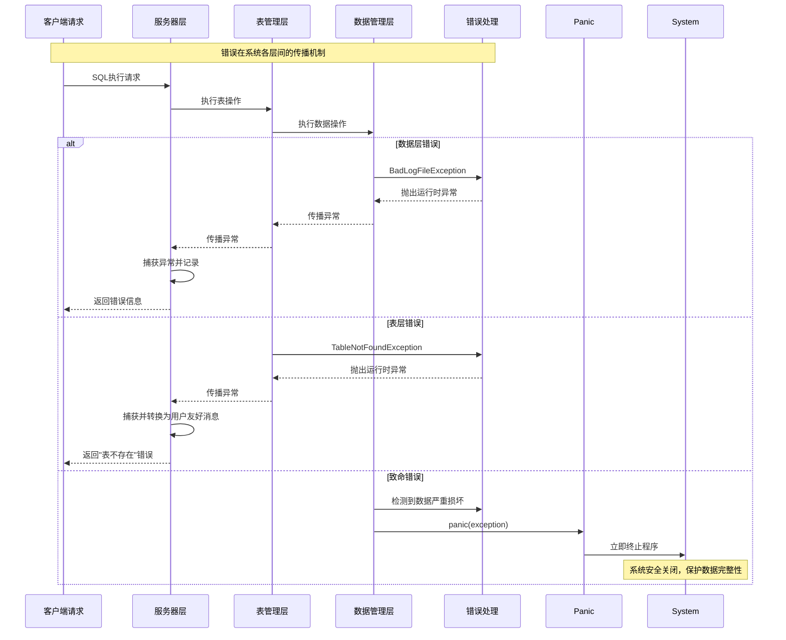
```mermaid
sequenceDiagram
    participant Client as 客户端请求
    participant Server as 服务器层
    participant TableMgr as 表管理层
    participant DataMgr as 数据管理层
    participant Error as 错误处理

    Note over Client,Error: 错误在系统各层间的传播机制

    Client->>Server: SQL执行请求
    Server->>TableMgr: 执行表操作
    TableMgr->>DataMgr: 执行数据操作
    
    alt 数据层错误
        DataMgr->>Error: BadLogFileException
        Error-->>DataMgr: 抛出运行时异常
        DataMgr-->>TableMgr: 传播异常
        TableMgr-->>Server: 传播异常
        Server->>Server: 捕获异常并记录
        Server-->>Client: 返回错误信息
    else 表层错误
        TableMgr->>Error: TableNotFoundException
        Error-->>TableMgr: 抛出运行时异常
        TableMgr-->>Server: 传播异常
        Server->>Server: 捕获并转换为用户友好消息
        Server-->>Client: 返回"表不存在"错误
    else 致命错误
        DataMgr->>Error: 检测到数据严重损坏
        DataMgr->>Panic: panic(exception)
        Panic->>System: 立即终止程序
        Note over System: 系统安全关闭，保护数据完整性
    end
```

## 4. 启动器时序图

### 4.1 Launcher 命令行解析和初始化流程

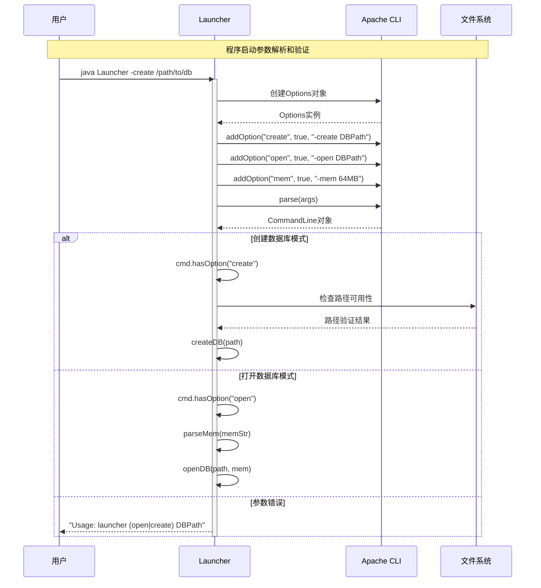
```mermaid
sequenceDiagram
    participant User as 用户
    participant Launcher as Launcher
    participant CommandParser as Apache CLI
    participant FileSystem as 文件系统

    Note over User,FileSystem: 程序启动参数解析和验证

    User->>Launcher: java Launcher -create /path/to/db
    activate Launcher
    
    Launcher->>CommandParser: 创建Options对象
    CommandParser-->>Launcher: Options实例
    
    Launcher->>CommandParser: addOption("create", true, "-create DBPath")
    Launcher->>CommandParser: addOption("open", true, "-open DBPath")  
    Launcher->>CommandParser: addOption("mem", true, "-mem 64MB")
    
    Launcher->>CommandParser: parse(args)
    CommandParser-->>Launcher: CommandLine对象
    
    alt 创建数据库模式
        Launcher->>Launcher: cmd.hasOption("create")
        Launcher->>FileSystem: 检查路径可用性
        FileSystem-->>Launcher: 路径验证结果
        Launcher->>Launcher: createDB(path)
    else 打开数据库模式
        Launcher->>Launcher: cmd.hasOption("open")
        Launcher->>Launcher: parseMem(memStr)
        Launcher->>Launcher: openDB(path, mem)
    else 参数错误
        Launcher-->>User: "Usage: launcher (open|create) DBPath"
    end
    
    deactivate Launcher
```

### 4.2 创建数据库流程

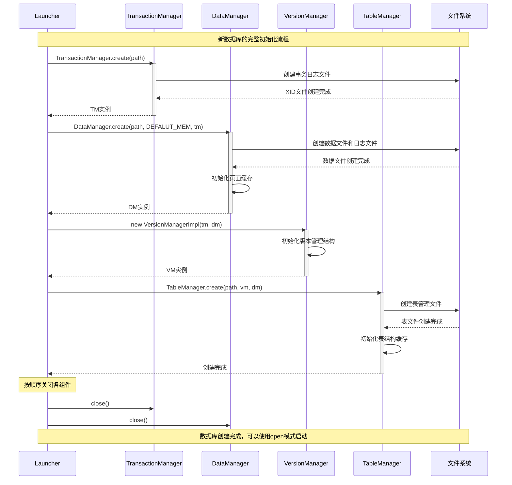
```mermaid
sequenceDiagram
    participant Launcher as Launcher
    participant TM as TransactionManager
    participant DM as DataManager  
    participant VM as VersionManager
    participant TBM as TableManager
    participant FileSystem as 文件系统

    Note over Launcher,FileSystem: 新数据库的完整初始化流程

    Launcher->>TM: TransactionManager.create(path)
    activate TM
    TM->>FileSystem: 创建事务日志文件
    FileSystem-->>TM: XID文件创建完成
    TM-->>Launcher: TM实例
    deactivate TM
    
    Launcher->>DM: DataManager.create(path, DEFALUT_MEM, tm)
    activate DM
    DM->>FileSystem: 创建数据文件和日志文件
    FileSystem-->>DM: 数据文件创建完成
    DM->>DM: 初始化页面缓存
    DM-->>Launcher: DM实例
    deactivate DM
    
    Launcher->>VM: new VersionManagerImpl(tm, dm)
    activate VM
    VM->>VM: 初始化版本管理结构
    VM-->>Launcher: VM实例
    deactivate VM
    
    Launcher->>TBM: TableManager.create(path, vm, dm)
    activate TBM
    TBM->>FileSystem: 创建表管理文件
    FileSystem-->>TBM: 表文件创建完成
    TBM->>TBM: 初始化表结构缓存
    TBM-->>Launcher: 创建完成
    deactivate TBM
    
    Note over Launcher: 按顺序关闭各组件
    Launcher->>TM: close()
    Launcher->>DM: close()
    
    Note over Launcher,FileSystem: 数据库创建完成，可以使用open模式启动
```

### 4.3 打开数据库和启动服务流程

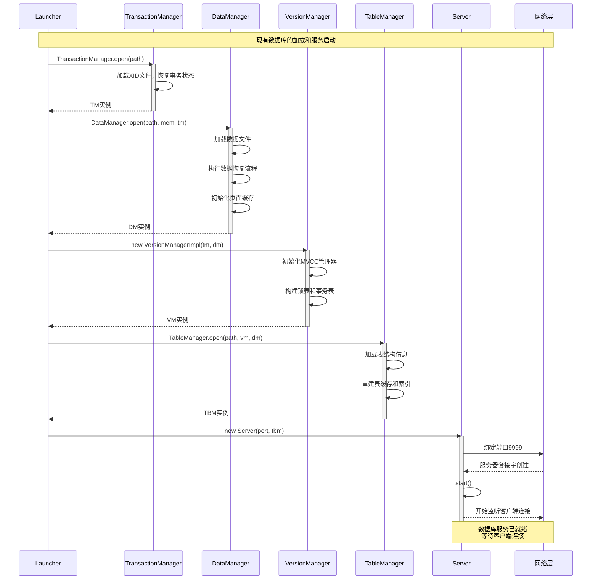
```mermaid
sequenceDiagram
    participant Launcher as Launcher
    participant TM as TransactionManager
    participant DM as DataManager
    participant VM as VersionManager
    participant TBM as TableManager
    participant Server as Server
    participant Network as 网络层

    Note over Launcher,Network: 现有数据库的加载和服务启动

    Launcher->>TM: TransactionManager.open(path)
    activate TM
    TM->>TM: 加载XID文件，恢复事务状态
    TM-->>Launcher: TM实例
    deactivate TM
    
    Launcher->>DM: DataManager.open(path, mem, tm)
    activate DM
    DM->>DM: 加载数据文件
    DM->>DM: 执行数据恢复流程
    DM->>DM: 初始化页面缓存
    DM-->>Launcher: DM实例
    deactivate DM
    
    Launcher->>VM: new VersionManagerImpl(tm, dm)
    activate VM
    VM->>VM: 初始化MVCC管理器
    VM->>VM: 构建锁表和事务表
    VM-->>Launcher: VM实例
    deactivate VM
    
    Launcher->>TBM: TableManager.open(path, vm, dm)
    activate TBM
    TBM->>TBM: 加载表结构信息
    TBM->>TBM: 重建表缓存和索引
    TBM-->>Launcher: TBM实例
    deactivate TBM
    
    Launcher->>Server: new Server(port, tbm)
    activate Server
    Server->>Network: 绑定端口9999
    Network-->>Server: 服务器套接字创建
    Server->>Server: start()
    Server-->>Network: 开始监听客户端连接
    
    Note over Server,Network: 数据库服务已就绪<br/>等待客户端连接
    deactivate Server
```

### 4.4 内存配置解析流程

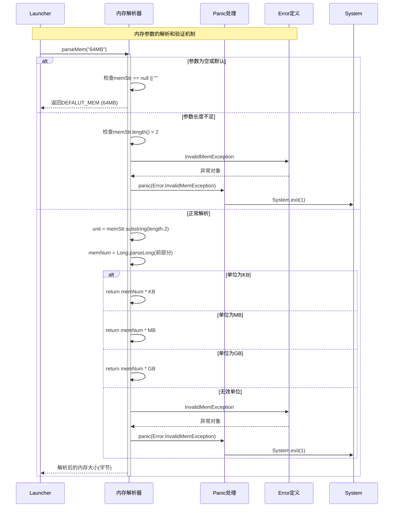
```mermaid
sequenceDiagram
    participant Launcher as Launcher
    participant Parser as 内存解析器
    participant Panic as Panic处理
    participant Error as Error定义

    Note over Launcher,Error: 内存参数的解析和验证机制

    Launcher->>Parser: parseMem("64MB")
    activate Parser
    
    alt 参数为空或默认
        Parser->>Parser: 检查memStr == null || ""
        Parser-->>Launcher: 返回DEFALUT_MEM (64MB)
    else 参数长度不足
        Parser->>Parser: 检查memStr.length() < 2
        Parser->>Error: InvalidMemException
        Error-->>Parser: 异常对象
        Parser->>Panic: panic(Error.InvalidMemException)
        Panic->>System: System.exit(1)
    else 正常解析
        Parser->>Parser: unit = memStr.substring(length-2)
        Parser->>Parser: memNum = Long.parseLong(前部分)
        
        alt 单位为KB
            Parser->>Parser: return memNum * KB
        else 单位为MB  
            Parser->>Parser: return memNum * MB
        else 单位为GB
            Parser->>Parser: return memNum * GB
        else 无效单位
            Parser->>Error: InvalidMemException
            Error-->>Parser: 异常对象
            Parser->>Panic: panic(Error.InvalidMemException)
            Panic->>System: System.exit(1)
        end
        
        Parser-->>Launcher: 解析后的内存大小(字节)
    end
    
    deactivate Parser
```

## 5. 组件交互图

### 5.1 工具类与业务模块的协作关系

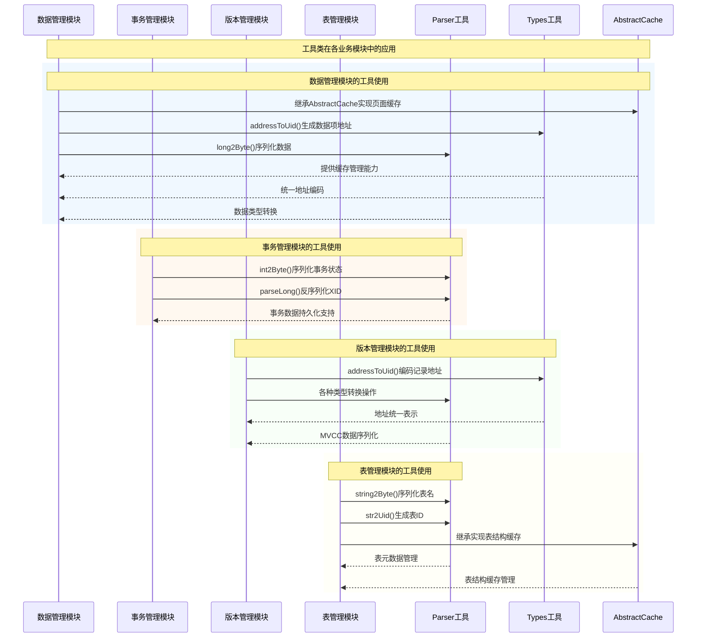
```mermaid
sequenceDiagram
    participant DM as 数据管理模块
    participant TM as 事务管理模块
    participant VM as 版本管理模块
    participant TBM as 表管理模块
    participant Parser as Parser工具
    participant Types as Types工具
    participant Cache as AbstractCache

    Note over DM,Cache: 工具类在各业务模块中的应用

    rect rgb(240, 248, 255)
        Note over DM,Cache: 数据管理模块的工具使用
        DM->>Cache: 继承AbstractCache实现页面缓存
        DM->>Types: addressToUid()生成数据项地址
        DM->>Parser: long2Byte()序列化数据
        Cache-->>DM: 提供缓存管理能力
        Types-->>DM: 统一地址编码
        Parser-->>DM: 数据类型转换
    end
    
    rect rgb(255, 248, 240)
        Note over TM,Parser: 事务管理模块的工具使用
        TM->>Parser: int2Byte()序列化事务状态
        TM->>Parser: parseLong()反序列化XID
        Parser-->>TM: 事务数据持久化支持
    end
    
    rect rgb(248, 255, 248)
        Note over VM,Types: 版本管理模块的工具使用
        VM->>Types: addressToUid()编码记录地址
        VM->>Parser: 各种类型转换操作
        Types-->>VM: 地址统一表示
        Parser-->>VM: MVCC数据序列化
    end
    
    rect rgb(255, 255, 248)
        Note over TBM,Parser: 表管理模块的工具使用
        TBM->>Parser: string2Byte()序列化表名
        TBM->>Parser: str2Uid()生成表ID
        TBM->>Cache: 继承实现表结构缓存
        Parser-->>TBM: 表元数据管理
        Cache-->>TBM: 表结构缓存管理
    end
```

### 5.2 缓存框架在各模块中的应用

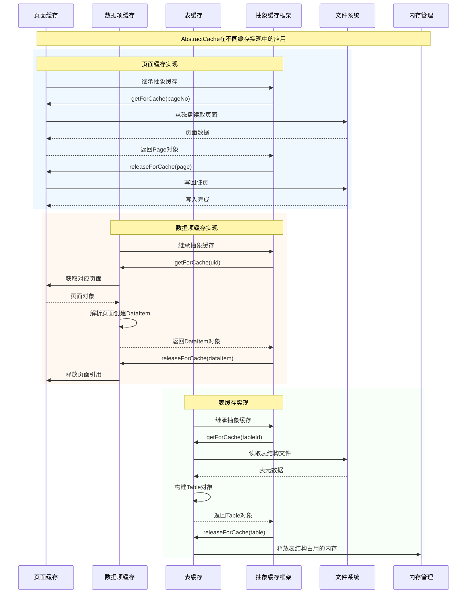
```mermaid
sequenceDiagram
    participant PageCache as 页面缓存
    participant DataItemCache as 数据项缓存
    participant TableCache as 表缓存
    participant AbstractCache as 抽象缓存框架
    participant FileSystem as 文件系统
    participant Memory as 内存管理

    Note over PageCache,Memory: AbstractCache在不同缓存实现中的应用

    rect rgb(240, 248, 255)
        Note over PageCache,AbstractCache: 页面缓存实现
        PageCache->>AbstractCache: 继承抽象缓存
        AbstractCache->>PageCache: getForCache(pageNo)
        PageCache->>FileSystem: 从磁盘读取页面
        FileSystem-->>PageCache: 页面数据
        PageCache-->>AbstractCache: 返回Page对象
        
        AbstractCache->>PageCache: releaseForCache(page)
        PageCache->>FileSystem: 写回脏页
        FileSystem-->>PageCache: 写入完成
    end
    
    rect rgb(255, 248, 240)
        Note over DataItemCache,AbstractCache: 数据项缓存实现
        DataItemCache->>AbstractCache: 继承抽象缓存
        AbstractCache->>DataItemCache: getForCache(uid)
        DataItemCache->>PageCache: 获取对应页面
        PageCache-->>DataItemCache: 页面对象
        DataItemCache->>DataItemCache: 解析页面创建DataItem
        DataItemCache-->>AbstractCache: 返回DataItem对象
        
        AbstractCache->>DataItemCache: releaseForCache(dataItem)
        DataItemCache->>PageCache: 释放页面引用
    end
    
    rect rgb(248, 255, 248)
        Note over TableCache,AbstractCache: 表缓存实现
        TableCache->>AbstractCache: 继承抽象缓存
        AbstractCache->>TableCache: getForCache(tableId)
        TableCache->>FileSystem: 读取表结构文件
        FileSystem-->>TableCache: 表元数据
        TableCache->>TableCache: 构建Table对象
        TableCache-->>AbstractCache: 返回Table对象
        
        AbstractCache->>TableCache: releaseForCache(table)
        TableCache->>Memory: 释放表结构占用的内存
    end
```

### 5.3 错误处理机制的全局覆盖

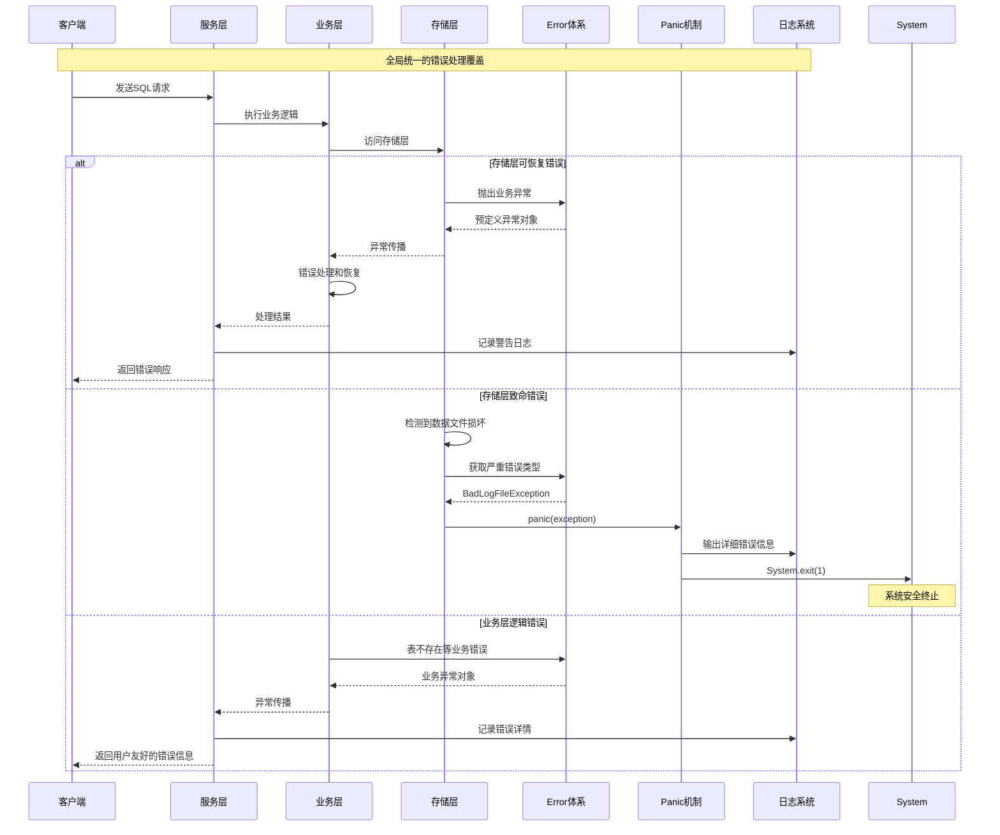
```mermaid
sequenceDiagram
    participant Client as 客户端
    participant Server as 服务层
    participant Business as 业务层
    participant Storage as 存储层
    participant Error as Error体系
    participant Panic as Panic机制
    participant Logger as 日志系统

    Note over Client,Logger: 全局统一的错误处理覆盖

    Client->>Server: 发送SQL请求
    Server->>Business: 执行业务逻辑
    Business->>Storage: 访问存储层
    
    alt 存储层可恢复错误
        Storage->>Error: 抛出业务异常
        Error-->>Storage: 预定义异常对象
        Storage-->>Business: 异常传播
        Business->>Business: 错误处理和恢复
        Business-->>Server: 处理结果
        Server->>Logger: 记录警告日志
        Server-->>Client: 返回错误响应
    else 存储层致命错误
        Storage->>Storage: 检测到数据文件损坏
        Storage->>Error: 获取严重错误类型
        Error-->>Storage: BadLogFileException
        Storage->>Panic: panic(exception)
        Panic->>Logger: 输出详细错误信息
        Panic->>System: System.exit(1)
        Note over System: 系统安全终止
    else 业务层逻辑错误
        Business->>Error: 表不存在等业务错误
        Error-->>Business: 业务异常对象
        Business-->>Server: 异常传播
        Server->>Logger: 记录错误详情
        Server-->>Client: 返回用户友好的错误信息
    end
```

### 5.4 启动流程与模块初始化的协调

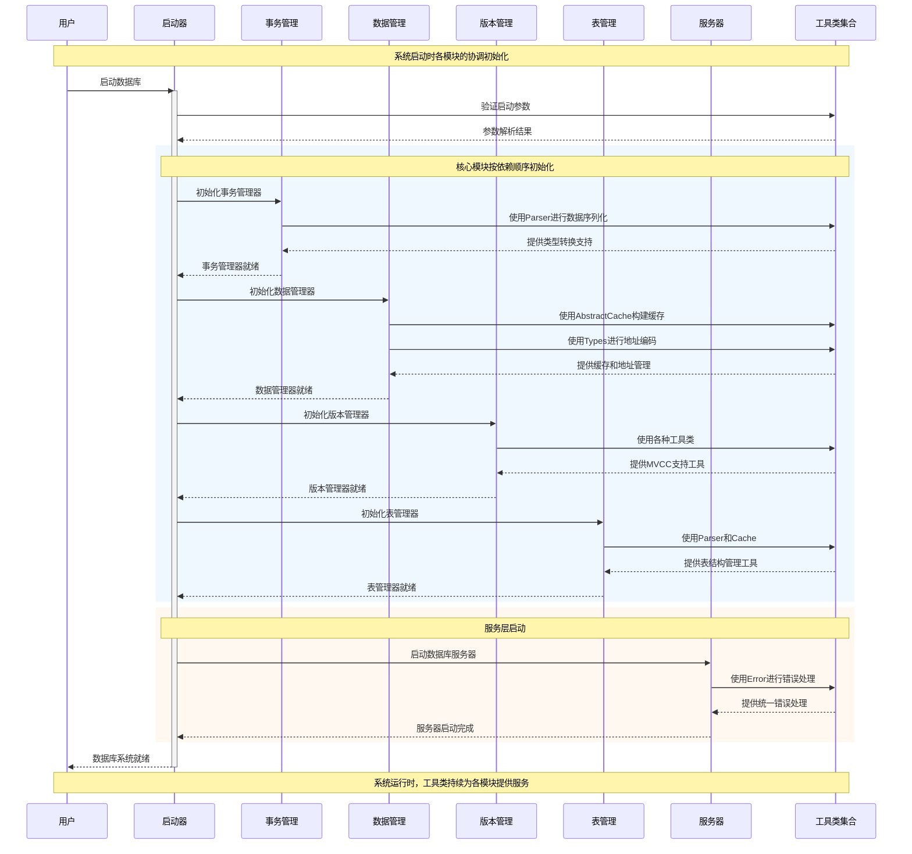
```mermaid
sequenceDiagram
    participant User as 用户
    participant Launcher as 启动器
    participant TM as 事务管理
    participant DM as 数据管理
    participant VM as 版本管理
    participant TBM as 表管理
    participant Server as 服务器
    participant Utils as 工具类集合

    Note over User,Utils: 系统启动时各模块的协调初始化

    User->>Launcher: 启动数据库
    activate Launcher
    
    Launcher->>Utils: 验证启动参数
    Utils-->>Launcher: 参数解析结果
    
    rect rgb(240, 248, 255)
        Note over Launcher,Utils: 核心模块按依赖顺序初始化
        Launcher->>TM: 初始化事务管理器
        TM->>Utils: 使用Parser进行数据序列化
        Utils-->>TM: 提供类型转换支持
        TM-->>Launcher: 事务管理器就绪
        
        Launcher->>DM: 初始化数据管理器
        DM->>Utils: 使用AbstractCache构建缓存
        DM->>Utils: 使用Types进行地址编码
        Utils-->>DM: 提供缓存和地址管理
        DM-->>Launcher: 数据管理器就绪
        
        Launcher->>VM: 初始化版本管理器
        VM->>Utils: 使用各种工具类
        Utils-->>VM: 提供MVCC支持工具
        VM-->>Launcher: 版本管理器就绪
        
        Launcher->>TBM: 初始化表管理器
        TBM->>Utils: 使用Parser和Cache
        Utils-->>TBM: 提供表结构管理工具
        TBM-->>Launcher: 表管理器就绪
    end
    
    rect rgb(255, 248, 240)
        Note over Launcher,Utils: 服务层启动
        Launcher->>Server: 启动数据库服务器
        Server->>Utils: 使用Error进行错误处理
        Utils-->>Server: 提供统一错误处理
        Server-->>Launcher: 服务器启动完成
    end
    
    Launcher-->>User: 数据库系统就绪
    deactivate Launcher
    
    Note over User,Utils: 系统运行时，工具类持续为各模块提供服务
```

## 6. 设计模式和最佳实践

### 6.1 模板方法模式在缓存框架中的应用

[`AbstractCache`](../src/main/java/top/guoziyang/mydb/backend/common/AbstractCache.java) 使用模板方法模式，定义了缓存操作的基本框架：

- **模板方法**: `get()` 和 `release()` 定义了获取和释放资源的标准流程
- **抽象方法**: `getForCache()` 和 `releaseForCache()` 由子类实现具体的加载和清理逻辑
- **优势**: 统一了缓存管理策略，保证了线程安全和引用计数的正确性

### 6.2 工具类的静态方法设计

所有工具类（[`Parser`](../src/main/java/top/guoziyang/mydb/backend/utils/Parser.java)、[`Types`](../src/main/java/top/guoziyang/mydb/backend/utils/Types.java)、[`RandomUtil`](../src/main/java/top/guoziyang/mydb/backend/utils/RandomUtil.java)、[`Panic`](../src/main/java/top/guoziyang/mydb/backend/utils/Panic.java)）都采用静态方法设计：

- **无状态设计**: 工具方法不依赖实例状态，保证线程安全
- **便于使用**: 可以直接类名调用，无需创建实例
- **性能优化**: 避免了对象创建的开销

### 6.3 错误处理的统一化设计

[`Error`](../src/main/java/top/guoziyang/mydb/common/Error.java) 类采用预定义异常对象的设计：

- **统一管理**: 所有错误都在一个类中定义，便于维护
- **分类明确**: 按模块组织异常，便于定位问题
- **性能优化**: 避免频繁创建异常对象

### 6.4 启动器的命令行设计

[`Launcher`](../src/main/java/top/guoziyang/mydb/backend/Launcher.java) 使用 Apache CLI 库进行命令行解析：

- **标准化**: 使用成熟的命令行解析库
- **扩展性**: 易于添加新的命令行选项
- **用户友好**: 提供清晰的使用说明

## 总结

通用工具和错误处理模块虽然不是 MYDB 的核心业务模块，但却是整个系统稳定运行的重要基础。这些组件体现了以下重要的设计原则：

1. **基础设施优先**: 为上层业务提供稳定可靠的基础服务
2. **统一标准**: 通过工具类统一数据处理和错误处理标准
3. **性能优化**: 通过缓存框架和零拷贝设计提高系统性能
4. **可维护性**: 通过模板方法和预定义异常提高代码可维护性

至此，MYDB 项目的八个核心模块时序图文档已全部完成：

1. [数据管理模块时序图](./01-数据管理模块时序图.md) - 页面缓存、数据项、WAL日志机制
2. [事务管理模块时序图](./02-事务管理模块时序图.md) - 事务生命周期、XID管理、ACID特性  
3. [版本管理模块时序图](./03-版本管理模块时序图.md) - MVCC实现、死锁检测、可见性判断
4. [表管理模块时序图](./04-表管理模块时序图.md) - 表结构管理、数据操作、字段系统
5. [索引管理模块时序图](./05-索引管理模块时序图.md) - B+树实现、索引操作、节点管理
6. [查询处理模块时序图](./06-查询处理模块时序图.md) - SQL解析、词法分析、语法分析
7. [服务与通信模块时序图](./07-服务与通信模块时序图.md) - 客户端/服务器通信、SQL执行引擎
8. [通用工具和错误处理模块时序图](./08-通用工具和错误处理模块时序图.md) - 基础设施、工具类、错误处理

这套完整的时序图文档系统性地展示了 MYDB 数据库系统的内部工作机制，为理解和学习数据库系统原理提供了宝贵的参考资料。