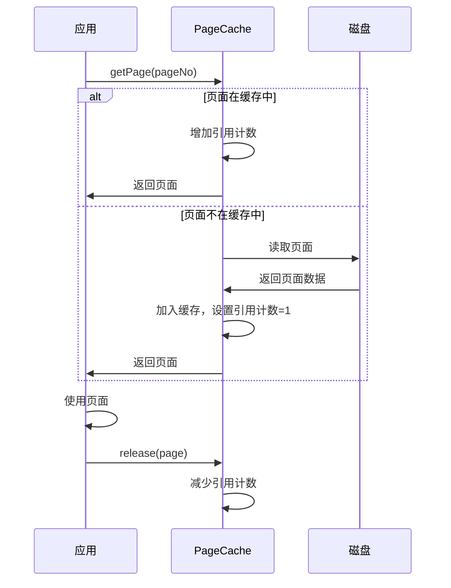
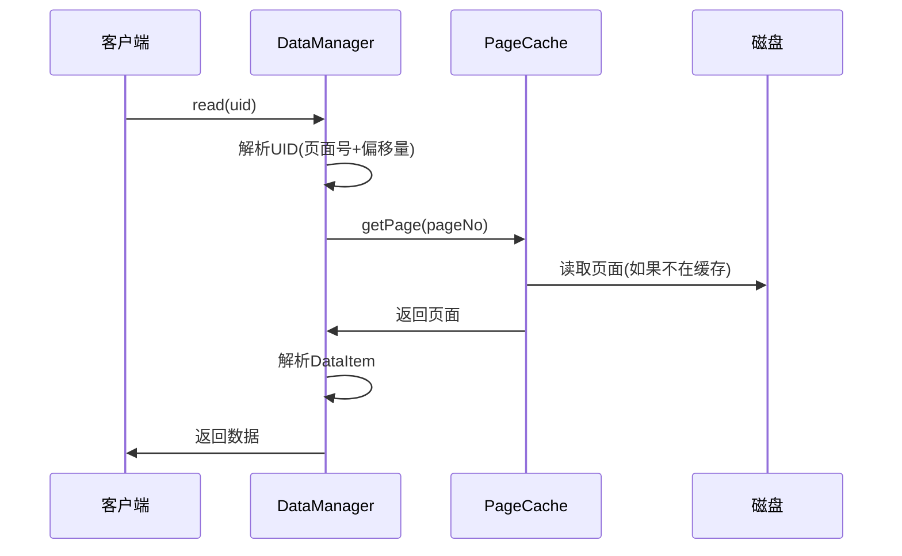
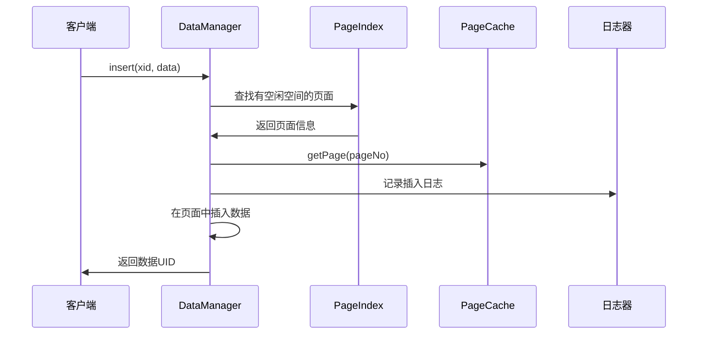
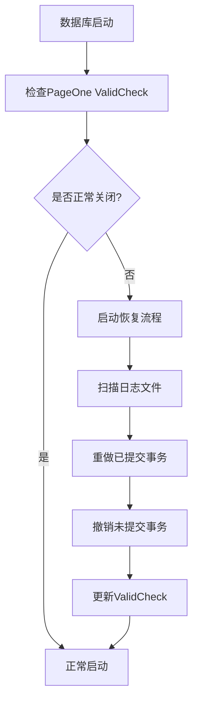

# 阶段2：数据管理模块深度解析

## 📚 学习目标

通过本阶段的学习，您将深入理解：
1. 数据库如何在磁盘上存储数据
2. 页面缓存机制如何提高性能
3. 数据项的组织和管理方式
4. 数据库的崩溃恢复原理
5. MYDB与MySQL在存储层面的异同

## 🏗️ 模块架构概览

数据管理（dm）模块是MYDB的存储引擎核心，负责数据的物理存储和访问。其架构层次如下：

```
数据管理模块 (dm)
├── 数据管理器 (DataManager) - 顶层接口
├── 页面缓存 (PageCache) - 内存管理
├── 页面管理 (Page系列) - 存储单位
├── 数据项管理 (DataItem) - 记录管理
├── 日志管理 (Logger) - 持久化保证
├── 页面索引 (PageIndex) - 空间管理
└── 数据恢复 (Recover) - 故障恢复
```

## 1️⃣ 基础工具类：SubArray

### 🎯 核心概念

`SubArray`是一个简单但重要的工具类，用于表示字节数组的片段，避免频繁的数组拷贝。

### 💡 设计思想

在数据库中，我们经常需要处理大块的字节数据，如果每次操作都拷贝整个数组，会造成巨大的性能开销。SubArray通过引用和偏移量的方式，实现了零拷贝的数据访问。

### 🔍 与MySQL的对比

| 方面 | MYDB SubArray | MySQL InnoDB |
|------|---------------|--------------|
| 数据表示 | 字节数组片段 | 页面内记录偏移 |
| 内存效率 | 零拷贝引用 | 直接偏移量访问 |
| 使用场景 | 通用数据片段 | 页面内数据定位 |

### 📝 使用示例

```java
// 假设有一个大的字节数组
byte[] bigData = new byte[8192]; // 8KB页面数据

// 传统方式：需要拷贝数据
byte[] record = Arrays.copyOfRange(bigData, 100, 200);

// SubArray方式：零拷贝
SubArray recordRef = new SubArray(bigData, 100, 200);
// 通过recordRef.raw, recordRef.start, recordRef.end 访问数据
```

## 2️⃣ 页面管理：数据存储的基本单位

### 🎯 核心概念

页面（Page）是数据库存储的基本单位，类似于操作系统的内存页。MYDB使用8KB页面，而MySQL InnoDB使用16KB页面。

### 🏗️ Page接口设计

Page接口定义了页面的基本操作：

```java
public interface Page {
    void lock();           // 页面锁
    void unlock();         // 释放锁
    void release();        // 释放引用
    void setDirty(boolean dirty);  // 脏页标记
    boolean isDirty();     // 检查脏页
    int getPageNumber();   // 页面号
    byte[] getData();      // 页面数据
}
```

### 🔒 并发控制机制

**页面锁（Page Latch）**
- 类似于MySQL的页面latch
- 保护页面数据结构的完整性
- 比事务锁更轻量级，持有时间很短

**脏页机制**
- 标记被修改但未写入磁盘的页面
- 延迟写入提高性能
- 类似于MySQL的脏页管理

### 📊 页面生命周期


## 3️⃣ 特殊页面：PageOne

### 🎯 核心概念

PageOne是数据库的第一个页面，存储关键的元数据和启动检查信息。这在所有数据库系统中都是一个重要概念。

### 🔍 ValidCheck机制详解

ValidCheck是MYDB检测数据库异常关闭的机制：

1. **正常启动**：在100~107字节写入随机数
2. **正常关闭**：将随机数复制到108~115字节
3. **启动检查**：比较两个区域是否相同

```
页面布局：
[0-99]     [100-107]  [108-115]  [116-8191]
其他数据    随机数A     随机数B     其他数据

正常关闭：A == B
异常关闭：A != B
```

### 🔄 与MySQL的对比

| 方面 | MYDB ValidCheck | MySQL InnoDB |
|------|-----------------|--------------|
| 检测方式 | 随机字节比较 | Checksum + LSN |
| 存储位置 | 第一页固定位置 | 每页页头 |
| 复杂度 | 简单直观 | 复杂完备 |
| 可靠性 | 基本检测 | 强校验 |

### 💻 实现原理

```java
// 数据库启动时
public static void setVcOpen(Page pg) {
    pg.setDirty(true);  // 标记为脏页
    // 写入随机字节到100~107位置
    System.arraycopy(RandomUtil.randomBytes(8), 0, 
                     pg.getData(), 100, 8);
}

// 数据库关闭时
public static void setVcClose(Page pg) {
    pg.setDirty(true);  // 标记为脏页
    byte[] data = pg.getData();
    // 复制100~107的内容到108~115
    System.arraycopy(data, 100, data, 108, 8);
}

// 启动时检查
public static boolean checkVc(Page pg) {
    byte[] data = pg.getData();
    // 比较两个区域是否相同
    return Arrays.equals(
        Arrays.copyOfRange(data, 100, 108),
        Arrays.copyOfRange(data, 108, 116)
    );
}
```

## 4️⃣ 页面缓存：PageCache

### 🎯 核心概念

PageCache是数据库性能的关键组件，管理内存中的页面缓存，减少磁盘I/O操作。

### 🏗️ 缓存架构

```
PageCache架构：
┌─────────────────────────────────────────┐
│              内存缓存区                    │
├─────────────────────────────────────────┤
│  页面1  │  页面2  │  页面3  │  ...      │
│ (引用:2) │ (引用:0) │ (引用:1) │         │
├─────────────────────────────────────────┤
│              引用计数表                    │
├─────────────────────────────────────────┤
│              磁盘文件                     │
└─────────────────────────────────────────┘
```

### 🔄 缓存策略

**引用计数法**
- 每个页面维护引用计数
- 引用计数>0的页面不能被替换
- 类似于MySQL Buffer Pool的pin机制

**页面替换算法**
1. 需要加载新页面时，检查缓存是否已满
2. 如果已满，查找引用计数为0的页面
3. 将找到的页面替换为新页面
4. 如果所有页面都在使用，等待或抛出异常

### 📊 缓存操作流程



### 💡 与MySQL Buffer Pool的对比

| 特性 | MYDB PageCache | MySQL Buffer Pool |
|------|----------------|-------------------|
| 替换算法 | 引用计数法 | 改进的LRU算法 |
| 页面大小 | 8KB | 16KB (可配置) |
| 预读机制 | 无 | 线性预读、随机预读 |
| 刷新策略 | 简单刷新 | 复杂的checkpoint |
| 并发控制 | 基础锁机制 | 分段锁、自适应哈希 |

## 5️⃣ 数据项管理：DataItem

### 🎯 核心概念

DataItem是MYDB中数据存储的最小单位，相当于MySQL中的记录（Record）。每个DataItem代表数据库中的一行数据。

### 🏗️ 数据项结构

```
DataItem结构：
┌─────────────┬─────────────┬─────────────────┐
│ ValidFlag   │ DataSize    │ Data            │
│ (1字节)      │ (2字节)      │ (变长)           │
└─────────────┴─────────────┴─────────────────┘

ValidFlag: 0=有效, 1=已删除
DataSize:  数据部分的长度
Data:      实际的用户数据
```

### 🔍 与MySQL行格式的对比

| 数据库 | 行格式复杂度 | 头部信息 | 变长字段 | NULL值处理 |
|--------|-------------|----------|----------|------------|
| MYDB | 简单 | ValidFlag + Size | 不支持 | 应用层处理 |
| MySQL Compact | 复杂 | 变长字段长度列表 + NULL值列表 + 记录头 | 支持 | 位图表示 |

### 🔒 并发控制

**读写锁机制**
```java
// 读操作：可以并发
dataItem.rLock();
try {
    byte[] data = dataItem.data();
    // 读取数据
} finally {
    dataItem.rUnLock();
}

// 写操作：独占访问
dataItem.lock();
try {
    // 修改数据
} finally {
    dataItem.unlock();
}
```

**事务支持**
```java
// 事务修改流程
dataItem.before();          // 1. 保存修改前状态
try {
    // 2. 修改数据
    modifyData();
    dataItem.after(xid);     // 3. 提交修改
} catch (Exception e) {
    dataItem.unBefore();     // 4. 回滚修改
    throw e;
}
```

### 💾 生命周期管理

**引用计数**
- 类似于页面的引用计数
- 防止正在使用的数据项被释放
- 支持并发访问控制

**内存管理**
- DataItem通过DataManager统一管理
- 支持LRU缓存策略
- 自动处理内存回收

## 6️⃣ 日志管理：Logger

### 🎯 核心概念

Logger实现Write-Ahead Logging（WAL）机制，确保数据的持久性和一致性。这是所有企业级数据库的核心机制。

### 🔍 WAL原理

**Write-Ahead Logging规则**
1. 事务提交前，相关的日志记录必须先写入磁盘
2. 数据页写入磁盘前，相关的日志记录必须先写入磁盘

### 📊 日志结构

```
日志文件结构：
┌─────────────┬─────────────┬─────────────┬─────┐
│ 日志头       │ 日志记录1    │ 日志记录2    │ ... │
│ (4字节)      │             │             │     │
└─────────────┴─────────────┴─────────────┴─────┘

每条日志记录：
┌─────────────┬─────────────────────────────────┐
│ 记录长度     │ 日志数据                         │
│ (4字节)      │ (变长)                          │
└─────────────┴─────────────────────────────────┘
```

### 🔄 与MySQL redo log的对比

| 特性 | MYDB Logger | MySQL redo log |
|------|-------------|----------------|
| 日志格式 | 简单的长度+数据 | 复杂的LSN+类型+数据 |
| 循环写入 | 不支持 | 支持环形缓冲区 |
| 组提交 | 不支持 | 支持批量提交 |
| 崩溃恢复 | 顺序重放 | 基于LSN的精确恢复 |

## 7️⃣ 页面索引：PageIndex

### 🎯 核心概念

PageIndex管理页面的空闲空间信息，帮助快速找到有足够空间的页面来插入新数据。

### 🏗️ 索引结构

```
空间分组策略：
页面空间 8KB = 8192字节
分组大小 = 8192 / 40 ≈ 204字节

分组0:   0-203字节      (很少空闲空间)
分组1:   204-407字节    (少量空闲空间)
分组2:   408-611字节    (中等空闲空间)
...
分组39:  7980-8191字节  (大量空闲空间)
分组40:  完全空闲页面
```

### 🔍 空间管理算法

**插入策略**
1. 根据需要的空间大小计算分组号
2. 从对应分组开始向上查找
3. 找到第一个有可用页面的分组
4. 返回该页面的信息

### 💡 与MySQL的对比

MySQL InnoDB使用更复杂的段（Segment）和区（Extent）管理：
- **段管理**：将相关页面组织成段
- **区管理**：连续的64个页面组成一个区
- **MYDB简化**：只按空闲空间大小分组

## 8️⃣ 数据管理器：DataManager

### 🎯 核心概念

DataManager是数据管理模块的门面，协调各个组件的工作，为上层提供统一的数据访问接口。

### 🏗️ 组件协调

```java
public class DataManagerImpl {
    PageCache pc;           // 页面缓存
    Logger lg;              // 日志管理器
    TransactionManager tm;  // 事务管理器
    PageIndex pIndex;       // 页面索引
    Page pageOne;          // 第一页
}
```

### 🔄 核心操作流程

**数据读取流程**


**数据插入流程**


## 9️⃣ 崩溃恢复：Recover

### 🎯 核心概念

Recover模块实现数据库的崩溃恢复功能，确保在系统异常关闭后能够恢复到一致状态。

### 🔄 恢复原理

**ARIES算法简化版**
1. **分析阶段**：扫描日志，确定需要重做和撤销的操作
2. **重做阶段**：重放所有已提交事务的操作
3. **撤销阶段**：回滚所有未提交事务的操作

### 📊 恢复流程



### 🔍 与MySQL恢复的对比

| 方面 | MYDB Recover | MySQL InnoDB |
|------|-------------|--------------|
| 检查点机制 | ValidCheck | Checkpoint LSN |
| 日志类型 | 简单重做日志 | redo + undo log |
| 恢复精度 | 事务级别 | 页面级别 + 记录级别 |
| 并行恢复 | 不支持 | 支持并行重做 |

## 🎯 学习建议

### 对于编程新手

1. **先理解概念，再看代码**
   - 每个类的作用和职责
   - 模块间的依赖关系
   - 与MySQL的对应关系

2. **动手实践**
   - 在关键方法中添加日志输出
   - 观察数据库启动、插入、查询的完整流程
   - 模拟异常关闭，观察恢复过程

3. **逐步深入**
   - 先掌握接口和基本概念
   - 再深入实现细节
   - 最后理解整体协作

### 重点关注的概念

1. **页面是存储的基本单位**
   - 理解为什么使用页面而不是单个记录
   - 页面缓存如何提高性能

2. **WAL机制的重要性**
   - 为什么需要Write-Ahead Logging
   - 如何保证数据的持久性

3. **并发控制的层次**
   - 页面级别的latch
   - 数据项级别的读写锁
   - 事务级别的隔离

4. **崩溃恢复的必要性**
   - 什么情况下需要恢复
   - 如何保证恢复后的一致性

## 📝 练习建议

1. **代码阅读练习**
   - 跟踪一个完整的数据插入流程
   - 理解页面缓存的命中和未命中情况
   - 分析崩溃恢复的具体步骤

2. **对比学习**
   - 比较MYDB和MySQL的页面大小差异
   - 对比简单行格式和复杂行格式的优缺点
   - 分析不同缓存策略的适用场景

3. **实验验证**
   - 模拟数据库异常关闭，观察恢复过程
   - 测试页面缓存的性能影响
   - 验证并发访问的安全性

通过深入学习这个阶段，您将对数据库的存储引擎有深刻的理解，为后续学习事务管理和并发控制打下坚实的基础。 