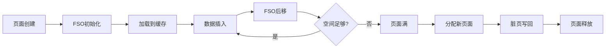
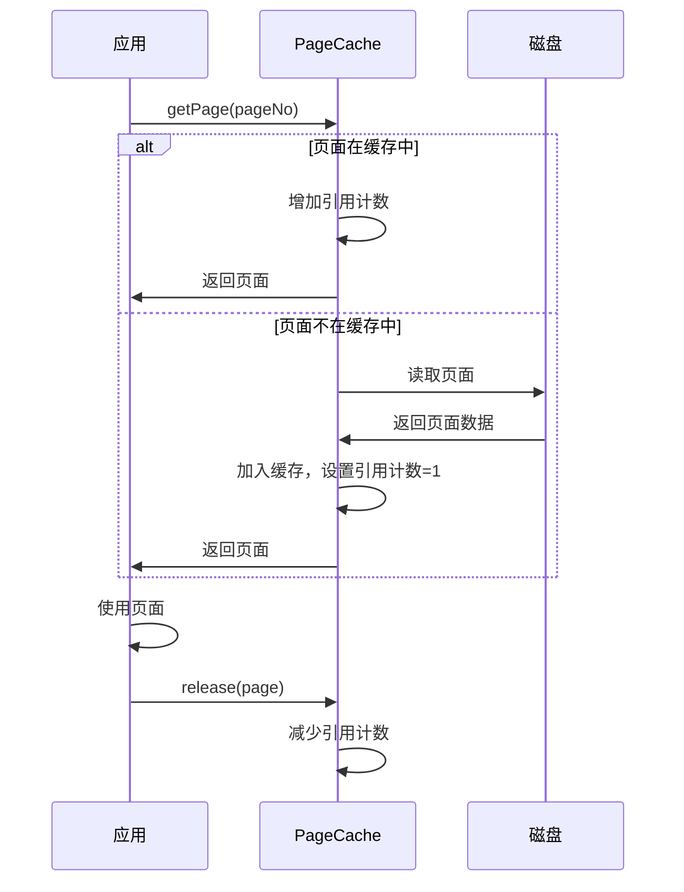
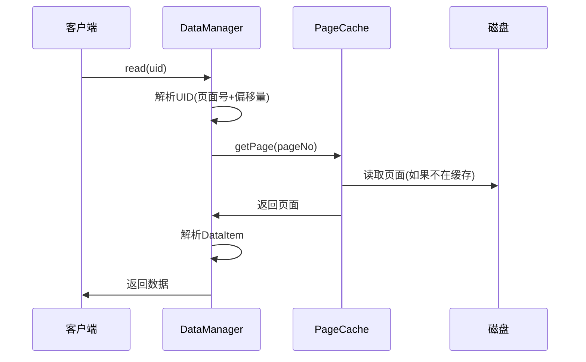
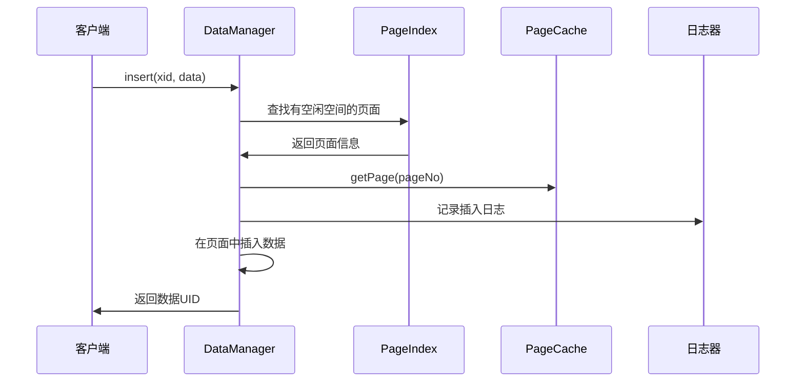
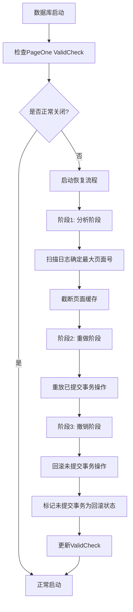

# 阶段2：数据管理模块深度解析

## 📚 学习目标

通过本阶段的学习，您将深入理解：
1. 数据库如何在磁盘上存储数据
2. 页面缓存机制如何提高性能
3. 数据项的组织和管理方式
4. 数据库的崩溃恢复原理
5. MYDB与MySQL在存储层面的异同

## 🏗️ 模块架构概览

数据管理（dm）模块是MYDB的存储引擎核心，负责数据的物理存储和访问。其架构层次如下：

```
数据管理模块 (dm)
├── 数据管理器 (DataManager) - 顶层接口
├── 页面缓存 (PageCache) - 内存管理
├── 页面管理 (Page系列) - 存储单位
├── 数据项管理 (DataItem) - 记录管理
├── 日志管理 (Logger) - 持久化保证
├── 页面索引 (PageIndex) - 空间管理
└── 数据恢复 (Recover) - 故障恢复
```

## 1️⃣ 基础工具类：SubArray

### 🎯 核心概念

`SubArray`是一个简单但重要的工具类，用于表示字节数组的片段，避免频繁的数组拷贝。

### 💡 设计思想

在数据库中，我们经常需要处理大块的字节数据，如果每次操作都拷贝整个数组，会造成巨大的性能开销。SubArray通过引用和偏移量的方式，实现了零拷贝的数据访问。

### 🔍 与MySQL的对比

| 方面 | MYDB SubArray | MySQL InnoDB |
|------|---------------|--------------|
| 数据表示 | 字节数组片段 | 页面内记录偏移 |
| 内存效率 | 零拷贝引用 | 直接偏移量访问 |
| 使用场景 | 通用数据片段 | 页面内数据定位 |

### 📝 使用示例

```java
// 假设有一个大的字节数组
byte[] bigData = new byte[8192]; // 8KB页面数据

// 传统方式：需要拷贝数据
byte[] record = Arrays.copyOfRange(bigData, 100, 200);

// SubArray方式：零拷贝
SubArray recordRef = new SubArray(bigData, 100, 200);
// 通过recordRef.raw, recordRef.start, recordRef.end 访问数据
```

## 2️⃣ 页面管理：数据存储的基本单位

### 🎯 核心概念

页面（Page）是数据库存储的基本单位，类似于操作系统的内存页。MYDB使用8KB页面，而MySQL InnoDB使用16KB页面。

### 🏗️ Page接口设计

Page接口定义了页面的基本操作：

```java
public interface Page {
    void lock();           // 页面锁
    void unlock();         // 释放锁
    void release();        // 释放引用
    void setDirty(boolean dirty);  // 脏页标记
    boolean isDirty();     // 检查脏页
    int getPageNumber();   // 页面号
    byte[] getData();      // 页面数据
}
```

### 🔒 并发控制机制

**页面锁（Page Latch）**
- 类似于MySQL的页面latch
- 保护页面数据结构的完整性
- 比事务锁更轻量级，持有时间很短

**脏页机制**
- 标记被修改但未写入磁盘的页面
- 延迟写入提高性能
- 类似于MySQL的脏页管理

### 🏗️ PageX：普通页面的具体实现

PageX是Page接口的核心实现，负责管理普通数据页面的具体结构和操作。

#### 页面结构设计

```
MYDB PageX页面结构：
┌─────────────────┬─────────────────────────────────────────┐
│ FreeSpaceOffset │              Data Area                  │
│    (2字节)       │               (变长)                    │
│     FSO=100     │  DataItem1 | DataItem2 | DataItem3...  │
└─────────────────┴─────────────────────────────────────────┘
                  ↑
                  下一个插入位置
```

#### 与MySQL InnoDB页面结构的深度对比

| 组件 | MYDB PageX | MySQL InnoDB | 说明 |
|------|------------|--------------|------|
| **页面头** | 2字节FSO | 38字节复杂页头 | MYDB极简设计 vs MySQL完整元数据 |
| **用户记录** | 简单连续存储 | 复杂记录格式+目录 | 顺序存储 vs 链表+索引结构 |
| **空闲空间管理** | 单一偏移量 | 空闲空间链表 | 简单指针 vs 复杂链表管理 |
| **页面目录** | 无 | 槽目录+记录指针 | 无索引 vs 二分查找优化 |
| **页面尾** | 无 | 8字节校验信息 | 无校验 vs 完整性保护 |

#### 空闲空间管理机制

**FSO（Free Space Offset）原理**：
```java
// 初始状态
FSO = 2  (跳过2字节的FSO字段本身)

// 插入第一个数据项（20字节）
插入位置 = FSO = 2
插入后 FSO = 2 + 20 = 22

// 插入第二个数据项（30字节）  
插入位置 = FSO = 22
插入后 FSO = 22 + 30 = 52

// 可用空间计算
剩余空间 = 8192 - 52 = 8140字节
```

**设计优势**：
1. **O(1)插入性能**：无需搜索空闲空间，直接在FSO位置插入
2. **零碎片**：连续分配，不产生内部碎片
3. **简单可靠**：逻辑简单，不易出错
4. **高空间利用率**：除了2字节头部，其余空间完全可用

#### 核心操作实现

**1. 页面初始化**
```java
public static byte[] initRaw() {
    byte[] raw = new byte[8192];  // 8KB页面
    setFSO(raw, 2);  // FSO初始指向第2字节
    return raw;
    // 结果：[0-1]=FSO字段, [2-8191]=可用空间
}
```

**2. 数据插入**
```java
public static short insert(Page pg, byte[] raw) {
    pg.setDirty(true);               // 1. 标记脏页
    short offset = getFSO(pg);       // 2. 获取插入位置
    copyData(raw, pg, offset);       // 3. 复制数据
    updateFSO(pg, offset + raw.length);  // 4. 更新FSO
    return offset;                   // 5. 返回位置用于UID构造
}
```

**3. 空闲空间计算**
```java
public static int getFreeSpace(Page pg) {
    // 总空间 - 已用空间 = 剩余空间
    return 8192 - getFSO(pg);
}
```

#### 崩溃恢复专用操作

**智能插入恢复**：
```java
public static void recoverInsert(Page pg, byte[] raw, short offset) {
    pg.setDirty(true);
    copyData(raw, pg, offset);  // 在指定位置插入
    
    short currentFSO = getFSO(pg);
    // 智能FSO更新：只有超出边界时才更新
    if(currentFSO < offset + raw.length) {
        setFSO(pg, offset + raw.length);
    }
    // 支持幂等恢复和乱序重放
}
```

**原地更新恢复**：
```java  
public static void recoverUpdate(Page pg, byte[] raw, short offset) {
    pg.setDirty(true);
    copyData(raw, pg, offset);  // 原地覆盖，不改变FSO
    // 适用于固定大小的数据项更新
}
```

### 📊 页面生命周期



### 💡 性能特性分析

**时间复杂度**：
- 插入操作：O(1) - 直接在FSO位置插入
- 空间查询：O(1) - 简单算术计算
- 数据访问：O(1) - 通过偏移量直接访问

**空间复杂度**：
- 页面头开销：2字节（0.024%）
- 空间利用率：99.976%
- 碎片率：0%（连续分配）

**与MySQL性能对比**：
```
操作性能对比：
┌─────────────┬─────────────┬─────────────┐
│    操作     │  MYDB PageX │ MySQL InnoDB│
├─────────────┼─────────────┼─────────────┤
│ 插入操作    │    O(1)     │   O(log n)  │
│ 空间管理    │    O(1)     │    O(1)     │
│ 数据查找    │    O(n)     │   O(log n)  │
│ 页面开销    │   2字节     │   46字节    │
└─────────────┴─────────────┴─────────────┘
```

**设计取舍分析**：
- **MYDB优势**：插入快速、结构简单、空间利用率高
- **MYDB劣势**：查找慢（线性扫描）、无完整性校验
- **MySQL优势**：查找快速、功能完整、高可靠性  
- **MySQL劣势**：结构复杂、开销较大

### 🔍 实际应用场景

**适合MYDB PageX的场景**：
1. **顺序访问为主**：日志记录、时序数据
2. **插入密集型**：数据导入、批量处理  
3. **简单查询**：全表扫描、范围查询
4. **学习研究**：理解数据库原理

**需要MySQL InnoDB的场景**：
1. **随机访问频繁**：OLTP业务、点查询
2. **复杂查询**：多条件查询、排序分组
3. **高并发读写**：Web应用、企业系统
4. **数据完整性要求高**：金融、医疗系统

通过理解PageX的设计，您可以深入掌握数据库页面管理的核心原理，为学习更复杂的存储引擎打下基础。

## 3️⃣ 特殊页面：PageOne

### 🎯 核心概念

PageOne是数据库的第一个页面，存储关键的元数据和启动检查信息。这在所有数据库系统中都是一个重要概念。

### 🔍 ValidCheck机制详解

ValidCheck是MYDB检测数据库异常关闭的机制：

1. **正常启动**：在100~107字节写入随机数
2. **正常关闭**：将随机数复制到108~115字节
3. **启动检查**：比较两个区域是否相同

```
页面布局：
[0-99]     [100-107]  [108-115]  [116-8191]
其他数据    随机数A     随机数B     其他数据

正常关闭：A == B
异常关闭：A != B
```

### 🔄 与MySQL的对比

| 方面 | MYDB ValidCheck | MySQL InnoDB |
|------|-----------------|--------------|
| 检测方式 | 随机字节比较 | Checksum + LSN |
| 存储位置 | 第一页固定位置 | 每页页头 |
| 复杂度 | 简单直观 | 复杂完备 |
| 可靠性 | 基本检测 | 强校验 |

### 💻 实现原理

```java
// 数据库启动时
public static void setVcOpen(Page pg) {
    pg.setDirty(true);  // 标记为脏页
    // 写入随机字节到100~107位置
    System.arraycopy(RandomUtil.randomBytes(8), 0, 
                     pg.getData(), 100, 8);
}

// 数据库关闭时
public static void setVcClose(Page pg) {
    pg.setDirty(true);  // 标记为脏页
    byte[] data = pg.getData();
    // 复制100~107的内容到108~115
    System.arraycopy(data, 100, data, 108, 8);
}

// 启动时检查
public static boolean checkVc(Page pg) {
    byte[] data = pg.getData();
    // 比较两个区域是否相同
    return Arrays.equals(
        Arrays.copyOfRange(data, 100, 108),
        Arrays.copyOfRange(data, 108, 116)
    );
}
```

## 4️⃣ 页面缓存：PageCache

### 🎯 核心概念

PageCache是数据库性能的关键组件，管理内存中的页面缓存，减少磁盘I/O操作。

### 🏗️ 缓存架构

```
PageCache架构：
┌─────────────────────────────────────────┐
│              内存缓存区                    │
├─────────────────────────────────────────┤
│  页面1  │  页面2  │  页面3  │  ...      │
│ (引用:2) │ (引用:0) │ (引用:1) │         │
├─────────────────────────────────────────┤
│              引用计数表                    │
├─────────────────────────────────────────┤
│              磁盘文件                     │
└─────────────────────────────────────────┘
```

### 🔄 缓存策略

**引用计数法**
- 每个页面维护引用计数
- 引用计数>0的页面不能被替换
- 类似于MySQL Buffer Pool的pin机制

**页面替换算法**
1. 需要加载新页面时，检查缓存是否已满
2. 如果已满，查找引用计数为0的页面
3. 将找到的页面替换为新页面
4. 如果所有页面都在使用，等待或抛出异常

### 📊 缓存操作流程



### 💡 与MySQL Buffer Pool的对比

| 特性 | MYDB PageCache | MySQL Buffer Pool |
|------|----------------|-------------------|
| 替换算法 | 引用计数法 | 改进的LRU算法 |
| 页面大小 | 8KB | 16KB (可配置) |
| 预读机制 | 无 | 线性预读、随机预读 |
| 刷新策略 | 简单刷新 | 复杂的checkpoint |
| 并发控制 | 基础锁机制 | 分段锁、自适应哈希 |

## 5️⃣ 数据项管理：DataItem

### 🎯 核心概念

DataItem是MYDB中数据存储的最小单位，相当于MySQL中的记录（Record）。每个DataItem代表数据库中的一行数据。

### 🏗️ 数据项结构

```
DataItem结构：
┌─────────────┬─────────────┬─────────────────┐
│ ValidFlag   │ DataSize    │ Data            │
│ (1字节)      │ (2字节)      │ (变长)           │
└─────────────┴─────────────┴─────────────────┘

ValidFlag: 0=有效, 1=已删除
DataSize:  数据部分的长度
Data:      实际的用户数据
```

### 🔍 与MySQL行格式的对比

| 数据库 | 行格式复杂度 | 头部信息 | 变长字段 | NULL值处理 |
|--------|-------------|----------|----------|------------|
| MYDB | 简单 | ValidFlag + Size | 不支持 | 应用层处理 |
| MySQL Compact | 复杂 | 变长字段长度列表 + NULL值列表 + 记录头 | 支持 | 位图表示 |

### 🔒 并发控制

**读写锁机制**
```java
// 读操作：可以并发
dataItem.rLock();
try {
    byte[] data = dataItem.data();
    // 读取数据
} finally {
    dataItem.rUnLock();
}

// 写操作：独占访问
dataItem.lock();
try {
    // 修改数据
} finally {
    dataItem.unlock();
}
```

**事务支持**
```java
// 事务修改流程
dataItem.before();          // 1. 保存修改前状态
try {
    // 2. 修改数据
    modifyData();
    dataItem.after(xid);     // 3. 提交修改
} catch (Exception e) {
    dataItem.unBefore();     // 4. 回滚修改
    throw e;
}
```

### 💾 生命周期管理

**引用计数**
- 类似于页面的引用计数
- 防止正在使用的数据项被释放
- 支持并发访问控制

**内存管理**
- DataItem通过DataManager统一管理
- 支持LRU缓存策略
- 自动处理内存回收

## 6️⃣ 日志管理：Logger

### 🎯 核心概念

Logger实现Write-Ahead Logging（WAL）机制，确保数据的持久性和一致性。这是所有企业级数据库的核心机制。

### 🔍 WAL原理

**Write-Ahead Logging规则**
1. 事务提交前，相关的日志记录必须先写入磁盘
2. 数据页写入磁盘前，相关的日志记录必须先写入磁盘

### 📊 日志结构

```
日志文件结构：
┌─────────────┬─────────────┬─────────────┬─────┐
│ 日志头       │ 日志记录1    │ 日志记录2    │ ... │
│ (4字节)      │             │             │     │
└─────────────┴─────────────┴─────────────┴─────┘

每条日志记录：
┌─────────────┬─────────────────────────────────┐
│ 记录长度     │ 日志数据                         │
│ (4字节)      │ (变长)                          │
└─────────────┴─────────────────────────────────┘
```

### 🔄 与MySQL redo log的对比

| 特性 | MYDB Logger | MySQL redo log |
|------|-------------|----------------|
| 日志格式 | 简单的长度+数据 | 复杂的LSN+类型+数据 |
| 循环写入 | 不支持 | 支持环形缓冲区 |
| 组提交 | 不支持 | 支持批量提交 |
| 崩溃恢复 | 顺序重放 | 基于LSN的精确恢复 |

## 7️⃣ 页面索引：PageIndex

### 🎯 核心概念

PageIndex管理页面的空闲空间信息，帮助快速找到有足够空间的页面来插入新数据。

### 🏗️ 索引结构

```
空间分组策略：
页面空间 8KB = 8192字节
分组大小 = 8192 / 40 ≈ 204字节

分组0:   0-203字节      (很少空闲空间)
分组1:   204-407字节    (少量空闲空间)
分组2:   408-611字节    (中等空闲空间)
...
分组39:  7980-8191字节  (大量空闲空间)
分组40:  完全空闲页面
```

### 🔍 空间管理算法

**插入策略**
1. 根据需要的空间大小计算分组号
2. 从对应分组开始向上查找
3. 找到第一个有可用页面的分组
4. 返回该页面的信息

### 💡 与MySQL的对比

MySQL InnoDB使用更复杂的段（Segment）和区（Extent）管理：
- **段管理**：将相关页面组织成段
- **区管理**：连续的64个页面组成一个区
- **MYDB简化**：只按空闲空间大小分组

## 8️⃣ 数据管理器：DataManager

### 🎯 核心概念

DataManager是数据管理模块的门面，协调各个组件的工作，为上层提供统一的数据访问接口。

### 🏗️ 组件协调

```java
public class DataManagerImpl {
    PageCache pc;           // 页面缓存
    Logger lg;              // 日志管理器
    TransactionManager tm;  // 事务管理器
    PageIndex pIndex;       // 页面索引
    Page pageOne;          // 第一页
}
```

### 🔄 核心操作流程

**数据读取流程**


**数据插入流程**


## 9️⃣ 崩溃恢复：Recover

### 🎯 核心概念

Recover模块实现数据库的崩溃恢复功能，确保在系统异常关闭后能够恢复到一致状态。这是所有企业级数据库系统的核心功能之一。

### 🏗️ 恢复算法原理

MYDB实现了经典ARIES算法的简化版本，包含三个阶段：

**ARIES算法简化版**
1. **分析阶段(Analysis)**：扫描日志，确定数据库状态和需要处理的事务
2. **重做阶段(Redo)**：重放所有已提交事务的操作，恢复到故障时的状态  
3. **撤销阶段(Undo)**：回滚所有未提交事务的操作，确保一致性

### 📊 恢复流程详解



### 🔍 三阶段详细分析

#### 阶段1：分析阶段
```java
// 扫描日志确定最大页面号
lg.rewind();
int maxPgno = 0;
while(true) {
    byte[] log = lg.next();
    if(log == null) break;
    // 解析日志获取页面号
    int pgno = parsePageNo(log);
    if(pgno > maxPgno) {
        maxPgno = pgno;
    }
}
// 截断可能损坏的页面
pc.truncateByBgno(maxPgno);
```

**目的**：
- 确定数据库的边界（最大页面号）
- 移除可能损坏或不完整的页面
- 为后续恢复做准备

#### 阶段2：重做阶段
```java
private static void redoTranscations(TransactionManager tm, Logger lg, PageCache pc) {
    lg.rewind();
    while(true) {
        byte[] log = lg.next();
        if(log == null) break;
        
        long xid = parseXid(log);
        if(!tm.isActive(xid)) {  // 事务已提交或已回滚
            if(isInsertLog(log)) {
                doInsertLog(pc, log, REDO);
            } else {
                doUpdateLog(pc, log, REDO);
            }
        }
    }
}
```

**重做原理**：
- 顺序扫描所有日志记录
- 对已提交事务的操作执行重做
- 确保已提交事务的持久性

#### 阶段3：撤销阶段
```java
private static void undoTranscations(TransactionManager tm, Logger lg, PageCache pc) {
    // 1. 收集未提交事务的所有操作
    Map<Long, List<byte[]>> logCache = new HashMap<>();
    
    // 2. 按事务分组收集日志
    lg.rewind();
    while(true) {
        byte[] log = lg.next();
        if(log == null) break;
        
        long xid = parseXid(log);
        if(tm.isActive(xid)) {  // 未提交事务
            logCache.computeIfAbsent(xid, k -> new ArrayList<>()).add(log);
        }
    }
    
    // 3. 倒序执行UNDO操作
    for(Entry<Long, List<byte[]>> entry : logCache.entrySet()) {
        List<byte[]> logs = entry.getValue();
        // 最后的操作最先撤销
        for (int i = logs.size()-1; i >= 0; i--) {
            byte[] log = logs.get(i);
            if(isInsertLog(log)) {
                doInsertLog(pc, log, UNDO);
            } else {
                doUpdateLog(pc, log, UNDO);
            }
        }
        // 标记事务为已回滚
        tm.abort(entry.getKey());
    }
}
```

**撤销原理**：
- 倒序执行未提交事务的操作
- 后执行的操作先撤销，保证正确性
- 确保未提交事务的原子性

### 🗂️ 日志格式设计

#### 插入日志格式
```
[LogType] [XID] [Pgno] [Offset] [Raw]
    1字节   8字节   4字节    2字节    变长

LogType: LOG_TYPE_INSERT (0)
XID: 事务ID
Pgno: 目标页面编号  
Offset: 页面内插入位置偏移量
Raw: 完整的数据项内容
```

#### 更新日志格式  
```
[LogType] [XID] [UID] [OldRaw] [NewRaw]
    1字节   8字节  8字节   变长      变长

LogType: LOG_TYPE_UPDATE (1)
XID: 事务ID
UID: 数据项唯一标识符（页面号+偏移量）
OldRaw: 修改前的完整数据
NewRaw: 修改后的完整数据
```

### 🔄 REDO/UNDO操作对比

| 操作类型 | REDO模式 | UNDO模式 |
|----------|----------|----------|
| **INSERT** | 重新执行插入操作 | 标记数据项为无效（逻辑删除） |
| **UPDATE** | 使用新数据覆盖 | 使用旧数据恢复 |

#### 插入操作的特殊处理

**REDO插入**：
```java
// 重新在指定位置插入数据
PageX.recoverInsert(pg, li.raw, li.offset);
```

**UNDO插入**：
```java
// 不能物理删除，通过ValidFlag标记为无效
if(flag == UNDO) {
    DataItem.setDataItemRawInvalid(li.raw);  // ValidFlag = 1
}
PageX.recoverInsert(pg, li.raw, li.offset);  // 仍然写入，但标记无效
```

### 🔍 与MySQL InnoDB恢复的深度对比

| 方面 | MYDB Recover | MySQL InnoDB |
|------|-------------|--------------|
| **算法基础** | ARIES简化版 | 完整ARIES算法 |
| **日志系统** | 单一WAL日志 | redo log + undo log |
| **检查点机制** | ValidCheck简单标记 | 复杂的checkpoint LSN |
| **恢复精度** | 事务级别 | 页面级别 + 记录级别 |
| **并行恢复** | 不支持 | 支持并行重做和撤销 |
| **崩溃检测** | 字节比较 | Checksum + LSN验证 |
| **空间管理** | 简单截断 | 精确的页面状态管理 |

### 💡 恢复原则的重要性

#### 1. ACID特性保证
```java
// 原子性：未提交事务完全回滚
for(long xid : activeTransactions) {
    undoAllOperations(xid);
    tm.abort(xid);
}

// 持久性：已提交事务完全重做  
for(long xid : committedTransactions) {
    redoAllOperations(xid);
}
```

#### 2. 一致性状态检查
```java
// 恢复完成后的一致性验证
public boolean verifyConsistency() {
    // 检查所有活跃事务都已被回滚
    assert tm.getActiveTransactions().isEmpty();
    
    // 检查ValidCheck状态正确
    assert PageOne.checkVc(pageOne);
    
    // 检查页面结构完整性
    return verifyAllPages();
}
```

### 📈 性能考虑

#### 恢复时间优化
```java
// 按页面分组处理，减少随机I/O
Map<Integer, List<LogRecord>> pageGroups = groupLogsByPage(logs);
for(Entry<Integer, List<LogRecord>> entry : pageGroups.entrySet()) {
    Page page = pc.getPage(entry.getKey());
    // 批量处理该页面的所有操作
    processPageLogs(page, entry.getValue());
    page.release();
}
```

#### 内存使用控制
```java
// 大型数据库的内存控制
if(logCache.size() > MAX_CACHE_SIZE) {
    // 分批处理未提交事务
    processBatch(logCache);
    logCache.clear();
}
```

### 🎯 学习要点

#### 关键概念理解
1. **WAL原则**：日志先于数据写入磁盘
2. **幂等性**：重做操作可以安全地重复执行
3. **补偿操作**：撤销通过逆操作实现
4. **原子性**：要么全部完成，要么全部撤销

#### 实际应用场景
1. **系统崩溃**：断电、内核panic、进程被杀死
2. **硬件故障**：磁盘错误、内存错误
3. **软件错误**：数据库bug、操作系统bug

#### 测试验证方法
```java
// 模拟崩溃测试
public void testCrashRecovery() {
    // 1. 执行一些事务操作
    insertData(xid1, data1);
    updateData(xid2, data2);
    
    // 2. 模拟崩溃（不正常关闭）
    simulateCrash();
    
    // 3. 重启并验证恢复结果
    restart();
    assert verifyDataConsistency();
}
```

### 🔧 调试技巧

#### 日志分析工具
```java
public void analyzeLogFile(String logPath) {
    Logger lg = Logger.open(logPath);
    lg.rewind();
    
    while(true) {
        byte[] log = lg.next();
        if(log == null) break;
        
        if(isInsertLog(log)) {
            InsertLogInfo info = parseInsertLog(log);
            System.out.println("INSERT: xid=" + info.xid + 
                             ", pgno=" + info.pgno + 
                             ", offset=" + info.offset);
        } else {
            UpdateLogInfo info = parseUpdateLog(log);
            System.out.println("UPDATE: xid=" + info.xid + 
                             ", pgno=" + info.pgno + 
                             ", offset=" + info.offset);
        }
    }
}
```

通过深入理解Recover模块，您将掌握数据库崩溃恢复的核心原理，这对理解数据库的可靠性机制非常重要。

## 🎯 学习建议

### 对于编程新手

1. **先理解概念，再看代码**
   - 每个类的作用和职责
   - 模块间的依赖关系
   - 与MySQL的对应关系

2. **动手实践**
   - 在关键方法中添加日志输出
   - 观察数据库启动、插入、查询的完整流程
   - 模拟异常关闭，观察恢复过程

3. **逐步深入**
   - 先掌握接口和基本概念
   - 再深入实现细节
   - 最后理解整体协作

### 重点关注的概念

1. **页面是存储的基本单位**
   - 理解为什么使用页面而不是单个记录
   - 页面缓存如何提高性能

2. **WAL机制的重要性**
   - 为什么需要Write-Ahead Logging
   - 如何保证数据的持久性

3. **并发控制的层次**
   - 页面级别的latch
   - 数据项级别的读写锁
   - 事务级别的隔离

4. **崩溃恢复的必要性**
   - 什么情况下需要恢复
   - 如何保证恢复后的一致性

## 📝 练习建议

1. **代码阅读练习**
   - 跟踪一个完整的数据插入流程
   - 理解页面缓存的命中和未命中情况
   - 分析崩溃恢复的具体步骤

2. **对比学习**
   - 比较MYDB和MySQL的页面大小差异
   - 对比简单行格式和复杂行格式的优缺点
   - 分析不同缓存策略的适用场景

3. **实验验证**
   - 模拟数据库异常关闭，观察恢复过程
   - 测试页面缓存的性能影响
   - 验证并发访问的安全性

通过深入学习这个阶段，您将对数据库的存储引擎有深刻的理解，为后续学习事务管理和并发控制打下坚实的基础。 