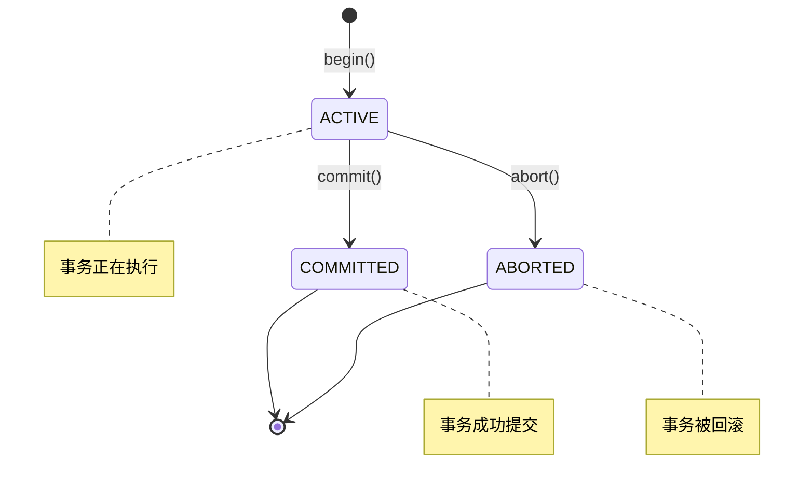

# 阶段3：事务管理模块深度解析

## 📚 学习目标

通过本阶段的学习，您将深入理解：
1. 数据库事务的基本概念和ACID特性
2. 事务生命周期的管理机制
3. 事务状态的持久化存储
4. 并发环境下的事务管理
5. MYDB与MySQL事务系统的异同

## 🏗️ 模块架构概览

事务管理（tm）模块是MYDB的核心基础模块，为数据库提供事务支持。其架构简洁而高效：

```
事务管理模块 (tm)
├── TransactionManager - 事务管理接口
└── TransactionManagerImpl - 具体实现
    ├── XID分配与管理
    ├── 事务状态持久化
    ├── 并发控制保护
    └── 文件完整性校验
```

## 1️⃣ 事务基础概念

### 🎯 什么是事务？

事务（Transaction）是数据库操作的基本逻辑单元，具有ACID特性：

- **原子性（Atomicity）**: 事务中的所有操作要么全部成功，要么全部失败
- **一致性（Consistency）**: 事务执行前后数据库保持一致状态
- **隔离性（Isolation）**: 并发事务之间相互隔离，不互相干扰
- **持久性（Durability）**: 已提交事务的修改永久保存

### 📊 事务生命周期



### 🔍 与MySQL事务系统的对比

| 特性 | MYDB事务管理 | MySQL InnoDB |
|------|-------------|--------------|
| **事务ID** | 简单递增XID | 复杂的事务ID + 回滚指针 |
| **状态管理** | 3种状态（ACTIVE/COMMITTED/ABORTED） | 多种内部状态 |
| **存储方式** | 单独的XID文件 | 内嵌在数据页和回滚段 |
| **并发控制** | 基础锁保护 | 复杂的锁管理器 |
| **隔离级别** | 简化的2级隔离 | 完整的4级隔离 |
| **回滚机制** | 依赖其他模块 | 完整的undo log系统 |

## 2️⃣ TransactionManager接口设计

### 🎯 核心接口定义

TransactionManager定义了事务管理的基本操作：

```java
public interface TransactionManager {
    long begin();                    // 开始新事务
    void commit(long xid);          // 提交事务
    void abort(long xid);           // 回滚事务
    boolean isActive(long xid);     // 检查活跃状态
    boolean isCommitted(long xid);  // 检查提交状态
    boolean isAborted(long xid);    // 检查回滚状态
    void close();                   // 关闭管理器
}
```

### 💡 设计理念

**简单而完整**：
- 提供事务的完整生命周期管理
- 接口简洁明了，易于理解和使用
- 状态查询支持MVCC和崩溃恢复

**职责分离**：
- 专注于事务状态管理
- 不涉及具体的数据操作
- 为其他模块提供事务上下文

### 🔧 工厂方法设计

```java
// 创建新的事务管理器
TransactionManager tm = TransactionManager.create(path);

// 打开已存在的事务管理器  
TransactionManager tm = TransactionManager.open(path);
```

**设计优势**：
- 统一的创建接口
- 自动处理文件初始化
- 内置完整性检查

## 3️⃣ TransactionManagerImpl实现详解

### 🏗️ 核心数据结构

#### XID文件存储格式

```
XID文件布局：
┌─────────────────┬─────────┬─────────┬─────────┬─────┐
│   XID Header    │  XID 1  │  XID 2  │  XID 3  │ ... │
│    (8字节)       │ (1字节)  │ (1字节)  │ (1字节)  │     │
│  最大事务ID      │  状态    │  状态    │  状态    │     │
└─────────────────┴─────────┴─────────┴─────────┴─────┘

文件大小 = 8 + 事务数量 × 1字节
```

#### 事务状态编码

```java
private static final byte FIELD_TRAN_ACTIVE   = 0;  // 活跃状态
private static final byte FIELD_TRAN_COMMITTED = 1;  // 已提交
private static final byte FIELD_TRAN_ABORTED  = 2;   // 已回滚
```

### ⚡ 核心算法实现

#### 1. XID分配算法

```java
public long begin() {
    counterLock.lock();  // 获取排他锁
    try {
        long xid = xidCounter + 1;           // 计算新XID
        updateXID(xid, FIELD_TRAN_ACTIVE);   // 设置活跃状态
        incrXIDCounter();                    // 更新计数器
        return xid;                          // 返回新XID
    } finally {
        counterLock.unlock();  // 释放锁
    }
}
```

**算法特点**：
- O(1)时间复杂度
- 线程安全的原子操作
- 立即持久化到磁盘

#### 2. 位置计算算法

```java
private long getXidPosition(long xid) {
    return LEN_XID_HEADER_LENGTH + (xid-1) * XID_FIELD_SIZE;
}
```

**计算示例**：
```
XID=1: position = 8 + (1-1) × 1 = 8
XID=2: position = 8 + (2-1) × 1 = 9  
XID=N: position = 8 + (N-1) × 1 = 7+N
```

#### 3. 状态更新算法

```java
private void updateXID(long xid, byte status) {
    long offset = getXidPosition(xid);       // 计算位置
    ByteBuffer buf = ByteBuffer.wrap(status); // 包装状态
    fc.position(offset);                     // 定位文件
    fc.write(buf);                          // 写入状态
    fc.force(false);                        // 强制刷新
}
```

**持久化保证**：
- 每次状态变更立即写入磁盘
- 使用force()确保不在OS缓存中滞留
- 满足事务持久性要求

### 🔒 并发控制机制

#### ReentrantLock保护

```java
private Lock counterLock = new ReentrantLock();

// 关键操作使用锁保护
counterLock.lock();
try {
    // 原子操作：XID分配 + 状态设置 + 计数器更新
} finally {
    counterLock.unlock();
}
```

**并发安全保证**：
- 防止多线程同时分配相同XID
- 确保XID计数器的一致性
- 避免文件竞争写入

#### 特殊事务处理

```java
public static final long SUPER_XID = 0;

public boolean isCommitted(long xid) {
    if(xid == SUPER_XID) return true;  // 超级事务总是已提交
    return checkXID(xid, FIELD_TRAN_COMMITTED);
}
```

**超级事务设计**：
- XID=0，永远处于COMMITTED状态
- 为系统初始化提供事务上下文
- 简化边界条件处理

### 🛡️ 完整性保护机制

#### 文件完整性校验

```java
private void checkXIDCounter() {
    long fileLen = file.length();                    // 实际文件大小
    long expectedLen = getXidPosition(xidCounter + 1); // 期望文件大小
    
    if(expectedLen != fileLen) {
        Panic.panic(Error.BadXIDFileException);  // 文件损坏
    }
}
```

**校验原理**：
```
期望大小 = 文件头(8字节) + 事务数(xidCounter) × 1字节
实际大小 = 从操作系统获取的文件大小

一致性检查：期望大小 == 实际大小
```

#### 启动时恢复

```java
TransactionManagerImpl(RandomAccessFile raf, FileChannel fc) {
    this.file = raf;
    this.fc = fc;
    counterLock = new ReentrantLock();
    checkXIDCounter();  // 验证文件并恢复状态
}
```

**恢复流程**：
1. 读取XID计数器
2. 验证文件完整性
3. 恢复内存状态
4. 准备接受新事务

## 4️⃣ 性能分析与优化

### ⚡ 时间复杂度分析

| 操作 | 时间复杂度 | 说明 |
|------|-----------|------|
| begin() | O(1) | 直接计算位置并写入 |
| commit(xid) | O(1) | 根据XID直接定位 |
| abort(xid) | O(1) | 根据XID直接定位 |
| isActive(xid) | O(1) | 直接读取状态字节 |
| isCommitted(xid) | O(1) | 直接读取状态字节 |
| isAborted(xid) | O(1) | 直接读取状态字节 |

### 💾 空间复杂度分析

**存储开销**：
```
文件开销 = 8字节(文件头) + N字节(N个事务)
平均每事务开销 = 1字节

对比MySQL InnoDB：
- 事务对象：几十字节
- 回滚段条目：几十字节  
- 锁记录：几十字节
- MYDB优势：极小的存储开销
```

**内存开销**：
```
固定开销：
- XID计数器：8字节
- 文件句柄：系统资源
- 锁对象：几十字节

总计：不到100字节的内存占用
```

### 🚀 性能优化特点

#### 1. 零拷贝设计
```java
// 直接操作ByteBuffer，避免额外内存拷贝
ByteBuffer buf = ByteBuffer.wrap(new byte[]{status});
fc.write(buf);
```

#### 2. 批量操作支持
```java
// 虽然当前是单事务操作，但设计支持未来的批量优化
// 可以扩展为批量提交多个事务状态
```

#### 3. 文件定位优化
```java
// 通过数学计算直接定位，避免文件搜索
long offset = LEN_XID_HEADER_LENGTH + (xid-1) * XID_FIELD_SIZE;
```

## 5️⃣ 实际应用场景

### 🎯 适用场景

**MYDB事务管理适合**：
1. **学习数据库原理**：简单清晰的实现
2. **轻量级应用**：最小化的资源开销  
3. **嵌入式系统**：简单可靠的事务支持
4. **原型开发**：快速实现事务功能

**需要MySQL InnoDB的场景**：
1. **高并发应用**：复杂的锁管理
2. **大型企业应用**：完整的ACID保证
3. **复杂事务**：嵌套事务、保存点等
4. **高可靠性要求**：完整的故障恢复

### 🔄 与其他模块的协作

#### 1. 与数据管理（dm）模块
```java
// dm模块在插入数据时获取事务上下文
long xid = tm.begin();
try {
    dm.insert(xid, data);  // 传递事务ID
    tm.commit(xid);        // 提交事务
} catch (Exception e) {
    tm.abort(xid);         // 回滚事务
}
```

#### 2. 与版本管理（vm）模块
```java
// vm模块检查版本可见性
if (tm.isCommitted(version.xid)) {
    // 版本对当前事务可见
    return version.data;
}
```

#### 3. 与崩溃恢复
```java
// 恢复时识别未完成的事务
for (long xid = 1; xid <= maxXid; xid++) {
    if (tm.isActive(xid)) {
        // 未完成事务需要回滚
        recoverAbort(xid);
    }
}
```

## 6️⃣ 调试与监控

### 🔍 调试技巧

#### 1. 事务状态追踪
```java
public void debugTransaction(long xid) {
    System.out.println("XID: " + xid);
    System.out.println("Active: " + isActive(xid));
    System.out.println("Committed: " + isCommitted(xid));
    System.out.println("Aborted: " + isAborted(xid));
    System.out.println("Position: " + getXidPosition(xid));
}
```

#### 2. 文件状态分析
```java
public void analyzeXIDFile() {
    System.out.println("XID Counter: " + xidCounter);
    System.out.println("File Size: " + file.length());
    System.out.println("Expected Size: " + getXidPosition(xidCounter + 1));
    
    // 扫描所有事务状态
    for (long xid = 1; xid <= xidCounter; xid++) {
        byte status = readXIDStatus(xid);
        System.out.println("XID " + xid + ": " + statusToString(status));
    }
}
```

#### 3. 性能监控
```java
public class TransactionMetrics {
    private AtomicLong beginCount = new AtomicLong();
    private AtomicLong commitCount = new AtomicLong();
    private AtomicLong abortCount = new AtomicLong();
    
    public void recordBegin() { beginCount.incrementAndGet(); }
    public void recordCommit() { commitCount.incrementAndGet(); }
    public void recordAbort() { abortCount.incrementAndGet(); }
    
    public void printStats() {
        System.out.println("Transactions - Begin: " + beginCount + 
                          ", Commit: " + commitCount + 
                          ", Abort: " + abortCount);
    }
}
```

## 7️⃣ 扩展思考

### 🤔 设计改进思路

#### 1. 批量操作优化
```java
// 当前：单事务操作
tm.commit(xid1);
tm.commit(xid2);
tm.commit(xid3);

// 改进：批量提交
tm.batchCommit(Arrays.asList(xid1, xid2, xid3));
```

#### 2. 内存缓存优化
```java
// 为热点事务状态添加内存缓存
private Map<Long, Byte> statusCache = new ConcurrentHashMap<>();

public boolean isCommitted(long xid) {
    Byte cached = statusCache.get(xid);
    if (cached != null) {
        return cached == FIELD_TRAN_COMMITTED;
    }
    // 缓存未命中，读取文件
    return checkXID(xid, FIELD_TRAN_COMMITTED);
}
```

#### 3. 统计信息支持
```java
public class TransactionStatistics {
    public long getTotalTransactions();
    public long getActiveTransactions();
    public long getCommittedTransactions();
    public long getAbortedTransactions();
    public double getCommitRate();
}
```

### 🎓 学习收获

通过学习事务管理模块，您应该掌握：

1. **事务基本概念**：ACID特性和生命周期
2. **持久化设计**：如何将事务状态持久化到磁盘
3. **并发控制**：如何在多线程环境中安全地管理事务
4. **性能优化**：如何设计高效的事务管理系统
5. **系统设计**：如何实现简单而完整的功能模块

### 🚀 后续学习建议

1. **深入理解**：对比学习MySQL InnoDB的事务实现
2. **实践验证**：编写测试程序验证并发安全性
3. **性能测试**：测试高并发场景下的性能表现
4. **扩展实现**：尝试添加事务统计和监控功能

通过深入学习事务管理模块，您为理解更复杂的数据库功能（如MVCC、锁管理等）奠定了坚实基础！ 