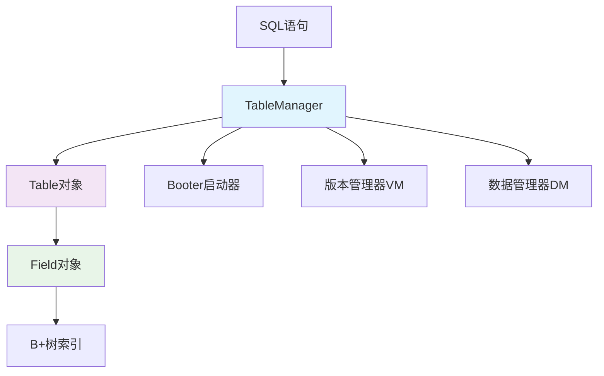
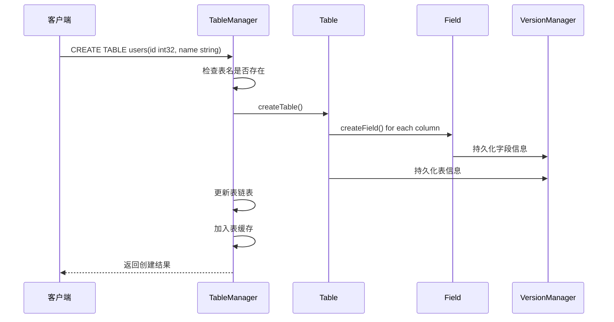
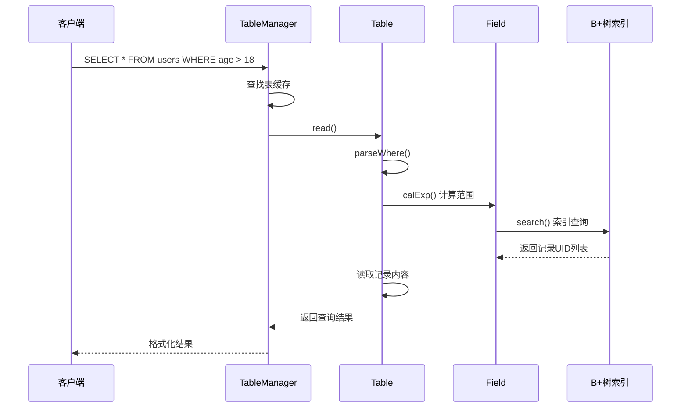
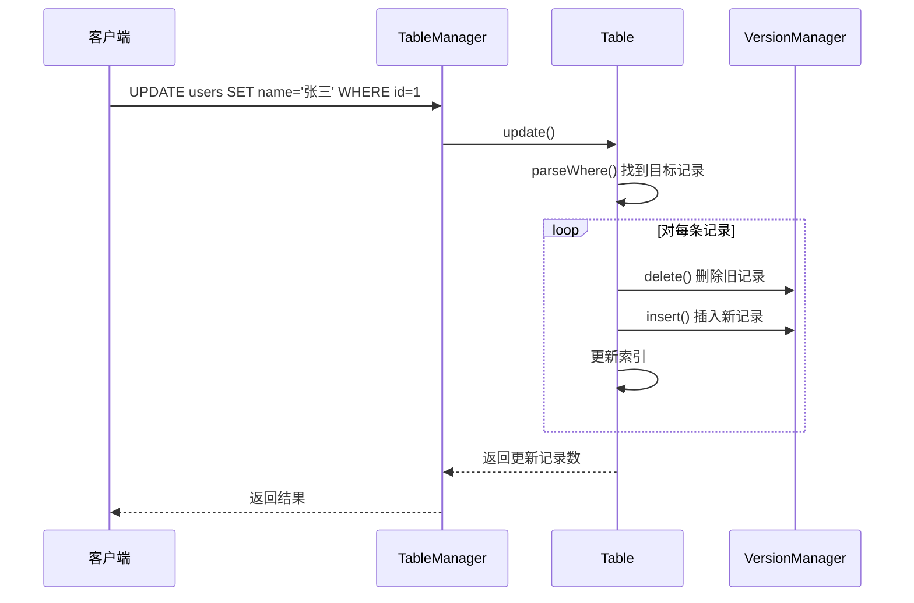

# 阶段5：表管理模块详解

## 📖 模块概述

表管理模块（Table Management，简称TBM）是MYDB数据库系统的核心组件之一，负责管理数据库中的表结构、字段定义和表级别的数据操作。它位于SQL解析层和底层存储层之间，起到承上启下的关键作用。

### 🎯 学习目标

通过本阶段的学习，你将掌握：
1. 数据库表和字段的内部表示方法
2. 表管理器的架构设计和实现原理
3. SQL操作（CRUD）在表管理层的处理流程
4. 索引管理和查询优化的基本原理
5. 事务隔离在表级别的实现机制

## 🏗️ 模块架构

表管理模块采用分层架构设计，主要包含以下组件：



## 📋 类结构详解

### 1. BeginRes - 事务开始结果

**作用**：封装BEGIN操作的返回信息

```java
public class BeginRes {
    public long xid;        // 新事务的ID
    public byte[] result;   // 操作结果信息
}
```

**与MySQL对比**：
- **MySQL**：BEGIN后返回OK包，包含影响行数、警告等复杂信息
- **MYDB**：简化返回，只包含事务ID和基本结果

### 2. FieldCalRes - 字段计算结果

**作用**：存储WHERE条件计算后的记录范围

```java
public class FieldCalRes {
    public long left;   // 范围左边界
    public long right;  // 范围右边界
}
```

**应用场景**：
```sql
-- 例如：SELECT * FROM users WHERE age > 18 AND age < 65
-- 会计算出满足条件的记录UID范围：[left, right]
```

### 3. Field - 字段定义

**作用**：表示数据库表中的一个字段（列）

#### 🔧 核心属性

```java
public class Field {
    String fieldName;     // 字段名称，如"id"、"name"
    String fieldType;     // 字段类型：int32/int64/string
    private long index;   // 索引UID，0表示无索引
    private BPlusTree bt; // B+树索引对象
}
```

#### 🎯 核心功能

1. **数据类型转换**
```java
// 字符串 → Java对象
Object value = field.string2Value("123");  // → Integer(123)

// Java对象 → 字节数组（存储格式）
byte[] raw = field.value2Raw(123);

// 字节数组 → Java对象（读取时）
ParseValueRes result = field.parserValue(raw);
```

2. **索引操作**
```java
// 插入索引项
field.insert("张三", recordUID);

// 范围查询
List<Long> uids = field.search(leftBound, rightBound);
```

3. **WHERE条件计算**
```java
// 计算 "age > 18" 的范围
FieldCalRes result = field.calExp(singleExpression);
// result.left = 19, result.right = Long.MAX_VALUE
```

#### 🆚 与MySQL字段对比

| 方面 | MYDB Field | MySQL Column |
|------|------------|--------------|
| **类型系统** | 3种基础类型 | 丰富的数据类型 |
| **索引绑定** | 字段直接管理索引 | 索引独立管理 |
| **存储格式** | 简单的字节序列化 | 复杂的行格式 |
| **类型检查** | 运行时检查 | 编译时+运行时检查 |

### 4. Table - 表定义

**作用**：表示数据库中的一个表，管理表结构和数据操作

#### 🔧 核心属性

```java
public class Table {
    String name;                    // 表名
    long nextUid;                   // 下一个表的UID（链表结构）
    List<Field> fields;             // 字段列表
    TableManager tbm;               // 表管理器引用
}
```

#### 🎯 核心功能

1. **表的创建和加载**
```java
// 创建新表
Table table = Table.createTable(tbm, nextUid, xid, createStatement);

// 加载已存在的表
Table table = Table.loadTable(tbm, tableUID);
```

2. **CRUD操作**
```java
// 插入数据
table.insert(xid, insertStatement);

// 查询数据
String result = table.read(xid, selectStatement);

// 更新数据（删除+插入）
int count = table.update(xid, updateStatement);

// 删除数据
int count = table.delete(xid, deleteStatement);
```

3. **WHERE子句处理**
```java
// 解析WHERE条件，返回满足条件的记录UID列表
List<Long> uids = parseWhere(whereClause);
```

#### 📦 持久化格式

表信息在存储中的格式：
```
[TableName][NextTableUID][Field1UID][Field2UID]...[FieldNUID]
```

#### 🆚 与MySQL表对比

| 方面 | MYDB Table | MySQL Table |
|------|------------|-------------|
| **元信息存储** | 直接存储在数据文件 | .frm文件 + 数据字典 |
| **表组织** | 链表结构 | 目录+文件结构 |
| **字段管理** | 内存中的List | 复杂的字段描述符 |
| **更新策略** | 删除+插入 | 原地更新 |

### 5. Booter - 表管理启动器

**作用**：管理表管理模块的启动信息，记录第一个表的UID

#### 🔧 核心功能

```java
// 创建新的booter文件
Booter booter = Booter.create("/path/to/db");

// 打开已存在的booter文件
Booter booter = Booter.open("/path/to/db");

// 原子性更新
booter.update(newData);
```

#### 🔒 原子性保证

Booter使用**临时文件+重命名**的方式保证更新的原子性：

```java
1. 写入数据到 .bt_tmp 文件
2. 刷新到磁盘
3. 原子性重命名：.bt_tmp → .bt
4. 删除临时文件
```

#### 🆚 与MySQL对比

| 方面 | MYDB Booter | MySQL |
|------|-------------|--------|
| **元信息管理** | 单一booter文件 | 多个系统表 |
| **原子性** | 文件重命名 | 事务日志 |
| **恢复机制** | 删除临时文件 | 复杂的崩溃恢复 |

### 6. TableManager - 表管理器接口

**作用**：定义表管理的所有操作接口

#### 🎯 核心方法

```java
public interface TableManager {
    // 事务管理
    BeginRes begin(Begin begin);
    byte[] commit(long xid);
    byte[] abort(long xid);
    
    // DDL操作
    byte[] show(long xid);
    byte[] create(long xid, Create create);
    
    // DML操作
    byte[] insert(long xid, Insert insert);
    byte[] read(long xid, Select select);
    byte[] update(long xid, Update update);
    byte[] delete(long xid, Delete delete);
}
```

### 7. TableManagerImpl - 表管理器实现

**作用**：TableManager接口的具体实现，协调各个组件

#### 🔧 核心属性

```java
public class TableManagerImpl implements TableManager {
    VersionManager vm;                      // 版本管理器
    DataManager dm;                         // 数据管理器
    private Booter booter;                  // 启动器
    private Map<String, Table> tableCache;  // 表缓存
    private Map<Long, List<Table>> xidTableCache; // 事务表缓存
    private Lock lock;                      // 并发控制锁
}
```

#### 🎯 关键设计

1. **表缓存机制**
```java
// 已提交的表
tableCache.put("users", userTable);

// 事务创建的未提交表
xidTableCache.get(xid).add(newTable);
```

2. **表链表管理**
```java
// 新表插入到链表头部
Table newTable = Table.createTable(this, firstTableUid(), xid, create);
updateFirstTableUid(newTable.uid);
```

3. **事务隔离**
```java
// SHOW TABLES 只显示：
// 1. 已提交的表
// 2. 当前事务创建的表
```

## 🔄 工作流程详解

### 1. 表创建流程



### 2. 数据查询流程



### 3. 数据更新流程



## 🔍 核心算法详解

### 1. WHERE条件优化

MYDB实现了简化的查询优化器：

```java
// AND操作：计算交集
if (logicOp.equals("and")) {
    FieldCalRes range1 = field.calExp(exp1);  // age > 18
    FieldCalRes range2 = field.calExp(exp2);  // age < 65
    
    // 取交集
    left = Math.max(range1.left, range2.left);   // max(19, 0) = 19
    right = Math.min(range1.right, range2.right); // min(MAX, 64) = 64
}

// OR操作：需要两次查询
if (logicOp.equals("or")) {
    List<Long> result1 = field.search(range1.left, range1.right);
    List<Long> result2 = field.search(range2.left, range2.right);
    result1.addAll(result2);  // 合并结果
}
```

### 2. 索引查询流程

```java
// 1. 表达式计算
FieldCalRes range = field.calExp("age > 18");
// range.left = 19, range.right = Long.MAX_VALUE

// 2. 索引范围扫描
List<Long> recordUIDs = bPlusTree.searchRange(19, Long.MAX_VALUE);

// 3. 根据UID读取记录
for (Long uid : recordUIDs) {
    byte[] recordData = vm.read(xid, uid);
    if (recordData != null) {
        // 解析并返回记录
    }
}
```

## 💡 设计亮点与创新

### 1. 简化的表组织结构

**传统数据库**：复杂的目录结构 + 多个文件
```
database/
├── table1.frm      # 表结构文件
├── table1.MYD      # 数据文件
├── table1.MYI      # 索引文件
└── ...
```

**MYDB设计**：统一的版本管理 + 链表组织
```
所有表通过链表连接：Table1 → Table2 → Table3 → 0
每个表的信息存储在版本管理系统中
```

### 2. 事务级表隔离

```java
// 已提交的表：所有事务可见
Map<String, Table> tableCache;

// 事务创建的表：只对创建事务可见
Map<Long, List<Table>> xidTableCache;
```

这种设计实现了表级别的事务隔离，防止未提交的表结构变更影响其他事务。

### 3. 统一的MVCC更新策略

```java
// 更新操作 = 删除 + 插入
public int update(long xid, Update update) {
    // 1. 读取原记录
    byte[] oldData = vm.read(xid, recordUID);
    
    // 2. 删除原记录（MVCC标记删除）
    vm.delete(xid, recordUID);
    
    // 3. 插入新记录
    long newUID = vm.insert(xid, newData);
    
    // 4. 更新索引
    updateAllIndexes(newUID, newData);
}
```

## 🔧 与MySQL的深度对比

### 架构层面

| 维度 | MYDB | MySQL InnoDB |
|------|------|--------------|
| **表组织** | 链表 + 版本管理 | 独立文件 + 数据字典 |
| **元信息** | 统一存储 | .frm + information_schema |
| **索引管理** | 字段内置 | 独立的索引子系统 |
| **更新策略** | 一律删除+插入 | 原地更新 + undo log |

### 功能层面

| 功能 | MYDB实现 | MySQL实现 | 复杂度对比 |
|------|----------|-----------|------------|
| **字段类型** | 3种基础类型 | 50+种数据类型 | 简化 |
| **约束检查** | 基础类型检查 | 完整约束系统 | 大幅简化 |
| **查询优化** | 基于索引的范围查询 | 复杂的成本优化器 | 简化 |
| **并发控制** | 粗粒度表锁 | 细粒度行锁 | 简化 |

### 性能层面

| 方面 | MYDB | MySQL | 说明 |
|------|------|--------|------|
| **表扫描** | 全索引扫描 | 表扫描 + 索引扫描 | MYDB依赖索引 |
| **内存使用** | 简单缓存 | 复杂的Buffer Pool | MySQL更优化 |
| **磁盘IO** | 版本管理统一调度 | 多层缓存优化 | 各有优势 |

## 🚀 实践建议

### 对于初学者

1. **理解核心概念**
   - 从Field类开始，理解字段的内部表示
   - 掌握Table类的CRUD操作流程
   - 理解TableManager的协调作用

2. **动手实验**
   ```java
   // 尝试创建一个简单的表
   CREATE TABLE test(id int32, name string, age int32);
   
   // 观察表的内部结构
   // 分析Field对象的创建过程
   // 理解索引的工作原理
   ```

3. **对比学习**
   - 对比MYDB和MySQL的CREATE TABLE过程
   - 分析WHERE子句的优化差异
   - 理解事务隔离的不同实现

### 进阶学习

1. **性能优化**
   - 分析表扫描的性能瓶颈
   - 思考缓存策略的改进方案
   - 研究查询优化的可能性

2. **功能扩展**
   - 添加新的数据类型支持
   - 实现更复杂的WHERE条件
   - 支持多表关联查询

## 📝 总结

表管理模块是MYDB的核心组件，它通过简化设计实现了关系型数据库的基本功能：

**核心价值**：
- 提供了完整的表和字段管理功能
- 实现了基本的SQL操作支持
- 集成了索引和事务管理

**设计优势**：
- 架构简洁，易于理解和扩展
- 统一的版本管理，简化了实现复杂度
- 良好的模块化设计，职责清晰

**学习意义**：
- 帮助理解数据库表管理的基本原理
- 展示了如何将复杂的数据库功能模块化
- 为进一步学习高级数据库特性打下基础

通过学习这个模块，你将对数据库的内部工作原理有更深入的理解，为后续学习索引管理、查询优化等高级主题做好准备。