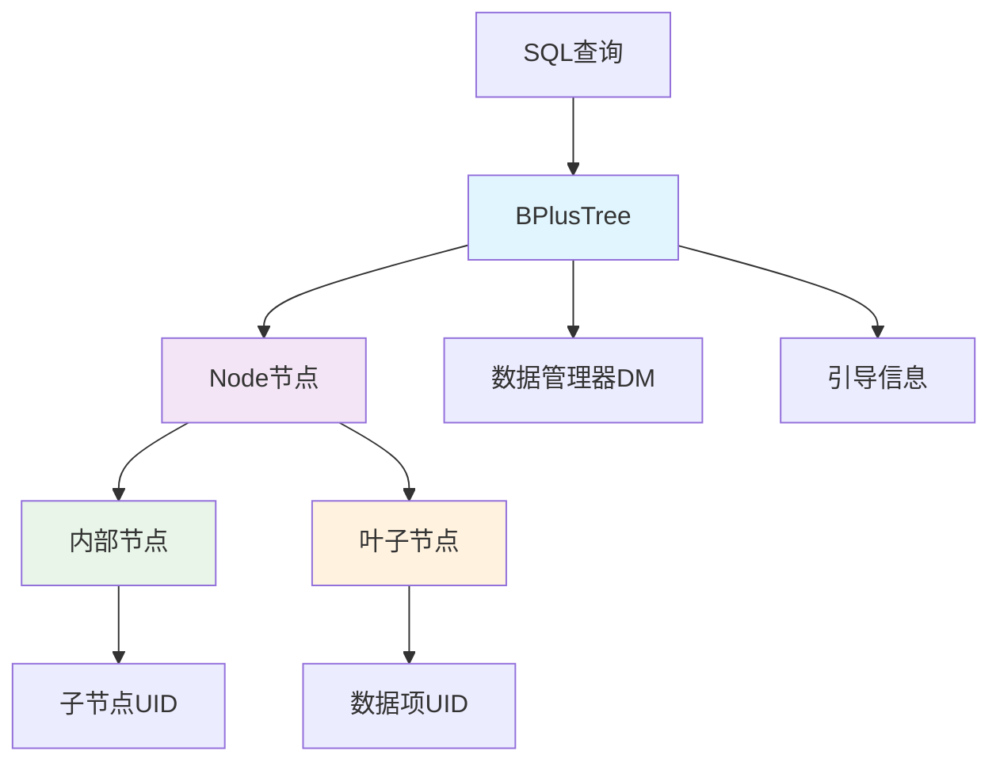
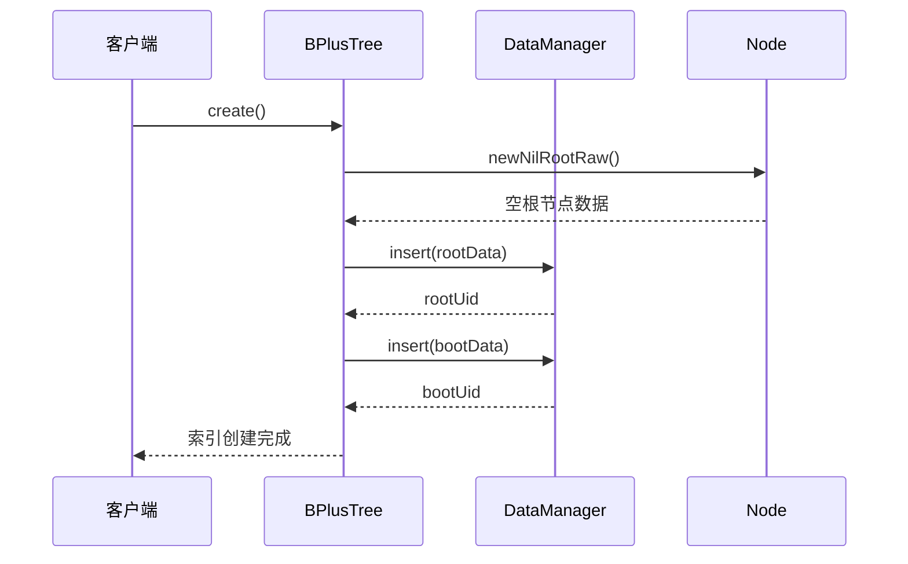
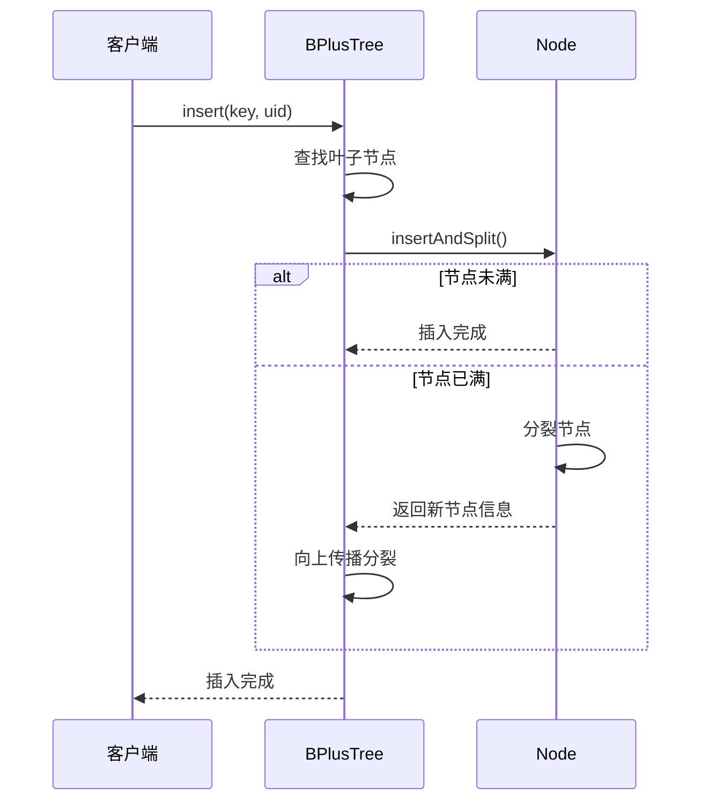
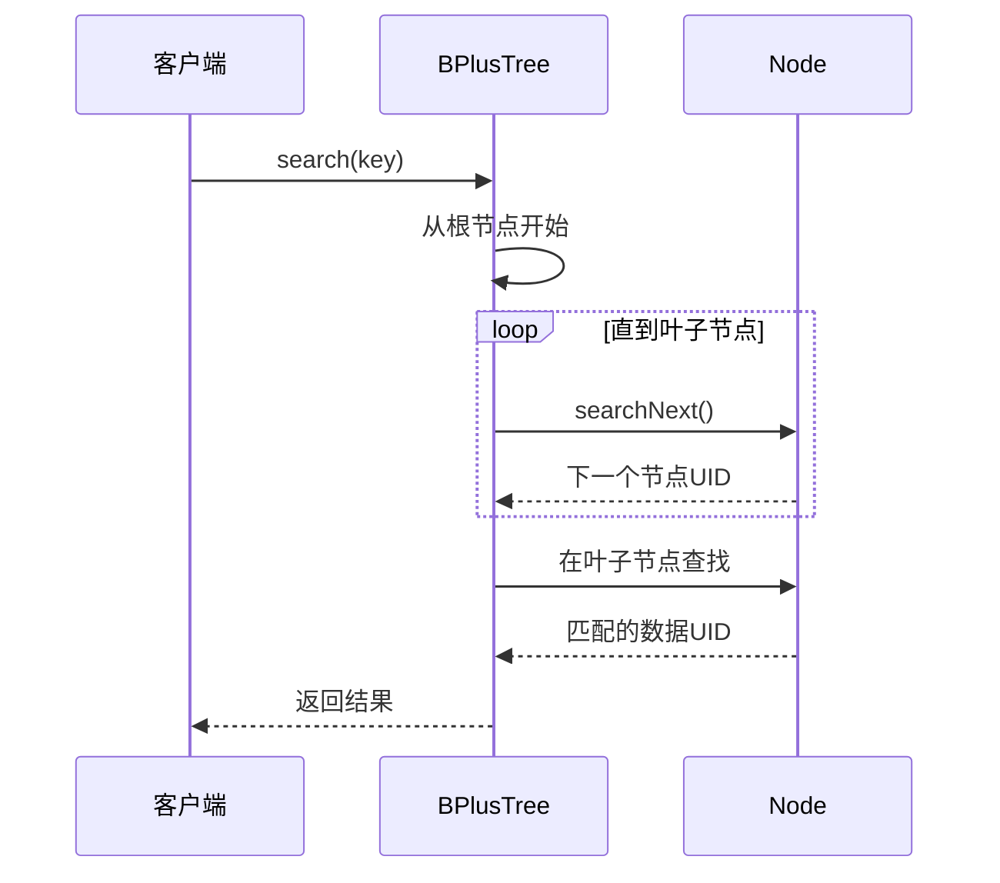

# 阶段6：索引管理模块详解

## 📖 模块概述

索引管理模块（Index Management，简称IM）是MYDB数据库系统的核心组件之一，负责管理数据库索引的创建、维护和查询操作。该模块采用B+树数据结构实现高效的数据索引，为数据库提供快速的数据访问能力。

### 🎯 学习目标

通过本阶段的学习，你将掌握：
1. B+树数据结构的原理和实现细节
2. 数据库索引的存储格式和管理机制
3. 索引的插入、查询和范围搜索算法
4. 节点分裂和树平衡维护策略
5. 索引与数据管理层的交互机制

## 🏗️ 模块架构

索引管理模块采用经典的B+树结构设计，主要包含以下组件：



## 📋 类结构详解

### 1. BPlusTree - B+树主控制器

**作用**：B+树的主要控制类，负责整体的索引操作管理

```java
public class BPlusTree {
    DataManager dm;          // 数据管理器
    long bootUid;           // 引导信息UID
    DataItem bootDataItem;  // 引导数据项
    Lock bootLock;          // 并发控制锁
}
```

**核心功能**：
- `create()`: 创建新的B+树索引
- `load()`: 从存储中加载已有索引
- `search()`: 精确查找指定键值
- `searchRange()`: 范围查询操作
- `insert()`: 插入新的键值对

**与MySQL对比**：
- **MySQL**：InnoDB引擎使用B+树作为聚簇索引和辅助索引的底层结构，支持多种数据类型
- **MYDB**：简化实现，专注于long类型键值的B+树索引，突出核心算法

### 2. Node - B+树节点

**作用**：B+树的基本存储单元，支持内部节点和叶子节点的统一管理

```java
public class Node {
    BPlusTree tree;     // 所属B+树
    DataItem dataItem;  // 节点数据项
    SubArray raw;       // 原始字节数据
    long uid;           // 节点唯一标识
}
```

**节点存储格式**：
```
[LeafFlag][KeyNumber][SiblingUid]
[Son0][Key0][Son1][Key1]...[SonN][KeyN]
```

**字段说明**：
- `LeafFlag`(1字节)：节点类型标识，1为叶子节点，0为内部节点
- `KeyNumber`(2字节)：当前节点中的键值对数量
- `SiblingUid`(8字节)：右兄弟节点UID，构建节点链表
- 键值对数组：交替存储子节点UID和键值

**与MySQL对比**：
- **MySQL**：使用16KB页面，包含页头、目录、记录等复杂结构
- **MYDB**：固定大小节点，结构简洁，便于理解和实现

## 🔄 工作流程

### 1. 索引创建流程



### 2. 数据插入流程



### 3. 数据查询流程



## 🧮 核心算法

### 1. B+树搜索算法

```java
private long searchLeaf(long nodeUid, long key) throws Exception {
    Node node = Node.loadNode(this, nodeUid);
    boolean isLeaf = node.isLeaf();
    node.release();

    if(isLeaf) {
        return nodeUid;  // 找到叶子节点
    } else {
        long next = searchNext(nodeUid, key);
        return searchLeaf(next, key);  // 递归搜索
    }
}
```

**算法特点**：
- 时间复杂度：O(log N)
- 空间复杂度：O(log N)（递归栈深度）
- 平均磁盘I/O次数：3-4次（典型B+树高度）

### 2. 范围查询算法

```java
public List<Long> searchRange(long leftKey, long rightKey) {
    long leafUid = searchLeaf(rootUid(), leftKey);
    List<Long> uids = new ArrayList<>();
    
    while(true) {
        Node leaf = Node.loadNode(this, leafUid);
        LeafSearchRangeRes res = leaf.leafSearchRange(leftKey, rightKey);
        leaf.release();
        
        uids.addAll(res.uids);
        if(res.siblingUid == 0) break;
        leafUid = res.siblingUid;  // 移动到下一个叶子节点
    }
    return uids;
}
```

**算法优势**：
- 利用叶子节点链表，实现高效的顺序访问
- 避免重复访问内部节点，减少I/O开销
- 支持大范围查询，适合OLAP场景

### 3. 节点分裂算法

```java
private SplitRes split() throws Exception {
    SubArray nodeRaw = new SubArray(new byte[NODE_SIZE], 0, NODE_SIZE);
    setRawIsLeaf(nodeRaw, getRawIfLeaf(raw));
    setRawNoKeys(nodeRaw, BALANCE_NUMBER);
    setRawSibling(nodeRaw, getRawSibling(raw));
    copyRawFromKth(raw, nodeRaw, BALANCE_NUMBER);
    
    long son = tree.dm.insert(TransactionManagerImpl.SUPER_XID, nodeRaw.raw);
    setRawNoKeys(raw, BALANCE_NUMBER);
    setRawSibling(raw, son);
    
    SplitRes res = new SplitRes();
    res.newSon = son;
    res.newKey = getRawKthKey(nodeRaw, 0);
    return res;
}
```

**分裂策略**：
- 平均分配：将节点一分为二，保证负载均衡
- 链表维护：更新兄弟节点指针，保持链表完整性
- 向上传播：返回新节点信息，触发父节点更新

## 🆚 与MySQL的对比

### 1. 数据结构对比

| 特性 | MySQL InnoDB | MYDB |
|------|-------------|------|
| 页面大小 | 16KB | 固定NODE_SIZE |
| 键类型 | 多种数据类型 | 仅支持long |
| 记录格式 | 变长记录 | 固定长度键值对 |
| 页面利用率 | 动态优化 | 简化的平衡因子 |

### 2. 功能对比

| 功能 | MySQL InnoDB | MYDB |
|------|-------------|------|
| 聚簇索引 | ✅ 支持 | ❌ 不支持 |
| 辅助索引 | ✅ 支持 | ✅ 简化支持 |
| 范围查询 | ✅ 优化支持 | ✅ 基本支持 |
| 并发控制 | 复杂锁机制 | 简单锁机制 |
| 事务支持 | 完整ACID | 基础事务支持 |

### 3. 性能特性

| 指标 | MySQL InnoDB | MYDB |
|------|-------------|------|
| 查询性能 | 高度优化 | 基础性能 |
| 插入性能 | 批量优化 | 单条插入 |
| 内存使用 | 缓冲池管理 | 简单缓存 |
| 磁盘I/O | 预读、写入优化 | 基础I/O |

## 💡 实践建议

### 1. 学习路径

1. **理解B+树基本概念**
   - 掌握B+树与B树的区别
   - 理解叶子节点链表的作用
   - 学习节点分裂和合并原理

2. **分析代码实现**
   - 跟踪搜索算法的执行路径
   - 理解插入操作的分裂传播机制
   - 观察节点存储格式的设计思路

3. **对比学习**
   - 对比MYDB与MySQL的实现差异
   - 理解简化设计的优缺点
   - 思考优化改进的可能性

### 2. 实验建议

1. **插入测试**
   ```java
   // 测试节点分裂
   BPlusTree tree = BPlusTree.create(dm);
   for(int i = 0; i < 100; i++) {
       tree.insert(i, dataUid);
   }
   ```

2. **范围查询测试**
   ```java
   // 测试范围查询性能
   List<Long> results = tree.searchRange(10, 50);
   ```

3. **并发测试**
   ```java
   // 测试多线程访问
   ExecutorService executor = Executors.newFixedThreadPool(10);
   // 并发插入和查询操作
   ```

### 3. 扩展思考

1. **性能优化**
   - 如何实现节点缓存？
   - 如何优化范围查询的性能？
   - 如何支持逆序扫描？

2. **功能扩展**
   - 如何支持变长键值？
   - 如何实现索引压缩？
   - 如何支持唯一性约束？

3. **工程实践**
   - 如何监控索引性能？
   - 如何实现索引的在线重建？
   - 如何处理索引损坏和恢复？

## 📚 总结

索引管理模块是MYDB的核心组件，通过B+树数据结构实现了高效的数据索引功能。虽然相比MySQL InnoDB引擎的实现较为简化，但它完整地展现了B+树索引的核心原理和实现要点。

**关键收获**：
1. 深入理解B+树的结构和算法原理
2. 掌握数据库索引的基本实现方法
3. 学会分析和优化索引性能
4. 理解索引在数据库系统中的重要作用

通过学习这个模块，你将为理解更复杂的数据库索引技术打下坚实的基础，并为后续学习SQL解析、查询优化等高级主题做好准备。