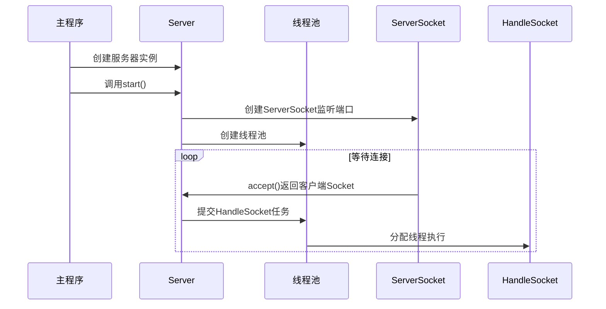
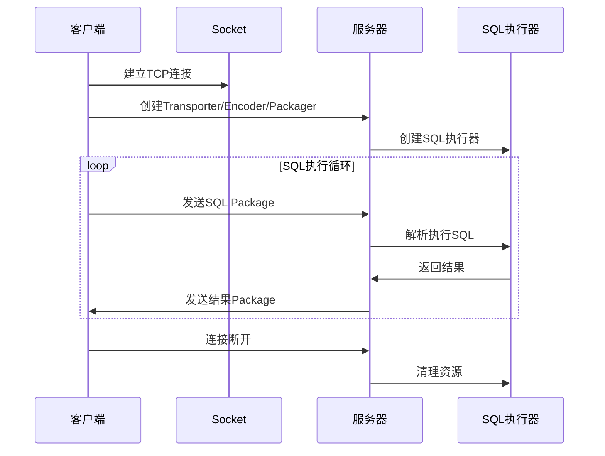
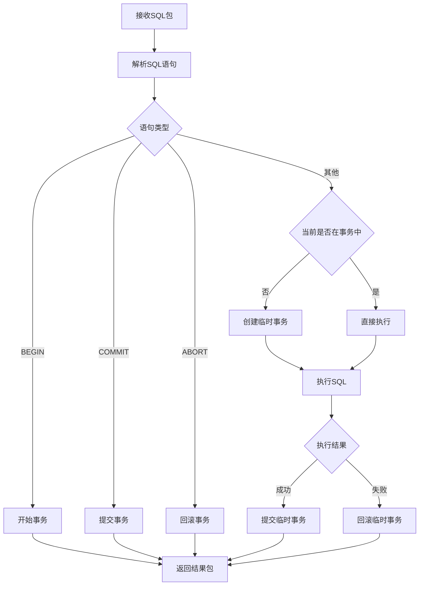

# 阶段8-服务与通信模块详解

## 模块概述

服务与通信模块是MYDB项目的网络通信层，负责客户端与服务器之间的数据传输和协议处理。本模块实现了完整的C/S架构通信机制，包括服务器端的连接管理、客户端的通信接口，以及底层的数据传输协议。

### 学习目标

通过学习本模块，您将了解：

1. **网络数据库架构设计**：理解数据库系统的客户端-服务器通信模式
2. **TCP网络编程**：掌握基于Socket的网络通信实现
3. **自定义协议设计**：学习简单而有效的二进制通信协议
4. **多线程服务器**：理解并发连接处理和线程池应用
5. **分层架构思想**：体会网络传输的分层设计原理

## 架构设计

### 整体架构图

```
┌─────────────────┐                    ┌─────────────────┐
│   客户端应用     │                    │   服务器应用     │
└─────────────────┘                    └─────────────────┘
         │                                       │
┌─────────────────┐                    ┌─────────────────┐
│     Shell       │                    │     Server      │
│  (用户界面层)    │                    │ (连接管理层)     │
└─────────────────┘                    └─────────────────┘
         │                                       │
┌─────────────────┐                    ┌─────────────────┐
│     Client      │                    │   HandleSocket  │
│  (客户端核心)    │                    │ (连接处理器)     │
└─────────────────┘                    └─────────────────┘
         │                                       │
┌─────────────────┐                    ┌─────────────────┐
│  RoundTripper   │                    │    Executor     │
│ (往返通信器)     │                    │  (SQL执行器)    │
└─────────────────┘                    └─────────────────┘
         │                                       │
         └───────────────┐       ┌───────────────┘
                        │       │
                ┌─────────────────┐
                │    Packager     │
                │  (数据包装器)    │
                └─────────────────┘
                        │
        ┌───────────────┼───────────────┐
        │               │               │
┌─────────────┐  ┌─────────────┐  ┌─────────────┐
│ Transporter │  │   Encoder   │  │   Package   │
│ (网络传输)   │  │ (数据编码)   │  │ (数据封装)   │
└─────────────┘  └─────────────┘  └─────────────┘
        │
┌─────────────────┐
│   TCP Socket    │
│   (底层网络)     │
└─────────────────┘
```

### 模块分层

本模块采用经典的分层架构设计，从上到下包括：

1. **应用层**：Shell（用户界面）、Server（服务管理）
2. **业务层**：Client（客户端逻辑）、Executor（SQL执行）
3. **通信层**：RoundTripper（通信模式）、HandleSocket（连接处理）
4. **传输层**：Packager（数据包装）、Encoder（编码解码）、Package（数据封装）
5. **网络层**：Transporter（网络传输）、Socket（系统调用）

## 关键组件详解

### 1. 服务器端组件

#### Server类 - 服务器主控制器

Server类是服务器端的核心组件，负责监听客户端连接并分配处理资源。

**核心功能**：
- 监听指定端口，接受客户端连接
- 使用线程池管理并发连接
- 为每个连接创建独立的处理线程

**设计亮点**：
```java
// 线程池配置 - 平衡性能与资源消耗
ThreadPoolExecutor tpe = new ThreadPoolExecutor(
    10,     // 核心线程数
    20,     // 最大线程数  
    1L,     // 空闲超时
    TimeUnit.SECONDS,
    new ArrayBlockingQueue<>(100),              // 任务队列
    new ThreadPoolExecutor.CallerRunsPolicy()   // 拒绝策略
);
```

**与MySQL对比**：
- MySQL使用更复杂的连接管理，包括连接认证、SSL等
- MYDB简化为直接的TCP连接处理

#### HandleSocket类 - 连接处理器

HandleSocket实现了单个客户端连接的完整生命周期管理。

**处理流程**：
1. 建立通信组件栈（Transporter → Encoder → Packager）
2. 创建SQL执行器（Executor）
3. 进入请求-响应循环
4. 清理资源

**错误处理机制**：
```java
try {
    // 执行SQL
    result = exe.execute(sql);
} catch (Exception e1) {
    // 捕获异常，封装到响应包中
    e = e1;
    e.printStackTrace();
}
// 统一的响应包创建
pkg = new Package(result, e);
```

#### Executor类 - SQL执行协调器

Executor负责SQL语句的解析分发和事务管理。

**事务管理特点**：
- 支持显式事务（BEGIN/COMMIT/ABORT）
- 自动临时事务（非事务语句自动包装）
- 连接级事务隔离

**执行分发逻辑**：
```java
// 事务控制语句直接处理
if(Begin.class.isInstance(stat)) {
    // BEGIN处理
} else if(Commit.class.isInstance(stat)) {
    // COMMIT处理  
} else {
    // 数据操作语句委托给execute2
    return execute2(stat);
}
```

### 2. 客户端组件

#### Client类 - 客户端核心

Client提供了简洁的SQL执行接口，封装了所有通信细节。

**接口设计**：
```java
public byte[] execute(byte[] stat) throws Exception {
    Package pkg = new Package(stat, null);      // 创建请求包
    Package resPkg = rt.roundTrip(pkg);         // 执行往返通信
    if(resPkg.getErr() != null) {
        throw resPkg.getErr();                  // 异常传播
    }
    return resPkg.getData();                    // 返回结果
}
```

#### RoundTripper类 - 往返通信器

RoundTripper实现了经典的请求-响应通信模式。

**通信语义**：
- 同步阻塞：每个请求等待对应响应
- 一对一映射：请求和响应严格对应
- 异常透明：网络异常直接传播

#### Shell类 - 交互式界面

Shell提供了类似MySQL命令行的用户体验。

**用户体验设计**：
```java
while(true) {
    System.out.print(":> ");                    // 友好提示符
    String statStr = sc.nextLine();
    if("exit".equals(statStr) || "quit".equals(statStr)) {
        break;                                  // 支持多种退出命令
    }
    // SQL执行和结果显示
}
```

#### Launcher类 - 客户端启动器

Launcher演示了完整的客户端组件装配过程。

**组件装配链**：
```java
Socket → Transporter → Encoder → Packager → Client → Shell
```

### 3. 传输层组件

#### Package类 - 统一数据容器

Package实现了类似Rust的Result类型，统一处理成功和失败情况。

**设计模式**：
```java
// 成功情况
new Package(resultData, null)

// 失败情况  
new Package(null, exception)

// 使用模式
if(pkg.getErr() != null) {
    throw pkg.getErr();         // 处理错误
} else {
    return pkg.getData();       // 处理数据
}
```

#### Encoder类 - 数据编码器

Encoder实现了简单而有效的二进制协议。

**协议格式**：
```
字节0: 状态标志
  - 0x00: 正常数据
  - 0x01: 错误信息
字节1+: 载荷数据
```

**编码示例**：
```java
// 正常数据: [0][data...]
return Bytes.concat(new byte[]{0}, pkg.getData());

// 错误信息: [1][error_message...]  
return Bytes.concat(new byte[]{1}, msg.getBytes());
```

#### Transporter类 - 网络传输器

Transporter负责字节级的网络传输，使用十六进制编码确保传输安全。

**传输协议**：
- 基于行的文本协议
- 十六进制编码避免二进制问题
- 每行一个完整消息

**编码转换**：
```java
// 发送: bytes → hex string + \n → network
String raw = Hex.encodeHexString(buf, true) + "\n";

// 接收: network → hex string → bytes
return Hex.decodeHex(line);
```

#### Packager类 - 数据包装器

Packager实现Facade模式，组合Encoder和Transporter提供高级接口。

**组件协作**：
```java
// 发送流程
Package → Encoder.encode() → byte[] → Transporter.send() → Network

// 接收流程  
Network → Transporter.receive() → byte[] → Encoder.decode() → Package
```

## 通信协议详解

### 协议栈设计

MYDB的通信协议采用简化的分层设计：

```
应用层: SQL语句 / 查询结果
包装层: Package(data, error)  
编码层: [flag][payload]
传输层: HEX编码 + 换行符
网络层: TCP Socket
```

### 协议特点

1. **简单性**：最小化协议复杂度，便于理解和调试
2. **可读性**：使用十六进制文本，可用标准工具查看
3. **自描述**：通过状态标志区分数据类型
4. **容错性**：明确的错误传播机制

### 协议示例

**客户端发送SQL**：
```
Package: data="SELECT * FROM users", err=null
Encoder: [0x00]["SELECT * FROM users"]  
Transporter: "0053454C454354202A2046524F4D207573657273\n"
```

**服务器返回结果**：
```
Transporter: "0075736572313B75736572320A\n"
Encoder: [0x00]["user1;user2\n"]
Package: data="user1;user2\n", err=null
```

**服务器返回错误**：
```
Transporter: "01496E76616C69642053514C207379706E7461780A\n"  
Encoder: [0x01]["Invalid SQL syntax\n"]
Package: data=null, err=RuntimeException("Invalid SQL syntax")
```

## 工作流程分析

### 服务器启动流程



### 客户端连接流程



### SQL执行流程



## 核心算法解析

### 1. 连接池管理算法

```java
ThreadPoolExecutor tpe = new ThreadPoolExecutor(
    10,                                         // 核心线程数
    20,                                         // 最大线程数
    1L, TimeUnit.SECONDS,                      // 空闲超时时间
    new ArrayBlockingQueue<>(100),             // 任务队列容量
    new ThreadPoolExecutor.CallerRunsPolicy()  // 拒绝策略
);
```

**算法特点**：
- **核心线程池**：维持10个常驻线程处理常规负载
- **弹性扩展**：高峰期可扩展到20个线程
- **队列缓冲**：100个任务的缓冲队列平滑负载波动
- **背压处理**：超载时由主线程执行，避免任务丢失

### 2. 事务自动管理算法

```java
private byte[] execute2(Object stat) throws Exception {
    boolean tmpTransaction = false;
    Exception e = null;
    
    // 检查是否需要创建临时事务
    if(xid == 0) {
        tmpTransaction = true;
        BeginRes r = tbm.begin(new Begin());
        xid = r.xid;
    }
    
    try {
        // 执行SQL语句
        byte[] res = executeSqlStatement(stat);
        return res;
    } catch(Exception e1) {
        e = e1;
        throw e;
    } finally {
        // 临时事务的提交或回滚
        if(tmpTransaction) {
            if(e != null) {
                tbm.abort(xid);     // 异常时回滚
            } else {
                tbm.commit(xid);    // 正常时提交
            }
            xid = 0;
        }
    }
}
```

**算法思路**：
- **自动包装**：非事务语句自动包装在临时事务中
- **异常安全**：使用try-finally确保事务正确结束
- **状态一致**：无论成功失败都清理事务状态

### 3. 协议编解码算法

**编码算法**：
```java
public byte[] encode(Package pkg) {
    if(pkg.getErr() != null) {
        // 错误包: [1][错误消息]
        String msg = pkg.getErr().getMessage();
        return Bytes.concat(new byte[]{1}, msg.getBytes());
    } else {
        // 数据包: [0][数据载荷]  
        return Bytes.concat(new byte[]{0}, pkg.getData());
    }
}
```

**解码算法**：
```java
public Package decode(byte[] data) throws Exception {
    if(data.length < 1) {
        throw Error.InvalidPkgDataException;
    }
    
    switch(data[0]) {
        case 0: // 正常数据
            return new Package(Arrays.copyOfRange(data, 1, data.length), null);
        case 1: // 错误信息
            String errorMsg = new String(Arrays.copyOfRange(data, 1, data.length));
            return new Package(null, new RuntimeException(errorMsg));
        default:
            throw Error.InvalidPkgDataException;
    }
}
```

## 与MySQL协议对比

### 复杂度对比

| 特性 | MySQL协议 | MYDB协议 |
|------|-----------|----------|
| 包头结构 | 4字节长度+1字节序号 | 1字节状态标志 |
| 数据类型 | 20+种字段类型 | 统一字节数组 |
| 认证机制 | 挑战-响应认证 | 无认证 |
| SSL支持 | 完整SSL/TLS | 无加密 |
| 压缩 | 可选数据压缩 | 无压缩 |
| 多语句 | 支持批量执行 | 单语句执行 |

### 设计权衡

**MySQL协议优势**：
- 功能完整，支持生产环境各种需求
- 高效的二进制编码
- 完善的安全和认证机制

**MYDB协议优势**：
- 实现简单，代码量少
- 易于调试和扩展
- 学习成本低

**设计选择说明**：
MYDB作为教学项目，选择了简化的协议设计。这样的设计有助于：
- 快速理解网络数据库的核心概念
- 专注于数据库本身的逻辑而非协议细节
- 为后续扩展提供清晰的架构基础

## 性能分析

### 吞吐量分析

**理论性能**：
- **连接数限制**：最大20个并发连接
- **队列容量**：100个待处理请求
- **单连接QPS**：受SQL执行时间限制

**性能瓶颈**：
1. **线程池大小**：限制了并发处理能力
2. **同步通信**：每个请求必须等待响应
3. **文本协议**：十六进制编码增加传输开销

### 内存使用

**内存分配模式**：
- **连接内存**：每个连接约占用几KB（缓冲区+对象）
- **数据包内存**：随SQL和结果大小变化
- **线程栈内存**：每个线程约1MB栈空间

**内存优化建议**：
- 限制单次查询结果大小
- 使用对象池复用Package等对象
- 及时清理断开的连接资源

### 网络效率

**传输开销**：
- **协议开销**：每个包1字节状态位
- **编码开销**：十六进制编码约2倍数据膨胀
- **文本协议**：增加解析CPU开销

**优化空间**：
- 使用二进制协议减少传输量
- 添加数据压缩支持
- 实现连接复用和keep-alive

## 实践练习

### 练习1：协议扩展

为MYDB协议添加心跳检测功能：

```java
// 扩展Package支持心跳类型
public enum PackageType {
    DATA(0), ERROR(1), HEARTBEAT(2)
}

// 修改Encoder支持心跳包
public byte[] encode(Package pkg) {
    if(pkg.getType() == PackageType.HEARTBEAT) {
        return new byte[]{2};  // 心跳包只有类型标志
    }
    // ... 原有逻辑
}
```

### 练习2：连接池监控

添加连接池状态监控：

```java
public class ServerMonitor {
    private ThreadPoolExecutor threadPool;
    
    public void printStats() {
        System.out.println("活跃线程: " + threadPool.getActiveCount());
        System.out.println("总任务数: " + threadPool.getTaskCount());
        System.out.println("队列大小: " + threadPool.getQueue().size());
    }
}
```

### 练习3：客户端连接池

实现简单的客户端连接池：

```java
public class ClientPool {
    private Queue<Client> availableClients = new LinkedBlockingQueue<>();
    private int maxPoolSize = 10;
    
    public Client borrowClient() throws Exception {
        Client client = availableClients.poll();
        if(client == null) {
            // 创建新连接
            client = createNewClient();
        }
        return client;
    }
    
    public void returnClient(Client client) {
        if(availableClients.size() < maxPoolSize) {
            availableClients.offer(client);
        } else {
            client.close();
        }
    }
}
```

## 故障排查指南

### 常见问题及解决方案

#### 1. 连接被拒绝

**现象**：客户端无法连接到服务器

**可能原因**：
- 服务器未启动或端口被占用
- 防火墙阻止连接
- 线程池已满且队列溢出

**排查步骤**：
```bash
# 检查端口是否被监听
netstat -an | grep 9999

# 检查防火墙设置
iptables -L

# 查看服务器日志输出
```

#### 2. 连接超时

**现象**：客户端连接建立后长时间无响应

**可能原因**：
- SQL执行时间过长
- 死锁导致事务阻塞
- 网络延迟或丢包

**排查方法**：
```java
// 添加超时机制
socket.setSoTimeout(30000);  // 30秒超时

// 添加SQL执行监控
long startTime = System.currentTimeMillis();
byte[] result = executor.execute(sql);
long duration = System.currentTimeMillis() - startTime;
if(duration > 5000) {
    System.out.println("慢查询: " + duration + "ms");
}
```

#### 3. 内存泄漏

**现象**：服务器运行一段时间后内存持续增长

**可能原因**：
- 连接未正确关闭
- Package对象未及时回收
- 线程局部变量未清理

**解决方案**：
```java
// 确保资源正确关闭
try {
    // 业务逻辑
} finally {
    if(packager != null) {
        packager.close();
    }
}

// 使用工具监控内存使用
jstat -gc -t <pid> 5s
```

### 调试技巧

#### 1. 协议调试

使用telnet模拟客户端：
```bash
telnet localhost 9999
# 发送十六进制编码的SQL
53454C454354202A2046524F4D207573657273
```

#### 2. 网络抓包

使用Wireshark查看网络传输：
```bash
# 过滤MYDB流量
tcp.port == 9999
```

#### 3. 性能分析

```java
// 添加性能统计
public class PerformanceMonitor {
    private AtomicLong requestCount = new AtomicLong(0);
    private AtomicLong totalTime = new AtomicLong(0);
    
    public void recordRequest(long duration) {
        requestCount.incrementAndGet();
        totalTime.addAndGet(duration);
    }
    
    public double getAverageTime() {
        return (double)totalTime.get() / requestCount.get();
    }
}
```

## 扩展方向

### 功能扩展

1. **连接认证**：添加用户名密码验证
2. **SSL支持**：加密传输保证安全
3. **连接池**：支持连接复用和管理
4. **批量操作**：支持一次发送多个SQL
5. **流式结果**：支持大结果集的分批返回

### 性能优化

1. **异步处理**：使用NIO实现非阻塞IO
2. **二进制协议**：减少编码开销
3. **数据压缩**：减少网络传输量
4. **连接复用**：减少连接建立开销
5. **读写分离**：支持负载均衡

### 监控运维

1. **指标收集**：QPS、延迟、错误率等
2. **健康检查**：服务状态监控
3. **日志记录**：详细的操作日志
4. **配置管理**：动态调整参数
5. **故障恢复**：自动重连和故障转移

## 总结

MYDB的服务与通信模块虽然相对简单，但完整地展示了数据库网络通信的核心概念和实现模式。通过学习本模块，您应该理解：

1. **分层架构**的重要性和实现方法
2. **网络协议设计**的基本原则和权衡考虑
3. **多线程服务器**的实现模式和资源管理
4. **客户端-服务器通信**的完整流程
5. **错误处理和资源管理**的最佳实践

这些知识不仅适用于数据库系统，也是所有网络应用开发的基础。在实际项目中，您可以根据具体需求在简单性和功能性之间做出合适的权衡选择。

记住，优秀的系统设计往往从简单开始，然后根据实际需要逐步演进。MYDB的设计正是遵循了这一原则，为我们提供了一个清晰的学习起点。